# 📘 CANONICAL - Sequence Diagram: Generazione Atto Amministrativo Completo

🏆 **CANONICAL REFERENCE**: Questo è il diagramma di sequenza autoritativo e completo per UC5. Contiene tutti i dettagli tecnici, API endpoints, payload JSON, timing, e strategie di caching/scalabilità.

**Versioni Supplementari**:
- [02 SUPPLEMENTARY - Overview Semplificato.md](02 SUPPLEMENTARY - Overview Semplificato.md) - Per stakeholder business
- [03 SUPPLEMENTARY - Ultra Semplificato.md](03 SUPPLEMENTARY - Ultra Semplificato.md) - Per presentazioni executive
- [04 DEPRECATED - Sequence Con SP00.md](04 DEPRECATED - Sequence Con SP00.md) - Versione archiviata (non usare)

---

## Flusso End-to-End: Da Email PEC a Pubblicazione


## Data Flow Dettagliato

### Payload Example: Document Generation Request

```json
{
  "workflow_id": "WF-12345",
  "document_type": "DELIBERA_GIUNTA",
  "metadata": {
    "oggetto": "Approvazione Piano Urbanistico Zona Industriale",
    "proponente": "Assessorato Urbanistica",
    "responsabile_procedimento": "ing. Mario Rossi",
    "importo": 150000.00,
    "cig": "Z1234567890",
    "normativa_riferimento": ["L.R. 12/2005", "D.Lgs 42/2004"],
    "scadenza": "2025-12-31"
  },
  "allegati": [
    {"nome": "planimetria.pdf", "size": 2048576, "hash": "sha256:abc123..."},
    {"nome": "relazione_tecnica.pdf", "size": 512000, "hash": "sha256:def456..."}
  ],
  "user_context": {
    "user_id": "user_123",
    "role": "RESPONSABILE_UFFICIO",
    "permissions": ["CREATE_DELIBERA", "APPROVE_DELIBERA"]
  }
}
```

### Response Example: Classificazione (SP07 - Content Classifier)

```json
{
  "classification": {
    "document_type": "DELIBERA_GIUNTA",
    "category": "URBANISTICA",
    "subcategory": "PIANI_REGOLATORI",
    "confidence": 0.94
  },
  "metadata_extracted": {
    "date_mentions": ["2025-12-31"],
    "importi": [150000.00],
    "riferimenti_normativi": [
      {"tipo": "LEGGE_REGIONALE", "numero": "12/2005"},
      {"tipo": "DECRETO_LEGISLATIVO", "numero": "42/2004"}
    ],
    "entita": [
      {"tipo": "PERSONA", "nome": "Mario Rossi", "ruolo": "Responsabile Procedimento"},
      {"tipo": "ENTE", "nome": "Assessorato Urbanistica"}
    ],
    "cig": "Z1234567890"
  },
  "similarity_scores": [
    {"doc_id": "DOC-98765", "similarity": 0.87, "tipo": "DELIBERA_GIUNTA"},
    {"doc_id": "DOC-54321", "similarity": 0.82, "tipo": "DELIBERA_GIUNTA"}
  ],
  "processing_time_ms": 450
}
```

### Response Example: Knowledge Base (SP04)

```json
{
  "legal_context": {
    "normativa_principale": [
      {
        "riferimento": "L. 241/1990",
        "articolo": "Art. 5",
        "testo": "Il responsabile del procedimento...",
        "rilevanza": 0.95
      },
      {
        "riferimento": "D.Lgs 42/2004",
        "articolo": "Art. 146",
        "testo": "Autorizzazione paesaggistica...",
        "rilevanza": 0.89
      }
    ],
    "giurisprudenza": [
      {
        "fonte": "Consiglio di Stato",
        "sentenza": "n. 1234/2024",
        "massima": "In materia di piani urbanistici...",
        "rilevanza": 0.78
      }
    ],
    "precedenti_simili": [
      {
        "doc_id": "DELIB-2024-0123",
        "oggetto": "Piano Urbanistico Zona Artigianale",
        "similarity": 0.84,
        "esito": "APPROVATA"
      }
    ]
  },
  "knowledge_graph_path": [
    "L.R. 12/2005 -> modifica -> L.R. 3/1999",
    "D.Lgs 42/2004 -> rimanda -> Codice Beni Culturali"
  ],
  "rag_synthesis": "Per l'approvazione del Piano Urbanistico è necessario rispettare...",
  "confidence_score": 0.91,
  "processing_time_ms": 1200
}
```

### Response Example: Template Generation (SP05)

```json
{
  "document_draft": {
    "format": "XML",
    "content": "<delibera>...</delibera>",
    "sections": [
      {"id": "premesse", "tokens": 245, "status": "generated"},
      {"id": "motivazioni", "tokens": 487, "status": "generated"},
      {"id": "dispositivo", "tokens": 156, "status": "generated"},
      {"id": "allegati", "tokens": 89, "status": "referenced"}
    ]
  },
  "generation_metadata": {
    "model_used": "gpt-4-turbo",
    "temperature": 0.3,
    "tokens_consumed": 1234,
    "api_cost_euros": 0.0148,
    "generation_time_sec": 2.3
  },
  "template_info": {
    "template_id": "TPL-DELIB-URB-001",
    "version": "2.1.4",
    "last_updated": "2025-09-15",
    "variables_filled": 23,
    "variables_total": 25
  },
  "warnings": [
    "Campo 'data_approvazione_preventiva' non valorizzato - da verificare"
  ]
}
```

### Response Example: Validation (SP06)

```json
{
  "validation_result": {
    "status": "WARNING",
    "overall_score": 0.87,
    "timestamp": "2025-10-08T10:25:33Z"
  },
  "critical_issues": [],
  "warnings": [
    {
      "severity": "MEDIUM",
      "category": "METADATA_MISSING",
      "field": "cig",
      "message": "CIG obbligatorio per importi > €40.000",
      "suggestion": "Inserire CIG da ANAC",
      "auto_fixable": false
    }
  ],
  "conformity_checks": [
    {
      "rule": "PRESENZA_RESPONSABILE_PROCEDIMENTO",
      "status": "PASS",
      "normativa_ref": "L. 241/1990 Art. 5"
    },
    {
      "rule": "FORMATO_DATA_VALIDO",
      "status": "PASS"
    },
    {
      "rule": "RIFERIMENTI_NORMATIVI_VIGENTI",
      "status": "PASS",
      "details": "Tutte le norme citate sono in vigore"
    }
  ],
  "semantic_analysis": {
    "coherence_score": 0.92,
    "completeness_score": 0.89,
    "legal_consistency_score": 0.95
  },
  "suggestions": [
    "Aggiungere riferimento a delibera precedente n. 45/2024 per contesto",
    "Specificare tempistiche attuazione nel dispositivo"
  ],
  "processing_time_ms": 780
}
```

### Response Example: Quality Check (SP08)

```json
{
  "quality_report": {
    "overall_quality": "GOOD",
    "score": 82,
    "timestamp": "2025-10-08T10:26:15Z"
  },
  "grammar_check": {
    "errors_found": 3,
    "errors": [
      {
        "position": {"line": 23, "char": 145},
        "type": "AGREEMENT",
        "original": "i documentazione",
        "suggestion": "la documentazione",
        "rule_id": "IT_AGREEMENT_1"
      }
    ]
  },
  "style_check": {
    "warnings": 5,
    "issues": [
      {
        "type": "PASSIVE_VOICE",
        "severity": "LOW",
        "position": {"line": 34},
        "suggestion": "Preferire forma attiva per chiarezza"
      }
    ]
  },
  "readability": {
    "gulpease_index": 62,
    "interpretation": "Testo difficile - livello universitario",
    "avg_sentence_length": 28.5,
    "avg_word_length": 5.2,
    "passive_voice_ratio": 0.23
  },
  "terminology": {
    "technical_terms_count": 45,
    "consistency_score": 0.94,
    "unknown_terms": []
  },
  "corrections_applied": 0,
  "corrections_suggested": 8,
  "processing_time_ms": 320
}
```

### Audit Trail Example (SP11 - Security & Audit)

```json
{
  "audit_record": {
    "workflow_id": "WF-12345",
    "document_id": "DOC-67890",
    "audit_trail_id": "AUDIT-98765",
    "blockchain_hash": "0x1234567890abcdef...",
    "timestamp": "2025-10-08T10:30:45Z"
  },
  "actions_log": [
    {
      "seq": 1,
      "timestamp": "2025-10-08T10:20:00Z",
      "action": "WORKFLOW_INITIATED",
      "user_id": "user_123",
      "ip_address": "192.168.1.100",
      "user_agent": "Mozilla/5.0..."
    },
    {
      "seq": 2,
      "timestamp": "2025-10-08T10:20:05Z",
      "action": "DOCUMENT_CLASSIFIED",
      "service": "SP07",
      "confidence": 0.94,
      "processing_time_ms": 450
    },
    {
      "seq": 3,
      "timestamp": "2025-10-08T10:20:12Z",
      "action": "LEGAL_CONTEXT_RETRIEVED",
      "service": "SP04",
      "normativa_refs": ["L.241/1990", "D.Lgs 42/2004"],
      "processing_time_ms": 1200
    },
    {
      "seq": 4,
      "timestamp": "2025-10-08T10:22:35Z",
      "action": "TEMPLATE_GENERATED",
      "service": "SP05",
      "model": "gpt-4-turbo",
      "tokens_used": 1234,
      "api_cost_euros": 0.0148
    },
    {
      "seq": 5,
      "timestamp": "2025-10-08T10:25:33Z",
      "action": "DOCUMENT_VALIDATED",
      "service": "SP06",
      "validation_status": "WARNING",
      "warnings_count": 1
    },
    {
      "seq": 6,
      "timestamp": "2025-10-08T10:26:15Z",
      "action": "QUALITY_CHECKED",
      "service": "SP08",
      "quality_score": 82,
      "corrections_suggested": 8
    },
    {
      "seq": 7,
      "timestamp": "2025-10-08T10:28:00Z",
      "action": "HUMAN_APPROVED",
      "user_id": "user_123",
      "approval_level": "RESPONSABILE_UFFICIO",
      "signature": "BASE64_ENCODED_SIGNATURE"
    },
    {
      "seq": 8,
      "timestamp": "2025-10-08T10:29:15Z",
      "action": "PROTOCOLLED",
      "system": "PROTOCOLLO",
      "protocol_number": "12345/2025"
    },
    {
      "seq": 9,
      "timestamp": "2025-10-08T10:30:30Z",
      "action": "DIGITALLY_SIGNED",
      "system": "FIRMA_DIGITALE",
      "signer": "ing. Mario Rossi",
      "timestamp_authority": "InfoCert"
    },
    {
      "seq": 10,
      "timestamp": "2025-10-08T10:30:45Z",
      "action": "WORKFLOW_COMPLETED",
      "final_status": "PUBLISHED",
      "total_duration_sec": 645
    }
  ],
  "gdpr_compliance": {
    "purpose": "GENERAZIONE_ATTO_AMMINISTRATIVO",
    "legal_basis": "Art. 6(1)(e) GDPR - public interest",
    "data_subjects": ["Mario Rossi"],
    "retention_period": "10 years",
    "right_to_explanation": true,
    "automated_decision": true,
    "human_oversight": true
  },
  "security_events": [],
  "anomalies_detected": 0
}
```

## Performance Metrics

| Fase | Tempo Medio | Timeout | SLA |
|------|-------------|---------|-----|
| Email Parsing (SP01) | 800ms | 3s | 95% <2s |
| Document Extraction (SP02) | 2.5s | 10s | 90% <5s |
| Procedural Classification (SP03) | 520ms | 3s | 95% <2s |
| Knowledge Retrieval (SP04) | 1.2s | 5s | 90% <3s |
| Template Generation (SP05) | 2.3s | 10s | 90% <5s |
| Validation (SP06) | 780ms | 5s | 95% <2s |
| Content Classification (SP07) | 450ms | 2s | 95% <1s |
| Quality Check (SP08) | 320ms | 3s | 95% <1s |
| **Total End-to-End** | **~44s** | **90s** | **85% <60s** |

## Error Handling e Retry Logic

```mermaid
graph TD
    A[Servizio Chiamato] --> B{Risposta OK?}
    B -->|200 OK| C[Procedi]
    B -->|4xx Client Error| D[Log + Notifica Utente]
    B -->|5xx Server Error| E{Retry Count < 3?}
    E -->|Sì| F[Exponential Backoff]
    F --> G[Wait 2^n secondi]
    G --> A
    E -->|No| H[Circuit Breaker OPEN]
    H --> I[Fallback Strategy]
    I --> J{Fallback Possibile?}
    J -->|Sì| K[Usa Fallback]
    J -->|No| L[Fail Workflow]
    L --> M[Notifica Admin]
    
    style B fill:#e1f5ff
    style H fill:#f8d7da
    style C fill:#d4edda
```



## Caching Strategy

| Layer | Cache Type | TTL | Invalidazione |
|-------|-----------|-----|---------------|
| Email Parsing (SP01) | Redis | 1 ora | On new email version |
| Document Extraction (SP02) | Redis | 24 ore | On document update |
| Procedural Classification (SP03) | Redis | 2 ore | On document update |
| Normativa (SP04) | Redis | 24 ore | On legislative change |
| Template base (SP05) | Redis | 7 giorni | On template version update |
| Content Classification (SP07) | Redis | 1 ora | On document update |
| Quality rules (SP08) | Redis | 30 giorni | Manual purge |
| User sessions | Redis | 30 min | On logout |

## Scalability Patterns

- **SP01 EML Parser**: Async parsing con message queue per email batch
- **SP02 Document Extractor**: GPU-accelerated OCR con parallel processing
- **SP03 Procedural Classifier**: Caching procedimenti ricorrenti (43% hit rate)
- **SP04 Knowledge Base**: Read replicas per high-throughput queries
- **SP05 Template Engine**: Queue-based generation con Celery worker pool
- **SP06 Validator**: Parallel validation di sezioni indipendenti
- **SP07 Content Classifier**: Batch processing per upload massivi (100+ documenti)
- **SP08 Quality Checker**: Distributed processing con load balancing
- **NiFi FlowFiles**: Routing per `document_type` (load balancing con RouteOnAttribute)
