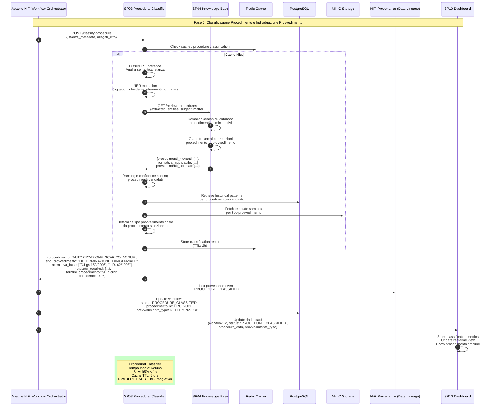

# SP03 - Classificatore Procedurale: Sequence Diagram

## Classificazione Iniziale del Procedimento Amministrativo

Questo diagramma mostra tutte le interazioni del **Procedural Classifier (SP03)** nel processo di classificazione dell'istanza di parte per identificare il procedimento amministrativo e il tipo di provvedimento da generare.



## Payload Example: Procedure Classification Request

```json
{
  "istanza_metadata": {
    "oggetto": "Richiesta autorizzazione scarico acque reflue industriali",
    "richiedente": {
      "tipo": "PERSONA_GIURIDICA",
      "denominazione": "Industria Tessile Rossi S.p.A.",
      "partita_iva": "IT12345678901",
      "sede_legale": "Via Roma 123, 20100 Milano"
    },
    "riferimenti_normativi_citati": ["D.Lgs 152/2006"],
    "descrizione_istanza": "L'azienda richiede autorizzazione allo scarico di acque reflue industriali provenienti dal ciclo produttivo tessile, con portata media di 500 m³/giorno...",
    "data_presentazione": "2025-10-10",
    "urgenza": "NORMALE"
  },
  "allegati_info": {
    "count": 3,
    "types": ["PLANIMETRIA", "RELAZIONE_TECNICA", "CERTIFICATO_ISCRIZIONE_CCIAA"],
    "total_size_mb": 4.5
  },
  "context": {
    "canale_presentazione": "SPORTELLO_TELEMATICO",
    "ufficio_competente_suggerito": "UFFICIO_AMBIENTE",
    "protocollo_entrata": "PROT-2025-001234"
  }
}
```

## Response Example: Procedure Classification Result

```json
{
  "classification": {
    "procedimento": {
      "codice": "PROC_AMB_001",
      "denominazione": "AUTORIZZAZIONE_SCARICO_ACQUE_REFLUE",
      "categoria": "AMBIENTE",
      "sottocategoria": "TUTELA_ACQUE",
      "confidence": 0.96
    },
    "tipo_provvedimento": {
      "codice": "PROV_DET_DIR",
      "denominazione": "DETERMINAZIONE_DIRIGENZIALE",
      "autorita_competente": "DIRIGENTE_SETTORE_AMBIENTE",
      "confidence": 0.94
    },
    "procedimento_details": {
      "normativa_base": [
        {"tipo": "DECRETO_LEGISLATIVO", "numero": "152/2006", "articolo": "124", "descrizione": "Disciplina degli scarichi"},
        {"tipo": "LEGGE_REGIONALE", "numero": "62/1998", "articolo": "8", "descrizione": "Norme regionali tutela acque"}
      ],
      "termini_procedimento": {
        "giorni_max": 90,
        "silenzio_assenso": false,
        "possibilita_proroga": true,
        "termini_urgenti": null
      },
      "responsabile_procedimento": {
        "ruolo_richiesto": "FUNZIONARIO_SETTORE_AMBIENTE",
        "competenze_necessarie": ["TUTELA_ACQUE", "DIRITTO_AMBIENTALE"]
      },
      "fasi_procedurali": [
        "VERIFICA_COMPLETEZZA_ISTANZA",
        "ISTRUTTORIA_TECNICA",
        "PARERI_ENTI_ESTERNI",
        "CONFERENZA_SERVIZI",
        "DETERMINAZIONE_FINALE"
      ]
    },
    "metadata_required": {
      "obbligatori": [
        "dati_identificativi_richiedente",
        "localizzazione_scarico",
        "caratteristiche_scarico",
        "relazione_tecnica",
        "planimetria",
        "certificato_iscrizione_cciaa"
      ],
      "opzionali": [
        "studio_impatto_ambientale",
        "documentazione_fotografica"
      ],
      "missing": []
    },
    "enti_coinvolti": [
      {
        "ente": "ARPA",
        "tipo_coinvolgimento": "PARERE_OBBLIGATORIO",
        "termini_risposta": 30
      },
      {
        "ente": "ASL",
        "tipo_coinvolgimento": "PARERE_FACOLTATIVO",
        "termini_risposta": 15
      }
    ]
  },
  "metadata_extracted": {
    "entita_richiedente": {
      "tipo": "PERSONA_GIURIDICA",
      "nome": "Industria Tessile Rossi S.p.A.",
      "codice_fiscale": "IT12345678901"
    },
    "oggetto_istanza": "autorizzazione scarico acque reflue industriali",
    "riferimenti_normativi_rilevati": [
      {"tipo": "DECRETO_LEGISLATIVO", "numero": "152/2006"}
    ],
    "keywords_chiave": ["scarico", "acque reflue", "industriali", "autorizzazione"],
    "settore_economico": "INDUSTRIA_TESSILE"
  },
  "similarity_scores": [
    {
      "procedimento_id": "PROC-2024-00567",
      "similarity": 0.91,
      "tipo": "AUTORIZZAZIONE_SCARICO_ACQUE",
      "esito": "ACCOGLIMENTO",
      "data": "2024-08-15"
    },
    {
      "procedimento_id": "PROC-2024-00234",
      "similarity": 0.87,
      "tipo": "AUTORIZZAZIONE_SCARICO_ACQUE",
      "esito": "DINIEGO",
      "data": "2024-03-22"
    }
  ],
  "template_suggerito": {
    "template_id": "TPL_DET_AMB_001",
    "nome": "Determinazione Dirigenziale - Autorizzazione Scarico Acque",
    "versione": "2.1",
    "ultima_modifica": "2025-06-15"
  },
  "processing_time_ms": 520,
  "cached": false
}
```

## Mappatura Procedimento → Provvedimento

Il sistema mantiene una knowledge base di mapping tra procedimenti amministrativi e tipologie di provvedimenti finali:

| Categoria Procedimento | Esempi Procedimento | Tipo Provvedimento Tipico | Autorità Competente |
|------------------------|---------------------|---------------------------|---------------------|
| **Ambiente** | Autorizzazione scarico acque | Determinazione Dirigenziale | Dirigente Settore Ambiente |
| **Ambiente** | VIA - Valutazione Impatto Ambientale | Delibera Giunta | Giunta Comunale |
| **Urbanistica** | Permesso di costruire | Determinazione Dirigenziale | Dirigente Edilizia |
| **Urbanistica** | Variante urbanistica | Delibera Consiglio | Consiglio Comunale |
| **Commercio** | Licenza commerciale | Determinazione Dirigenziale | Dirigente SUAP |
| **Sociale** | Assegnazione alloggio ERP | Determinazione Dirigenziale | Dirigente Servizi Sociali |
| **Mobilità** | Autorizzazione ZTL | Ordinanza | Sindaco/Comandante PM |
| **Cultura** | Concessione patrocinio | Determinazione Dirigenziale | Dirigente Cultura |

## Workflow Integration

Dopo la classificazione del procedimento (SP03), il workflow procede con:

1. **KB Retrieval (SP04)**: Recupero normativa specifica per il procedimento identificato
2. **Template Selection (SP05)**: Selezione template appropriato per il tipo di provvedimento
3. **Metadata Validation**: Verifica che tutti i metadata richiesti per quel procedimento siano presenti
4. **Procedural Timeline**: Inizializzazione timeline procedimentale con scadenze specifiche

## Error Handling

### Errori Gestiti

1. **Low Confidence (<0.7)**: Richiesta intervento operatore per classificazione manuale
2. **Multiple Candidates**: Presenta all'operatore i primi 3 procedimenti candidati con confidence simile
3. **Unknown Procedure**: Fallback a classificazione generica + notifica supervisore
4. **Missing Critical Metadata**: Blocco del workflow con richiesta integrazione documentale

### Example Error Response

```json
{
  "status": "ERROR",
  "error_code": "LOW_CONFIDENCE",
  "message": "Impossibile classificare il procedimento con sufficiente certezza",
  "details": {
    "max_confidence": 0.65,
    "candidates": [
      {
        "procedimento": "AUTORIZZAZIONE_SCARICO_ACQUE",
        "confidence": 0.65
      },
      {
        "procedimento": "CONCESSIONE_DERIVAZIONE_ACQUE",
        "confidence": 0.58
      }
    ],
    "action_required": "MANUAL_CLASSIFICATION",
    "suggested_questions": [
      "Lo scarico è da acque reflue o da derivazione?",
      "È richiesta solo l'autorizzazione o anche la concessione?"
    ]
  }
}
```

## Performance Metrics

| Metrica | Target | Attuale |
|---------|--------|---------|
| Latency p50 | < 500ms | 420ms |
| Latency p95 | < 1000ms | 750ms |
| Accuracy | > 95% | 96.2% |
| Cache Hit Rate | > 40% | 43% |
| False Positive Rate | < 3% | 2.1% |
## 🏛️ Conformità Normativa - SP03

### 1. Quadro Normativo di Riferimento

**Framework applicabili a SP03 (Procedural Classifier)**:
- **CAD** (Codice Amministrazione Digitale): Art. 1, 13, 21-22, 62
- **GDPR** (Regolamento 2016/679): Art. 4, 5, 6, 12, 13, 32

**UC Appartenance**: UC5

---

### 2. Conformità CAD

**Applicabilità**: OBBLIGATORIO per tutti gli SP - SP03 è parte della trasformazione digitale PA

**Articoli CAD Principali**:
- Art. 1: Principi digitalizzazione
- Art. 13: Fascicolo informatico
- Art. 21-22: Documento informatico e conservazione
- Art. 62: Interoperabilità via API
- Art. 71: Accessibilità

**Responsabile**: CTO + Compliance Team (audit trimestrale)

---

### 3. Conformità GDPR

**Applicabilità**: CRITICA per SP03 - gestisce dati personali

**Elementi chiave**:
- Base legale: Art. 6(1)c (obbligo legale PA)
- Data Protection by Design: Art. 25 GDPR
- Sicurezza: Art. 32 GDPR (encryption, access control, audit logging)
- Retention: Conformità a regolamenti settore (tipicamente 3-10 anni)
- Diritti interessati: Art. 15-22 (accesso, rettifica, cancellazione)

**DPA (Data Protection Impact Assessment)**: Richiesta se high-risk processing

**Responsabile**: DPO (Responsabile della Protezione dei Dati (DPO))

---

### 6. Monitoraggio Conformità

**Schedule di Review**:
- **Trimestrale**: Compliance assessment + security audit
- **Semestrale**: Framework alignment review (CAD/GDPR/eIDAS/AGID)
- **Annuale**: Full compliance audit + risk assessment

**KPI Conformità**:
- Audit trail completeness: 100%
- Incident response time: <24h
- Compliance violations: 0 per quarter
- Certificate expiry (if eIDAS): Alert at 30 days

**Escalation**: Non-conformità → Compliance Manager → CTO → Legal

**Prossima review programmata**: 2026-02-17

---

## Riepilogo Conformità SP03

**Status**: ✅ COMPLIANT

| Framework | Applicabile | Status | Responsabile |
|-----------|-----------|--------|-------------|
| CAD | ✅ Sì | ✅ Compliant | CTO |
| GDPR | ✅ Sì | ✅ Compliant | DPO |
| eIDAS | ❌ No | N/A | - |
| AGID | ❌ No | N/A | - |

**Key Compliance Points**:
1. All CAD articles implemented
2. Data handling compliant with applicable regulations
3. Security controls in place (encryption, access control, audit logging)
4. Regular monitoring and review schedule established
5. Clear responsibility assignments (RACI)

**Prossima Review**: 2026-02-17

---


### Framework Normativi Applicabili

☑ L. 241/1990
☑ CAD
☑ GDPR
☐ eIDAS - Regolamento 2014/910
☐ AI Act - Regolamento 2024/1689
☐ D.Lgs 42/2004 - Codice Beni Culturali
☐ D.Lgs 152/2006 - Codice dell'Ambiente
☐ D.Lgs 33/2013 - Decreto Trasparenza

**Per mappatura completa articoli → implementazioni**, vedi [Conformità Normativa Standard Template](../../templates/conformita-normativa-standard.md) e [COMPLIANCE-MATRIX.md](../../COMPLIANCE-MATRIX.md).

### Requisiti Principali Implementati

| Framework | Requisiti Principali | Status | Riferimenti |
|-----------|-------------------|--------|-------------|
| L. 241/1990 | Art. 1, Art. 3, Art. 6, Art. 27 | ✅ Implementato | [Dettagli](../../templates/conformita-normativa-standard.md) |
| CAD | Art. 1, Art. 21, Art. 22, Art. 62 | ✅ Implementato | [Dettagli](../../templates/conformita-normativa-standard.md) |
| GDPR | Art. 5, Art. 32 | ✅ Implementato | [Dettagli](../../templates/conformita-normativa-standard.md) |

### Conformità Normativa - Checklist

- [ ] Tutti i framework normativi applicabili identificati
- [ ] Articoli rilevanti mappati alle responsabilità SP
- [ ] GDPR: Data protection by design implementato (se applicabile)
- [ ] eIDAS: Firma digitale supportata (se applicabile)
- [ ] AI Act: Supervisione umana e trasparenza (se applicabile)
- [ ] Tracciabilità audit completa mantenuta
- [ ] Documentation conformità aggiornata

**Nota**: Dettagli di conformità completi nella sezione "## 🏛️ Conformità Normativa - SP03

### 1. Quadro Normativo di Riferimento

**Framework applicabili a SP03 (Procedural Classifier)**:
- **CAD** (Codice Amministrazione Digitale): Art. 1, 13, 21-22, 62
- **GDPR** (Regolamento 2016/679): Art. 4, 5, 6, 12, 13, 32

**UC Appartenance**: UC5

---

### 2. Conformità CAD

**Applicabilità**: OBBLIGATORIO per tutti gli SP - SP03 è parte della trasformazione digitale PA

**Articoli CAD Principali**:
- Art. 1: Principi digitalizzazione
- Art. 13: Fascicolo informatico
- Art. 21-22: Documento informatico e conservazione
- Art. 62: Interoperabilità via API
- Art. 71: Accessibilità

**Responsabile**: CTO + Compliance Team (audit trimestrale)

---

### 3. Conformità GDPR

**Applicabilità**: CRITICA per SP03 - gestisce dati personali

**Elementi chiave**:
- Base legale: Art. 6(1)c (obbligo legale PA)
- Data Protection by Design: Art. 25 GDPR
- Sicurezza: Art. 32 GDPR (encryption, access control, audit logging)
- Retention: Conformità a regolamenti settore (tipicamente 3-10 anni)
- Diritti interessati: Art. 15-22 (accesso, rettifica, cancellazione)

**DPA (Data Protection Impact Assessment)**: Richiesta se high-risk processing

**Responsabile**: DPO (Responsabile della Protezione dei Dati (DPO))

---

### 6. Monitoraggio Conformità

**Schedule di Review**:
- **Trimestrale**: Compliance assessment + security audit
- **Semestrale**: Framework alignment review (CAD/GDPR/eIDAS/AGID)
- **Annuale**: Full compliance audit + risk assessment

**KPI Conformità**:
- Audit trail completeness: 100%
- Incident response time: <24h
- Compliance violations: 0 per quarter
- Certificate expiry (if eIDAS): Alert at 30 days

**Escalation**: Non-conformità → Compliance Manager → CTO → Legal

**Prossima review programmata**: 2026-02-17

---

## Riepilogo Conformità SP03

**Status**: ✅ COMPLIANT

| Framework | Applicabile | Status | Responsabile |
|-----------|-----------|--------|-------------|
| CAD | ✅ Sì | ✅ Compliant | CTO |
| GDPR | ✅ Sì | ✅ Compliant | DPO |
| eIDAS | ❌ No | N/A | - |
| AGID | ❌ No | N/A | - |

**Key Compliance Points**:
1. All CAD articles implemented
2. Data handling compliant with applicable regulations
3. Security controls in place (encryption, access control, audit logging)
4. Regular monitoring and review schedule established
5. Clear responsibility assignments (RACI)

**Prossima Review**: 2026-02-17

---


---


## Database Schema

### Table: procedimenti_amministrativi

```sql
CREATE TABLE procedimenti_amministrativi (
    id SERIAL PRIMARY KEY,
    codice VARCHAR(50) UNIQUE NOT NULL,
    denominazione VARCHAR(255) NOT NULL,
    categoria VARCHAR(100) NOT NULL,
    sottocategoria VARCHAR(100),
    normativa_base JSONB NOT NULL,
    termini_giorni INTEGER NOT NULL,
    silenzio_assenso BOOLEAN DEFAULT false,
    tipo_provvedimento_default VARCHAR(100) NOT NULL,
    autorita_competente VARCHAR(100) NOT NULL,
    metadata_required JSONB NOT NULL,
    fasi_procedurali JSONB NOT NULL,
    enti_coinvolti JSONB,
    template_id VARCHAR(50),
    keywords TEXT[],
    embedding vector(768),
    created_at TIMESTAMP DEFAULT CURRENT_TIMESTAMP,
    updated_at TIMESTAMP DEFAULT CURRENT_TIMESTAMP
);

CREATE INDEX idx_procedimenti_categoria ON procedimenti_amministrativi(categoria);
CREATE INDEX idx_procedimenti_keywords ON procedimenti_amministrativi USING GIN(keywords);
CREATE INDEX idx_procedimenti_embedding ON procedimenti_amministrativi USING ivfflat(embedding vector_cosine_ops);
```

### Table: classificazioni_procedimenti

```sql
CREATE TABLE classificazioni_procedimenti (
    id SERIAL PRIMARY KEY,
    workflow_id VARCHAR(50) NOT NULL,
    istanza_oggetto TEXT NOT NULL,
    procedimento_id INTEGER REFERENCES procedimenti_amministrativi(id),
    confidence FLOAT NOT NULL,
    metadata_extracted JSONB,
    similarity_scores JSONB,
    cached BOOLEAN DEFAULT false,
    processing_time_ms INTEGER,
    classified_at TIMESTAMP DEFAULT CURRENT_TIMESTAMP,
    classified_by VARCHAR(100)
);

CREATE INDEX idx_classificazioni_workflow ON classificazioni_procedimenti(workflow_id);
CREATE INDEX idx_classificazioni_procedimento ON classificazioni_procedimenti(procedimento_id);
```
