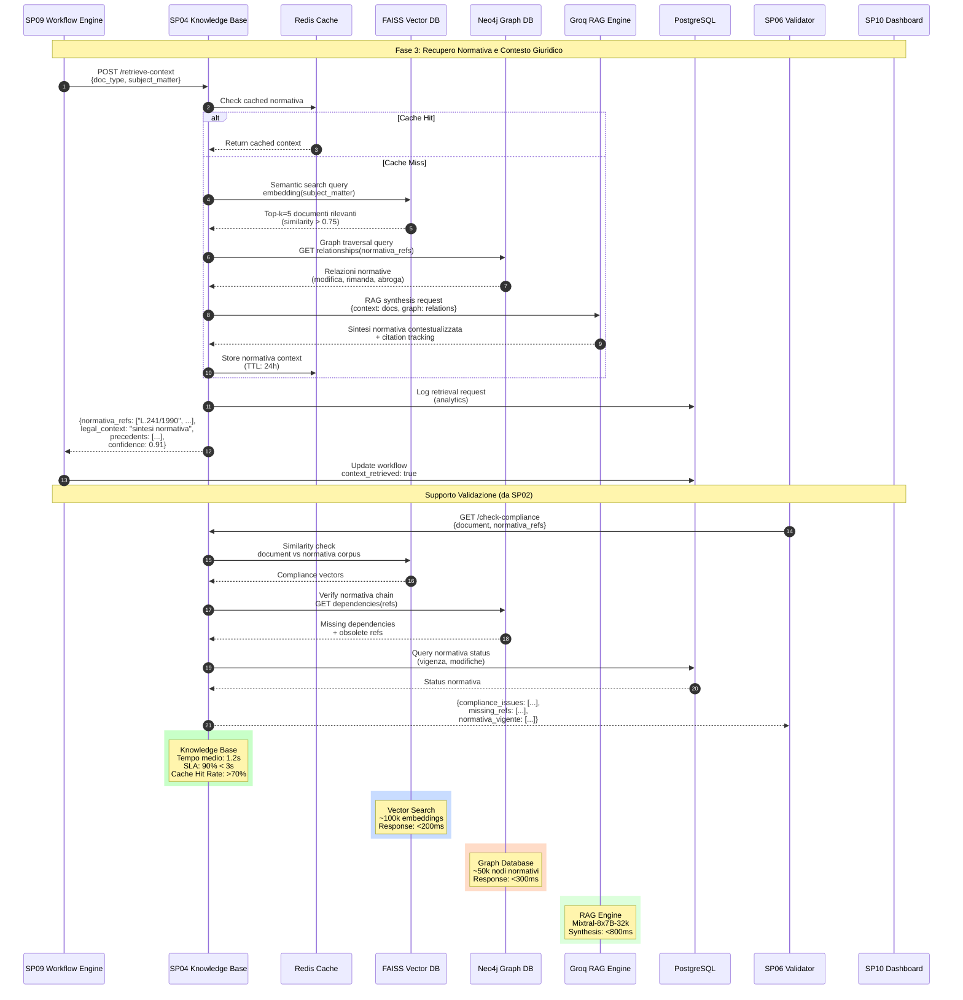

# SP04 - Knowledge Base

## Recupero Normativa e Contesto Giuridico

Questo diagramma mostra tutte le interazioni della **Knowledge Base (SP04)** nel processo di generazione degli atti amministrativi.



## Payload Example: Context Retrieval Request

```json
{
  "doc_type": "DELIBERA_GIUNTA",
  "subject_matter": {
    "category": "URBANISTICA",
    "subcategory": "PIANI_REGOLATORI",
    "keywords": ["piano urbanistico", "zona industriale", "autorizzazione paesaggistica"],
    "importo": 150000.00,
    "normativa_menzionata": ["L.R. 12/2005", "D.Lgs 42/2004"]
  },
  "context_level": "FULL"
}
```

## Response Example: Legal Context

```json
{
  "legal_context": {
    "normativa_principale": [
      {
        "riferimento": "L. 241/1990",
        "articolo": "Art. 5",
        "testo": "Il responsabile del procedimento...",
        "rilevanza": 0.95
      },
      {
        "riferimento": "D.Lgs 42/2004",
        "articolo": "Art. 146",
        "testo": "Autorizzazione paesaggistica...",
        "rilevanza": 0.89
      }
    ],
    "giurisprudenza": [
      {
        "fonte": "Consiglio di Stato",
        "sentenza": "n. 1234/2024",
        "massima": "In materia di piani urbanistici...",
        "rilevanza": 0.78
      }
    ],
    "precedenti_simili": [
      {
        "doc_id": "DELIB-2024-0123",
        "oggetto": "Piano Urbanistico Zona Artigianale",
        "similarity": 0.84,
        "esito": "APPROVATA"
      }
    ]
  },
  "knowledge_graph_path": [
    "L.R. 12/2005 -> modifica -> L.R. 3/1999",
    "D.Lgs 42/2004 -> rimanda -> Codice Beni Culturali"
  ],
  "rag_synthesis": "Per l'approvazione del Piano Urbanistico è necessario rispettare i vincoli paesaggistici del D.Lgs 42/2004 e seguire la procedura di L. 241/1990 con nomina del responsabile del procedimento. La L.R. 12/2005 prevede inoltre consultazione preventiva con enti sovracomunali...",
  "confidence_score": 0.91,
  "processing_time_ms": 1200
}
```

## Payload Example: Compliance Check Request

```json
{
  "document": {
    "content": "<delibera>...</delibera>",
    "metadata": {
      "responsabile_procedimento": "ing. Mario Rossi",
      "importo": 150000.00
    }
  },
  "normativa_refs": [
    "L. 241/1990",
    "L.R. 12/2005",
    "D.Lgs 42/2004"
  ]
}
```

## Response Example: Compliance Check

```json
{
  "compliance_issues": [
    {
      "severity": "MEDIUM",
      "normativa": "L.R. 12/2005",
      "articolo": "Art. 8",
      "issue": "Manca riferimento a parere sovracomunale obbligatorio",
      "suggestion": "Richiedere parere alla Provincia"
    }
  ],
  "missing_refs": [
    {
      "normativa": "D.P.R. 380/2001",
      "motivo": "Applicabile per opere edilizie in zona industriale",
      "rilevanza": "CONSIGLIATO"
    }
  ],
  "normativa_vigente": [
    {
      "riferimento": "L. 241/1990",
      "status": "IN_VIGORE",
      "ultima_modifica": "D.L. 76/2020"
    },
    {
      "riferimento": "L.R. 12/2005",
      "status": "IN_VIGORE",
      "ultima_modifica": "L.R. 18/2023"
    }
  ],
  "processing_time_ms": 850
}
```

## Funzionalità Chiave SP03

### Capacità di Ricerca

#### 1. Semantic Search (FAISS)
- **Vector Database**: Embedding normativa con sentence-transformers
- **Top-K Retrieval**: Recupero 5 documenti più rilevanti
- **Similarity Score**: Threshold minimo 0.75

#### 2. Knowledge Graph (Neo4j)
- **Relazioni normative**: Modifica, rimanda, abroga, integra
- **Path traversal**: Catene di riferimenti legislativi
- **Temporal queries**: Vigenza nel tempo

#### 3. RAG Pipeline (Mistral-7B)
- **Context augmentation**: Arricchimento prompt con normativa
- **Synthesis**: Generazione sintesi leggibile
- **Citation tracking**: Tracciabilità fonti

### Database Contenuti

| Tipo | Quantità | Aggiornamento |
|------|----------|---------------|
| Leggi nazionali | ~5.000 | Settimanale |
| Leggi regionali | ~15.000 | Bisettimanale |
| Decreti | ~25.000 | Settimanale |
| Giurisprudenza | ~50.000 | Mensile |
| Precedenti interni | ~10.000 | Real-time |

### Caching Strategy

- **Cache Type**: Redis
- **TTL**: 24 ore
- **Invalidazione**: On legislative change
- **Hit Rate Target**: > 70%

### Performance

- **Tempo medio**: 1.2 secondi
- **SLA target**: 90% < 3 secondi
- **Read replicas**: 3 per high-throughput
- **Concurrent queries**: Max 50

### Tecnologie e Architettura

#### Stack Principale

| Componente | Tecnologia | Ruolo | Performance Target |
|------------|------------|-------|-------------------|
| **Vector Search** | FAISS | Semantic similarity search su normativa embedded | <200ms per query |
| **Knowledge Graph** | Neo4j | Relazioni normative (modifica, rimanda, abroga) | <300ms per traversal |
| **RAG Engine** | Groq (Mixtral-8x7B-32k) | Sintesi contestualizzata + citation tracking | <800ms per synthesis |
| **Cache Layer** | Redis | Cache normativa (TTL: 24h) + session management | <10ms hit |
| **Relational DB** | PostgreSQL | Metadata normativa, analytics, audit logs | <100ms query |

#### Flusso di Elaborazione

1. **L1 Cache** (Redis): Primo controllo per richieste identiche
2. **L2 Retrieval** (FAISS): Semantic search su corpus normativo
3. **L3 Graph** (Neo4j): Navigazione relazioni e dipendenze
4. **L4 Synthesis** (Groq RAG): Generazione sintesi contestualizzata
5. **L5 Storage** (PostgreSQL): Persistenza metadata e analytics

#### Dettagli Implementativi

- **FAISS Index**: ~100k documenti normativi embedded con `sentence-transformers/all-MiniLM-L6-v2`
- **Neo4j Graph**: ~50k nodi (normativa) + ~200k relazioni (riferimenti legislativi)
- **Groq API**: Context window 32k tokens, temperatura 0.3 per consistenza
- **Redis Cache**: Hit rate target >70%, invalidazione automatica su legislative updates
- **PostgreSQL**: Vector extension (pgvector) per hybrid search fallback

---

## API Contract & Acceptance Test Criteria

### Endpoint 1: POST /retrieve-context

#### Request Schema

```json
{
  "$schema": "http://json-schema.org/draft-07/schema#",
  "type": "object",
  "required": ["doc_type", "subject_matter"],
  "properties": {
    "doc_type": {
      "type": "string",
      "enum": ["DELIBERA_GIUNTA", "DELIBERA_CONSIGLIO", "DETERMINA", "ORDINANZA"],
      "description": "Tipologia atto amministrativo"
    },
    "subject_matter": {
      "type": "object",
      "required": ["category"],
      "properties": {
        "category": {
          "type": "string",
          "enum": ["URBANISTICA", "BILANCIO", "AMBIENTE", "SOCIALE", "CULTURA"],
          "description": "Categoria principale materia"
        },
        "subcategory": {
          "type": "string",
          "description": "Sottocategoria specifica"
        },
        "keywords": {
          "type": "array",
          "items": { "type": "string" },
          "minItems": 1,
          "maxItems": 10,
          "description": "Parole chiave per semantic search"
        },
        "importo": {
          "type": "number",
          "minimum": 0,
          "description": "Importo economico (opzionale)"
        },
        "normativa_menzionata": {
          "type": "array",
          "items": { "type": "string" },
          "description": "Riferimenti normativi già noti"
        }
      }
    },
    "context_level": {
      "type": "string",
      "enum": ["MINIMAL", "STANDARD", "FULL"],
      "default": "STANDARD",
      "description": "Livello dettaglio richiesto"
    }
  }
}
```

#### Test Case 1: Urbanistica - Piano Regolatore

**Request:**
```json
{
  "doc_type": "DELIBERA_GIUNTA",
  "subject_matter": {
    "category": "URBANISTICA",
    "subcategory": "PIANI_REGOLATORI",
    "keywords": [
      "piano urbanistico",
      "zona industriale",
      "autorizzazione paesaggistica"
    ],
    "importo": 150000.00,
    "normativa_menzionata": ["L.R. 12/2005", "D.Lgs 42/2004"]
  },
  "context_level": "FULL"
}
```

**Expected Response (200 OK):**
```json
{
  "request_id": "kb-20251027-123456-abc",
  "legal_context": {
    "normativa_principale": [
      {
        "riferimento": "L. 241/1990",
        "articolo": "Art. 5",
        "comma": "1",
        "testo": "Il responsabile del procedimento è individuato dall'organo competente per l'adozione del provvedimento finale...",
        "rilevanza": 0.95,
        "fonte": "FAISS",
        "embedding_similarity": 0.89
      },
      {
        "riferimento": "D.Lgs 42/2004",
        "articolo": "Art. 146",
        "comma": "1-3",
        "testo": "I proprietari, possessori o detentori a qualsiasi titolo di immobili e aree sottoposti a vincolo paesaggistico...",
        "rilevanza": 0.89,
        "fonte": "FAISS",
        "embedding_similarity": 0.92
      },
      {
        "riferimento": "L.R. 12/2005",
        "articolo": "Art. 8",
        "testo": "Per l'approvazione dei piani urbanistici è richiesto parere preventivo degli enti sovracomunali...",
        "rilevanza": 0.87,
        "fonte": "GRAPH_TRAVERSAL"
      }
    ],
    "giurisprudenza": [
      {
        "fonte": "Consiglio di Stato",
        "sentenza": "n. 1234/2024",
        "sezione": "IV",
        "data": "2024-03-15",
        "massima": "In materia di piani urbanistici con impatto paesaggistico, l'autorizzazione ex D.Lgs 42/2004 è presupposto necessario...",
        "rilevanza": 0.78,
        "url": "https://..."
      },
      {
        "fonte": "TAR Lazio",
        "sentenza": "n. 5678/2023",
        "sezione": "II",
        "data": "2023-11-20",
        "massima": "La consultazione preventiva con enti sovracomunali costituisce garanzia procedimentale inderogabile...",
        "rilevanza": 0.72,
        "url": "https://..."
      }
    ],
    "precedenti_simili": [
      {
        "doc_id": "DELIB-2024-0123",
        "oggetto": "Piano Urbanistico Zona Artigianale Est",
        "similarity": 0.84,
        "categoria": "URBANISTICA",
        "esito": "APPROVATA",
        "data": "2024-06-10",
        "note": "Importo simile, stessa tipologia vincoli"
      },
      {
        "doc_id": "DELIB-2023-0456",
        "oggetto": "Variante PRG Area Industriale Nord",
        "similarity": 0.79,
        "categoria": "URBANISTICA",
        "esito": "APPROVATA_CON_PRESCRIZIONI",
        "data": "2023-09-15",
        "note": "Richieste integrazioni su impatto ambientale"
      }
    ]
  },
  "knowledge_graph": {
    "graph_path": [
      {
        "from": "L.R. 12/2005",
        "relation": "MODIFICA",
        "to": "L.R. 3/1999",
        "effective_date": "2005-04-01"
      },
      {
        "from": "D.Lgs 42/2004",
        "relation": "RIMANDA",
        "to": "Codice Beni Culturali",
        "article": "Art. 146"
      },
      {
        "from": "L. 241/1990",
        "relation": "INTEGRATA_DA",
        "to": "D.L. 76/2020",
        "note": "Semplificazioni procedurali"
      }
    ],
    "dependencies": [
      {
        "normativa": "D.P.R. 380/2001",
        "motivo": "Applicabile per opere edilizie in zona industriale",
        "obbligatorietà": "CONSIGLIATO"
      }
    ]
  },
  "rag_synthesis": {
    "testo": "Per l'approvazione del Piano Urbanistico relativo a zona industriale con vincoli paesaggistici è necessario:\n\n1. **Procedura amministrativa** (L. 241/1990): Nomina responsabile del procedimento ai sensi dell'Art. 5, con termine procedimentale di 90 giorni salvo sospensioni per integrazioni.\n\n2. **Autorizzazione paesaggistica** (D.Lgs 42/2004, Art. 146): Richiesta obbligatoria alla Soprintendenza con documentazione fotografica e relazione paesaggistica. La giurisprudenza (Consiglio di Stato n. 1234/2024) conferma che tale autorizzazione è presupposto necessario.\n\n3. **Consultazione sovracomunale** (L.R. 12/2005, Art. 8): Parere preventivo obbligatorio della Provincia, come confermato dalla giurisprudenza regionale (TAR Lazio n. 5678/2023).\n\n4. **Aspetti economici**: Per l'importo di €150.000, applicabile normativa su appalti pubblici se previsti lavori.\n\n5. **Precedenti**: Analisi dei casi DELIB-2024-0123 e DELIB-2023-0456 suggerisce particolare attenzione a impatto ambientale e prescrizioni paesaggistiche.",
    "generated_by": "groq-mixtral-8x7b-32k",
    "temperature": 0.3,
    "tokens_used": 1847,
    "citations": [
      "L. 241/1990, Art. 5",
      "D.Lgs 42/2004, Art. 146",
      "L.R. 12/2005, Art. 8",
      "Consiglio di Stato n. 1234/2024",
      "TAR Lazio n. 5678/2023"
    ]
  },
  "metadata": {
    "confidence_score": 0.91,
    "processing_time_ms": 1245,
    "cache_hit": false,
    "sources": {
      "faiss_docs": 5,
      "neo4j_relations": 8,
      "groq_synthesis": true,
      "precedenti": 2
    }
  }
}
```

**Acceptance Criteria:**
- ✅ Response time < 3000ms (SLA: 90% requests)
- ✅ `confidence_score` >= 0.75
- ✅ `normativa_principale` contiene almeno 3 riferimenti con `rilevanza` > 0.70
- ✅ `rag_synthesis.citations` traccia tutte le fonti menzionate
- ✅ `knowledge_graph.graph_path` mostra relazioni normative
- ✅ Cache Redis popolata con TTL 24h

#### Test Case 2: Bilancio - Variazione Budget

**Request:**
```json
{
  "doc_type": "DELIBERA_GIUNTA",
  "subject_matter": {
    "category": "BILANCIO",
    "subcategory": "VARIAZIONI_BUDGET",
    "keywords": ["variazione bilancio", "fondi covid", "emergenza sanitaria"],
    "importo": 250000.00,
    "normativa_menzionata": ["D.Lgs 267/2000", "TUEL"]
  },
  "context_level": "STANDARD"
}
```

**Expected Response (200 OK):**
```json
{
  "request_id": "kb-20251027-123457-def",
  "legal_context": {
    "normativa_principale": [
      {
        "riferimento": "D.Lgs 267/2000",
        "articolo": "Art. 175",
        "comma": "2",
        "testo": "Le variazioni di bilancio sono approvate con deliberazione della Giunta...",
        "rilevanza": 0.96,
        "fonte": "FAISS",
        "embedding_similarity": 0.94
      },
      {
        "riferimento": "D.L. 34/2020",
        "articolo": "Art. 109",
        "testo": "Misure finanziarie urgenti connesse all'emergenza COVID-19...",
        "rilevanza": 0.88,
        "fonte": "FAISS",
        "embedding_similarity": 0.87
      },
      {
        "riferimento": "L. 241/1990",
        "articolo": "Art. 7",
        "testo": "Motivazione del provvedimento amministrativo...",
        "rilevanza": 0.82,
        "fonte": "GRAPH_TRAVERSAL"
      }
    ],
    "precedenti_simili": [
      {
        "doc_id": "DELIB-2023-0789",
        "oggetto": "Variazione Bilancio Fondi Emergenza Sanitaria",
        "similarity": 0.91,
        "categoria": "BILANCIO",
        "esito": "APPROVATA",
        "data": "2023-04-20",
        "note": "Stanziamento €200.000 per COVID-19"
      }
    ]
  },
  "knowledge_graph": {
    "graph_path": [
      {
        "from": "D.Lgs 267/2000",
        "relation": "MODIFICATO_DA",
        "to": "D.L. 174/2012",
        "effective_date": "2012-12-10"
      }
    ]
  },
  "rag_synthesis": {
    "testo": "La variazione di bilancio per €250.000 destinata a fondi emergenza COVID-19 richiede:\n\n1. **Delibera Giunta** (D.Lgs 267/2000, Art. 175): Competenza della Giunta per variazioni urgenti.\n\n2. **Motivazione** (L. 241/1990, Art. 7): Esplicitare urgenza e necessità connessa a emergenza sanitaria.\n\n3. **Normativa COVID** (D.L. 34/2020, Art. 109): Utilizzo fondi emergenza sanitaria con rendicontazione.\n\n4. **Precedente DELIB-2023-0789** suggerisce iter approvativo standard con ratifica consiliare entro 60 giorni.",
    "generated_by": "groq-mixtral-8x7b-32k",
    "temperature": 0.3,
    "tokens_used": 892,
    "citations": [
      "D.Lgs 267/2000, Art. 175",
      "D.L. 34/2020, Art. 109",
      "L. 241/1990, Art. 7"
    ]
  },
  "metadata": {
    "confidence_score": 0.89,
    "processing_time_ms": 987,
    "cache_hit": false,
    "sources": {
      "faiss_docs": 5,
      "neo4j_relations": 3,
      "groq_synthesis": true,
      "precedenti": 1
    }
  }
}
```

**Acceptance Criteria:**
- ✅ Response time < 2000ms (caso STANDARD, non FULL)
- ✅ `confidence_score` >= 0.75
- ✅ Riferimenti normativi specifici per categoria BILANCIO
- ✅ `precedenti_simili` con `similarity` > 0.80

---

### Endpoint 2: GET /check-compliance

#### Request Schema

```json
{
  "$schema": "http://json-schema.org/draft-07/schema#",
  "type": "object",
  "required": ["document", "normativa_refs"],
  "properties": {
    "document": {
      "type": "object",
      "required": ["content", "metadata"],
      "properties": {
        "content": {
          "type": "string",
          "description": "Contenuto bozza atto (testo o XML)"
        },
        "doc_type": {
          "type": "string",
          "enum": ["DELIBERA_GIUNTA", "DELIBERA_CONSIGLIO", "DETERMINA", "ORDINANZA"]
        },
        "metadata": {
          "type": "object",
          "properties": {
            "responsabile_procedimento": { "type": "string" },
            "importo": { "type": "number" },
            "data_redazione": { "type": "string", "format": "date" }
          }
        }
      }
    },
    "normativa_refs": {
      "type": "array",
      "items": { "type": "string" },
      "minItems": 1,
      "description": "Riferimenti normativi da verificare"
    },
    "check_level": {
      "type": "string",
      "enum": ["BASIC", "COMPREHENSIVE"],
      "default": "BASIC"
    }
  }
}
```

#### Test Case 3: Compliance Check - Delibera Urbanistica

**Request:**
```json
{
  "document": {
    "content": "DELIBERAZIONE DELLA GIUNTA COMUNALE N. XX DEL XX/XX/XXXX\n\nOGGETTO: Approvazione Piano Urbanistico Zona Industriale Est\n\nPREMESSO CHE:\n- È necessario procedere all'approvazione del Piano Urbanistico;\n- L'importo previsto è di €150.000,00;\n- Il Responsabile del Procedimento è l'Ing. Mario Rossi;\n\nVISTO:\n- La L. 241/1990 in materia di procedimento amministrativo;\n- Il D.Lgs 42/2004 sul patrimonio culturale;\n\nDELIBERA:\n1. Di approvare il Piano Urbanistico come da allegato A;\n2. Di dare atto che la spesa è coperta dal Capitolo 12345;\n...",
    "doc_type": "DELIBERA_GIUNTA",
    "metadata": {
      "responsabile_procedimento": "Ing. Mario Rossi",
      "importo": 150000.00,
      "data_redazione": "2025-10-27"
    }
  },
  "normativa_refs": [
    "L. 241/1990",
    "D.Lgs 42/2004",
    "L.R. 12/2005"
  ],
  "check_level": "COMPREHENSIVE"
}
```

**Expected Response (200 OK):**
```json
{
  "request_id": "kb-comp-20251027-123458-ghi",
  "compliance_status": "NON_COMPLIANT",
  "compliance_score": 0.68,
  "compliance_issues": [
    {
      "severity": "HIGH",
      "category": "MISSING_REFERENCE",
      "normativa": "L.R. 12/2005",
      "articolo": "Art. 8",
      "issue": "Manca riferimento esplicito al parere sovracomunale obbligatorio",
      "location": {
        "section": "VISTO",
        "line_number": null
      },
      "suggestion": "Aggiungere: 'VISTO il parere favorevole della Provincia prot. n. XXXX del XX/XX/XXXX, ai sensi della L.R. 12/2005, Art. 8'",
      "impact": "Illegittimità delibera per mancanza presupposto procedimentale",
      "detected_by": "NEO4J_GRAPH"
    },
    {
      "severity": "MEDIUM",
      "category": "INCOMPLETE_REFERENCE",
      "normativa": "D.Lgs 42/2004",
      "articolo": "Art. 146",
      "issue": "Citato D.Lgs 42/2004 generico, ma non menzionata l'autorizzazione paesaggistica specifica",
      "location": {
        "section": "VISTO",
        "line_number": null
      },
      "suggestion": "Specificare: 'ACQUISITA l'autorizzazione paesaggistica della Soprintendenza prot. n. XXXX del XX/XX/XXXX, ai sensi del D.Lgs 42/2004, Art. 146'",
      "impact": "Procedura incompleta, possibile annullamento",
      "detected_by": "FAISS_SIMILARITY"
    },
    {
      "severity": "LOW",
      "category": "BEST_PRACTICE",
      "normativa": "L. 241/1990",
      "articolo": "Art. 10-bis",
      "issue": "Non indicato termine finale del procedimento",
      "location": {
        "section": "PREMESSO",
        "line_number": null
      },
      "suggestion": "Aggiungere: 'Il procedimento deve concludersi entro 90 giorni dalla presentazione, ai sensi della L. 241/1990, Art. 2'",
      "impact": "Miglioramento trasparenza amministrativa",
      "detected_by": "GROQ_ANALYSIS"
    }
  ],
  "missing_refs": [
    {
      "normativa": "D.P.R. 380/2001",
      "articolo": "Art. 12",
      "motivo": "Applicabile per permessi di costruire in zona industriale",
      "rilevanza": "CONSIGLIATO",
      "similarity_score": 0.76
    }
  ],
  "normativa_vigente": [
    {
      "riferimento": "L. 241/1990",
      "status": "IN_VIGORE",
      "ultima_modifica": "D.L. 76/2020",
      "data_modifica": "2020-07-16",
      "versione_applicabile": "Testo consolidato al 2020-07-16"
    },
    {
      "riferimento": "D.Lgs 42/2004",
      "status": "IN_VIGORE",
      "ultima_modifica": "D.Lgs 62/2008",
      "data_modifica": "2008-04-26",
      "versione_applicabile": "Codice Beni Culturali vigente"
    },
    {
      "riferimento": "L.R. 12/2005",
      "status": "IN_VIGORE",
      "ultima_modifica": "L.R. 18/2023",
      "data_modifica": "2023-06-30",
      "versione_applicabile": "Testo consolidato regionale"
    }
  ],
  "suggestions": [
    {
      "type": "STRUCTURE",
      "priority": "MEDIUM",
      "text": "Aggiungere sezione 'ACQUISITI' per elencare pareri e autorizzazioni degli enti terzi"
    },
    {
      "type": "COMPLETENESS",
      "priority": "HIGH",
      "text": "Verificare allegati: Piano Urbanistico, relazione paesaggistica, documentazione fotografica"
    }
  ],
  "metadata": {
    "processing_time_ms": 1456,
    "checks_performed": {
      "faiss_similarity": true,
      "neo4j_dependencies": true,
      "groq_analysis": true,
      "normativa_status": true
    }
  }
}
```

**Acceptance Criteria:**
- ✅ Response time < 3000ms
- ✅ `compliance_issues` categorizzati per `severity` (HIGH, MEDIUM, LOW)
- ✅ Ogni issue contiene `suggestion` actionable
- ✅ `normativa_vigente` verifica status aggiornato
- ✅ `detected_by` traccia quale componente ha identificato l'issue (FAISS, Neo4j, Groq)

#### Test Case 4: Compliance Check - Documento Conforme

**Request:**
```json
{
  "document": {
    "content": "DELIBERAZIONE DELLA GIUNTA COMUNALE N. 45 DEL 27/10/2025\n\nOGGETTO: Variazione Bilancio 2025 - Fondi Emergenza\n\nPREMESSO CHE:\n- È necessario stanziare €250.000 per emergenza sanitaria;\n- Il Responsabile del Servizio Finanziario ha verificato la copertura;\n\nVISTO:\n- Il D.Lgs 267/2000, Art. 175, comma 2 sulle variazioni di bilancio;\n- Il D.L. 34/2020, Art. 109 sulle misure COVID-19;\n- La L. 241/1990, Art. 7 sulla motivazione degli atti;\n\nACQUISITO il parere favorevole del Revisore dei Conti;\n\nDELIBERA:\n1. Di approvare la variazione di bilancio;\n2. Di trasmettere al Consiglio per ratifica entro 60 giorni;\n...",
    "doc_type": "DELIBERA_GIUNTA",
    "metadata": {
      "responsabile_procedimento": "Dott.ssa Anna Bianchi",
      "importo": 250000.00,
      "data_redazione": "2025-10-27"
    }
  },
  "normativa_refs": [
    "D.Lgs 267/2000",
    "D.L. 34/2020",
    "L. 241/1990"
  ],
  "check_level": "BASIC"
}
```

**Expected Response (200 OK):**
```json
{
  "request_id": "kb-comp-20251027-123459-jkl",
  "compliance_status": "COMPLIANT",
  "compliance_score": 0.94,
  "compliance_issues": [],
  "missing_refs": [],
  "normativa_vigente": [
    {
      "riferimento": "D.Lgs 267/2000",
      "status": "IN_VIGORE",
      "ultima_modifica": "D.L. 174/2012",
      "data_modifica": "2012-12-10",
      "versione_applicabile": "TUEL vigente"
    },
    {
      "riferimento": "D.L. 34/2020",
      "status": "IN_VIGORE",
      "ultima_modifica": "Convertito in L. 77/2020",
      "data_modifica": "2020-07-17",
      "versione_applicabile": "Decreto Rilancio vigente"
    },
    {
      "riferimento": "L. 241/1990",
      "status": "IN_VIGORE",
      "ultima_modifica": "D.L. 76/2020",
      "data_modifica": "2020-07-16",
      "versione_applicabile": "Testo consolidato al 2020-07-16"
    }
  ],
  "suggestions": [
    {
      "type": "OPTIMIZATION",
      "priority": "LOW",
      "text": "Documento ben strutturato. Verificare solo la corretta protocollazione del parere del Revisore dei Conti"
    }
  ],
  "metadata": {
    "processing_time_ms": 678,
    "checks_performed": {
      "faiss_similarity": true,
      "neo4j_dependencies": false,
      "groq_analysis": false,
      "normativa_status": true
    }
  }
}
```

**Acceptance Criteria:**
- ✅ Response time < 1500ms (check BASIC più veloce)
- ✅ `compliance_status` = "COMPLIANT" quando nessun issue HIGH/MEDIUM
- ✅ `compliance_score` >= 0.90 per documenti conformi
- ✅ `suggestions` anche per documenti conformi (best practices)

---

### Endpoint 3: POST /semantic-search

#### Request Schema

```json
{
  "$schema": "http://json-schema.org/draft-07/schema#",
  "type": "object",
  "required": ["query"],
  "properties": {
    "query": {
      "type": "string",
      "minLength": 10,
      "description": "Query in linguaggio naturale"
    },
    "filters": {
      "type": "object",
      "properties": {
        "tipo_normativa": {
          "type": "array",
          "items": { 
            "type": "string",
            "enum": ["LEGGE", "DECRETO", "REGOLAMENTO", "GIURISPRUDENZA"]
          }
        },
        "ambito": {
          "type": "array",
          "items": {
            "type": "string",
            "enum": ["NAZIONALE", "REGIONALE", "LOCALE"]
          }
        },
        "data_dal": { "type": "string", "format": "date" },
        "data_al": { "type": "string", "format": "date" }
      }
    },
    "top_k": {
      "type": "integer",
      "minimum": 1,
      "maximum": 20,
      "default": 5
    },
    "similarity_threshold": {
      "type": "number",
      "minimum": 0.0,
      "maximum": 1.0,
      "default": 0.75
    }
  }
}
```

#### Test Case 5: Semantic Search - Responsabile Procedimento

**Request:**
```json
{
  "query": "Quali sono gli obblighi del responsabile del procedimento amministrativo in materia di trasparenza?",
  "filters": {
    "tipo_normativa": ["LEGGE"],
    "ambito": ["NAZIONALE"]
  },
  "top_k": 3,
  "similarity_threshold": 0.80
}
```

**Expected Response (200 OK):**
```json
{
  "request_id": "kb-search-20251027-123460-mno",
  "query_embedding_time_ms": 45,
  "search_time_ms": 178,
  "results": [
    {
      "rank": 1,
      "similarity": 0.92,
      "documento": {
        "riferimento": "L. 241/1990",
        "titolo": "Nuove norme in materia di procedimento amministrativo",
        "articolo": "Art. 6",
        "comma": "1",
        "testo": "Il responsabile del procedimento ha la responsabilità dell'istruttoria e di ogni altro adempimento inerente il singolo procedimento, nonché dell'adozione del provvedimento finale...",
        "tipo": "LEGGE",
        "ambito": "NAZIONALE",
        "data_pubblicazione": "1990-08-18",
        "gazzetta_ufficiale": "G.U. n. 192 del 18/08/1990"
      },
      "highlights": [
        "responsabile del procedimento",
        "responsabilità dell'istruttoria",
        "adozione del provvedimento finale"
      ]
    },
    {
      "rank": 2,
      "similarity": 0.88,
      "documento": {
        "riferimento": "D.Lgs 33/2013",
        "titolo": "Riordino della disciplina riguardante il diritto di accesso civico",
        "articolo": "Art. 5",
        "comma": "2",
        "testo": "Nelle pagine iniziali del sito istituzionale è indicato il nominativo del responsabile del procedimento cui è attribuito il potere sostitutivo...",
        "tipo": "DECRETO",
        "ambito": "NAZIONALE",
        "data_pubblicazione": "2013-04-05",
        "gazzetta_ufficiale": "G.U. n. 80 del 05/04/2013"
      },
      "highlights": [
        "nominativo del responsabile",
        "trasparenza",
        "sito istituzionale"
      ]
    },
    {
      "rank": 3,
      "similarity": 0.84,
      "documento": {
        "riferimento": "L. 241/1990",
        "titolo": "Nuove norme in materia di procedimento amministrativo",
        "articolo": "Art. 8",
        "comma": "1",
        "testo": "Il responsabile del procedimento può chiedere il rilascio di dichiarazioni e la rettifica di dichiarazioni o istanze erronee o incomplete...",
        "tipo": "LEGGE",
        "ambito": "NAZIONALE",
        "data_pubblicazione": "1990-08-18",
        "gazzetta_ufficiale": "G.U. n. 192 del 18/08/1990"
      },
      "highlights": [
        "responsabile del procedimento può chiedere",
        "dichiarazioni",
        "istanze"
      ]
    }
  ],
  "total_results": 3,
  "metadata": {
    "faiss_index_size": 98547,
    "embedding_model": "sentence-transformers/all-MiniLM-L6-v2",
    "processing_time_ms": 223
  }
}
```

**Acceptance Criteria:**
- ✅ Response time < 500ms
- ✅ Results ordinati per `similarity` decrescente
- ✅ Tutti i risultati hanno `similarity` >= `similarity_threshold`
- ✅ `highlights` mostra match testuali rilevanti
- ✅ Metadata include dettagli pubblicazione (GU, data, ecc.)

---

### Endpoint 4: GET /graph-relations

#### Request Schema

```json
{
  "$schema": "http://json-schema.org/draft-07/schema#",
  "type": "object",
  "required": ["normativa_id"],
  "properties": {
    "normativa_id": {
      "type": "string",
      "description": "ID normativa (es: 'L.241/1990')"
    },
    "relation_types": {
      "type": "array",
      "items": {
        "type": "string",
        "enum": ["MODIFICA", "ABROGA", "RIMANDA", "INTEGRA", "SOSTITUISCE"]
      },
      "description": "Tipi di relazioni da recuperare (default: tutte)"
    },
    "max_depth": {
      "type": "integer",
      "minimum": 1,
      "maximum": 5,
      "default": 2,
      "description": "Profondità max traversal grafo"
    }
  }
}
```

#### Test Case 6: Graph Relations - L.241/1990

**Request:**
```json
{
  "normativa_id": "L.241/1990",
  "relation_types": ["MODIFICA", "INTEGRA"],
  "max_depth": 2
}
```

**Expected Response (200 OK):**
```json
{
  "request_id": "kb-graph-20251027-123461-pqr",
  "normativa": {
    "id": "L.241/1990",
    "titolo": "Nuove norme in materia di procedimento amministrativo",
    "data_pubblicazione": "1990-08-18",
    "status": "IN_VIGORE"
  },
  "relations": {
    "outgoing": [
      {
        "relation_type": "INTEGRA",
        "target": {
          "id": "L.15/2005",
          "titolo": "Modifiche ed integrazioni alla legge 7 agosto 1990, n. 241",
          "data": "2005-03-11"
        },
        "depth": 1,
        "note": "Introduce Art. 11 (Accordi tra P.A.)"
      },
      {
        "relation_type": "MODIFICA",
        "target": {
          "id": "D.L.76/2020",
          "titolo": "Misure urgenti per semplificazione e innovazione digitale",
          "data": "2020-07-16"
        },
        "depth": 1,
        "note": "Semplificazioni procedurali Art. 2-3"
      }
    ],
    "incoming": [
      {
        "relation_type": "RIMANDA",
        "source": {
          "id": "D.Lgs 267/2000",
          "titolo": "Testo Unico Enti Locali",
          "data": "2000-08-18"
        },
        "depth": 1,
        "note": "TUEL fa riferimento a L.241/1990 per procedimenti comunali"
      }
    ],
    "transitive": [
      {
        "path": ["L.241/1990", "INTEGRA", "L.15/2005", "MODIFICA", "L.80/2005"],
        "depth": 2,
        "final_target": {
          "id": "L.80/2005",
          "titolo": "Conversione DL 35/2005 su competitività"
        }
      }
    ]
  },
  "graph_stats": {
    "total_relations": 15,
    "outgoing_count": 8,
    "incoming_count": 7,
    "max_depth_reached": 2
  },
  "metadata": {
    "processing_time_ms": 245,
    "neo4j_query_time_ms": 198
  }
}
```

**Acceptance Criteria:**
- ✅ Response time < 500ms
- ✅ Relations categorizzate in `outgoing`, `incoming`, `transitive`
- ✅ `depth` indica livello nel grafo
- ✅ `transitive` mostra catene di relazioni
- ✅ Graph stats fornisce metriche navigazione

---

### Endpoint 5: POST /cache-invalidate

#### Request Schema (Admin Endpoint)

```json
{
  "$schema": "http://json-schema.org/draft-07/schema#",
  "type": "object",
  "required": ["invalidation_type"],
  "properties": {
    "invalidation_type": {
      "type": "string",
      "enum": ["ALL", "BY_PATTERN", "BY_NORMATIVA"],
      "description": "Tipo di invalidazione cache"
    },
    "pattern": {
      "type": "string",
      "description": "Pattern Redis (es: 'kb:urbanistica:*')"
    },
    "normativa_id": {
      "type": "string",
      "description": "ID normativa modificata (es: 'L.R.12/2005')"
    },
    "reason": {
      "type": "string",
      "description": "Motivo invalidazione (audit)"
    }
  }
}
```

#### Test Case 7: Cache Invalidation - Normativa Update

**Request:**
```json
{
  "invalidation_type": "BY_NORMATIVA",
  "normativa_id": "L.R.12/2005",
  "reason": "Pubblicata L.R. 23/2025 che modifica Art. 8"
}
```

**Expected Response (200 OK):**
```json
{
  "request_id": "kb-cache-20251027-123462-stu",
  "invalidation_result": {
    "keys_invalidated": 47,
    "patterns_matched": [
      "kb:context:*:L.R.12/2005:*",
      "kb:compliance:*:L.R.12/2005:*",
      "kb:graph:L.R.12/2005:*"
    ],
    "affected_categories": ["URBANISTICA"],
    "cache_hit_rate_before": 0.73,
    "estimated_rebuild_time_hours": 2.5
  },
  "audit": {
    "timestamp": "2025-10-27T14:30:00Z",
    "operator": "system",
    "reason": "Pubblicata L.R. 23/2025 che modifica Art. 8",
    "logged": true
  },
  "metadata": {
    "processing_time_ms": 156
  }
}
```

**Acceptance Criteria:**
- ✅ Invalidazione atomica (all-or-nothing)
- ✅ `keys_invalidated` conta precisa chiavi rimosse
- ✅ `audit` log completo per tracciabilità
- ✅ `estimated_rebuild_time_hours` per pianificazione

---
## 🏛️ Conformità Normativa

### Framework Normativi Applicabili

☑ L. 241/1990
☑ CAD
☑ AI Act
☐ GDPR - Regolamento 2016/679
☐ eIDAS - Regolamento 2014/910
☐ D.Lgs 42/2004 - Codice Beni Culturali
☐ D.Lgs 152/2006 - Codice dell'Ambiente
☐ D.Lgs 33/2013 - Decreto Trasparenza

**Per mappatura completa articoli → implementazioni**, vedi [Conformità Normativa Standard Template](../../templates/conformita-normativa-standard.md) e [COMPLIANCE-MATRIX.md](../../COMPLIANCE-MATRIX.md).

### Requisiti Principali Implementati

| Framework | Requisiti Principali | Status | Riferimenti |
|-----------|-------------------|--------|-------------|
| L. 241/1990 | Art. 1, Art. 3, Art. 6, Art. 27 | ✅ Implementato | [Dettagli](../../templates/conformita-normativa-standard.md) |
| CAD | Art. 1, Art. 21, Art. 22, Art. 62 | ✅ Implementato | [Dettagli](../../templates/conformita-normativa-standard.md) |
| AI Act | Art. 6, Art. 13, Art. 22 | ✅ Implementato | [Dettagli](../../templates/conformita-normativa-standard.md) |

### Conformità Normativa - Checklist

- [ ] Tutti i framework normativi applicabili identificati
- [ ] Articoli rilevanti mappati alle responsabilità SP
- [ ] GDPR: Data protection by design implementato (se applicabile)
- [ ] eIDAS: Firma digitale supportata (se applicabile)
- [ ] AI Act: Supervisione umana e trasparenza (se applicabile)
- [ ] Tracciabilità audit completa mantenuta
- [ ] Documentation conformità aggiornata

**Nota**: Dettagli di conformità completi nella sezione "## 🏛️ Conformità Normativa" del template standard.

---


## Performance Benchmarks

### Latency Targets (P90)

| Endpoint | Context Level | Target (ms) | Max Acceptable (ms) |
|----------|---------------|-------------|---------------------|
| `/retrieve-context` | MINIMAL | 500 | 1000 |
| `/retrieve-context` | STANDARD | 1200 | 2000 |
| `/retrieve-context` | FULL | 1800 | 3000 |
| `/check-compliance` | BASIC | 600 | 1500 |
| `/check-compliance` | COMPREHENSIVE | 1400 | 3000 |
| `/semantic-search` | - | 300 | 500 |
| `/graph-relations` | depth=1 | 200 | 400 |
| `/graph-relations` | depth=2 | 300 | 500 |

### Throughput Targets

- **Concurrent requests**: Max 50
- **Requests/second**: 30 sustained, 60 burst
- **Cache hit rate**: >70%
- **FAISS query/sec**: >100
- **Neo4j query/sec**: >80

### Quality Metrics

- **Confidence score threshold**: >= 0.75 per risposte valide
- **Similarity threshold**: >= 0.75 per FAISS retrieval
- **RAG citation accuracy**: 100% (tutte le citazioni tracciabili)
- **Normativa status accuracy**: 99.9% (aggiornamento settimanale)

```
