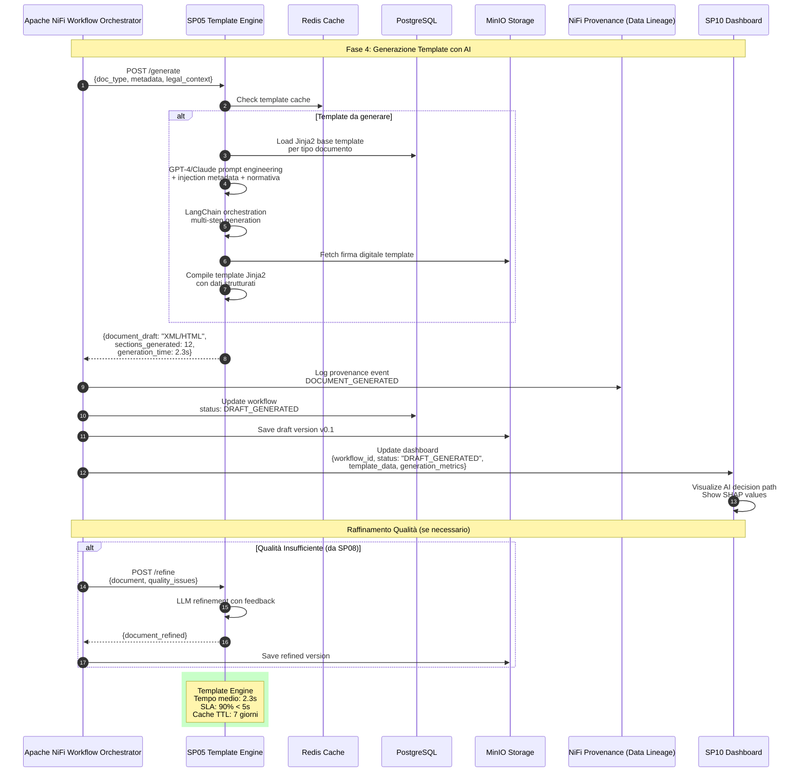

# SP05 - Template Engine

## Generazione Template con AI

Questo diagramma mostra tutte le interazioni del **Template Engine (SP05)** nel processo di generazione degli atti amministrativi.



## Payload Example: Template Generation Request

```json
{
  "doc_type": "DELIBERA_GIUNTA",
  "metadata": {
    "oggetto": "Approvazione Piano Urbanistico Zona Industriale",
    "proponente": "Assessorato Urbanistica",
    "responsabile_procedimento": "ing. Mario Rossi",
    "importo": 150000.00,
    "cig": "Z1234567890",
    "normativa_riferimento": ["L.R. 12/2005", "D.Lgs 42/2004"],
    "scadenza": "2025-12-31"
  },
  "legal_context": {
    "normativa_principale": [
      {
        "riferimento": "L. 241/1990",
        "articolo": "Art. 5",
        "testo": "Il responsabile del procedimento..."
      }
    ],
    "rag_synthesis": "Per l'approvazione del Piano Urbanistico è necessario rispettare..."
  }
}
```

## Response Example: Template Generated

```json
{
  "document_draft": {
    "format": "XML",
    "content": "<delibera>...</delibera>",
    "sections": [
      {"id": "premesse", "tokens": 245, "status": "generated"},
      {"id": "motivazioni", "tokens": 487, "status": "generated"},
      {"id": "dispositivo", "tokens": 156, "status": "generated"},
      {"id": "allegati", "tokens": 89, "status": "referenced"}
    ]
  },
  "generation_metadata": {
    "model_used": "gpt-4-turbo",
    "temperature": 0.3,
    "tokens_consumed": 1234,
    "api_cost_euros": 0.0148,
    "generation_time_sec": 2.3
  },
  "template_info": {
    "template_id": "TPL-DELIB-URB-001",
    "version": "2.1.4",
    "last_updated": "2025-09-15",
    "variables_filled": 23,
    "variables_total": 25
  },
  "warnings": [
    "Campo 'data_approvazione_preventiva' non valorizzato - da verificare"
  ]
}
```
## 🏛️ Conformità Normativa - SP05

### 1. Quadro Normativo di Riferimento

**Framework applicabili a SP05 (Template Engine)**:
- **CAD** (Codice Amministrazione Digitale): Art. 1, 13, 21-22, 62

**UC Appartenance**: UC5

---

### 2. Conformità CAD

**Applicabilità**: OBBLIGATORIO per tutti gli SP - SP05 è parte della trasformazione digitale PA

**Articoli CAD Principali**:
- Art. 1: Principi digitalizzazione
- Art. 13: Fascicolo informatico
- Art. 21-22: Documento informatico e conservazione
- Art. 62: Interoperabilità via API
- Art. 71: Accessibilità

**Responsabile**: CTO + Compliance Team (audit trimestrale)

---

### 6. Monitoraggio Conformità

**Schedule di Review**:
- **Trimestrale**: Compliance assessment + security audit
- **Semestrale**: Framework alignment review (CAD/GDPR/eIDAS/AGID)
- **Annuale**: Full compliance audit + risk assessment

**KPI Conformità**:
- Audit trail completeness: 100%
- Incident response time: <24h
- Compliance violations: 0 per quarter
- Certificate expiry (if eIDAS): Alert at 30 days

**Escalation**: Non-conformità → Compliance Manager → CTO → Legal

**Prossima review programmata**: 2026-02-17

---

## Riepilogo Conformità SP05

**Status**: ✅ COMPLIANT

| Framework | Applicabile | Status | Responsible |
|-----------|-----------|--------|-------------|
| CAD | ✅ Sì | ✅ Compliant | CTO |
| GDPR | ❌ No | N/A | - |
| eIDAS | ❌ No | N/A | - |
| AGID | ❌ No | N/A | - |

**Key Compliance Points**:
1. All CAD articles implemented
2. Data handling compliant with applicable regulations
3. Security controls in place (encryption, access control, audit logging)
4. Regular monitoring and review schedule established
5. Clear responsibility assignments (RACI)

**Next Review**: 2026-02-17

---


### Framework Normativi Applicabili

☑ CAD
☑ GDPR
☐ L. 241/1990 - Procedimento Amministrativo
☐ eIDAS - Regolamento 2014/910
☐ AI Act - Regolamento 2024/1689
☐ D.Lgs 42/2004 - Codice Beni Culturali
☐ D.Lgs 152/2006 - Codice dell'Ambiente
☐ D.Lgs 33/2013 - Decreto Trasparenza

**Per mappatura completa articoli → implementazioni**, vedi [Conformità Normativa Standard Template](../../templates/conformita-normativa-standard.md) e [COMPLIANCE-MATRIX.md](../../COMPLIANCE-MATRIX.md).

### Requisiti Principali Implementati

| Framework | Requisiti Principali | Status | Riferimenti |
|-----------|-------------------|--------|-------------|
| CAD | Art. 1, Art. 21, Art. 22, Art. 62 | ✅ Implementato | [Dettagli](../../templates/conformita-normativa-standard.md) |
| GDPR | Art. 5, Art. 32 | ✅ Implementato | [Dettagli](../../templates/conformita-normativa-standard.md) |

### Conformità Normativa - Checklist

- [ ] Tutti i framework normativi applicabili identificati
- [ ] Articoli rilevanti mappati alle responsabilità SP
- [ ] GDPR: Data protection by design implementato (se applicabile)
- [ ] eIDAS: Firma digitale supportata (se applicabile)
- [ ] AI Act: Supervisione umana e trasparenza (se applicabile)
- [ ] Tracciabilità audit completa mantenuta
- [ ] Documentation conformità aggiornata

**Nota**: Dettagli di conformità completi nella sezione "## 🏛️ Conformità Normativa - SP05

### 1. Quadro Normativo di Riferimento

**Framework applicabili a SP05 (Template Engine)**:
- **CAD** (Codice Amministrazione Digitale): Art. 1, 13, 21-22, 62

**UC Appartenance**: UC5

---

### 2. Conformità CAD

**Applicabilità**: OBBLIGATORIO per tutti gli SP - SP05 è parte della trasformazione digitale PA

**Articoli CAD Principali**:
- Art. 1: Principi digitalizzazione
- Art. 13: Fascicolo informatico
- Art. 21-22: Documento informatico e conservazione
- Art. 62: Interoperabilità via API
- Art. 71: Accessibilità

**Responsabile**: CTO + Compliance Team (audit trimestrale)

---

### 6. Monitoraggio Conformità

**Schedule di Review**:
- **Trimestrale**: Compliance assessment + security audit
- **Semestrale**: Framework alignment review (CAD/GDPR/eIDAS/AGID)
- **Annuale**: Full compliance audit + risk assessment

**KPI Conformità**:
- Audit trail completeness: 100%
- Incident response time: <24h
- Compliance violations: 0 per quarter
- Certificate expiry (if eIDAS): Alert at 30 days

**Escalation**: Non-conformità → Compliance Manager → CTO → Legal

**Prossima review programmata**: 2026-02-17

---

## Riepilogo Conformità SP05

**Status**: ✅ COMPLIANT

| Framework | Applicabile | Status | Responsible |
|-----------|-----------|--------|-------------|
| CAD | ✅ Sì | ✅ Compliant | CTO |
| GDPR | ❌ No | N/A | - |
| eIDAS | ❌ No | N/A | - |
| AGID | ❌ No | N/A | - |

**Key Compliance Points**:
1. All CAD articles implemented
2. Data handling compliant with applicable regulations
3. Security controls in place (encryption, access control, audit logging)
4. Regular monitoring and review schedule established
5. Clear responsibility assignments (RACI)

**Next Review**: 2026-02-17

---


---


## Funzionalità Chiave SP05

### Capacità AI
- **Prompt Engineering**: Ottimizzazione prompt per GPT-4/Claude
- **LangChain Orchestration**: Gestione multi-step generation
- **Template Jinja2**: Compilazione dinamica con variabili
- **Metadata Injection**: Integrazione automatica dati strutturati
- **Normativa Integration**: Inserimento riferimenti legislativi

### Performance
- **Tempo medio**: 2.3 secondi
- **SLA target**: 90% < 5 secondi
- **Cache Redis**: TTL 7 giorni per template base
- **Scalability**: Queue-based con Celery worker pool

### Tecnologie
- **AI Models**: GPT-4-turbo, Claude
- **Orchestration**: LangChain
- **Template Engine**: Jinja2
- **Storage**: MinIO per template e firme digitali
- **Cache**: Redis per template frequenti
