# SP06 - Validator

## Validazione Semantica e Conformità

Questo diagramma mostra tutte le interazioni del **Validator (SP06)** nel processo di validazione degli atti amministrativi.

```mermaid
sequenceDiagram
    autonumber
    participant WF as Apache NiFi Workflow Orchestrator
    participant VAL as SP06 Validator
    participant KB as SP04 Knowledge Base
    participant UI as Web UI
    participant U as Utente (Operatore)
    participant NIFI_PROV as NiFi Provenance (Data Lineage)
    participant DB as PostgreSQL
    participant STORAGE as MinIO Storage
    participant DASH as SP10 Dashboard
    
    Note over WF,DASH: Fase 5: Validazione Semantica e Conformità
    
    WF->>VAL: POST /validate<br/>{document_draft, doc_type}
    
    VAL->>VAL: BERT semantic analysis<br/>coerenza interna
    
    VAL->>KB: GET /check-compliance<br/>{document, normativa_refs}
    
    KB->>KB: Cross-reference con DB normativo
    
    KB-->>VAL: {compliance_issues: [...],<br/>missing_refs: [...]}
    
    VAL->>VAL: Rule engine (Drools)<br/>validazioni strutturali
    
    VAL->>VAL: Aggregazione errori per severità
    
    VAL-->>WF: {validation_status: "WARNING",<br/>critical_issues: [],<br/>warnings: ["Manca CIG"],<br/>suggestions: [...]}
    
    alt Errori Critici Rilevati
        WF->>NIFI_PROV: Log provenance event<br/>VALIDATION_FAILED
        
        WF->>UI: Notifica errori critici
        
        UI-->>U: Mostra errori e suggerimenti
        
        U->>UI: Corregge metadata
        
        Note over U,UI: Loop di correzione
        
        UI->>WF: Riavvia validazione
        
        WF->>VAL: POST /validate<br/>{document_updated, doc_type}
    end
    
    WF->>NIFI_PROV: Log provenance event<br/>DOCUMENT_VALIDATED
    
    WF->>DB: Update workflow<br/>status: VALIDATED
    
    WF->>STORAGE: Save validated version v0.2
    
    WF->>DASH: Update dashboard<br/>{workflow_id, status: "VALIDATED",<br/>validation_report, issues}
    
    DASH->>DASH: Display validation details<br/>Highlight warnings/errors
    
    rect rgb(200, 255, 200)
        Note over VAL: Validator<br/>Tempo medio: 780ms<br/>SLA: 95% < 2s<br/>BERT + Drools Rules
    end
```



## Payload Example: Validation Request

```json
{
  "document_draft": {
    "format": "XML",
    "content": "<delibera>...</delibera>",
    "sections": [
      {"id": "premesse", "content": "..."},
      {"id": "motivazioni", "content": "..."},
      {"id": "dispositivo", "content": "..."}
    ]
  },
  "doc_type": "DELIBERA_GIUNTA",
  "metadata": {
    "oggetto": "Approvazione Piano Urbanistico Zona Industriale",
    "responsabile_procedimento": "ing. Mario Rossi",
    "importo": 150000.00,
    "normativa_riferimento": ["L.R. 12/2005", "D.Lgs 42/2004"]
  }
}
```

## Response Example: Validation Result

```json
{
  "validation_result": {
    "status": "WARNING",
    "overall_score": 0.87,
    "timestamp": "2025-10-08T10:25:33Z"
  },
  "critical_issues": [],
  "warnings": [
    {
      "severity": "MEDIUM",
      "category": "METADATA_MISSING",
      "field": "cig",
      "message": "CIG obbligatorio per importi > €40.000",
      "suggestion": "Inserire CIG da ANAC",
      "auto_fixable": false
    }
  ],
  "conformity_checks": [
    {
      "rule": "PRESENZA_RESPONSABILE_PROCEDIMENTO",
      "status": "PASS",
      "normativa_ref": "L. 241/1990 Art. 5"
    },
    {
      "rule": "FORMATO_DATA_VALIDO",
      "status": "PASS"
    },
    {
      "rule": "RIFERIMENTI_NORMATIVI_VIGENTI",
      "status": "PASS",
      "details": "Tutte le norme citate sono in vigore"
    }
  ],
  "semantic_analysis": {
    "coherence_score": 0.92,
    "completeness_score": 0.89,
    "legal_consistency_score": 0.95
  },
  "suggestions": [
    "Aggiungere riferimento a delibera precedente n. 45/2024 per contesto",
    "Specificare tempistiche attuazione nel dispositivo"
  ],
  "processing_time_ms": 780
}
```
## 🏛️ Conformità Normativa

### Framework Normativi Applicabili

☑ CAD
☑ eIDAS
☐ L. 241/1990 - Procedimento Amministrativo
☐ GDPR - Regolamento 2016/679
☐ AI Act - Regolamento 2024/1689
☐ D.Lgs 42/2004 - Codice Beni Culturali
☐ D.Lgs 152/2006 - Codice dell'Ambiente
☐ D.Lgs 33/2013 - Decreto Trasparenza

**Per mappatura completa articoli → implementazioni**, vedi [Conformità Normativa Standard Template](../../templates/conformita-normativa-standard.md) e [COMPLIANCE-MATRIX.md](../../COMPLIANCE-MATRIX.md).

### Requisiti Principali Implementati

| Framework | Requisiti Principali | Status | Riferimenti |
|-----------|-------------------|--------|-------------|
| CAD | Art. 1, Art. 21, Art. 22, Art. 62 | ✅ Implementato | [Dettagli](../../templates/conformita-normativa-standard.md) |
| eIDAS | Art. 3, Art. 13 | ✅ Implementato | [Dettagli](../../templates/conformita-normativa-standard.md) |

### Conformità Normativa - Checklist

- [ ] Tutti i framework normativi applicabili identificati
- [ ] Articoli rilevanti mappati alle responsabilità SP
- [ ] GDPR: Data protection by design implementato (se applicabile)
- [ ] eIDAS: Firma digitale supportata (se applicabile)
- [ ] AI Act: Supervisione umana e trasparenza (se applicabile)
- [ ] Tracciabilità audit completa mantenuta
- [ ] Documentation conformità aggiornata

**Nota**: Dettagli di conformità completi nella sezione "## 🏛️ Conformità Normativa" del template standard.

---


## Funzionalità Chiave SP06

### Tipologie di Validazione

#### 1. Validazione Semantica (BERT)
- **Coerenza interna**: Analisi contraddizioni tra sezioni
- **Completezza**: Verifica presenza elementi essenziali
- **Consistenza legale**: Cross-check con normativa

#### 2. Validazione Strutturale (Drools)
- **Formato dati**: Validazione campi obbligatori
- **Regole business**: Applicazione policy aziendali
- **Constraints**: Verifica vincoli normativi

#### 3. Compliance Check (via SP04)
- **Normativa vigente**: Verifica riferimenti legislativi
- **Scadenze**: Controllo termini procedimentali
- **Autorizzazioni**: Verifica competenze

### Categorie di Errori

| Severità | Comportamento | Esempio |
|----------|---------------|---------|
| **CRITICAL** | Blocca workflow | Manca responsabile procedimento |
| **HIGH** | Richiede correzione | Normativa citata abrogata |
| **MEDIUM** | Warning con suggerimento | CIG mancante per importo alto |
| **LOW** | Informativo | Riferimento a delibera precedente consigliato |

### Performance

- **Tempo medio**: 780ms
- **SLA target**: 95% < 2 secondi
- **Parallel validation**: Sezioni indipendenti validate in parallelo
- **Cache**: Regole di validazione in Redis (TTL: non applicabile)

### Tecnologie

- **AI Model**: BERT per semantic analysis
- **Rule Engine**: Drools per validazioni strutturali
- **Integration**: SP03 Knowledge Base per compliance
- **Storage**: PostgreSQL per audit dei risultati
