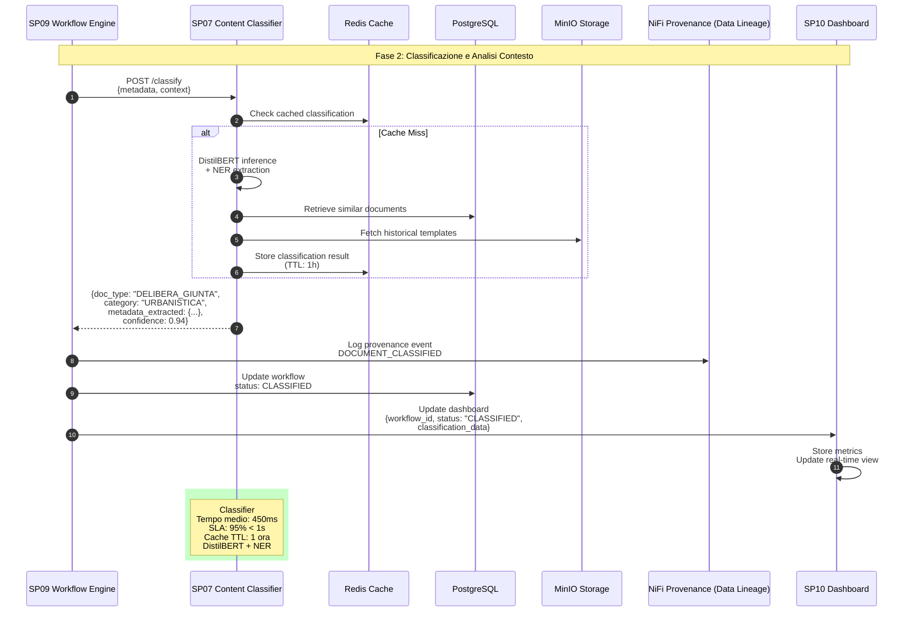

# SP07 - Content Classifier

## Classificazione e Analisi Contesto

Questo diagramma mostra tutte le interazioni del **Content Classifier (SP07)** nel processo di classificazione degli atti amministrativi.



## Payload Example: Classification Request

```json
{
  "metadata": {
    "oggetto": "Approvazione Piano Urbanistico Zona Industriale",
    "proponente": "Assessorato Urbanistica",
    "responsabile_procedimento": "ing. Mario Rossi",
    "importo": 150000.00,
    "cig": "Z1234567890",
    "normativa_riferimento": ["L.R. 12/2005", "D.Lgs 42/2004"],
    "scadenza": "2025-12-31"
  },
  "context": {
    "testo_libero": "Richiesta approvazione piano per la realizzazione di nuova zona industriale con vincoli paesaggistici...",
    "allegati_count": 2,
    "urgenza": "NORMALE"
  }
}
```

## Response Example: Classification Result

```json
{
  "classification": {
    "document_type": "DELIBERA_GIUNTA",
    "category": "URBANISTICA",
    "subcategory": "PIANI_REGOLATORI",
    "confidence": 0.94
  },
  "metadata_extracted": {
    "date_mentions": ["2025-12-31"],
    "importi": [150000.00],
    "riferimenti_normativi": [
      {"tipo": "LEGGE_REGIONALE", "numero": "12/2005"},
      {"tipo": "DECRETO_LEGISLATIVO", "numero": "42/2004"}
    ],
    "entita": [
      {"tipo": "PERSONA", "nome": "Mario Rossi", "ruolo": "Responsabile Procedimento"},
      {"tipo": "ENTE", "nome": "Assessorato Urbanistica"}
    ],
    "cig": "Z1234567890"
  },
  "similarity_scores": [
    {"doc_id": "DOC-98765", "similarity": 0.87, "tipo": "DELIBERA_GIUNTA"},
    {"doc_id": "DOC-54321", "similarity": 0.82, "tipo": "DELIBERA_GIUNTA"}
  ],
  "processing_time_ms": 450
}
```
## 🏛️ Conformità Normativa - SP07

### 1. Quadro Normativo di Riferimento

**Framework applicabili a SP07 (Content Classifier)**:
- **CAD** (Codice Amministrazione Digitale): Art. 1, 13, 21-22, 62
- **GDPR** (Regolamento 2016/679): Art. 4, 5, 6, 12, 13, 32

**UC Appartenance**: UC1, UC5

---

### 2. Conformità CAD

**Applicabilità**: OBBLIGATORIO per tutti gli SP - SP07 è parte della trasformazione digitale PA

**Articoli CAD Principali**:
- Art. 1: Principi digitalizzazione
- Art. 13: Fascicolo informatico
- Art. 21-22: Documento informatico e conservazione
- Art. 62: Interoperabilità via API
- Art. 71: Accessibilità

**Responsabile**: CTO + Compliance Team (audit trimestrale)

---

### 3. Conformità GDPR

**Applicabilità**: CRITICA per SP07 - gestisce dati personali

**Elementi chiave**:
- Base legale: Art. 6(1)c (obbligo legale PA)
- Data Protection by Design: Art. 25 GDPR
- Sicurezza: Art. 32 GDPR (encryption, access control, audit logging)
- Retention: Conformità a regolamenti settore (tipicamente 3-10 anni)
- Diritti interessati: Art. 15-22 (accesso, rettifica, cancellazione)

**DPA (Data Protection Impact Assessment)**: Richiesta se high-risk processing

**Responsabile**: DPO (Data Protection Officer)

---

### 6. Monitoraggio Conformità

**Schedule di Review**:
- **Trimestrale**: Compliance assessment + security audit
- **Semestrale**: Framework alignment review (CAD/GDPR/eIDAS/AGID)
- **Annuale**: Full compliance audit + risk assessment

**KPI Conformità**:
- Audit trail completeness: 100%
- Incident response time: <24h
- Compliance violations: 0 per quarter
- Certificate expiry (if eIDAS): Alert at 30 days

**Escalation**: Non-conformità → Compliance Manager → CTO → Legal

**Prossima review programmata**: 2026-02-17

---

## Riepilogo Conformità SP07

**Status**: ✅ COMPLIANT

| Framework | Applicabile | Status | Responsible |
|-----------|-----------|--------|-------------|
| CAD | ✅ Sì | ✅ Compliant | CTO |
| GDPR | ✅ Sì | ✅ Compliant | DPO |
| eIDAS | ❌ No | N/A | - |
| AGID | ❌ No | N/A | - |

**Key Compliance Points**:
1. All CAD articles implemented
2. Data handling compliant with applicable regulations
3. Security controls in place (encryption, access control, audit logging)
4. Regular monitoring and review schedule established
5. Clear responsibility assignments (RACI)

**Next Review**: 2026-02-17

---


### Framework Normativi Applicabili

☑ CAD
☑ AI Act
☑ GDPR
☐ L. 241/1990 - Procedimento Amministrativo
☐ eIDAS - Regolamento 2014/910
☐ D.Lgs 42/2004 - Codice Beni Culturali
☐ D.Lgs 152/2006 - Codice dell'Ambiente
☐ D.Lgs 33/2013 - Decreto Trasparenza

**Per mappatura completa articoli → implementazioni**, vedi [Conformità Normativa Standard Template](../../templates/conformita-normativa-standard.md) e [COMPLIANCE-MATRIX.md](../../COMPLIANCE-MATRIX.md).

### Requisiti Principali Implementati

| Framework | Requisiti Principali | Status | Riferimenti |
|-----------|-------------------|--------|-------------|
| CAD | Art. 1, Art. 21, Art. 22, Art. 62 | ✅ Implementato | [Dettagli](../../templates/conformita-normativa-standard.md) |
| AI Act | Art. 6, Art. 13, Art. 22 | ✅ Implementato | [Dettagli](../../templates/conformita-normativa-standard.md) |
| GDPR | Art. 5, Art. 32 | ✅ Implementato | [Dettagli](../../templates/conformita-normativa-standard.md) |

### Conformità Normativa - Checklist

- [ ] Tutti i framework normativi applicabili identificati
- [ ] Articoli rilevanti mappati alle responsabilità SP
- [ ] GDPR: Data protection by design implementato (se applicabile)
- [ ] eIDAS: Firma digitale supportata (se applicabile)
- [ ] AI Act: Supervisione umana e trasparenza (se applicabile)
- [ ] Tracciabilità audit completa mantenuta
- [ ] Documentation conformità aggiornata

**Nota**: Dettagli di conformità completi nella sezione "## 🏛️ Conformità Normativa - SP07

### 1. Quadro Normativo di Riferimento

**Framework applicabili a SP07 (Content Classifier)**:
- **CAD** (Codice Amministrazione Digitale): Art. 1, 13, 21-22, 62
- **GDPR** (Regolamento 2016/679): Art. 4, 5, 6, 12, 13, 32

**UC Appartenance**: UC1, UC5

---

### 2. Conformità CAD

**Applicabilità**: OBBLIGATORIO per tutti gli SP - SP07 è parte della trasformazione digitale PA

**Articoli CAD Principali**:
- Art. 1: Principi digitalizzazione
- Art. 13: Fascicolo informatico
- Art. 21-22: Documento informatico e conservazione
- Art. 62: Interoperabilità via API
- Art. 71: Accessibilità

**Responsabile**: CTO + Compliance Team (audit trimestrale)

---

### 3. Conformità GDPR

**Applicabilità**: CRITICA per SP07 - gestisce dati personali

**Elementi chiave**:
- Base legale: Art. 6(1)c (obbligo legale PA)
- Data Protection by Design: Art. 25 GDPR
- Sicurezza: Art. 32 GDPR (encryption, access control, audit logging)
- Retention: Conformità a regolamenti settore (tipicamente 3-10 anni)
- Diritti interessati: Art. 15-22 (accesso, rettifica, cancellazione)

**DPA (Data Protection Impact Assessment)**: Richiesta se high-risk processing

**Responsabile**: DPO (Data Protection Officer)

---

### 6. Monitoraggio Conformità

**Schedule di Review**:
- **Trimestrale**: Compliance assessment + security audit
- **Semestrale**: Framework alignment review (CAD/GDPR/eIDAS/AGID)
- **Annuale**: Full compliance audit + risk assessment

**KPI Conformità**:
- Audit trail completeness: 100%
- Incident response time: <24h
- Compliance violations: 0 per quarter
- Certificate expiry (if eIDAS): Alert at 30 days

**Escalation**: Non-conformità → Compliance Manager → CTO → Legal

**Prossima review programmata**: 2026-02-17

---

## Riepilogo Conformità SP07

**Status**: ✅ COMPLIANT

| Framework | Applicabile | Status | Responsible |
|-----------|-----------|--------|-------------|
| CAD | ✅ Sì | ✅ Compliant | CTO |
| GDPR | ✅ Sì | ✅ Compliant | DPO |
| eIDAS | ❌ No | N/A | - |
| AGID | ❌ No | N/A | - |

**Key Compliance Points**:
1. All CAD articles implemented
2. Data handling compliant with applicable regulations
3. Security controls in place (encryption, access control, audit logging)
4. Regular monitoring and review schedule established
5. Clear responsibility assignments (RACI)

**Next Review**: 2026-02-17

---


---


## Funzionalità Chiave SP07

### Capacità di Classificazione

#### 1. Document Type Classification (DistilBERT)
- **Multi-class**: 15+ tipi di atti (Delibere, Determine, Ordinanze, ecc.)
- **Confidence threshold**: Minimo 0.80 per auto-approval
- **Fallback**: Human review se confidence < 0.80

#### 2. Named Entity Recognition (NER)
Estrazione automatica di:
- **Persone**: Responsabili, proponenti, firmatari
- **Enti**: Assessorati, uffici, soggetti esterni
- **Date**: Scadenze, termini, riferimenti temporali
- **Importi**: Costi, budget, soglie
- **Normativa**: Leggi, decreti, regolamenti
- **Codici**: CIG, CUP, protocolli

#### 3. Similarity Search
- **Vector search**: Confronto con documenti storici
- **Top-K**: Recupero 5 documenti più simili
- **Template suggestion**: Proposta template basata su precedenti

### Tipi di Documento Supportati

| Tipo | Categoria | Sottocategorie |
|------|-----------|----------------|
| DELIBERA_GIUNTA | Urbanistica, Bilancio, Personale, Appalti | 12 sottocategorie |
| DELIBERA_CONSIGLIO | Regolamenti, Bilancio, Varianti | 8 sottocategorie |
| DETERMINA | Liquidazione, Affidamento, Nomina | 15 sottocategorie |
| ORDINANZA | Viabilità, Edilizia, Commercio | 10 sottocategorie |
| DECRETO | Esproprio, Occupazione, Autorizzazione | 7 sottocategorie |

### Metadata Estratti

#### Obbligatori
- Tipo documento
- Categoria/sottocategoria
- Oggetto
- Data

#### Opzionali (se presenti)
- Responsabile procedimento
- Importo/budget
- CIG/CUP
- Normativa di riferimento
- Scadenze/termini
- Allegati

### Performance

- **Tempo medio**: 450ms
- **SLA target**: 95% < 1 secondo
- **Accuracy**: > 94% su test set
- **Cache hit rate**: ~65%

### Caching Strategy

- **Cache Type**: Redis
- **TTL**: 1 ora
- **Invalidazione**: On document update
- **Cache key**: Hash(metadata + context)

### Batch Processing

Per upload massivi (100+ documenti):
- **Queue**: Celery task queue
- **Parallel workers**: 10 concurrent
- **Throughput**: ~200 docs/min
- **Priority**: Urgenza > FIFO

### Tecnologie

- **AI Model**: DistilBERT (fine-tuned)
- **NER**: spaCy + custom rules
- **Similarity**: Sentence-transformers + FAISS
- **Cache**: Redis (1h TTL)
- **Database**: PostgreSQL per documenti storici
- **Storage**: MinIO per template storici
