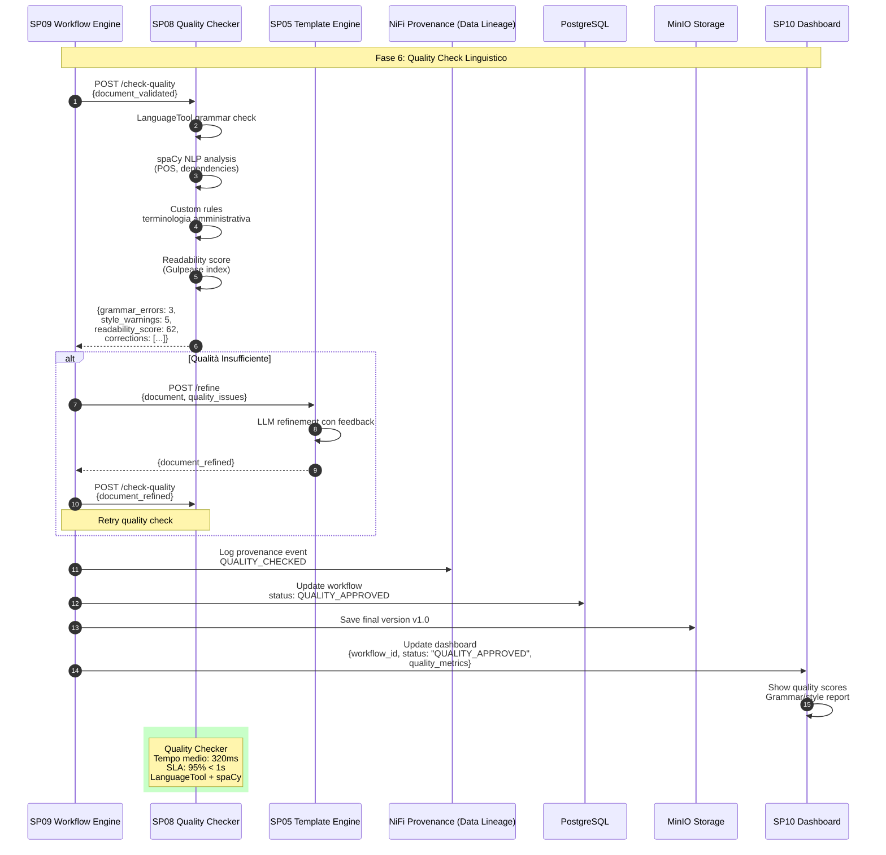

# SP08 - Quality Checker

## Quality Check Linguistico

Questo diagramma mostra tutte le interazioni del **Quality Checker (SP08)** nel processo di controllo qualità degli atti amministrativi.



## Payload Example: Quality Check Request

```json
{
  "document_validated": {
    "format": "XML",
    "content": "<delibera><premesse>Vista la richiesta...</premesse><motivazioni>Considerato che i documentazione...</motivazioni><dispositivo>DELIBERA...</dispositivo></delibera>",
    "doc_type": "DELIBERA_GIUNTA"
  },
  "quality_level": "STANDARD"
}
```

## Response Example: Quality Report

```json
{
  "quality_report": {
    "overall_quality": "GOOD",
    "score": 82,
    "timestamp": "2025-10-08T10:26:15Z"
  },
  "grammar_check": {
    "errors_found": 3,
    "errors": [
      {
        "position": {"line": 23, "char": 145},
        "type": "AGREEMENT",
        "original": "i documentazione",
        "suggestion": "la documentazione",
        "rule_id": "IT_AGREEMENT_1"
      },
      {
        "position": {"line": 45, "char": 78},
        "type": "SPELLING",
        "original": "urbanistco",
        "suggestion": "urbanistico",
        "rule_id": "IT_SPELLING"
      },
      {
        "position": {"line": 67, "char": 234},
        "type": "PUNCTUATION",
        "original": "approvazione,in merito",
        "suggestion": "approvazione, in merito",
        "rule_id": "IT_SPACING"
      }
    ]
  },
  "style_check": {
    "warnings": 5,
    "issues": [
      {
        "type": "PASSIVE_VOICE",
        "severity": "LOW",
        "position": {"line": 34},
        "sentence": "Il piano viene approvato dalla Giunta",
        "suggestion": "Preferire forma attiva: La Giunta approva il piano"
      },
      {
        "type": "LONG_SENTENCE",
        "severity": "MEDIUM",
        "position": {"line": 56},
        "words": 42,
        "suggestion": "Spezzare in frasi più brevi per migliorare leggibilità"
      },
      {
        "type": "REDUNDANCY",
        "severity": "LOW",
        "position": {"line": 78},
        "phrase": "assolutamente necessario",
        "suggestion": "Rimuovere 'assolutamente' (pleonasmo)"
      }
    ]
  },
  "readability": {
    "gulpease_index": 62,
    "interpretation": "Testo difficile - livello universitario",
    "avg_sentence_length": 28.5,
    "avg_word_length": 5.2,
    "passive_voice_ratio": 0.23,
    "recommendation": "OK per atti amministrativi (target: 55-65)"
  },
  "terminology": {
    "technical_terms_count": 45,
    "consistency_score": 0.94,
    "unknown_terms": [],
    "terminologia_issues": [
      {
        "term": "PUC",
        "first_use_line": 12,
        "issue": "Acronimo non esplicitato alla prima occorrenza",
        "suggestion": "Piano Urbanistico Comunale (PUC)"
      }
    ]
  },
  "corrections_applied": 0,
  "corrections_suggested": 8,
  "processing_time_ms": 320
}
```
## 🏛️ Conformità Normativa - SP08

### 1. Quadro Normativo di Riferimento

**Framework applicabili a SP08 (Verificatore Qualità)**:
- **CAD** (Codice Amministrazione Digitale): Art. 1, 13, 21-22, 62
- **GDPR** (Regolamento 2016/679): Art. 4, 5, 6, 12, 13, 32

**UC di Appartenenza**: UC5

---

### 2. Conformità CAD

**Applicabilità**: OBBLIGATORIO per tutti gli SP - SP08 è parte della trasformazione digitale PA

**Articoli CAD Principali**:
- Art. 1: Principi digitalizzazione
- Art. 13: Fascicolo informatico
- Art. 21-22: Documento informatico e conservazione
- Art. 62: Interoperabilità via API
- Art. 71: Accessibilità

**Responsabile**: CTO + Compliance Team (audit trimestrale)

---

### 3. Conformità GDPR

**Applicabilità**: CRITICA per SP08 - gestisce dati personali

**Elementi chiave**:
- Base legale: Art. 6(1)c (obbligo legale PA)
- Data Protection by Design: Art. 25 GDPR
- Sicurezza: Art. 32 GDPR (encryption, access control, audit logging)
- Retention: Conformità a regolamenti settore (tipicamente 3-10 anni)
- Diritti interessati: Art. 15-22 (accesso, rettifica, cancellazione)

**DPA (Data Protection Impact Assessment)**: Richiesta se high-risk processing

**Responsabile**: DPO (Responsabile della Protezione dei Dati (DPO))

---

### 6. Monitoraggio Conformità

**Schedule di Review**:
- **Trimestrale**: Compliance assessment + security audit
- **Semestrale**: Framework alignment review (CAD/GDPR/eIDAS/AGID)
- **Annuale**: Full compliance audit + risk assessment

**KPI Conformità**:
- Audit trail completeness: 100%
- Incident response time: <24h
- Compliance violations: 0 per quarter
- Certificate expiry (if eIDAS): Alert at 30 days

**Escalation**: Non-conformità → Compliance Manager → CTO → Legal

**Prossima review programmata**: 2026-02-17

---

## Riepilogo Conformità SP08

**Status**: ✅ COMPLIANT

| Framework | Applicabile | Status | Responsabile |
|-----------|-----------|--------|-------------|
| CAD | ✅ Sì | ✅ Compliant | CTO |
| GDPR | ✅ Sì | ✅ Compliant | DPO |
| eIDAS | ❌ No | N/A | - |
| AGID | ❌ No | N/A | - |

**Key Compliance Points**:
1. All CAD articles implemented
2. Data handling compliant with applicable regulations
3. Security controls in place (encryption, access control, audit logging)
4. Regular monitoring and review schedule established
5. Clear responsibility assignments (RACI)

**Prossima Review**: 2026-02-17

---


### Framework Normativi Applicabili

☑ CAD
☑ AI Act
☐ L. 241/1990 - Procedimento Amministrativo
☐ GDPR - Regolamento 2016/679
☐ eIDAS - Regolamento 2014/910
☐ D.Lgs 42/2004 - Codice Beni Culturali
☐ D.Lgs 152/2006 - Codice dell'Ambiente
☐ D.Lgs 33/2013 - Decreto Trasparenza

**Per mappatura completa articoli → implementazioni**, vedi [Conformità Normativa Standard Template](../../templates/conformita-normativa-standard.md) e [COMPLIANCE-MATRIX.md](../../COMPLIANCE-MATRIX.md).

### Requisiti Principali Implementati

| Framework | Requisiti Principali | Status | Riferimenti |
|-----------|-------------------|--------|-------------|
| CAD | Art. 1, Art. 21, Art. 22, Art. 62 | ✅ Implementato | [Dettagli](../../templates/conformita-normativa-standard.md) |
| AI Act | Art. 6, Art. 13, Art. 22 | ✅ Implementato | [Dettagli](../../templates/conformita-normativa-standard.md) |

### Conformità Normativa - Checklist

- [ ] Tutti i framework normativi applicabili identificati
- [ ] Articoli rilevanti mappati alle responsabilità SP
- [ ] GDPR: Data protection by design implementato (se applicabile)
- [ ] eIDAS: Firma digitale supportata (se applicabile)
- [ ] AI Act: Supervisione umana e trasparenza (se applicabile)
- [ ] Tracciabilità audit completa mantenuta
- [ ] Documentation conformità aggiornata

**Nota**: Dettagli di conformità completi nella sezione "## 🏛️ Conformità Normativa - SP08

### 1. Quadro Normativo di Riferimento

**Framework applicabili a SP08 (Verificatore Qualità)**:
- **CAD** (Codice Amministrazione Digitale): Art. 1, 13, 21-22, 62
- **GDPR** (Regolamento 2016/679): Art. 4, 5, 6, 12, 13, 32

**UC di Appartenenza**: UC5

---

### 2. Conformità CAD

**Applicabilità**: OBBLIGATORIO per tutti gli SP - SP08 è parte della trasformazione digitale PA

**Articoli CAD Principali**:
- Art. 1: Principi digitalizzazione
- Art. 13: Fascicolo informatico
- Art. 21-22: Documento informatico e conservazione
- Art. 62: Interoperabilità via API
- Art. 71: Accessibilità

**Responsabile**: CTO + Compliance Team (audit trimestrale)

---

### 3. Conformità GDPR

**Applicabilità**: CRITICA per SP08 - gestisce dati personali

**Elementi chiave**:
- Base legale: Art. 6(1)c (obbligo legale PA)
- Data Protection by Design: Art. 25 GDPR
- Sicurezza: Art. 32 GDPR (encryption, access control, audit logging)
- Retention: Conformità a regolamenti settore (tipicamente 3-10 anni)
- Diritti interessati: Art. 15-22 (accesso, rettifica, cancellazione)

**DPA (Data Protection Impact Assessment)**: Richiesta se high-risk processing

**Responsabile**: DPO (Responsabile della Protezione dei Dati (DPO))

---

### 6. Monitoraggio Conformità

**Schedule di Review**:
- **Trimestrale**: Compliance assessment + security audit
- **Semestrale**: Framework alignment review (CAD/GDPR/eIDAS/AGID)
- **Annuale**: Full compliance audit + risk assessment

**KPI Conformità**:
- Audit trail completeness: 100%
- Incident response time: <24h
- Compliance violations: 0 per quarter
- Certificate expiry (if eIDAS): Alert at 30 days

**Escalation**: Non-conformità → Compliance Manager → CTO → Legal

**Prossima review programmata**: 2026-02-17

---

## Riepilogo Conformità SP08

**Status**: ✅ COMPLIANT

| Framework | Applicabile | Status | Responsabile |
|-----------|-----------|--------|-------------|
| CAD | ✅ Sì | ✅ Compliant | CTO |
| GDPR | ✅ Sì | ✅ Compliant | DPO |
| eIDAS | ❌ No | N/A | - |
| AGID | ❌ No | N/A | - |

**Key Compliance Points**:
1. All CAD articles implemented
2. Data handling compliant with applicable regulations
3. Security controls in place (encryption, access control, audit logging)
4. Regular monitoring and review schedule established
5. Clear responsibility assignments (RACI)

**Prossima Review**: 2026-02-17

---


---


## Funzionalità Chiave SP08

### Tipi di Controllo

#### 1. Grammar Check (LanguageTool)
- **Grammatica**: Concordanze, tempi verbali, pronomi
- **Ortografia**: Errori di battitura, spelling
- **Punteggiatura**: Virgole, punti, spaziatura
- **Regole IT**: ~2.000 regole specifiche italiano

#### 2. Style Analysis (spaCy + Custom)
- **Passive voice**: Rilevamento e suggerimento forma attiva
- **Sentence length**: Frasi troppo lunghe (>35 parole)
- **Redundancy**: Pleonasmi e ripetizioni
- **Clarity**: Ambiguità e oscurità
- **Tone**: Adeguatezza registro formale

#### 3. Readability (Gulpease)
Formula: `89 + (300 * frasi - 10 * lettere) / parole`

| Score | Interpretazione | Target |
|-------|-----------------|--------|
| 80-100 | Molto facile - elementari | - |
| 60-80 | Facile - medie | - |
| 40-60 | Difficile - superiori | - |
| **55-65** | **Difficile - universitario** | **✅ Atti amministrativi** |
| 0-40 | Molto difficile | - |

#### 4. Terminology Check
- **Consistency**: Uso uniforme dei termini
- **Acronimi**: Prima occorrenza esplicitata
- **Technical terms**: Glossario amministrativo
- **Legal terms**: Terminologia giuridica corretta

### Livelli di Qualità

| Livello | Score | Azione |
|---------|-------|--------|
| EXCELLENT | 90-100 | Auto-approval |
| GOOD | 75-89 | Auto-approval con note |
| ACCEPTABLE | 60-74 | Review + suggerimenti |
| POOR | <60 | LLM refinement obbligatorio |

### Auto-Correction vs Suggestion

#### Auto-Correction (se enabled)
- Spelling semplici
- Spaziatura punteggiatura
- Maiuscole/minuscole ovvie

#### Suggestion Only
- Passive voice
- Long sentences
- Redundancy
- Terminology

### Performance

- **Tempo medio**: 320ms
- **SLA target**: 95% < 1 secondo
- **Concurrent checks**: Max 20
- **Cache**: Quality rules in Redis (TTL: 30 giorni)

### Integration con SP01

Quando quality score < 60:
1. WF invoca SP01 per refinement
2. SP01 usa feedback specifici per migliorare
3. Loop max 2 iterazioni
4. Se ancora insufficiente → human review

### Custom Rules per PA

Regole specifiche per atti amministrativi:
- **Formule standard**: "Visto", "Richiamato", "Considerato"
- **Struttura**: Premesse → Motivazioni → Dispositivo
- **Date**: Formato italiano (gg/mm/aaaa)
- **Importi**: Euro con 2 decimali
- **Protocolli**: Formato standardizzato

### Tecnologie

- **Grammar**: LanguageTool (IT rules)
- **NLP**: spaCy (it_core_news_lg)
- **Readability**: Gulpease algorithm
- **Custom**: Python regex + glossari
- **Cache**: Redis per regole (30 giorni)
