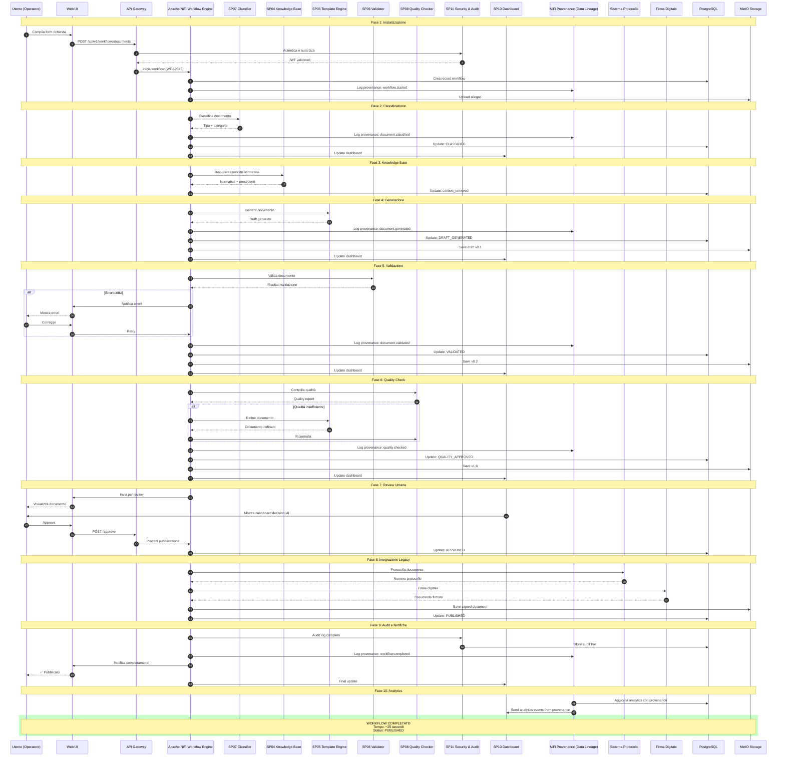
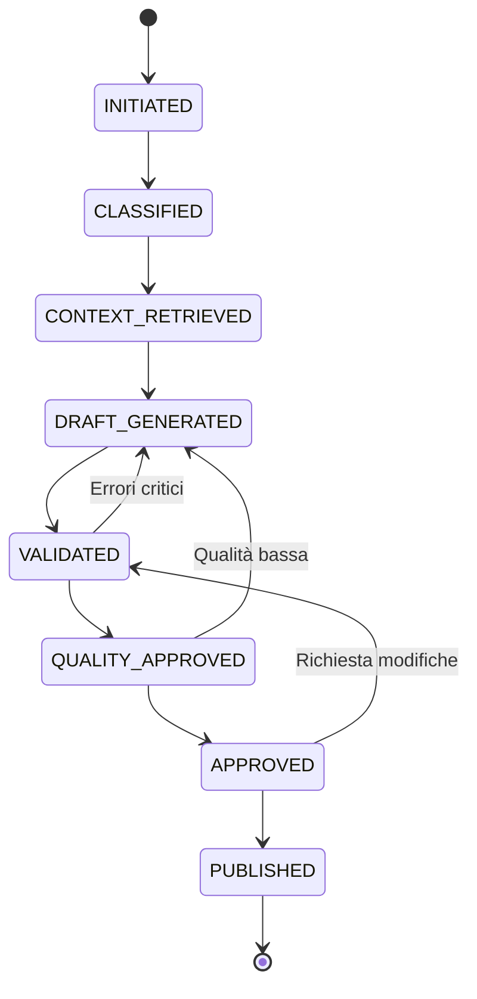

# SP09 - Workflow Engine

## Orchestrazione Workflow End-to-End

Questo diagramma mostra il ruolo centrale del **Workflow Engine (SP09)** nell'orchestrazione di tutti i sottoprogetti.



## Funzionalità Chiave SP09

### Orchestrazione Workflow

#### Stati del Workflow



| Stato | Descrizione | Timeout |
|-------|-------------|---------|
| INITIATED | Workflow creato, allegati caricati | 5s |
| CLASSIFIED | Documento classificato | 10s |
| CONTEXT_RETRIEVED | Contesto normativo recuperato | 15s |
| DRAFT_GENERATED | Bozza generata | 30s |
| VALIDATED | Documento validato | 40s |
| QUALITY_APPROVED | Qualità verificata | 45s |
| APPROVED | Approvato da operatore | ∞ |
| PUBLISHED | Protocollato e firmato | 60s |

### Retry Logic

```json
{
  "retry_policy": {
    "max_attempts": 3,
    "backoff_strategy": "EXPONENTIAL",
    "base_delay_ms": 1000,
    "max_delay_ms": 10000,
    "retryable_errors": [
      "TIMEOUT",
      "SERVICE_UNAVAILABLE",
      "RATE_LIMIT_EXCEEDED"
    ],
    "non_retryable_errors": [
      "VALIDATION_FAILED",
      "UNAUTHORIZED",
      "BAD_REQUEST"
    ]
  }
}
```

### Circuit Breaker

Protezione da failure a cascata:

```json
{
  "circuit_breaker": {
    "failure_threshold": 5,
    "timeout_seconds": 30,
    "half_open_requests": 3,
    "states": {
      "CLOSED": "Normal operation",
      "OPEN": "Failures exceeded, fallback active",
      "HALF_OPEN": "Testing if service recovered"
    }
  }
}
```

### Compensating Transactions

In caso di rollback:

| Fase Fallita | Compensazione |
|--------------|---------------|
| DRAFT_GENERATED | Elimina draft da storage |
| VALIDATED | Elimina versione validata |
| PUBLISHED | ⚠️ Non reversibile - audit log |

### Event Publishing

Eventi tracciati con NiFi Provenance:

```json
{
  "events": [
    {
      "provenance_type": "CREATE",
      "component": "workflow.started",
      "payload": {"workflow_id": "WF-12345", "timestamp": "..."}
    },
    {
      "provenance_type": "ROUTE",
      "component": "document.classified",
      "payload": {"workflow_id": "WF-12345", "doc_type": "DELIBERA_GIUNTA"}
    },
    {
      "provenance_type": "MODIFY",
      "component": "document.generated",
      "payload": {"workflow_id": "WF-12345", "version": "v0.1"}
    },
    {
      "provenance_type": "ROUTE",
      "component": "document.validated",
      "payload": {"workflow_id": "WF-12345", "status": "WARNING"}
    },
    {
      "provenance_type": "MODIFY",
      "component": "document.quality.checked",
      "payload": {"workflow_id": "WF-12345", "score": 82}
    },
    {
      "provenance_type": "SEND",
      "component": "document.workflow.completed",
      "payload": {"workflow_id": "WF-12345", "protocol": "12345/2025"}
    }
  ]
}
```

### Dashboard Integration

Aggiornamenti real-time inviati a SP10:

```json
{
  "dashboard_updates": [
    {
      "phase": "CLASSIFICATION",
      "data": {
        "status": "CLASSIFIED",
        "doc_type": "DELIBERA_GIUNTA",
        "confidence": 0.94,
        "processing_time_ms": 450
      }
    },
    {
      "phase": "GENERATION",
      "data": {
        "status": "DRAFT_GENERATED",
        "sections": 12,
        "tokens": 1234,
        "ai_model": "gpt-4-turbo"
      }
    },
    {
      "phase": "VALIDATION",
      "data": {
        "status": "VALIDATED",
        "warnings": 1,
        "critical_issues": 0
      }
    }
  ]
}
```

### Performance Metrics

```json
{
  "metrics": {
    "total_duration_seconds": 25,
    "phase_breakdown": {
      "initialization": 1.2,
      "classification": 0.45,
      "knowledge_retrieval": 1.2,
      "generation": 2.3,
      "validation": 0.78,
      "quality_check": 0.32,
      "human_review": 15.0,
      "integration": 3.5
    },
    "sla_compliance": {
      "target_seconds": 30,
      "achieved": true,
      "percentile_95": 28.5
    }
  }
}
```

### Error Handling

```json
{
  "error_scenarios": [
    {
      "scenario": "CLS timeout",
      "action": "Retry 3x → Fallback manual classification"
    },
    {
      "scenario": "KB unavailable",
      "action": "Use cached normativa or skip context"
    },
    {
      "scenario": "TPL API limit",
      "action": "Queue for later processing"
    },
    {
      "scenario": "VAL critical errors",
      "action": "Notify user, pause workflow"
    },
    {
      "scenario": "PROT system down",
      "action": "Mark as pending, retry background job"
    }
  ]
}
```

### Scalability

- **Concurrent workflows**: Max 100
- **Queue capacity**: 1000 pending
- **Worker pool**: 20 concurrent workers
- **Database connections**: Pool 50
- **Rate limiting**: 100 req/min per user

### Tecnologie

- **Orchestration**: Apache NiFi
- **State Machine**: PostgreSQL + FSM library
- **Events**: NiFi Provenance for data lineage
- **Queue**: NiFi FlowFiles
- **Monitoring**: Prometheus + Grafana
- **Tracing**: Jaeger (distributed tracing)
