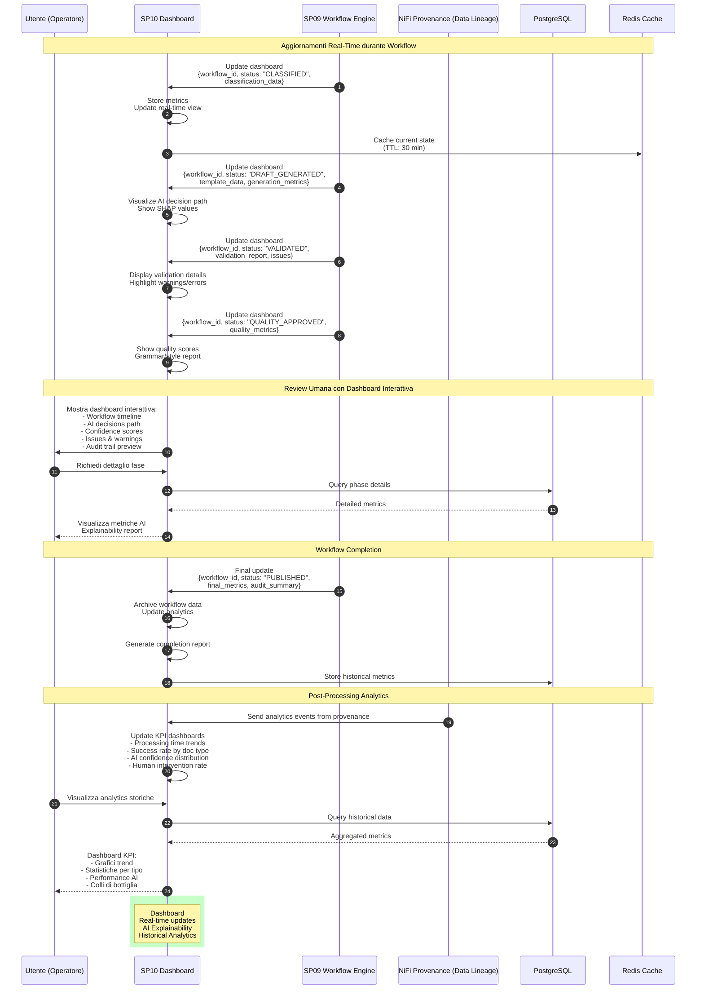

# SP10 - Dashboard

## Visualizzazione Real-Time e Analytics

Questo diagramma mostra tutte le interazioni del **Dashboard (SP10)** per la visualizzazione e monitoraggio dei workflow.



## Funzionalità Chiave SP10

### Real-Time Workflow Monitoring

#### Workflow Timeline View

```json
{
  "workflow_timeline": {
    "workflow_id": "WF-12345",
    "current_status": "VALIDATED",
    "progress_percentage": 65,
    "phases": [
      {
        "phase": "INITIATED",
        "timestamp": "2025-10-08T10:20:00Z",
        "duration_ms": 1200,
        "status": "COMPLETED",
        "icon": "✅"
      },
      {
        "phase": "CLASSIFIED",
        "timestamp": "2025-10-08T10:20:05Z",
        "duration_ms": 450,
        "status": "COMPLETED",
        "details": {
          "doc_type": "DELIBERA_GIUNTA",
          "confidence": 0.94
        },
        "icon": "✅"
      },
      {
        "phase": "DRAFT_GENERATED",
        "timestamp": "2025-10-08T10:22:35Z",
        "duration_ms": 2300,
        "status": "COMPLETED",
        "details": {
          "model": "gpt-4-turbo",
          "tokens": 1234,
          "sections": 12
        },
        "icon": "✅"
      },
      {
        "phase": "VALIDATED",
        "timestamp": "2025-10-08T10:25:33Z",
        "duration_ms": 780,
        "status": "WARNING",
        "details": {
          "warnings": 1,
          "critical_issues": 0
        },
        "icon": "⚠️"
      },
      {
        "phase": "QUALITY_APPROVED",
        "timestamp": null,
        "status": "PENDING",
        "icon": "⏳"
      }
    ]
  }
}
```

### AI Explainability Dashboard

#### Decision Path Visualization

```json
{
  "ai_decisions": {
    "classification": {
      "model": "DistilBERT",
      "confidence": 0.94,
      "top_predictions": [
        {"class": "DELIBERA_GIUNTA", "probability": 0.94},
        {"class": "DETERMINA", "probability": 0.04},
        {"class": "DECRETO", "probability": 0.02}
      ],
      "shap_values": {
        "top_features": [
          {"feature": "oggetto: 'piano urbanistico'", "contribution": 0.35},
          {"feature": "proponente: 'Assessorato'", "contribution": 0.28},
          {"feature": "importo: 150000", "contribution": 0.15}
        ]
      },
      "explainability_score": 0.89
    },
    "generation": {
      "model": "gpt-4-turbo",
      "prompts_used": [
        "System: Sei un esperto di atti amministrativi...",
        "User: Genera delibera di giunta per..."
      ],
      "token_usage": {
        "prompt": 856,
        "completion": 1234,
        "total": 2090,
        "cost_euros": 0.0148
      },
      "temperature": 0.3,
      "reasoning_chain": [
        "1. Analisi tipo documento → DELIBERA_GIUNTA",
        "2. Struttura standard: Premesse + Motivazioni + Dispositivo",
        "3. Injection normativa: L.241/1990, D.Lgs 42/2004",
        "4. Compilazione template con metadata"
      ]
    },
    "validation": {
      "semantic_coherence": 0.92,
      "legal_consistency": 0.95,
      "rules_applied": 15,
      "rules_passed": 14,
      "rules_warned": 1
    }
  }
}
```

### KPI Dashboard

#### Metrics Overview

```json
{
  "kpi_dashboard": {
    "period": "LAST_30_DAYS",
    "metrics": {
      "total_workflows": 342,
      "completed_workflows": 327,
      "failed_workflows": 8,
      "pending_workflows": 7,
      "success_rate": 0.958,
      "avg_processing_time_seconds": 24.3,
      "median_processing_time_seconds": 22.1,
      "percentile_95_seconds": 31.5,
      "sla_compliance_rate": 0.892
    },
    "by_document_type": [
      {
        "type": "DELIBERA_GIUNTA",
        "count": 145,
        "success_rate": 0.965,
        "avg_time_seconds": 25.1
      },
      {
        "type": "DETERMINA",
        "count": 98,
        "success_rate": 0.959,
        "avg_time_seconds": 21.3
      },
      {
        "type": "ORDINANZA",
        "count": 67,
        "success_rate": 0.940,
        "avg_time_seconds": 26.8
      }
    ],
    "ai_performance": {
      "classification_accuracy": 0.947,
      "generation_quality_avg": 83.2,
      "validation_auto_pass_rate": 0.78,
      "quality_auto_pass_rate": 0.85
    },
    "human_intervention": {
      "review_required_rate": 1.0,
      "corrections_requested_rate": 0.12,
      "avg_review_time_seconds": 15.3
    }
  }
}
```

### Trend Analysis

```json
{
  "trends": {
    "processing_time": {
      "trend": "DECREASING",
      "change_percentage": -8.3,
      "data_points": [
        {"date": "2025-09-08", "avg_seconds": 28.5},
        {"date": "2025-09-15", "avg_seconds": 26.2},
        {"date": "2025-09-22", "avg_seconds": 25.1},
        {"date": "2025-09-29", "avg_seconds": 24.8},
        {"date": "2025-10-06", "avg_seconds": 24.3}
      ]
    },
    "success_rate": {
      "trend": "STABLE",
      "change_percentage": 0.5,
      "current": 0.958
    },
    "ai_confidence": {
      "trend": "INCREASING",
      "change_percentage": 3.2,
      "avg_confidence": 0.924
    }
  }
}
```

### Bottleneck Detection

```json
{
  "bottlenecks": [
    {
      "phase": "HUMAN_REVIEW",
      "avg_duration_seconds": 15.3,
      "percentage_of_total": 61.2,
      "severity": "HIGH",
      "recommendation": "Ridurre review time con migliore UI/UX"
    },
    {
      "phase": "INTEGRATION_LEGACY",
      "avg_duration_seconds": 3.5,
      "percentage_of_total": 14.0,
      "severity": "MEDIUM",
      "recommendation": "Ottimizzare chiamate API protocollo"
    },
    {
      "phase": "GENERATION",
      "avg_duration_seconds": 2.3,
      "percentage_of_total": 9.2,
      "severity": "LOW",
      "recommendation": "OK - dentro SLA"
    }
  ]
}
```

### Issue Tracking

```json
{
  "issues_summary": {
    "total_issues": 127,
    "by_severity": {
      "CRITICAL": 0,
      "HIGH": 5,
      "MEDIUM": 43,
      "LOW": 79
    },
    "by_category": {
      "METADATA_MISSING": 56,
      "COMPLIANCE_WARNING": 34,
      "QUALITY_STYLE": 28,
      "QUALITY_GRAMMAR": 9
    },
    "most_common_issues": [
      {
        "issue": "CIG mancante",
        "occurrences": 42,
        "percentage": 0.123
      },
      {
        "issue": "Riferimento delibera precedente consigliato",
        "occurrences": 31,
        "percentage": 0.091
      }
    ]
  }
}
```

### Visualizations

#### Dashboard Components

1. **Workflow Timeline** (Gantt chart)
   - Fasi workflow con durata
   - Status indicators
   - Bottlenecks highlighted

2. **AI Decision Tree** (Sankey diagram)
   - Input → Classification → Generation → Validation
   - Confidence flow
   - Decision branches

3. **Performance Trends** (Line charts)
   - Processing time over time
   - Success rate trend
   - AI confidence evolution

4. **Document Type Distribution** (Pie chart)
   - Breakdown per tipo documento
   - Success rate per tipo

5. **Issue Heatmap** (Calendar heatmap)
   - Frequenza issue per giorno
   - Severity color-coded

6. **Quality Scores** (Radar chart)
   - Grammar, Style, Readability, Terminology
   - Comparison con baseline

### Alert System

```json
{
  "alerts": [
    {
      "type": "SLA_BREACH",
      "severity": "HIGH",
      "workflow_id": "WF-12345",
      "message": "Workflow supera SLA di 30s (attuale: 35s)",
      "timestamp": "2025-10-08T10:30:00Z"
    },
    {
      "type": "AI_LOW_CONFIDENCE",
      "severity": "MEDIUM",
      "workflow_id": "WF-12346",
      "phase": "CLASSIFICATION",
      "confidence": 0.72,
      "message": "Confidence < 0.80, review consigliata"
    }
  ]
}
```

### Export & Reporting

- **PDF Report**: Summary mensile con KPI
- **Excel Export**: Raw data per analisi custom
- **API Export**: JSON per integrazione BI tools
- **Email Digest**: Report settimanale automatico

### Tecnologie

- **Frontend**: React + D3.js (visualizations)
- **Real-time**: WebSocket for live updates
- **Backend**: FastAPI
- **Cache**: Redis (30 min TTL)
- **Database**: PostgreSQL (time-series tables)
- **Analytics**: Pandas + NumPy
- **Charts**: Chart.js, Plotly
