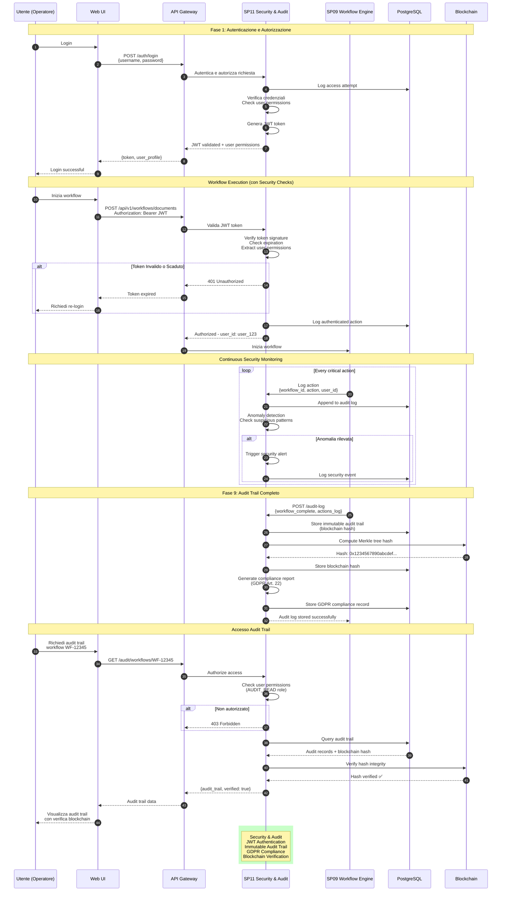
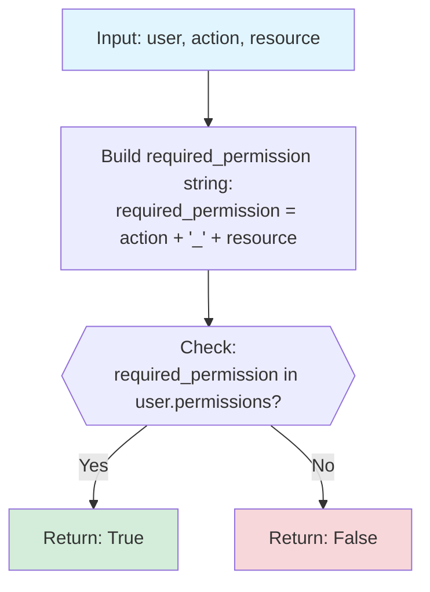
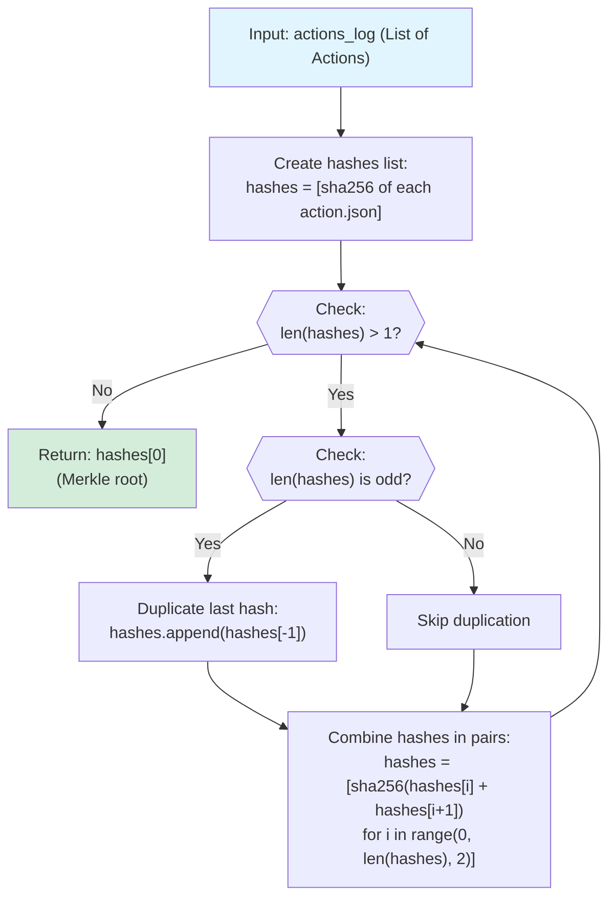

# SP11 - Security & Audit

## Security, Autenticazione e Audit Trail

Questo diagramma mostra tutte le interazioni del **Security & Audit (SP11)** per la sicurezza e tracciabilità.



## Funzionalità Chiave SP11

### Autenticazione e Autorizzazione

#### JWT Token Structure

```json
{
  "header": {
    "alg": "RS256",
    "typ": "JWT"
  },
  "payload": {
    "user_id": "user_123",
    "username": "mario.rossi@comune.it",
    "role": "RESPONSABILE_UFFICIO",
    "permissions": [
      "CREATE_DELIBERA",
      "APPROVE_DELIBERA",
      "CREATE_DETERMINA",
      "VIEW_AUDIT_LOG"
    ],
    "iss": "provvedimento-assistant",
    "exp": 1696845600,
    "iat": 1696842000,
    "jti": "token-uuid-12345"
  },
  "signature": "..."
}
```

#### Ruoli e Permessi

| Ruolo | Permessi | Descrizione |
|-------|----------|-------------|
| **ADMIN** | ALL | Amministratore sistema |
| **RESPONSABILE_UFFICIO** | CREATE_*, APPROVE_*, VIEW_* | Responsabile ufficio |
| **OPERATORE** | CREATE_*, VIEW_OWN | Operatore base |
| **REVISORE** | VIEW_*, AUDIT_READ | Solo lettura + audit |
| **GUEST** | VIEW_PUBLIC | Accesso limitato |

#### Permission Check



### Audit Trail

#### Audit Record Structure

```json
{
  "audit_record": {
    "audit_trail_id": "AUDIT-98765",
    "workflow_id": "WF-12345",
    "document_id": "DOC-67890",
    "blockchain_hash": "0x1234567890abcdef...",
    "merkle_root": "0xabcdef1234567890...",
    "timestamp": "2025-10-08T10:30:45Z",
    "verification_status": "VERIFIED"
  },
  "actions_log": [
    {
      "seq": 1,
      "timestamp": "2025-10-08T10:20:00Z",
      "action": "WORKFLOW_INITIATED",
      "user_id": "user_123",
      "user_name": "Mario Rossi",
      "ip_address": "192.168.1.100",
      "user_agent": "Mozilla/5.0...",
      "session_id": "sess-abc123"
    },
    {
      "seq": 2,
      "timestamp": "2025-10-08T10:20:05Z",
      "action": "DOCUMENT_CLASSIFIED",
      "service": "SP07",
      "confidence": 0.94,
      "processing_time_ms": 450,
      "ai_model": "DistilBERT"
    },
    {
      "seq": 3,
      "timestamp": "2025-10-08T10:20:12Z",
      "action": "LEGAL_CONTEXT_RETRIEVED",
      "service": "SP04",
      "normativa_refs": ["L.241/1990", "D.Lgs 42/2004"],
      "processing_time_ms": 1200
    },
    {
      "seq": 4,
      "timestamp": "2025-10-08T10:22:35Z",
      "action": "TEMPLATE_GENERATED",
      "service": "SP05",
      "model": "gpt-4-turbo",
      "tokens_used": 1234,
      "api_cost_euros": 0.0148
    },
    {
      "seq": 5,
      "timestamp": "2025-10-08T10:25:33Z",
      "action": "DOCUMENT_VALIDATED",
      "service": "SP06",
      "validation_status": "WARNING",
      "warnings_count": 1
    },
    {
      "seq": 6,
      "timestamp": "2025-10-08T10:26:15Z",
      "action": "QUALITY_CHECKED",
      "service": "SP08",
      "quality_score": 82,
      "corrections_suggested": 8
    },
    {
      "seq": 7,
      "timestamp": "2025-10-08T10:28:00Z",
      "action": "HUMAN_APPROVED",
      "user_id": "user_123",
      "approval_level": "RESPONSABILE_UFFICIO",
      "signature": "BASE64_ENCODED_SIGNATURE"
    },
    {
      "seq": 8,
      "timestamp": "2025-10-08T10:29:15Z",
      "action": "PROTOCOLLED",
      "system": "PROTOCOLLO",
      "protocol_number": "12345/2025"
    },
    {
      "seq": 9,
      "timestamp": "2025-10-08T10:30:30Z",
      "action": "DIGITALLY_SIGNED",
      "system": "FIRMA_DIGITALE",
      "signer": "ing. Mario Rossi",
      "timestamp_authority": "InfoCert"
    },
    {
      "seq": 10,
      "timestamp": "2025-10-08T10:30:45Z",
      "action": "WORKFLOW_COMPLETED",
      "final_status": "PUBLISHED",
      "total_duration_sec": 645
    }
  ]
}
```

### GDPR Compliance

#### Article 22 - Right to Explanation

```json
{
  "gdpr_compliance": {
    "purpose": "GENERAZIONE_ATTO_AMMINISTRATIVO",
    "legal_basis": "Art. 6(1)(e) GDPR - public interest",
    "data_subjects": ["Mario Rossi"],
    "personal_data_processed": {
      "categories": ["nome", "ruolo", "firma_digitale"],
      "purposes": ["identificazione_responsabile", "firma_atto"],
      "retention_period": "10 years (normativa archivistica)"
    },
    "automated_decision": {
      "enabled": true,
      "human_oversight": true,
      "explainability_provided": true,
      "right_to_object": true
    },
    "data_protection_measures": [
      "Encryption at rest (AES-256)",
      "Encryption in transit (TLS 1.3)",
      "Access control (RBAC)",
      "Audit logging (immutable)",
      "Anonymization after retention period"
    ],
    "dpia_required": false,
    "dpo_contact": "dpo@comune.it"
  }
}
```

#### Data Minimization

```json
{
  "data_minimization": {
    "principle": "Collect only necessary data",
    "implementation": {
      "classification_model": "No personal data stored",
      "knowledge_base": "No personal data in normativa",
      "generation": "Personal data only from user input",
      "validation": "No additional personal data collected"
    },
    "storage": {
      "encrypted_fields": ["nome", "firma"],
      "anonymized_after": "10 years",
      "deletion_policy": "Automatic after 15 years"
    }
  }
}
```

### Blockchain Verification

#### Merkle Tree Construction



#### Verification Process

```json
{
  "verification": {
    "workflow_id": "WF-12345",
    "stored_hash": "0x1234567890abcdef...",
    "computed_hash": "0x1234567890abcdef...",
    "match": true,
    "verification_timestamp": "2025-10-08T11:00:00Z",
    "verifier": "SP08-Security",
    "integrity_status": "VERIFIED"
  }
}
```

### Anomaly Detection

```json
{
  "anomaly_detection": {
    "rules": [
      {
        "rule": "MULTIPLE_FAILED_LOGINS",
        "threshold": 5,
        "action": "LOCK_ACCOUNT",
        "alert": "HIGH"
      },
      {
        "rule": "UNUSUAL_WORKFLOW_TIME",
        "threshold": "3x avg_time",
        "action": "LOG_WARNING",
        "alert": "MEDIUM"
      },
      {
        "rule": "PERMISSION_ESCALATION_ATTEMPT",
        "threshold": 1,
        "action": "BLOCK_IMMEDIATELY",
        "alert": "CRITICAL"
      },
      {
        "rule": "BULK_DOCUMENT_CREATION",
        "threshold": 50,
        "action": "RATE_LIMIT",
        "alert": "LOW"
      }
    ],
    "ml_based": {
      "enabled": true,
      "model": "Isolation Forest",
      "features": [
        "login_time",
        "workflow_duration",
        "document_type",
        "user_location"
      ]
    }
  }
}
```

### Security Events

```json
{
  "security_events": [
    {
      "event_id": "SEC-98765",
      "timestamp": "2025-10-08T10:15:23Z",
      "severity": "HIGH",
      "type": "FAILED_LOGIN_ATTEMPT",
      "user_id": "user_456",
      "ip_address": "203.0.113.45",
      "details": "Password incorrect (attempt 4/5)",
      "action_taken": "Account locked after 5th attempt"
    },
    {
      "event_id": "SEC-98766",
      "timestamp": "2025-10-08T10:45:12Z",
      "severity": "MEDIUM",
      "type": "PERMISSION_DENIED",
      "user_id": "user_789",
      "resource": "DELIBERA_GIUNTA",
      "action": "APPROVE",
      "details": "User lacks APPROVE_DELIBERA permission"
    }
  ]
}
```

### Compliance Reports

#### Monthly Security Report

```json
{
  "security_report": {
    "period": "2025-09",
    "metrics": {
      "total_logins": 1234,
      "failed_logins": 56,
      "security_events": 12,
      "critical_events": 0,
      "accounts_locked": 3,
      "permission_violations": 8
    },
    "audit_trails_created": 342,
    "blockchain_verifications": 342,
    "verification_success_rate": 1.0,
    "gdpr_requests": {
      "access_requests": 2,
      "deletion_requests": 0,
      "objection_requests": 0
    },
    "recommendations": [
      "Review permission model for user_789",
      "Enable MFA for ADMIN roles"
    ]
  }
}
```

### Data Retention

```json
{
  "data_retention": {
    "audit_logs": {
      "retention_period": "15 years",
      "legal_basis": "Normativa archivistica PA",
      "deletion_policy": "Automatic after retention period"
    },
    "personal_data": {
      "retention_period": "10 years",
      "anonymization_after": "10 years",
      "deletion_policy": "Anonymization + encryption key deletion"
    },
    "security_events": {
      "retention_period": "7 years",
      "deletion_policy": "Automatic purge"
    },
    "blockchain_hashes": {
      "retention_period": "PERMANENT",
      "immutable": true
    }
  }
}
```

### Tecnologie

- **Authentication**: JWT (RS256)
- **Authorization**: RBAC (Role-Based Access Control)
- **Encryption**: AES-256 (at rest), TLS 1.3 (in transit)
- **Hashing**: SHA-256 for blockchain
- **Blockchain**: Private Ethereum / Hyperledger Fabric
- **Anomaly Detection**: Isolation Forest (scikit-learn)
- **Database**: PostgreSQL (audit tables immutable)
- **Compliance**: GDPR Art. 22 compliance framework
