# Sequence Diagram: Overview Semplificato - Generazione Atto da Email PEC

📋 **SUPPLEMENTARY DIAGRAM**: Versione semplificata della [sequenza canonica completa](01 CANONICAL - Generazione Atto Completo.md). Ideale per stakeholder e presentazioni di business. Per dettagli tecnici completi, consultare la versione canonica.

## Flusso End-to-End con Blocchi Sottoprogetti (Aggiornato con SP01-SP02)

Questo diagramma mostra il flusso completo dall'email PEC in ingresso fino all'atto protocollato, utilizzando blocchi semplificati per ogni sottoprogetto.

```mermaid
sequenceDiagram
    autonumber
    participant U as Cittadino
    participant PEC as PEC Server
    participant OPS as Operatore PA
    participant WF as SP09<br/>Workflow
    participant EML as SP01<br/>EML Parser
    participant DOC as SP02<br/>Doc Extractor
    participant PROC as SP03<br/>Procedural
    participant KB as SP04<br/>Knowledge Base
    participant TPL as SP05<br/>Template
    participant VAL as SP06<br/>Validator
    participant QC as SP08<br/>Quality
    participant SEC as SP11<br/>Security
    
    Note over U,SEC: 📧 Fase 1-2: Ricezione e Parsing Email
    U->>PEC: Email PEC + 3 allegati
    PEC->>WF: Notifica .eml
    WF->>EML: Parse email
    EML-->>WF: Metadata + lista allegati
    
    Note over U,SEC: 📄 Fase 3: Estrazione Documenti
    WF->>DOC: Estrai allegati (parallelo)
    DOC->>DOC: OCR + Classifica + NER
    DOC-->>WF: Documents[] + validation
    
    rect rgb(255, 235, 59, 0.3)
        Note over OPS,WF: 🔄 HITL #1: Verifica Documenti
        WF->>OPS: Mostra allegati estratti
        OPS->>WF: ✅ Conferma completezza
    end
    
    Note over U,SEC: 🎯 Fase 4: Classificazione Procedimento
    WF->>PROC: Classifica con dati SP02
    PROC->>KB: Cerca procedimenti
    KB-->>PROC: Procedimenti + normativa
    PROC-->>WF: Procedimento identificato (96%)
    
    rect rgb(255, 235, 59, 0.3)
        Note over OPS,WF: 🔄 HITL #2: Conferma Procedimento
        WF->>OPS: Proposta procedimento
        OPS->>WF: ✅ Conferma
    end
    
    Note over U,SEC: ✍️ Fase 5: Generazione
    WF->>KB: Recupera normativa
    KB-->>WF: Contesto giuridico
    WF->>TPL: Genera con dati pre-estratti
    TPL-->>WF: Draft documento
    
    rect rgb(255, 235, 59, 0.3)
        Note over OPS,WF: 🔄 HITL #3: Review Draft
        WF->>OPS: Mostra bozza
        OPS->>WF: ✅ Approva
    end
    
    Note over U,SEC: ✔️ Fase 6-7: Validazione
    WF->>VAL: Valida documento
    VAL->>KB: Check compliance
    VAL-->>WF: ✅ Validato (97/100)
    WF->>QC: Quality check
    QC-->>WF: ✅ Quality OK (82/100)
    
    rect rgb(255, 235, 59, 0.3)
        Note over OPS,WF: 🔄 HITL #4: Firma
        WF->>OPS: Richiedi firma
        OPS->>WF: 🔐 Firmato
    end
    
    Note over U,SEC: 🏛️ Fase 8: Pubblicazione
    WF->>SEC: Audit trail
    SEC-->>WF: ✅ Registrato
    WF->>U: 📧 Notifica PEC completamento
```



## Legenda Sottoprogetti (Aggiornata)

| Sottoprogetto | Responsabilità | Tecnologie | Tempo |
|---------------|----------------|------------|-------|
| **SP01 - EML Parser** | Parse email PEC, valida firma | Python email lib, cryptography | 0.8s |
| **SP02 - Document Extractor** | OCR, classifica allegati, NER | Tesseract, DistilBERT, spaCy | 2.5s |
| **SP03 - Procedural Classifier** | Classifica procedimento amministrativo | DistilBERT, NER, KB | 0.5s |
| **SP04 - Knowledge Base** | RAG normativa e contesto | FAISS, Neo4j, Mistral-7B | 1.2s |
| **SP05 - Template Engine** | Genera documento con AI | GPT-4/Groq, LangChain | 2.3s |
| **SP06 - Validator** | Validazione conformità | BERT, Drools | 0.8s |
| **SP07 - Content Classifier** | Classifica tipo documento | DistilBERT | 0.4s |
| **SP08 - Quality Checker** | Controllo qualità linguistica | LanguageTool, spaCy | 0.3s |
| **SP09 - Workflow Engine** | Orchestrazione | Apache NiFi | - |
| **SP10 - Dashboard** | Visualizzazione | React, D3.js | - |
| **SP11 - Security & Audit** | Sicurezza e tracciabilità | JWT, Blockchain | - |

## Flusso Decisionale con Gestione Integrazioni

```mermaid
flowchart TD
    Start([📧 Email PEC Ricevuta]) --> Parse[SP01: Parse Email]
    Parse --> Extract[SP02: Estrai Documenti]
    
    Extract --> CheckDocs{Documenti<br/>Completi?}
    CheckDocs -->|No| RequestInt[Richiedi Integrazioni]
    RequestInt --> WaitReply[Attendi Email Cittadino]
    WaitReply --> Parse
    
    CheckDocs -->|Si| HITL1[HITL #1: Verifica]
    HITL1 --> ClassProc[SP03: Classifica Procedimento]
    
    ClassProc --> HITL2[HITL #2: Conferma]
    HITL2 --> GetKB[SP04: Recupera Normativa]
    GetKB --> Generate[SP05: Genera Documento]
    
    Generate --> HITL3[HITL #3: Review]
    HITL3 --> Validate[SP06: Valida]
    
    Validate --> ValCheck{Errori<br/>Critici?}
    ValCheck -->|Sì| UserFix[Correggi Dati]
    UserFix --> Validate
    
    ValCheck -->|No| QC[SP08: Quality Check]
    QC --> QCCheck{Qualità<br/>OK?}
    QCCheck -->|No| Refine[Raffina Documento]
    Refine --> QC
    
    QCCheck -->|Sì| HITL4[HITL #4: Firma]
    HITL4 --> Audit[SP11: Audit Trail]
    Audit --> Notify[Notifica PEC Cittadino]
    Notify --> End([✅ Completato])
    
    style Start fill:#90EE90
    style End fill:#90EE90
    style HITL1 fill:#FFD700
    style HITL2 fill:#FFD700
    style HITL3 fill:#FFD700
    style HITL4 fill:#FFD700
    style RequestInt fill:#FFB6C1
```



## Timeline Completa (da Email a Atto)


## Metriche Aggregate

| Macro-Fase | Componenti | Tempo | % |
|------------|-----------|-------|---|
| **Email Processing** | SP01, SP02 | 3.3s | 7% |
| **HITL Verifica Doc** | Operatore | 8s | 18% |
| **Classificazione** | SP03, SP04 | 1.7s | 4% |
| **HITL Conferma** | Operatore | 5s | 11% |
| **Generazione** | SP05 | 2.3s | 5% |
| **HITL Review** | Operatore | 12s | 27% |
| **Validazione** | SP06, SP08 | 1.1s | 3% |
| **HITL Firma** | Operatore | 8s | 18% |
| **Pubblicazione** | Legacy | 2s | 5% |
| **Audit** | SP11 | <1s | 2% |
| **TOTALE** | - | **~44s** | **100%** |

## Benefici Automazione SP01-SP02

### Prima (Processo Manuale)
```
Operatore scarica email → Estrae allegati manualmente → 
Trascrizione dati (CF, indirizzi) → Verifica documenti → 
[Poi workflow classico]

Tempo: ~20 minuti (rischio errori trascrizione)
```

### Dopo (Con SP01-SP02)
```
Email PEC → SP01 Parse automatico → SP02 Estrai e classifica → 
Operatore verifica (8s) → [Workflow classico]

Tempo: ~3.3s automatici + 8s verifica = 11.3s
Risparmio: ~19 minuti (95% riduzione)
```

### ROI Quantificato
- **Pratiche/giorno**: da 20 a 80+ (4x incremento)
- **Errori trascrizione**: -70%
- **Tempo operatore**: da 20min a 33s review
- **Costo per pratica**: -60%

## Punti Critici e Raccomandazioni

### ⚠️ Bottleneck
1. **HITL Review (27%)**: Ottimizzare UX SP10 Dashboard
2. **SP02 OCR (6%)**: Scaling orizzontale (max 12 replicas)
3. **HITL Firma (18%)**: Integrazione firma digitale automatica

### ✅ Ottimizzazioni
1. **Parallelizzazione**: SP03 + SP04 in parallelo
2. **Caching**: SP03 procedimenti ricorrenti (43% hit rate)
3. **Pre-warming**: SP04 normativa frequente
4. **Batch**: SP02 per allegati multipli

## Dipendenze tra Sottoprogetti


**Novità**:
- 🆕 SP01-SP02: Entry point automatizzato (elimina trascrizione manuale)
- 🔄 HITL #1: Nuovo checkpoint documentale upstream
- ⚡ 4x throughput: da 20 a 80+ pratiche/giorno

---

**Conclusione**: L'integrazione di SP01 (EML Parser) e SP02 (Document Extractor) trasforma il sistema da "document processor" a **"email-to-act intelligent platform"**, eliminando il lavoro manuale di download, trascrizione e validazione documentale.
