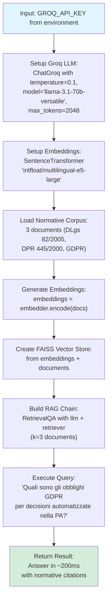
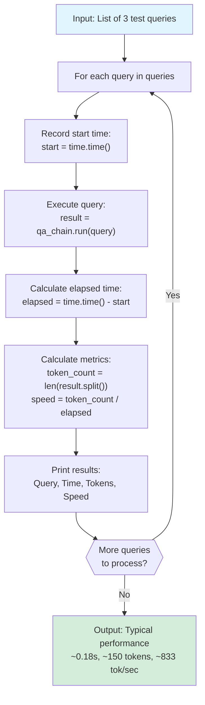
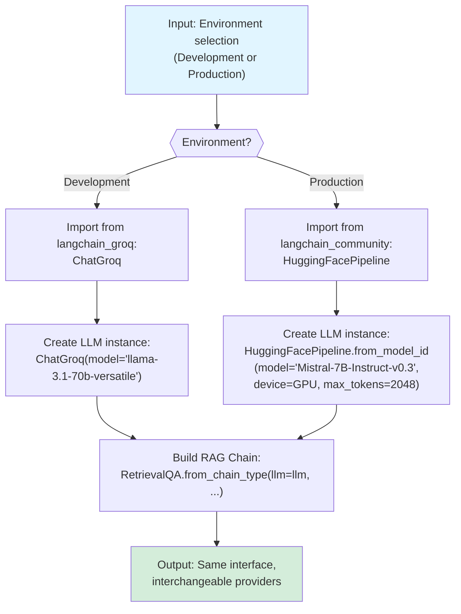
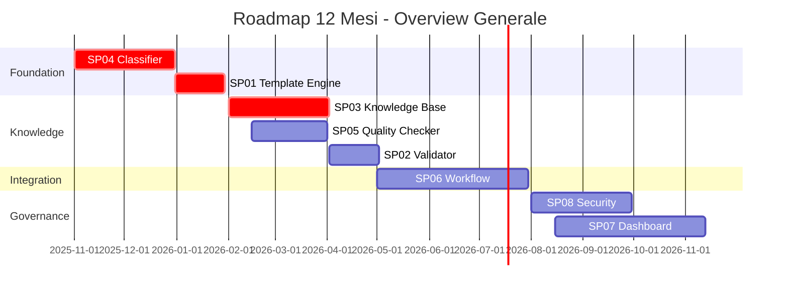
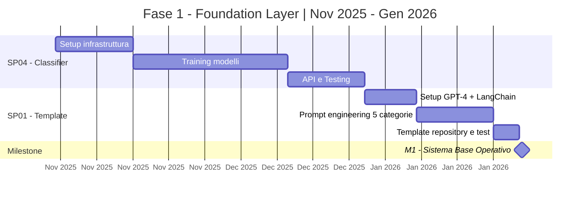
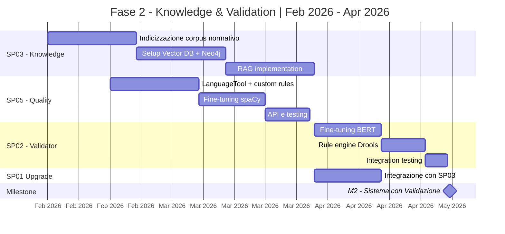
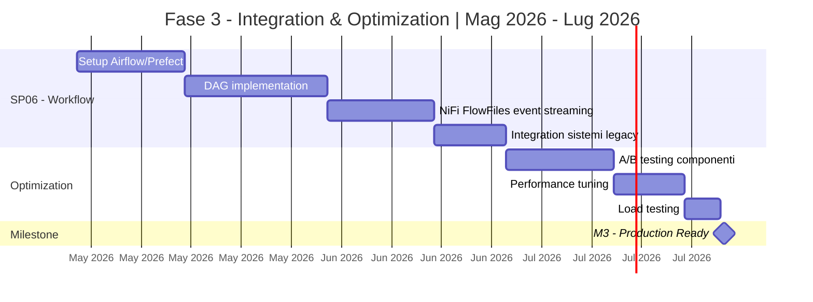
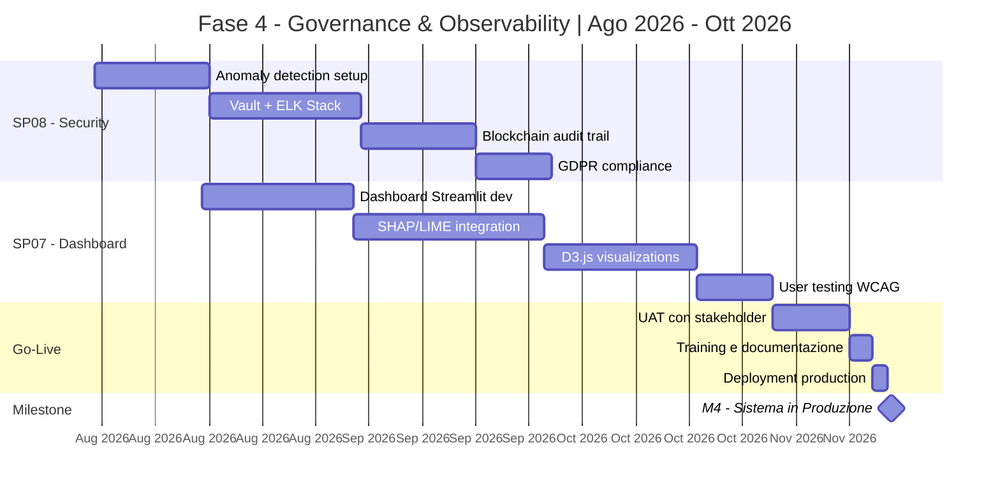

# Sottoprogetti per Generazione Atti Amministrativi - Pipeline Operative Dettagliate

## SP03 - Classificatore Procedurale per Classificazione Procedimenti Amministrativi

### Descrizione
Sistema AI-powered per la classificazione automatica dell'istanza di parte (richiesta utente) al fine di identificare il procedimento amministrativo applicabile e il tipo di provvedimento da generare.

### Tecnologie
- DistilBERT per classificazione semantica
- spaCy per Named Entity Recognition
- PostgreSQL per storage procedimenti
- Redis per caching classificazioni
- FAISS per similarity search

### Pipeline Operativa

#### 1. Definizione del Problema
- **Tipo**: Classificazione multi-classe (procedimento amministrativo) + Named Entity Recognition
- **Metriche di successo**: 
  - Accuracy classificazione procedimento: >95%
  - Precision/Recall identificazione tipo provvedimento: >92%
  - Tempo di classificazione: <1 secondo
  - False Positive Rate: <3%

#### 2. Raccolta Dati
- **Fonti**:
  - Database storico istanze pervenute
  - Archivio procedimenti amministrativi con relativa normativa
  - Mappatura procedimenti → provvedimenti da esperti di dominio
  - Dataset etichettato di istanze classificate manualmente
- **Privacy**: Anonimizzazione dati personali richiedenti, tokenizzazione informazioni sensibili

#### 3. Esplorazione Dati (EDA)
- Analisi distribuzione tipologie procedimenti per categoria (ambiente, urbanistica, commercio, ecc.)
- Identificazione pattern linguistici ricorrenti nelle istanze per categoria
- Mappatura relazioni procedimento → tipo provvedimento → autorità competente
- Analisi correlazione tra keywords istanza e procedimento

#### 4. Preprocessing / Feature Engineering
- **Testo istanza**:
  - Tokenizzazione con DistilBERT tokenizer
  - Estrazione entità (NER): richiedente, oggetto, riferimenti normativi, importi
  - Creazione embeddings semantici per matching similarità
  - Normalizzazione riferimenti normativi (D.Lgs, L.R., ecc.)
- **Database procedimenti**:
  - Indicizzazione procedimenti con embeddings vector
  - Creazione grafo relazioni procedimenti-normativa-provvedimenti
  - Categorizzazione gerarchica (categoria → sottocategoria → procedimento specifico)

#### 5. Modello Baseline
- **Approccio iniziale**: Keyword matching + rule-based classification
- **Similarity search**: Cosine similarity su embeddings istanza vs. procedimenti noti
- **Fallback**: Classificazione generica con richiesta intervento operatore

#### 6. Allenamento e Validazione
- Fine-tuning DistilBERT su dataset istanze classificate
- Training NER personalizzato con spaCy su entità amministrative
- Split dataset: 70% training / 15% validation / 15% test
- Cross-validation con esperti procedimenti amministrativi

#### 7. Valutazione e Interpretazione
- **Metriche quantitative**:
  - Confusion matrix per categorie procedimenti
  - F1-score per classificazione multi-classe
  - Precision/Recall su estrazione entità (NER)
  - Confidence score calibration
- **Explainability**:
  - Visualizzazione keywords più rilevanti per classificazione
  - Similarity scores con procedimenti simili
  - Tracciamento decisionale (quale feature ha influenzato la classificazione)

#### 8. Ottimizzazione
- Tuning threshold confidence per classificazione vs. escalation umana
- Ottimizzazione similarity search (HNSW index vs. IVF)
- A/B testing su diverse strategie di ranking procedimenti candidati
- Caching risultati per istanze ricorrenti (TTL: 2 ore)

#### 9. Produzione & MLOps
- **Deployment**:
  - API FastAPI con endpoint `/classify-procedure`
  - Container Docker con CPU optimized (DistilBERT è leggero)
  - Caching Redis per riduzioni latency
  - Integration con SP03 (Knowledge Base) per retrieval normativa
- **Monitoraggio**:
  - Logging classificazioni con confidence scores
  - Alert su low confidence (<0.7) per review manuale
  - Dashboard metriche real-time (accuracy, latency, cache hit rate)
  - Feedback loop da operatori per miglioramento continuo

---

## SP01 - Template Engine AI per Atti Amministrativi

### Descrizione
Sistema AI-powered per la generazione automatica di documenti amministrativi basato su template predefiniti e dati strutturati.

### Tecnologie
- GPT-4 / Claude per generazione testo
- LangChain per orchestrazione
- Jinja2 per template management
- PostgreSQL per storage template

### Pipeline Operativa

#### 1. Definizione del Problema
- **Tipo**: Generazione testo strutturato (text generation + template filling)
- **Metriche di successo**: 
  - Accuratezza compilazione campi: >95%
  - Coerenza semantica: valutazione qualitativa + BLEU score >0.8
  - Tempo di generazione: <3 secondi per documento
  - Tasso di accettazione umana: >90%

#### 2. Raccolta Dati
- **Fonti**:
  - Repository storico atti amministrativi (database legacy)
  - Template ufficiali da Gazzetta Ufficiale
  - Documentazione normativa di riferimento
  - Dataset etichettati di atti pre-validati
- **Privacy**: Anonimizzazione dati personali secondo GDPR, tokenizzazione informazioni sensibili

#### 3. Esplorazione Dati (EDA)
- Analisi distribuzione tipologie atti (delibere, determine, ordinanze)
- Identificazione pattern ricorrenti e clausole standard
- Mappatura relazioni tra metadati e contenuto
- Analisi lunghezza media documenti e complessità lessicale

#### 4. Preprocessing / Feature Engineering
- **Testo**:
  - Tokenizzazione con modelli transformer-based
  - Estrazione entità (NER): date, importi, riferimenti normativi
  - Creazione embeddings semantici per clausole standard
  - Normalizzazione formati data/importi
- **Template**:
  - Parsing struttura Jinja2
  - Identificazione placeholder variabili
  - Categorizzazione sezioni obbligatorie/opzionali

#### 5. Modello Baseline
- **Approccio iniziale**: GPT-3.5 con prompt engineering strutturato
- **Template matching**: Rule-based system per selezione template
- **Fallback**: Sistema a regole per compilazione base

#### 6. Allenamento e Validazione
- Fine-tuning GPT-4 su dataset atti amministrativi
- Validazione prompt con few-shot learning
- Split dataset: 70% training / 15% validation / 15% test
- Validazione cross-funzionale con esperti legali

#### 7. Valutazione e Interpretazione
- **Metriche quantitative**:
  - ROUGE score per similarità con template di riferimento
  - Precision/Recall su estrazione entità
  - Human evaluation score (scala 1-5)
- **Explainability**:
  - Visualizzazione attention weights per sezioni generate
  - Tracciamento fonte dati per ogni campo compilato

#### 8. Ottimizzazione
- Tuning parametri LLM (temperature, top_p, max_tokens)
- A/B testing su diverse versioni prompt
- Ottimizzazione retrieval template (vector similarity)
- Caching risultati per template ricorrenti

#### 9. Produzione & MLOps
- **Deployment**:
  - API FastAPI con endpoints per generazione sincrona/asincrona
  - Container Docker con GPU support
  - Rate limiting e gestione code (Redis/Celery)
- **Monitoraggio**:
  - Logging generazioni e feedback utente
  - Alert su anomalie (lunghezza, tempo risposta)
  - Dashboard metriche real-time (Grafana)
  - Versioning template e modelli (DVC)

---

## SP02 - Validatore Semantico di Conformità

### Descrizione
Sistema di validazione automatica della coerenza semantica e conformità normativa degli atti amministrativi.

### Tecnologie
- BERT/RoBERTa per analisi semantica
- Sentence Transformers per similarity matching
- Elasticsearch per ricerca normativa
- Rule Engine (Drools) per validazioni strutturate

### Pipeline Operativa

#### 1. Definizione del Problema
- **Tipo**: Classificazione multi-label + anomaly detection
- **Metriche di successo**:
  - Precision/Recall errori conformità: >92%
  - F1-score complessivo: >0.90
  - False Positive Rate: <5%
  - Tempo validazione: <5 secondi

#### 2. Raccolta Dati
- **Fonti**:
  - Atti validati manualmente (ground truth)
  - Database errori comuni e casistica
  - Corpus normativo aggiornato (EU, nazionale, regionale)
  - Feedback validatori umani su falsi positivi/negativi
- **Etichettatura**: Categorizzazione errori (formale, sostanziale, procedurale)

#### 3. Esplorazione Dati (EDA)
- Distribuzione tipologie errori per categoria atto
- Analisi pattern linguistici associati a non-conformità
- Correlazione tra lunghezza documento e tasso errore
- Identificazione sezioni critiche ad alta incidenza errori

#### 4. Preprocessing / Feature Engineering
- **Testo**:
  - Sentence segmentation e embeddings contestuali
  - Estrazione triple (soggetto-predicato-oggetto)
  - Feature linguistiche: POS tagging, dependency parsing
- **Normativa**:
  - Indicizzazione articoli/commi con vettori semantici
  - Creazione grafo dipendenze normative
- **Feature strutturali**: presenza sezioni obbligatorie, formato date/importi

#### 5. Modello Baseline
- Classificatore Random Forest su feature linguistiche
- Rule-based validator per controlli formali
- Sentence-BERT per similarity con atti conformi

#### 6. Allenamento e Validazione
- Fine-tuning BERT su task classificazione errori
- Training ensemble: BERT + XGBoost su feature combinate
- 5-fold cross-validation per robustezza
- Validazione su campione mensile atti più recenti

#### 7. Valutazione e Interpretazione
- **Metriche**:
  - Matrice confusione per categoria errore
  - Curve Precision-Recall per threshold optimization
  - Analisi errori per severità (bloccante/warning)
- **Explainability**:
  - LIME per evidenziare frasi problematiche
  - Attention visualization su sezioni critiche
  - Report dettagliato con riferimenti normativi

#### 8. Ottimizzazione
- Hyperparameter tuning con Optuna
- Ensemble stacking (BERT + Legal-BERT + RoBERTa)
- Active learning: prioritizzazione atti incerti per review umana
- Threshold calibration per bilanciare precision/recall

#### 9. Produzione & MLOps
- **Deployment**:
  - Microservizio FastAPI con validazione asincrona
  - Queue system per batch validation (NiFi Queue)
  - Cache Redis per regole statiche
- **Monitoraggio**:
  - Tracking drift normativo (cambio legislazione)
  - Dashboard errori ricorrenti per pattern analysis
  - Retraining automatico mensile con nuovi atti validati
  - MLflow per experiment tracking e model registry

---

## SP03 - Legal Knowledge Base & Normativa Assistant

### Descrizione
Sistema RAG (Retrieval Augmented Generation) **on-premise** per assistenza normativa contestuale e interrogazione knowledge base giuridica, con aggiornamenti trimestrali/semestrali del corpus normativo.

### Architettura On-Premise Ottimizzata

#### Modelli HuggingFace Raccomandati per Legal Domain Italiano

**🏆 OPZIONE 1: SOLUZIONE RACCOMANDATA (Embeddings + LLM separati)**

**Per Embeddings e Retrieval**:
1. **`multilingual-e5-large`** (intfloat/multilingual-e5-large)
   - Dimensione: 560M parametri
   - Supporto multilingua eccellente (italiano incluso)
   - Performance: MTEB score 64.5 su 112 task
   - RAM richiesta: ~2.5GB
   - Ottimizzato per semantic search
   - **USO**: Embedding documenti normativi + query

2. **`legal-bert-base-uncased`** (nlpaueb/legal-bert-base-uncased)
   - Dimensione: 110M parametri
   - Pre-trained su 12GB di corpus legali (EU, US, UK)
   - RAM richiesta: ~500MB
   - **USO**: Backup embeddings domain-specific

**Per Generazione Risposte (LLM)**:

**🚀 SVILUPPO & TEST (Groq Cloud - Velocità Max)**:

3. **`llama-3.1-70b-versatile`** (Groq) ⭐ **TOP CHOICE PER DEV/TEST**
   - Dimensione: 70B parametri (hosted by Groq)
   - **Velocità**: ~300 token/sec (50-100x più veloce di GPT-4)
   - Latenza: ~100-200ms per risposta completa
   - Costo: $0.59/1M input tokens, $0.79/1M output tokens
   - Context: 128k tokens (ideale per documenti normativi lunghi)
   - Multilingua: Italiano eccellente
   - **USO**: Sviluppo rapido, A/B testing, prototipazione RAG pipeline
   - **FREE TIER**: 14,400 richieste/giorno gratuite! 🎁

4. **`llama-3.1-8b-instant`** (Groq) - Per test veloci
   - Dimensione: 8B parametri
   - **Velocità**: ~800 token/sec (!!)
   - Latency: <50ms
   - Costo: $0.05/1M input, $0.08/1M output (10x più economico)
   - **USO**: Unit testing, CI/CD pipeline, load testing

5. **`mixtral-8x7b-32768`** (Groq) - Alternativa MoE
   - 8 expert da 7B (46.7B totali, ma 12.9B attivi)
   - Velocità: ~400 token/sec
   - Multilingua superiore (trained on 🇮🇹 italiano)
   - Context: 32k tokens
   - **USO**: Quando serve bilanciamento qualità/velocità

---

**🏢 PRODUZIONE ON-PREMISE (Post Go-Live)**:

6. **`Mistral-7B-Instruct-v0.3`** (mistralai/Mistral-7B-Instruct-v0.3) ⭐ **TOP CHOICE**
   - Dimensione: 7B parametri
   - Eccellente reasoning e istruzioni
   - Multilingua (italiano nativo)
   - Quantizzazione 4-bit: ~4GB VRAM
   - Quantizzazione 8-bit: ~7GB VRAM
   - Licenza: Apache 2.0
   - **USO**: Question answering su documenti retrieved (produzione)

7. **`Llama-3.1-8B-Instruct`** (meta-llama/Llama-3.1-8B-Instruct) - Alternativa
   - Dimensione: 8B parametri
   - Performance superiore su task complessi
   - Quantizzazione 4-bit: ~5GB VRAM
   - Richiede accettazione licenza Meta
   - **USO**: Alternativa a Mistral per PA con GPU potenti

**💡 STRATEGIA IBRIDA RACCOMANDATA**:
```
FASE SVILUPPO (Mesi 1-2): Groq llama-3.1-70b
  ↓ (prototipo validato, prompt ottimizzati)
FASE TEST (Mese 3): Groq + On-premise parallelo
  ↓ (A/B testing, tuning performance)
FASE PRODUZIONE (Mese 4+): On-premise Mistral-7B/Llama-3.1-8B
  ↓
FALLBACK: Groq llama-3.1-8b-instant (se GPU down)
```

**🔧 OPZIONE 2: SOLUZIONE COMPATTA (All-in-One)**

5. **`sabia-2-small`** o **`camemBERT-legal`** (per italiano specifico)
   - Modelli più compatti (<1B parametri)
   - Fine-tunati su corpus giuridico europeo
   - RAM: <4GB totali
   - **Trade-off**: Minor accuratezza ma deployment immediato

---

---

#### Comparazione Groq vs On-Premise per SP03

| Criterio | Groq (Dev/Test) | On-Premise (Produzione) |
|----------|-----------------|-------------------------|
| **Velocità Inference** | 🟢 300-800 tok/sec | 🟡 20-50 tok/sec |
| **Latenza** | 🟢 50-200ms | 🟡 500-1000ms |
| **Setup Time** | 🟢 <1 ora (API key) | 🔴 2-4 settimane |
| **Costo Mensile** | 🟢 $50-200 (dev) | 🟢 €150 (elettricità) |
| **Costo Anno 1** | 🟡 $600-2,400 | 🔴 €17,000 (capex) |
| **Costo Anni 2-5** | 🔴 $2,400/anno | 🟢 €2,000/anno |
| **Privacy/GDPR** | 🔴 Dati su cloud US | 🟢 100% on-premise |
| **Scalabilità** | 🟢 Illimitata | 🟡 Limitata da HW |
| **Dipendenze** | 🔴 Internet + Groq uptime | 🟢 Zero dipendenze |
| **Fine-tuning** | 🔴 Non possibile | 🟢 Possibile |
| **Context Length** | 🟢 128k tokens | 🟡 8k-32k tokens |

**Raccomandazione**: 
- **Fasi 1-2 (primi 3 mesi)**: Groq per sviluppo rapido
- **Fase 3+**: Migrazione on-premise per produzione
- **Groq come fallback**: Se GPU on-premise down (HA)

---

#### Setup Rapido Groq per Sviluppo SP03

**Step 1: Registrazione Groq (5 minuti)**
```bash
# 1. Registrati su https://console.groq.com
# 2. Crea API key (free tier: 14,400 req/day)
# 3. Salva in .env
echo "GROQ_API_KEY=gsk_..." > .env
```

**Step 2: Installazione Dependencies**
```bash
pip install groq langchain-groq sentence-transformers faiss-cpu
```

**Step 3: Codice Esempio RAG con Groq**


**Step 4: Benchmark Performance**


---

#### Migrazione Groq → On-Premise (Fase 3)

**Compatibilità Codice**:


**Vantaggi Approccio Ibrido**:
1. ✅ **Time-to-market**: Prototipo in 1 settimana con Groq
2. ✅ **Validation**: Test utente real-world prima di capex hardware
3. ✅ **De-risking**: Verifica retrieval quality prima di on-premise
4. ✅ **Smooth migration**: Stesso codice LangChain, swap provider
5. ✅ **Fallback**: Groq come disaster recovery se GPU fail

---

#### Stack Tecnologico (Stack Rivisto On-Premise)

**Infrastruttura Hardware Minima**:
- **CPU**: 16+ cores (Intel Xeon / AMD EPYC)
- **RAM**: 32GB+ DDR4
- **Storage**: 500GB SSD NVMe (corpus normativo + indici)
- **GPU** (opzionale ma raccomandato): NVIDIA RTX 4090 (24GB) o A40 (48GB)

**Software Stack**:
```yaml
Embedding Layer:
  - sentence-transformers (multilingual-e5-large)
  - FAISS (vector index, on-disk storage)
  - Alternativa: Qdrant (open-source vector DB)

LLM Layer:
  - vLLM (inference ottimizzato) o llama.cpp
  - GGUF quantization (4-bit/8-bit)
  - Hugging Face Transformers

Knowledge Graph:
  - Neo4j Community Edition (on-premise)
  - Grafo relazioni normative (modifica, abroga, rimanda)

Orchestrazione RAG:
  - LangChain / LlamaIndex (no cloud dependencies)
  - Custom retrieval pipeline

Storage Documenti:
  - PostgreSQL + pgvector (vector extension)
  - MinIO per object storage (XML/PDF gazzette)

API Server:
  - FastAPI con caching Redis
  - Rate limiting locale
```

---

#### Pipeline di Aggiornamento Trimestrale/Semestrale

**Workflow Automatizzato**:


**Processo di Aggiornamento**:
1. **Estrazione** (Giorno 1-2):
   - Scraping automatico Gazzetta Ufficiale (API ufficiale o RSS)
   - Download modifiche normative trimestre precedente
   - Storage raw su MinIO

2. **Preprocessing** (Giorno 3-5):
   - Parsing XML strutturato (articoli, commi, allegati)
   - Chunking semantico (max 512 token per chunk)
   - Metadata enrichment (data vigenza, tipo norma, ente)

3. **Embedding & Indexing** (Giorno 6-7):
   - Batch embedding con multilingual-e5-large
   - Update FAISS index (append-only o rebuild)
   - Update Neo4j con nuove relazioni normative

4. **Validazione** (Giorno 8):
   - Test suite automatica su 100 query rappresentative
   - Verifica citation accuracy
   - Comparison performance vs versione precedente

5. **Deploy** (Giorno 9):
   - Hot-swap indice FAISS (zero downtime)
   - Blue-Green deployment per LLM se fine-tuned
   - Monitoring metriche post-deploy (24-48h)

**Cron Schedule**:
```bash
# Aggiornamento trimestrale (1° giorno di gen/apr/lug/ott)
0 2 1 1,4,7,10 * /opt/legal-kb/scripts/update_corpus.sh

# Controllo giornaliero nuove pubblicazioni critiche
0 6 * * * /opt/legal-kb/scripts/check_urgent_updates.sh
```

---

#### Vantaggi Approccio On-Premise

✅ **Costi**:
- **Zero costi API** (no GPT-4, no embeddings OpenAI)
- Capex iniziale: ~€15k hardware
- Opex annuale: ~€2k (elettricità + manutenzione)
- **ROI**: Break-even dopo 6-8 mesi vs cloud

✅ **Controllo & Privacy**:
- Dati normativi mai escono dall'infrastruttura PA
- GDPR compliance nativa
- Nessuna dipendenza da fornitori terzi

✅ **Performance**:
- Latency <500ms (vs 2-5s cloud APIs)
- Throughput illimitato (no rate limits)
- SLA controllabili internamente

✅ **Personalizzazione**:
- Fine-tuning su corpus PA-specific
- Custom prompt engineering senza limitazioni
- Integrazione tight con workflow interni

❌ **Svantaggi**:
- Manutenzione infrastruttura richiesta
- Competenze DevOps/MLOps necessarie
- Aggiornamenti modello manuali

---

### Tecnologie (Stack Rivisto On-Premise)
- **Embeddings**: multilingual-e5-large (HuggingFace)
- **LLM**: Mistral-7B-Instruct-v0.3 quantizzato 4-bit
- **Vector DB**: FAISS on-disk + PostgreSQL pgvector
- **Graph DB**: Neo4j Community Edition
- **RAG Framework**: LangChain/LlamaIndex (self-hosted)
- **Inference**: vLLM o llama.cpp con GGUF
- **Storage**: MinIO (object) + PostgreSQL (metadata)

### Pipeline Operativa

#### 1. Definizione del Problema
- **Tipo**: Information retrieval + question answering generativo
- **Metriche di successo**:
  - Retrieval Precision@5: >85%
  - Answer relevance score: >4/5 (valutazione umana)
  - Latency retrieval+generation: <8 secondi
  - Citation accuracy: 100%

#### 2. Raccolta Dati
- **Fonti**:
  - Gazzetta Ufficiale (XML feed)
  - Normattiva (database normativo nazionale)
  - Giurisprudenza amministrativa (TAR, Consiglio di Stato)
  - Circolari ministeriali e linee guida
  - Documentazione interna ente
- **Aggiornamento**: Pipeline automatica giornaliera per nuove pubblicazioni

#### 3. Esplorazione Dati (EDA)
- Analisi copertura temporale normativa (vigenza, abrogazioni)
- Mappatura relazioni gerarchiche (legge > regolamento > circolare)
- Identificazione documenti più citati/rilevanti
- Analisi query utenti storiche per topic modeling

#### 4. Preprocessing / Feature Engineering
- **Chunking intelligente**:
  - Segmentazione per articolo/comma mantenendo contesto
  - Overlap window per continuità semantica
  - Metadata enrichment (data vigenza, ambito applicativo)
- **Embeddings**:
  - Modelli domain-specific (Legal-BERT, Lawformer)
  - Embedding gerarchici (documento → sezione → articolo)
- **Grafo normativo**:
  - Nodi: leggi, articoli, definizioni
  - Relazioni: modifica, abroga, rimanda, applica

#### 5. Modello Baseline
- BM25 per retrieval lessicale
- Sentence-BERT per semantic search
- GPT-3.5 con prompt contenente top-3 documenti retrieved

#### 6. Allenamento e Validazione
- Fine-tuning retriever su coppie (query, documento rilevante)
- Ottimizzazione embedding model con contrastive learning
- Validazione qualità RAG con dataset Q&A annotato
- Test A/B su diverse strategie chunking

#### 7. Valutazione e Interpretazione
- **Metriche retrieval**:
  - MRR (Mean Reciprocal Rank)
  - NDCG (Normalized Discounted Cumulative Gain)
- **Metriche generazione**:
  - Faithfulness (aderenza a documenti retrieved)
  - Answer similarity con ground truth
- **Explainability**:
  - Citazioni esplicite con link a fonte
  - Confidence score per risposta
  - Visualizzazione grafo normativo percorso

#### 8. Ottimizzazione
- Hybrid search: combinazione BM25 + vector similarity
- Reranking con cross-encoder per precisione finale
- Query expansion con sinonimi giuridici
- Caching domande frequenti (FAQ dinamiche)

#### 9. Produzione & MLOps
- **Deployment**:
  - API REST con streaming response
  - Vector DB replication per alta disponibilità
  - CDN per documenti statici
- **Monitoraggio**:
  - Update tracking normativa (changelog automatico)
  - Alert su modifiche normative rilevanti
  - Analytics query utenti per knowledge gap detection
  - Reindexing incrementale notturno
  - DVC per versioning corpus normativo

---

## SP04 - Document Classifier & Metadata Extractor

### Descrizione
Sistema integrato per classificazione automatica degli atti amministrativi ed estrazione intelligente di metadati strutturati (date, importi, riferimenti normativi, entità coinvolte).

### Tecnologie
- Transformer-based models (DistilBERT, ALBERT) per classificazione
- spaCy + Custom NER per estrazione entità
- Scikit-learn per feature classiche
- MLflow per experiment tracking
- ONNX per ottimizzazione inference
- Regex patterns + Rule-based extractors per metadati strutturati

### Pipeline Operativa

#### 1. Definizione del Problema
- **Tipo**: 
  - Classificazione multi-class + multi-label (categorizzazione atti)
  - Named Entity Recognition + Information Extraction (metadati)
- **Metriche di successo**:
  - **Classificazione**: Accuracy complessiva >94%, F1-score macro >0.91
  - **Estrazione metadati**: Precision >92%, Recall >88%
  - **Performance**: Latency inference <800ms, Support 50+ categorie
  - **Completezza**: Coverage metadati obbligatori >95%

#### 2. Raccolta Dati
- **Fonti**:
  - Repository atti classificati (5+ anni storico)
  - Metadata sistema protocollo con etichette ground truth
  - Classificazioni manuali da operatori con metadati estratti
  - Dataset pubblici atti amministrativi annotati
  - Database anagrafiche (enti, persone, normative) per validation
- **Bilanciamento**: Strategie oversampling per categorie rare (SMOTE testuale)
- **Annotazione metadati**:
  - Date (delibera, esecutività, scadenza)
  - Importi (stanziamenti, liquidazioni)
  - Riferimenti normativi (leggi, articoli, commi)
  - Entità (soggetti, enti, responsabili)
  - Protocolli e numeri identificativi

#### 3. Esplorazione Dati (EDA)
- **Classificazione**:
  - Distribuzione classi (imbalance detection)
  - Analisi co-occorrenza etichette multi-label
  - Word clouds per categoria (terminologia distintiva)
  - Correlazione metadata con categoria
- **Metadati**:
  - Frequenza presenza metadati per tipo documento
  - Pattern formati (es. "art. 12 comma 3 L. 241/1990")
  - Posizionamento metadati nel documento (heatmap)
  - Variabilità formati data/importi
  - Analisi errori estrazione manuale storica

#### 4. Preprocessing / Feature Engineering
- **Testo**:
  - Lowercase, rimozione stopwords giuridiche custom
  - Lemmatizzazione con dizionario legale
  - TF-IDF su n-grams (1-3) per classificazione
  - Sentence embeddings contestualizzati
- **Metadata extraction**:
  - Regex patterns ottimizzati per:
    - Date (formati multipli: gg/mm/aaaa, gggg-mm-aa, testuali)
    - Importi (euro, cifre, valuta)
    - Riferimenti normativi (pattern legislativi italiani)
    - Protocolli (pattern PEC, prot. N.xxx/YYYY)
  - Gazetteer lists (enti pubblici, comuni, province)
  - Context windows per disambiguazione
- **Feature strutturali**:
  - Encoding categorico (one-hot, target encoding)
  - Feature temporali (mese, trimestre, anno)
  - Feature documento (lunghezza, n° allegati, sezioni)
  - Feature metadati estratti (per migliorare classificazione)

#### 5. Modello Baseline
- **Classificazione**:
  - Naive Bayes Multinomial su TF-IDF
  - Logistic Regression multi-class
  - Performance target: Accuracy >80%
- **Estrazione metadati**:
  - Rule-based extractors con regex
  - spaCy NER pre-trained su italiano
  - Performance target: F1 >75%

#### 6. Allenamento e Validazione
- **Classificazione**:
  - Stratified K-Fold (k=5) per classi sbilanciate
  - Fine-tuning DistilBERT su task specifico
  - Ensemble: BERT + XGBoost su feature ibride + metadati estratti
  - Validazione temporale: train su anni N-3:N-1, test su anno N
- **Estrazione metadati**:
  - Fine-tuning spaCy NER su corpus annotato
  - Training modelli seq2seq per normalizzazione date/importi
  - Multi-task learning: classificazione + NER congiunta
  - Validazione con gold standard annotato manualmente

#### 7. Valutazione e Interpretazione
- **Metriche classificazione**:
  - Confusion matrix per analisi errori sistematici
  - Per-class Precision/Recall/F1
  - ROC-AUC multi-class (One-vs-Rest)
- **Metriche estrazione**:
  - Exact match vs partial match per entità
  - Slot filling accuracy per tipo metadato
  - Error analysis per categoria (date errate, importi mancanti)
  - Consistency checks (date logiche, importi validi)
- **Explainability**:
  - SHAP values per feature importance classificazione
  - Attention weights per token significativi
  - Visualizzazione span estratti con confidence
  - Examples nearest neighbors per classe
  - Tracciamento fonte metadati (numero riga/sezione)

#### 8. Ottimizzazione
- **Classificazione**:
  - Hyperparameter tuning (GridSearch su RF, Optuna su DL)
  - Pruning modelli transformer per latency
  - Quantizzazione INT8 per riduzione dimensione
  - Calibrazione probabilità output (Platt scaling)
- **Estrazione metadati**:
  - Cascaded extractors (rule-based → ML-based → post-processing)
  - Ensemble NER models (spaCy + BERT-NER + CRF)
  - Post-processing validation con knowledge base
  - Active learning per pattern non coperti
- **Pipeline integrata**:
  - Feature augmentation: metadati estratti → migliorano classificazione
  - Multi-task learning: loss combinato classificazione + NER
  - Caching pattern regex compilati

#### 9. Produzione & MLOps
- **Deployment**:
  - Serializzazione ONNX per inferenza rapida
  - API FastAPI con batch endpoint
  - Pipeline unificata: documento → classificazione + metadati (parallelo)
  - A/B testing modelli in produzione (shadow mode)
  - Output strutturato JSON con metadati + classificazione
- **Monitoraggio**:
  - **Classificazione**:
    - Drift detection su distribuzione classi
    - Performance degradation alerts
    - Human-in-the-loop per casi ambigui (confidence <0.7)
  - **Estrazione metadati**:
    - Coverage monitoring per tipo metadato
    - Validation failures tracking (date impossibili, importi negativi)
    - Missing metadata alerts per campi obbligatori
  - **Sistema integrato**:
    - Correlation classification accuracy vs metadata completeness
    - End-to-end latency monitoring
    - Retraining trimestrale con nuovi dati etichettati
    - MLflow tracking metrics per versione
    - Data quality dashboard (metadati mancanti, incongruenze)

---

## SP05 - Linguistic Quality Checker

### Descrizione
Sistema di controllo qualità linguistica per verifica grammaticale, stilistica e terminologica degli atti amministrativi.

### Tecnologie
- LanguageTool API
- Custom NLP models (spaCy)
- GPT-4 per analisi stilistica
- Redis per caching regole

### Pipeline Operativa

#### 1. Definizione del Problema
- **Tipo**: Sequence labeling + text quality scoring
- **Metriche di successo**:
  - Detection rate errori grammaticali: >96%
  - Precision correzioni: >88% (basso false positive)
  - Style consistency score: >4/5
  - Throughput: 10k parole/secondo

#### 2. Raccolta Dati
- **Fonti**:
  - Corpus atti amministrativi con revisioni editoriali
  - Manuali di stile (es. manuale atti comunali)
  - Dizionari terminologici settoriali
  - Dataset errori grammaticali annotati (italiano amministrativo)
- **Annotazione**: Categorie errori (ortografia, grammatica, stile, terminologia)

#### 3. Esplorazione Dati (EDA)
- Tipologie errori più frequenti per categoria documento
- Analisi complessità lessicale (indice Gulpease)
- Pattern errori ricorrenti (es. concordanze, punteggiatura)
- Correlazione lunghezza frase con errori

#### 4. Preprocessing / Feature Engineering
- **Analisi linguistica**:
  - POS tagging e dependency parsing
  - Named Entity Recognition per nomi propri
  - Sentence segmentation e clause detection
- **Feature stilistiche**:
  - Lunghezza media frase/periodo
  - Rapporto subordinate/principali
  - Vocabolario passivo/forma impersonale
  - Densità terminologia tecnico-giuridica

#### 5. Modello Baseline
- LanguageTool out-of-the-box per grammatica
- Rule-based checker per terminologia (dizionari)
- Readability formulas (Flesch, Gulpease)

#### 6. Allenamento e Validazione
- Fine-tuning spaCy NER per termini tecnici
- Training classifier stile amministrativo vs colloquiale
- Validazione su corpus annotato da revisori professionisti
- Cross-validation con documenti multi-ente

#### 7. Valutazione e Interpretazione
- **Metriche**:
  - Precision/Recall per categoria errore
  - Inter-annotator agreement con revisori umani
  - User acceptance rate correzioni suggerite
- **Explainability**:
  - Highlight errori con spiegazione regola violata
  - Suggerimenti correttivi multipli con ranking
  - Riferimenti a manuale di stile

#### 8. Ottimizzazione
- Custom rules per linguaggio amministrativo
- Ensemble LanguageTool + modelli custom
- Ottimizzazione pipeline NLP (parallelizzazione)
- Adaptive learning da feedback utente (accetta/rifiuta)

#### 9. Produzione & MLOps
- **Deployment**:
  - API asincrona per documenti lunghi
  - WebSocket per real-time checking (editor integrato)
  - Cache regole statiche (Redis)
- **Monitoraggio**:
  - Tracking tipologie errori trending
  - Performance profiling per bottleneck
  - Dashboard qualità media corpus
  - Update dizionari terminologici (mensile)
  - A/B testing nuove regole grammaticali

---

## SP06 - Workflow Integration Engine

### Descrizione
Motore di orchestrazione per integrazione AI nei workflow documentali esistenti con supporto multi-sistema.

### Tecnologie
- Apache NiFi per orchestrazione
- NiFi FlowFiles per event streaming
- FastAPI per microservizi
- Docker/Kubernetes per containerizzazione

### Pipeline Operativa

#### 1. Definizione del Problema
- **Tipo**: Workflow automation + system integration
- **Metriche di successo**:
  - Success rate esecuzione workflow: >99.5%
  - Latency end-to-end: <30 secondi (95 percentile)
  - System uptime: >99.9%
  - Throughput: 1000 documenti/ora

#### 2. Raccolta Dati
- **Fonti**:
  - Log workflow sistemi legacy (protocollo, firma digitale)
  - Trace distribuiti chiamate API
  - Metriche performance storico
  - Schemi dati sistemi integrati (database schema)
- **Mappatura**: Dizionario dati per trasformazioni cross-system

#### 3. Esplorazione Dati (EDA)
- Analisi tempi medi per step workflow
- Identificazione bottleneck e failure points
- Pattern utilizzo per carico temporale
- Dipendenze tra sistemi (grafo integrazioni)
- Analisi cause failure (retry, timeout, errori business logic)

#### 4. Preprocessing / Feature Engineering
- **Normalizzazione dati**:
  - Schema mapping e trasformazioni ETL
  - Gestione formati data/importi cross-system
  - Validazione input pre-workflow
- **Orchestrazione**:
  - DAG definition per workflow complessi
  - Definizione retry policies e compensating transactions
  - Circuit breaker pattern per servizi esterni

#### 5. Modello Baseline
- Workflow lineari con retry semplice
- Orchestrazione sincrona con timeout fissi
- Logging basic su database relazionale

#### 6. Allenamento e Validazione
- (Non applicabile per integration engine)
- Validazione funzionale: integration testing end-to-end
- Load testing: simulazione picchi carico (JMeter, Locust)
- Chaos engineering: test resilienza con failure injection

#### 7. Valutazione e Interpretazione
- **Metriche**:
  - SLA compliance per workflow critico
  - Error rate per tipologia (network, business, system)
  - Trace analysis per latency breakdown
- **Monitoring**:
  - Distributed tracing (Jaeger, Zipkin)
  - Correlazione eventi cross-system
  - Alerting su anomalie pattern esecuzione

#### 8. Ottimizzazione
- Parallelizzazione step indipendenti
- Caching risultati intermedi (Redis)
- Ottimizzazione query database (indexing, connection pooling)
- Async processing per task non bloccanti
- Auto-scaling basato su queue depth

#### 9. Produzione & MLOps
- **Deployment**:
  - Microservizi containerizzati (Docker)
  - Orchestrazione Kubernetes con HPA
  - Service mesh (Istio) per resilienza
  - API Gateway per routing intelligente
- **Monitoraggio**:
  - Grafana dashboard per KPI real-time
  - Prometheus metrics collection
  - Log aggregation (ELK stack)
  - Alerting multi-livello (PagerDuty)
  - Blue/green deployment per zero-downtime
  - GitOps per infrastructure as code (ArgoCD)

---

## SP07 - Explainability Dashboard

### Descrizione
Dashboard interattiva per visualizzazione e interpretazione delle decisioni AI con audit trail completo.

### Tecnologie
- Streamlit / Gradio per UI
- SHAP / LIME per explainability
- D3.js per visualizzazioni custom
- PostgreSQL per audit log

### Pipeline Operativa

#### 1. Definizione del Problema
- **Tipo**: Visualization & interpretation system
- **Metriche di successo**:
  - User comprehension score: >4/5 (survey)
  - Time to understanding: <2 minuti
  - Adoption rate utenti: >70%
  - Dashboard load time: <2 secondi

#### 2. Raccolta Dati
- **Fonti**:
  - Prediction logs da tutti i modelli AI
  - Feature importance scores (SHAP values)
  - Audit trail decisioni (timestamp, utente, modello)
  - Feedback utenti su spiegazioni (thumbs up/down)
  - Metadata modelli (versione, accuracy, training date)

#### 3. Esplorazione Dati (EDA)
- Analisi usage patterns dashboard (heatmap interazioni)
- Correlazione complessità spiegazione con feedback utente
- Identificazione visualizzazioni più efficaci per tipo modello
- Pattern domande utenti (FAQ generation)

#### 4. Preprocessing / Feature Engineering
- **Aggregazione metriche**:
  - Time-series performance modelli
  - Feature importance ranking globale/locale
  - Clustering predizioni simili per case-based reasoning
- **Visualizzazioni**:
  - Waterfall charts per SHAP values
  - Force plots per decisioni individuali
  - Dependency plots per feature interactions
  - Counterfactual examples ("cosa succederebbe se...")

#### 5. Modello Baseline
- Dashboard statica con metriche base (accuracy, latency)
- Tabelle raw SHAP values senza visualizzazione
- Log testuale decisioni

#### 6. Allenamento e Validazione
- (Non applicabile - sistema di visualizzazione)
- User testing con focus group (operatori legali)
- A/B testing layout dashboard
- Accessibility testing (WCAG compliance)

#### 7. Valutazione e Interpretazione
- **Metriche UX**:
  - Task completion rate
  - Time on task per tipo analisi
  - Error rate interazioni utente
- **Metriche business**:
  - Riduzione tempo review manuale
  - Incremento fiducia in predizioni AI
  - Audit compliance rate

#### 8. Ottimizzazione
- Pre-calcolo SHAP values per modelli statici
- Caching visualizzazioni frequenti
- Lazy loading componenti dashboard
- Progressive disclosure informazioni (drill-down)
- Personalizzazione view per ruolo utente

#### 9. Produzione & MLOps
- **Deployment**:
  - Web app containerizzata (Docker)
  - Backend API separata per scalabilità
  - CDN per asset statici
  - SSO integration per autenticazione
- **Monitoraggio**:
  - Analytics interazioni utente (Google Analytics)
  - Performance monitoring (Sentry)
  - Feedback collection automatica
  - Changelog visualizzazioni per audit
  - Versioning dashboard sincronizzato con modelli
  - Backup giornaliero audit logs (compliance)

---

## SP08 - AI Security & Audit Module

### Descrizione
Modulo di sicurezza e auditing per conformità GDPR, tracciabilità decisioni AI e detection anomalie.

### Tecnologie
- Isolation Forest per anomaly detection
- HashiCorp Vault per secrets management
- ELK Stack per log analysis
- Blockchain per immutabilità audit trail

### Pipeline Operativa

#### 1. Definizione del Problema
- **Tipo**: Anomaly detection + compliance monitoring + security auditing
- **Metriche di successo**:
  - Detection rate anomalie security: >95%
  - False Positive Rate: <3%
  - Audit trail completeness: 100%
  - GDPR compliance score: 100%
  - Mean Time to Detect (MTTD): <5 minuti

#### 2. Raccolta Dati
- **Fonti**:
  - Access logs (autenticazione, autorizzazione)
  - API call logs con payload (anonimizzato)
  - Model prediction logs con input/output
  - System metrics (CPU, memory, network)
  - Security events (failed logins, privilege escalation)
- **Privacy**: Pseudonimizzazione dati personali, encryption at rest/in transit

#### 3. Esplorazione Dati (EDA)
- Baseline comportamento utenti normali (profiling)
- Pattern accesso anomali storici (brute force, scraping)
- Distribuzione temporale utilizzo sistema
- Correlazione eventi security con incident
- Analisi catene causali violazioni (attack paths)

#### 4. Preprocessing / Feature Engineering
- **Security features**:
  - Frequenza richieste per utente/IP
  - Sequenze azioni anomale (Markov chains)
  - Deviazione da baseline comportamentale
  - Geo-location e device fingerprinting
- **Audit features**:
  - Lineage completo decisione (input→processing→output)
  - Hash crittografico chain per immutabilità
  - Metadata arricchito (GDPR fields: purpose, retention)

#### 5. Modello Baseline
- Rule-based alerts (es. 5 failed login → block)
- Threshold semplici su metriche (rate limiting)
- Log retention policy basica (90 giorni)

#### 6. Allenamento e Validazione
- Training Isolation Forest su comportamento normale
- Autoencoder per anomaly detection su pattern accesso
- Validazione con red team (penetration testing)
- Simulation attack scenarios (MITRE ATT&CK framework)

#### 7. Valutazione e Interpretazione
- **Metriche security**:
  - Precision/Recall detection intrusioni
  - Time to detect (TTD) per tipo minaccia
  - ROC-AUC per scoring anomalie
- **Metriche compliance**:
  - Audit completeness per GDPR Art. 22
  - Right to explanation coverage: 100%
  - Data retention compliance check
- **Explainability**:
  - Incident timeline reconstruction
  - Attribution analysis (quale feature ha triggerato alert)
  - Forensic report generation automatica

#### 8. Ottimizzazione
- Ensemble anomaly detectors (Isolation Forest + LSTM)
- Adaptive thresholds basati su context (orario, utente)
- Federation learning per privacy-preserving detection
- Smart sampling log per riduzione storage (intelligente retention)

#### 9. Produzione & MLOps
- **Deployment**:
  - SIEM integration (Splunk, QRadar)
  - Secrets rotation automatica (Vault)
  - Blockchain private per audit trail critico
  - WAF integration per protezione API
- **Monitoraggio**:
  - Real-time alerting multi-canale (email, Slack, SMS)
  - SOC dashboard per security analysts
  - Automated incident response (SOAR playbooks)
  - Compliance reporting automatico (mensile)
  - Penetration testing programmato (trimestrale)
  - GDPR DPO dashboard per data subject requests
  - Backup encrypted audit logs (multi-region)
  - Disaster recovery testing (annuale)

---

## Note Finali

### Approccio Integrato
Tutti i sottoprogetti devono essere progettati con:
- **Interoperabilità**: API standardizzate (OpenAPI spec)
- **Scalabilità**: Architettura cloud-native
- **Resilienza**: Circuit breakers e graceful degradation
- **Osservabilità**: Logging, metrics, tracing
- **Security by design**: Encryption, authentication, authorization

### Governance AI
- Model cards per documentazione modelli
- Ethical review board per use case critici
- Bias monitoring continuo
- Human oversight obbligatorio per decisioni ad alto impatto

### Matrice delle Dipendenze

#### Grafo delle Dipendenze
```
SP04 (Foundation)
  ├──> SP01 (Template Engine)
  ├──> SP02 (Validator)
  └──> SP06 (Workflow)

SP03 (Knowledge Base)
  ├──> SP01 (Template Engine)
  ├──> SP02 (Validator)
  └──> SP07 (Dashboard)

SP01, SP02, SP05
  └──> SP06 (Workflow Integration)

SP01-SP06
  ├──> SP07 (Explainability Dashboard)
  └──> SP08 (Security & Audit)
```

#### Tabella Dipendenze Dettagliata

| Sottoprogetto | Dipende da | Fornisce input a | Criticità Path | Priorità |
|--------------|-----------|------------------|----------------|----------|
| **SP04** | - | SP01, SP02, SP06 | Critical Path | 🔴 P0 |
| **SP03** | - | SP01, SP02, SP07 | Critical Path | 🔴 P0 |
| **SP01** | SP04, SP03* | SP02, SP06 | Critical Path | 🔴 P0 |
| **SP05** | - | SP06, SP07 | Independent | 🟢 P2 |
| **SP02** | SP03, SP04 | SP06, SP07 | Dependent | 🟡 P1 |
| **SP06** | SP01-SP05 | SP07, SP08 | Integration | 🟡 P1 |
| **SP08** | SP01-SP06 | SP07 | Cross-cutting | 🟡 P1 |
| **SP07** | SP01-SP08 | - | Final Layer | 🟢 P2 |

*SP03 è desiderabile ma non bloccante per MVP di SP01

#### Analisi dei Rischi per Dipendenze

**🔴 Rischi Critici**:
- **SP01 senza SP04**: Impossibile generare template senza classificazione documenti esistenti
- **SP02 senza SP03**: Validatore non ha accesso a knowledge base normativa
- **SP06 prima di SP01-SP05**: Workflow senza componenti da orchestrare

**🟡 Rischi Medi**:
- **SP01 senza SP03**: Template generici, minor qualità contenuti normativi
- **SP07 prematuro**: Dashboard senza dati sufficienti da visualizzare

**🟢 Opportunità di Parallelizzazione**:
- SP04 e SP03 possono svilupparsi in parallelo (no dipendenze)
- SP05 può essere sviluppato in parallelo con SP02
- SP08 può iniziare in parallelo con SP06

### Roadmap Implementativa (Rivista)

#### **Fase 1 (Mesi 1-3): FOUNDATION LAYER**
**Obiettivo**: Costruire i componenti fondazionali indipendenti

**Mese 1-2: SP04 - Document Classifier & Metadata Extractor**
- Setup infrastruttura base (PostgreSQL, MLflow, ONNX)
- Training modelli classificazione su dataset storico
- Fine-tuning NER per estrazione metadati
- API REST per classificazione e estrazione
- **Deliverable**: Servizio di classificazione operativo
- **KPI**: Accuracy >94%, Latency <2s

**Mese 3: SP01 - Template Engine AI (MVP)**
- Utilizzo output SP04 per categorizzazione template
- Setup GPT-4 + LangChain + Jinja2
- Sviluppo prompt engineering per top 5 tipologie atti
- Template repository base (senza integrazione normativa completa)
- **Deliverable**: Generazione atti per 5 categorie principali
- **KPI**: Acceptance rate >85% (target ridotto per MVP)
- **Nota**: Versione completa con SP03 in Fase 2

**Milestone M1**: Sistema base generazione + classificazione documenti operativo

---

#### **Fase 2 (Mesi 4-6): KNOWLEDGE & VALIDATION**
**Obiettivo**: Aggiungere intelligence normativa e quality assurance

**Mese 4-5: SP03 - Legal Knowledge Base & Normativa Assistant** ⚠️ **SPOSTATO DA FASE 3**
- Indicizzazione corpus normativo (Gazzetta Ufficiale, regolamenti)
- Setup vector database (Pinecone/Weaviate) + Neo4j
- Implementazione RAG con LlamaIndex
- API per retrieval normativo e Q&A
- **Deliverable**: Knowledge base interrogabile
- **KPI**: Retrieval Precision@5 >85%, Citation accuracy 100%

**Mese 5-6 (parallelo): SP05 - Linguistic Quality Checker**
- Integrazione LanguageTool + custom rules
- Fine-tuning spaCy per terminologia amministrativa
- API asincrona per controllo qualità
- **Deliverable**: Servizio quality check linguistico
- **KPI**: Detection rate >96%, Throughput 10k parole/sec

**Mese 6: SP02 - Validatore Semantico di Conformità**
- Fine-tuning BERT su corpus validazioni (dipende da SP03)
- Integrazione con knowledge base normativa di SP03
- Rule engine (Drools) per validazioni strutturate
- **Deliverable**: Validatore conformità operativo
- **KPI**: Precision/Recall >92%, Validazione <5s

**Upgrade SP01**: Integrazione con SP03 per arricchimento normativo template

**Milestone M2**: Sistema completo con validazione normativa e quality check

---

#### **Fase 3 (Mesi 7-9): INTEGRATION & OPTIMIZATION**
**Obiettivo**: Orchestrare componenti e ottimizzare workflow end-to-end

**Mese 7-8: SP06 - Workflow Integration Engine**
- Setup Apache Airflow/Prefect
- Implementazione DAG per workflow documentali completi
- Integrazione SP01 (generazione) → SP02 (validazione) → SP05 (quality) → SP04 (classificazione output)
- NiFi FlowFiles per event streaming tra componenti
- Integration con sistemi legacy (protocollo, firma digitale)
- **Deliverable**: Workflow end-to-end automatizzato
- **KPI**: Success rate >99.5%, Throughput 1000 doc/ora

**Mese 8-9: Ottimizzazione & Refinement**
- A/B testing su componenti critici (SP01, SP02)
- Performance tuning (caching, parallelizzazione)
- Load testing e capacity planning
- Bug fixing e miglioramenti UX
- Documentazione tecnica completa

**Milestone M3**: Sistema integrato production-ready

---

#### **Fase 4 (Mesi 10-12): GOVERNANCE & OBSERVABILITY**
**Obiettivo**: Compliance, sicurezza e trasparenza decisionale

**Mese 10-11: SP08 - AI Security & Audit Module**
- Implementazione anomaly detection (Isolation Forest + LSTM)
- Setup HashiCorp Vault per secrets management
- ELK Stack per log analysis centralizzata
- Blockchain per audit trail immutabile
- GDPR compliance framework (data retention, right to explanation)
- **Deliverable**: Sistema security & audit completo
- **KPI**: Detection rate anomalie >95%, Audit completeness 100%

**Mese 11-12 (parallelo): SP07 - Explainability Dashboard**
- Sviluppo dashboard Streamlit/Gradio
- Integrazione SHAP/LIME per explainability
- Visualizzazioni D3.js per decision paths
- Audit trail UI per tracciamento decisioni
- User testing e accessibility (WCAG)
- **Deliverable**: Dashboard interattiva per operatori e auditor
- **KPI**: User comprehension >4/5, Load time <2s

**Mese 12: UAT & Go-Live**
- User Acceptance Testing con stakeholder
- Training operatori e documentazione utente
- Deployment production graduale (canary release)
- Monitoring & support plan

**Milestone M4**: Sistema completo in produzione con governance

---

### Timeline Gantt Interattivo

#### Gantt Completo (Overview)



---

#### Fase 1: Foundation Layer (Mesi 1-3)



---

#### Fase 2: Knowledge & Validation (Mesi 4-6)



---

#### Fase 3: Integration & Optimization (Mesi 7-9)



---

#### Fase 4: Governance & Observability (Mesi 10-12)



---

#### Legenda e Note

**Codifica Colori Mermaid**:
- 🔴 **crit** (rosso): Critical path - ritardi impattano l'intera timeline
- � **default** (blu): Attività standard
- 💎 **milestone**: Punti di verifica go/no-go

**Dipendenze Chiave**:
- SP01 dipende da SP04 (sequenziale)
- SP02 dipende da SP03 (sequenziale)
- SP06 richiede SP01-SP05 operativi
- SP07 richiede tutti i componenti

#### Critical Path Analysis
**Percorso critico (durata minima progetto)**:
```
SP04 (60d) → SP01 (30d) → SP03 (60d) → SP02 (30d) → SP06 (60d) → SP08 (60d) → SP07 (75d) → UAT (15d)
= 390 giorni (13 mesi) ⚠️
```

**Nota**: La roadmap a 12 mesi è **ottimistica** e richiede:
- Zero slittamenti su critical path
- Parallelizzazione efficace (SP05, SP07/SP08)
- Team esperto e dataset pronti

**Raccomandazione**: Bufferizzare +15% → **14 mesi realistici**

### Note sulla Roadmap Rivista

**Modifiche rispetto alla versione originale**:
1. ✅ **SP03 anticipato** da Fase 3 a Fase 2 (mesi 4-5) - CRITICO per SP02
2. ✅ **SP04 → SP01 sequenziale** invece che parallelo in Fase 1
3. ✅ **SP02 posticipato** a fine Fase 2 (dopo SP03)
4. ✅ **Fase 3 focalizzata** su integrazione invece che su nuovi componenti
5. ✅ **Overlap tra fasi** per smooth transition e integration testing

**Vantaggi della nuova roadmap**:
- ✅ Rispetta tutte le dipendenze critiche
- ✅ Riduce rischi di blocco per componenti mancanti
- ✅ Permette parallelizzazione dove possibile (SP03+SP05)
- ✅ Milestone incrementali e testabili
- ✅ Time-to-market più rapido per MVP (Fase 1)

**Assunzioni**:
- Team di 8-12 persone (2-3 per sottoprogetto major)
- Infrastruttura cloud già disponibile (Azure/AWS)
- Dataset storico atti amministrativi accessibile
- Budget per API LLM (GPT-4, embeddings)
