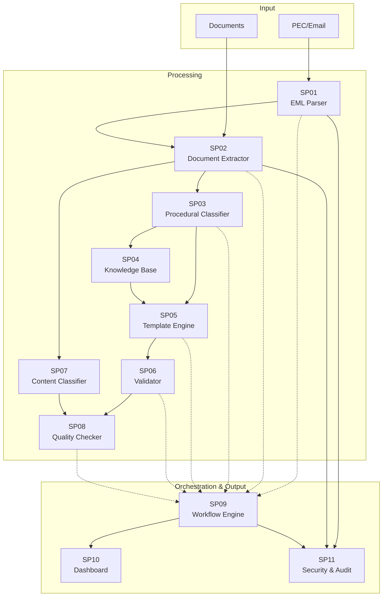

# Matrice Dipendenze Sottoprogetti - UC5 Produzione Documentale Integrata

## Overview Dipendenze



## Matrice Dipendenze Dettagliata

| SP | Nome | Dipendenze In | Dipendenze Out | Criticità | Dati |
|---|---|---|---|---|---|
| **SP01** | EML Parser | PEC/Email | SP02, SP09, SP11 | CRITICA | Parsed email + attachments |
| **SP02** | Document Extractor | SP01, Documents | SP03, SP07, SP09, SP11 | CRITICA | Extracted text + metadata |
| **SP03** | Procedural Classifier | SP02 | SP04, SP05, SP09 | ALTA | Classification + procedimento type |
| **SP04** | Knowledge Base | SP03 | SP05 | MEDIA | Normativa + templates + references |
| **SP05** | Template Engine | SP03, SP04 | SP06, SP09 | ALTA | Document draft from template |
| **SP06** | Validator | SP05 | SP08, SP09 | ALTA | Validation results + errors |
| **SP07** | Content Classifier | SP02 | SP08, SP09 | MEDIA | Content classification tags |
| **SP08** | Quality Checker | SP06, SP07 | SP09 | MEDIA | Quality score + suggestions |
| **SP09** | Workflow Engine | All SP (soft deps) | SP10, SP11 | CRITICA | Workflow state + execution |
| **SP10** | Dashboard | SP09 | Display | MEDIA | UI visualization |
| **SP11** | Security & Audit | All SP | Logs | CRITICA | Audit trail + security events |

## Flusso Dati Principale

```
PEC/Email
  ↓
SP01 (EML Parser)
  ├─→ SP02 (Document Extractor)
  │     ├─→ SP03 (Procedural Classifier)
  │     │     ├─→ SP04 (Knowledge Base)
  │     │     │     ↓
  │     │     └─→ SP05 (Template Engine)
  │     │           ├─→ SP06 (Validator)
  │     │           │     ↓
  │     │           └─→ SP08 (Quality Checker)
  │     │                 ↓
  │     └─→ SP07 (Content Classifier)
  │           ↓
  │         SP08 (Quality Checker)
  │
  └─→ SP09 (Workflow Engine) ◄─── All SP
        ├─→ SP10 (Dashboard)
        └─→ SP11 (Security & Audit)
```

## Dipendenze Critiche (Hard Dependencies)

### 1. SP01 → SP02 (Input pipeline)
- **Tipo**: Hard dependency
- **Dato**: Parsed email with attachments
- **Criticità**: CRITICA - No email parsing = no document processing
- **SLA**: Email parsing < 2 sec
- **Mitigazione**: Queue for high volume, retry on failure

### 2. SP02 → SP03/SP07 (Document Classification)
- **Tipo**: Hard dependency
- **Dato**: Extracted document content
- **Criticità**: CRITICA - Classification required for routing
- **SLA**: Classification < 5 sec per document
- **Mitigazione**: Cache classifications, async processing for large docs

### 3. SP03 → SP05 (Procedural to Template)
- **Tipo**: Hard dependency
- **Dato**: Procedimento classification
- **Criticità**: ALTA - Template selection depends on procedure type
- **SLA**: Template selection < 1 sec
- **Mitigazione**: Pre-load templates, versioning

### 4. SP05 → SP06 → SP08 (Generation → Validation)
- **Tipo**: Sequential hard dependencies
- **Dato**: Generated document → validation errors → quality checks
- **Criticità**: ALTA - Quality control is mandatory
- **SLA**: Full validation < 10 sec
- **Mitigazione**: Parallel validation, caching

### 5. SP09 (Workflow Engine)
- **Tipo**: Central orchestrator
- **Dato**: Coordinates all SP
- **Criticità**: CRITICA - SPOF for workflow execution
- **SLA**: Workflow steps < 500ms
- **Mitigazione**: High availability, multiple instances, queue for pending steps

### 6. SP11 (Security & Audit)
- **Tipo**: Cross-cutting concern
- **Dato**: Receives events from all SP
- **Criticità**: CRITICA - Non-repudiation requirement
- **SLA**: Audit logging < 100ms (async)
- **Mitigazione**: Async logging, immutable audit log

## Dipendenze Soft (Optional/Async)

- **SP04**: Knowledge Base can be stale/cached (updated async)
- **SP07**: Content classification is optional enhancement
- **SP10**: Dashboard is read-only, can be delayed

## Dipendenze Cicliche

✅ **NESSUNA dipendenza ciclica** - DAG (Directed Acyclic Graph) structure confirmed.

Linear chains:
- PEC → SP01 → SP02 → SP03 → SP05 → SP06 → SP08
- PEC → SP01 → SP02 → SP07 → SP08
- All → SP09 → SP10/SP11

## Matrice Tecnologica

| SP | Language | Framework | DB |
|---|---|---|---|
| SP01 | Python | email-parser | PostgreSQL |
| SP02 | Python | Tesseract, spaCy | PostgreSQL |
| SP03 | Python | DistilBERT | PostgreSQL |
| SP04 | Python | RAG, Mistral | Vector DB |
| SP05 | Python | LangChain, GPT-4 | PostgreSQL |
| SP06 | Python | BERT | PostgreSQL |
| SP07 | Python | spaCy | PostgreSQL |
| SP08 | Python | LanguageTool | PostgreSQL |
| SP09 | Python | Apache NiFi | PostgreSQL |
| SP10 | React | Streamlit | -Redis |
| SP11 | Python | FastAPI | PostgreSQL, ELK |

## KPIs per SP

- **SP01**: Email parsing latency < 2s, attachment extraction accuracy > 99%
- **SP02**: OCR accuracy > 95%, document extraction latency < 5s
- **SP03**: Classification accuracy > 90%, procedure detection > 95%
- **SP04**: KB search accuracy > 85%, template match confidence > 80%
- **SP05**: Document generation latency < 10s, template application accuracy > 98%
- **SP06**: Validation latency < 2s, error detection accuracy > 90%
- **SP07**: Content tagging accuracy > 85%
- **SP08**: Quality score accuracy > 90%, suggestion relevance > 80%
- **SP09**: Workflow execution latency < 500ms, completion rate > 99%
- **SP10**: Dashboard refresh < 5s, uptime > 99.9%
- **SP11**: Audit logging latency < 100ms, completeness 100%

## Ordine Implementazione Consigliato

1. **Phase 1 - Foundation**: SP04 (Knowledge Base - data layer)
2. **Phase 2 - Input Processing**: SP01 (EML Parser), SP02 (Document Extractor)
3. **Phase 3 - Classification**: SP03 (Procedural), SP07 (Content)
4. **Phase 4 - Generation & Validation**: SP05 (Template), SP06 (Validator)
5. **Phase 5 - Quality**: SP08 (Quality Checker)
6. **Phase 6 - Orchestration**: SP09 (Workflow)
7. **Phase 7 - Cross-Cutting**: SP11 (Security), SP10 (Dashboard)

## Rischi e Mitigazioni

### SPOF (Single Point of Failure)
- **SP09 Workflow Engine**: Central orchestrator
  - **Mitigazione**: HA cluster, auto-failover, queue for pending
- **SP01 EML Parser**: Input gate
  - **Mitigazione**: Queue system, retry logic, fallback parsing
- **SP05 Template Engine**: Document generation
  - **Mitigazione**: Template caching, version management, fallback templates

### Performance Bottlenecks
- **SP02 OCR**: Heavy computation
  - **Mitigazione**: GPU acceleration, async processing, queue
- **SP05 LLM Generation**: Token limits
  - **Mitigazione**: Chunk documents, rate limiting, caching
- **SP03 Model Inference**: ML latency
  - **Mitigazione**: Model optimization, batch inference, caching

### Failure Scenarios
- **SP01 fails**: No email processing - queue and retry
- **SP03 fails**: Use default procedure or manual intervention
- **SP05 fails**: Use template placeholder + HITL review
- **SP09 fails**: Use sequential queue + manual execution
- **SP11 fails**: Log to file + async recovery

## HITL (Human-in-the-Loop)

Special consideration for UC5: HITL interface for:
- Uncertain classifications (SP03 < 80% confidence)
- Template generation issues (SP05 validation errors)
- Complex procedimento types (manual override)
- Document quality issues (SP08 suggestions)

HITL Manager coordinates with SP09 Workflow for decision tracking.

## Testing Strategy

| Type | Scenario | Dependency Chain |
|---|---|---|
| Unit | Individual SP | None |
| Integration | SP01+SP02+SP03 | Input → Processing |
| E2E | PEC → Generated Doc | All SP in sequence |
| Load | 1000 emails/hour | All SP with stress |
| Chaos | SP failure | Fallback + recovery |

