# ⚠️ DEPRECATED - Analisi Refactoring EML Architecture

**STATUS**: DEPRECATED - This document contains analysis of architectural improvements that have been integrated into the canonical architecture.

**Please refer to**: [00 Architettura Generale Microservizi.md](./00 Architettura Generale Microservizi.md) for the current authoritative architecture.

**Purpose of this document**: Historical analysis of EML handling considerations - maintained for reference only.

---

## 📋 Panoramica del Cambiamento (ARCHIVED)

### Problema Originale
L'architettura attuale parte dall'assunzione di documenti già estratti e pronti per la classificazione, ma **nella realtà operativa**:
- ✉️ Input principale: email .eml (PEC, caselle istituzionali)
- 📎 Allegati multipli per singola email (istanza PDF, documenti identità, planimetrie, ecc.)
- 🔍 Necessità di **pre-processamento** prima della classificazione

### Soluzione Proposta
Introduzione di **2 nuovi sottoprogetti** all'inizio della pipeline:

```
PRIMA:
SP00 (Procedural Classifier) → SP01 (Template) → SP02 (Validator) → ...

DOPO:
SP01 (EML Parser) → SP02 (Document Extractor) → SP03 (Procedural Classifier) → 
SP04 (Template) → SP05 (Validator) → ...
```

---

## 🆕 Nuovi Sottoprogetti

### SP01 - EML Parser & Email Intelligence

**Responsabilità**:
- Parse email .eml (headers + body + attachments)
- Estrazione metadati email (mittente, destinatario, data, oggetto, PEC info)
- Identificazione thread conversazionali (risposte, forward)
- Classificazione tipo email (istanza iniziale, integrazione documentale, risposta ente)
- Estrazione firma digitale (.p7m) e validazione

**Input**: File .eml raw
**Output**: JSON strutturato con:
```json
{
  "email_metadata": {
    "message_id": "xxx",
    "from": "cittadino@pec.it",
    "to": "protocollo@comune.it",
    "subject": "Richiesta autorizzazione scarico acque reflue",
    "date": "2025-11-03T10:30:00Z",
    "is_pec": true,
    "pec_receipt_type": "avvenuta-consegna",
    "thread_id": "xxx",
    "in_reply_to": null
  },
  "body": {
    "text_plain": "Spett.le Amministrazione...",
    "text_html": "<html>...",
    "language": "it",
    "detected_intent": "istanza_iniziale"
  },
  "attachments": [
    {
      "filename": "istanza_scarico.pdf",
      "content_type": "application/pdf",
      "size_bytes": 245678,
      "hash_sha256": "abc123...",
      "storage_path": "minio://uploads/2025-11/xxx.pdf",
      "is_signed": false
    },
    {
      "filename": "documento_identita.pdf.p7m",
      "content_type": "application/pkcs7-mime",
      "size_bytes": 123456,
      "hash_sha256": "def456...",
      "storage_path": "minio://uploads/2025-11/yyy.pdf.p7m",
      "is_signed": true,
      "signature_valid": true,
      "signer_cn": "ROSSI MARIO - CF: RSSMRA80A01H501Z"
    }
  ],
  "classification_hints": {
    "procedimento_keywords": ["scarico", "acque", "reflue", "autorizzazione"],
    "urgency": "normal",
    "requires_response": true
  }
}
```

**Tecnologie**:
- Python `email` library per parsing .eml
- `mailparser` per metadata extraction avanzata
- `cryptography` + `asn1crypto` per validazione firma digitale
- spaCy per NER su corpo email
- MinIO per storage allegati

**Pipeline Operativa**: [Vedere sezione dettagliata sotto]

---

### SP02 - Document Extractor & Attachment Classifier

**Responsabilità**:
- Estrazione contenuto da allegati (PDF, DOCX, immagini, P7M)
- OCR per documenti scannerizzati
- Classificazione tipo allegato (istanza, documento identità, planimetria, ricevuta, ecc.)
- Estrazione testo strutturato per tipo documento
- Gestione formati speciali (.p7m firma digitale)

**Input**: Lista allegati da SP01
**Output**: Collezione documenti classificati e estratti:
```json
{
  "documents": [
    {
      "attachment_id": "att_001",
      "original_filename": "istanza_scarico.pdf",
      "document_type": "istanza_procedimento",
      "confidence": 0.96,
      "extracted_content": {
        "text": "Il sottoscritto Mario Rossi...",
        "metadata": {
          "page_count": 3,
          "has_tables": true,
          "has_images": false,
          "language": "it",
          "ocr_required": false
        },
        "structured_data": {
          "richiedente": {
            "nome": "Mario Rossi",
            "cf": "RSSMRA80A01H501Z",
            "indirizzo": "Via Roma 1, Milano"
          },
          "oggetto_richiesta": "Autorizzazione scarico acque reflue industriali",
          "riferimenti_normativi": ["D.Lgs 152/2006"]
        }
      }
    },
    {
      "attachment_id": "att_002",
      "original_filename": "documento_identita.pdf",
      "document_type": "documento_identita",
      "confidence": 0.98,
      "extracted_content": {
        "text": "CARTA D'IDENTITÀ...",
        "structured_data": {
          "tipo_documento": "carta_identita",
          "numero": "CA12345678",
          "rilasciato_da": "Comune di Milano",
          "data_rilascio": "2020-01-15",
          "data_scadenza": "2030-01-15",
          "intestatario": {
            "nome": "ROSSI",
            "cognome": "MARIO",
            "cf": "RSSMRA80A01H501Z"
          }
        }
      }
    },
    {
      "attachment_id": "att_003",
      "original_filename": "planimetria.pdf",
      "document_type": "planimetria_tecnica",
      "confidence": 0.92,
      "extracted_content": {
        "text": "",
        "metadata": {
          "is_technical_drawing": true,
          "format": "A3",
          "scale": "1:100"
        }
      }
    }
  ],
  "validation_status": {
    "required_documents_present": true,
    "missing_documents": [],
    "identity_verified": true,
    "signatures_valid": true
  }
}
```

**Tecnologie**:
- PyPDF2 / pdfplumber per PDF extraction
- python-docx per DOCX
- Tesseract OCR per documenti scannerizzati
- LayoutLM per understanding documenti strutturati
- DistilBERT fine-tuned per classificazione tipo documento
- Custom NER per estrazione dati strutturati (CF, date, indirizzi)

**Pipeline Operativa**: [Vedere sezione dettagliata sotto]

---

## 📊 Nuova Architettura Completa (Rinumerata)

### Elenco Sottoprogetti Aggiornato

| ID | Nome | Responsabilità | Priority |
|----|------|----------------|----------|
| **SP01** | **EML Parser & Email Intelligence** | Parse .eml, estrazione metadati, firma digitale | 🔴 P0 |
| **SP02** | **Document Extractor & Attachment Classifier** | OCR, classificazione allegati, estrazione dati | 🔴 P0 |
| **SP03** | **Procedural Classifier** | Classificazione procedimento amministrativo | 🔴 P0 |
| **SP04** | **Legal Knowledge Base** | RAG normativa, Q&A giuridico | 🔴 P0 |
| **SP05** | **Template Engine AI** | Generazione atti da template | 🔴 P0 |
| **SP06** | **Document Validator** | Validazione conformità normativa | 🟡 P1 |
| **SP07** | **Content Classifier** | Classificazione atti generati | 🟡 P1 |
| **SP08** | **Linguistic Quality Checker** | Controllo grammatica e stile | 🟢 P2 |
| **SP09** | **Workflow Engine** | Orchestrazione pipeline completa | 🟡 P1 |
| **SP10** | **Explainability Dashboard** | UI trasparenza decisioni AI | 🟢 P2 |
| **SP11** | **Security & Audit** | GDPR, audit trail, anomaly detection | 🟡 P1 |

---

## 🔄 Nuovo Flusso End-to-End

### Sequence Diagram Completo

```mermaid
sequenceDiagram
    autonumber
    participant U as 👤 Cittadino
    participant PEC as 📧 PEC Server
    participant SP01 as 🔧 SP01<br/>EML Parser
    participant SP02 as 📄 SP02<br/>Doc Extractor
    participant SP03 as 🎯 SP03<br/>Procedural<br/>Classifier
    participant SP04 as 📚 SP04<br/>Knowledge<br/>Base
    participant SP05 as ✍️ SP05<br/>Template<br/>Engine
    participant SP06 as ✔️ SP06<br/>Validator
    participant SP09 as 🔄 SP09<br/>Workflow
    participant HITL as 👨‍💼 HITL UI
    
    Note over U,HITL: 📥 FASE 1: Ricezione Email
    U->>PEC: Invia email PEC con istanza + allegati
    PEC->>SP09: Notifica nuovo messaggio (.eml)
    
    rect rgb(255, 240, 200)
        Note over SP01: ✨ FASE 2: Parsing Email
        SP09->>SP01: Parse file .eml
        SP01->>SP01: Estrae headers/body/attachments
        SP01->>SP01: Valida firma digitale PEC
        SP01->>SP01: Identifica thread conversazione
        SP01-->>SP09: JSON email_metadata + lista allegati
    end
    
    rect rgb(240, 255, 240)
        Note over SP02: 📄 FASE 3: Estrazione Documenti
        SP09->>SP02: Elabora allegati (parallelo)
        
        par Allegato 1: istanza.pdf
            SP02->>SP02: Extract text + OCR se necessario
            SP02->>SP02: Classifica: "istanza_procedimento"
            SP02->>SP02: Estrai dati strutturati (NER)
        and Allegato 2: documento_identita.pdf
            SP02->>SP02: Extract text
            SP02->>SP02: Classifica: "documento_identita"
            SP02->>SP02: Estrai CF, numero documento
        and Allegato 3: planimetria.pdf
            SP02->>SP02: Detect technical drawing
            SP02->>SP02: Classifica: "planimetria_tecnica"
        end
        
        SP02-->>SP09: JSON documents[] con classificazione + dati estratti
        SP02->>SP02: Valida presenza doc obbligatori
        SP02-->>SP09: validation_status
    end
    
    rect rgb(255, 235, 59, 0.3)
        Note over HITL: 🔄 HITL #1: Verifica Completezza Documentale
        SP09->>HITL: Mostra allegati classificati + dati estratti
        HITL->>HITL: Verifica identità, firma, completezza
        HITL-->>SP09: ✅ Conferma / ✏️ Richiedi integrazioni
        alt Integrazione richiesta
            SP09->>U: Email richiesta documenti mancanti
            U->>PEC: Invia email con integrazioni
            Note over SP09: Ritorna a FASE 2 (nuovo .eml)
        end
    end
    
    rect rgb(255, 240, 200)
        Note over SP03: 🎯 FASE 4: Classificazione Procedimento
        SP09->>SP03: Classifica istanza estratta
        SP03->>SP03: Analisi semantica testo istanza
        SP03->>SP04: Recupera procedimenti simili
        SP04-->>SP03: Database procedimenti
        SP03-->>SP09: Procedimento: AUTORIZ_SCARICO_ACQUE<br/>Provvedimento: DETERMINAZIONE<br/>Normativa: D.Lgs 152/2006
    end
    
    rect rgb(255, 235, 59, 0.3)
        Note over HITL: 🔄 HITL #2: Conferma Procedimento
        SP09->>HITL: Propone procedimento (96% confidence)
        HITL-->>SP09: ✅ Conferma / ✏️ Modifica
    end
    
    rect rgb(200, 240, 255)
        Note over SP05: ✍️ FASE 5: Generazione Atto
        SP09->>SP05: Genera documento con contesto
        SP05->>SP04: Recupera normativa + template
        SP04-->>SP05: Template + riferimenti normativi
        SP05-->>SP09: Documento generato (v1.0-AI)
    end
    
    rect rgb(255, 235, 59, 0.3)
        Note over HITL: 🔄 HITL #3: Review Draft
        SP09->>HITL: Mostra bozza completa
        HITL-->>SP09: ✅ Approva / ✏️ Modifica
    end
    
    rect rgb(200, 255, 200)
        Note over SP06: ✔️ FASE 6: Validazione
        SP09->>SP06: Valida conformità
        SP06->>SP04: Verifica normativa applicabile
        SP06-->>SP09: ✅ Validato (score: 97/100)
    end
    
    rect rgb(255, 235, 59, 0.3)
        Note over HITL: 🔄 HITL #4: Firma e Protocollo
        SP09->>HITL: Richiede firma digitale
        HITL->>HITL: Firma documento
        HITL-->>SP09: ✅ Documento firmato
    end
    
    SP09->>U: 📧 Notifica PEC: atto approvato
    
    Note over U,HITL: 📤 FINE: Atto protocollato e notificato
```



---

## 📋 Dettagli Tecnici Nuovi Sottoprogetti

### SP01 - EML Parser & Email Intelligence

#### Architettura Componenti


#### Pipeline Operativa Dettagliata

**1. Definizione del Problema**
- **Tipo**: Information extraction + classification multi-task
- **Metriche di successo**:
  - Accuracy parsing metadata: >99.5%
  - Firma digitale validation accuracy: 100%
  - Thread detection precision: >90%
  - Intent classification F1: >0.85
  - Latency: <2 secondi per email

**2. Raccolta Dati**
- **Fonti**:
  - Storico email PEC protocollo (3+ anni)
  - Dataset PEC con ricevute di consegna/accettazione
  - Esempi email firmata digitalmente (.p7m)
  - Casistica thread conversazionali (richieste integrazione)
- **Annotazione**: Classificazione intent email (istanza iniziale, integrazione, risposta ente, informazione)

**3. Preprocessing**
- Parsing headers RFC 822
- Decodifica charset (UTF-8, ISO-8859-1, quoted-printable)
- Estrazione plain text + HTML body
- Gestione allegati inline vs attached
- Validazione certificati firma digitale

**4. Modelli ML**
- **Intent Classifier**: DistilBERT fine-tuned su corpus email PA
  - Classi: `istanza_iniziale`, `integrazione_documentale`, `risposta_ente`, `richiesta_informazioni`, `sollecito`
- **Thread Detector**: Rule-based + ML su headers (In-Reply-To, References)
- **Urgency Detector**: Keywords + NER su corpo email

**5. API Endpoints**
```python
POST /api/v1/parse-email
Request:
{
  "eml_file_path": "s3://inbox/2025-11-03/msg_001.eml"
}

Response: [JSON come esempio sopra]
```

**6. Monitoring**
- Tracking errori parsing (malformed .eml)
- Alert firma digitale invalida
- Dashboard volumi email per tipo intent
- SLA: 95% email processate <2s

---

### SP02 - Document Extractor & Attachment Classifier

#### Architettura Componenti


#### Pipeline Operativa Dettagliata

**1. Definizione del Problema**
- **Tipo**: Multi-format extraction + multi-class classification + NER
- **Metriche di successo**:
  - Classificazione tipo documento: Accuracy >94%
  - Estrazione CF/Partita IVA: Precision >98%
  - OCR accuracy (testo scannerizzato): >92%
  - Completezza campi obbligatori: >90%
  - Throughput: 50 documenti/minuto

**2. Raccolta Dati**
- **Fonti**:
  - Repository allegati istanze (PDF, DOCX, immagini)
  - Dataset pubblici documenti identità italiani
  - Corpus planimetrie tecniche annotate
  - Esempi documenti firmati .p7m
- **Annotazione**:
  - Etichette tipo documento (16 categorie: istanza, identità, visura camerale, planimetria, ecc.)
  - Ground truth campi strutturati (CF, indirizzi, importi, date)

**3. Preprocessing**
- **PDF**: Layout analysis con pdfplumber, table extraction
- **OCR**: Pre-processing immagini (deskew, binarization, denoise)
- **DOCX**: Estrazione paragrafi + tabelle + immagini embedded
- **P7M**: Unwrap firma digitale CAdES, verifica certificato

**4. Modelli ML**

**4.1 Document Classifier**
- **Modello**: DistilBERT fine-tuned su dataset documenti PA
- **Classi** (16):
  ```
  - istanza_procedimento
  - documento_identita (carta, patente, passaporto)
  - codice_fiscale_tessera
  - visura_camerale
  - planimetria_tecnica
  - relazione_tecnica
  - ricevuta_pagamento
  - marca_da_bollo
  - procura_delega
  - dichiarazione_sostitutiva
  - autocertificazione
  - contratto
  - fattura
  - altro_allegato
  ```
- **Features**: Embeddings primo paragrafo + layout features
- **Training**: 5-fold CV, stratified sampling

**4.2 Custom NER per Dati Strutturati**
- **Modello**: spaCy NER + transformer-based (BERT-NER)
- **Entità** (personalizzate per PA italiana):
  ```
  - CODICE_FISCALE: pattern validation checksum
  - PARTITA_IVA: pattern + Luhn algorithm
  - INDIRIZZO: via, civico, CAP, comune, provincia
  - DATA: formati multipli (gg/mm/aaaa, testuale)
  - IMPORTO: euro, separatori migliaia/decimali
  - RIFERIMENTO_NORMATIVO: legge, decreto, articolo
  - PROTOCOLLO: pattern prot. N.xxx/YYYY
  - TELEFONO: formati italiani (+39, 0xx)
  - EMAIL: validation RFC 5322
  - PEC: domain validation
  ```

**4.3 Layout Understanding (per documenti complessi)**
- **Modello**: LayoutLMv3 fine-tuned
- **Uso**: Estrazione tabelle, form filling detection
- **Output**: Structured JSON da layout visivo

**5. Validation Layer**

```python
# Schema validation per tipo documento
SCHEMA_ISTANZA = {
  "required_fields": ["richiedente.cf", "oggetto_richiesta", "firma"],
  "optional_fields": ["richiedente.pec", "riferimenti_normativi"]
}

SCHEMA_DOC_IDENTITA = {
  "required_fields": [
    "tipo_documento", 
    "numero", 
    "intestatario.nome", 
    "intestatario.cf",
    "data_scadenza"
  ],
  "validations": {
    "data_scadenza": "must be > today",
    "cf": "checksum_valid"
  }
}
```

**6. API Endpoints**

```python
POST /api/v1/extract-documents
Request:
{
  "attachments": [
    {
      "attachment_id": "att_001",
      "storage_path": "minio://uploads/2025-11/doc1.pdf",
      "filename": "istanza.pdf"
    }
  ]
}

Response: [JSON come esempio sopra con documents[]]
```

**7. Monitoring & Retraining**
- Dashboard accuracy per tipo documento
- Tracking campi mancanti (per migliorare NER)
- A/B testing nuove versioni modelli
- Active learning: documenti low-confidence → revisione umana
- Retraining mensile con feedback HITL

---

## 🔧 Modifiche Necessarie ai Sottoprogetti Esistenti

### SP03 (ex SP00) - Procedural Classifier

**Modifiche INPUT**:
```python
# PRIMA
input = {
  "istanza_text": "Il sottoscritto richiede..."
}

# DOPO (arricchito da SP01 + SP02)
input = {
  "email_metadata": { ... },  # da SP01
  "istanza_document": {       # da SP02
    "text": "...",
    "structured_data": { ... }
  },
  "supporting_documents": [ ... ],  # da SP02
  "validation_status": { ... }      # da SP02
}
```

**Benefici**:
- ✅ Classificazione più accurata (context da email + allegati)
- ✅ Metadata pre-estratti (richiedente, oggetto) aiutano NER
- ✅ Validazione documentale upstream riduce errori

### SP05 (ex SP01) - Template Engine

**Modifiche INPUT**:
```python
# Può ora accedere a:
- Dati richiedente estratti da documento identità (SP02)
- Riferimenti normativi già identificati in istanza (SP02)
- Eventuali integrazioni documentali da thread email (SP01)
```

**Benefici**:
- ✅ Compilazione template più completa
- ✅ Minor necessità di inferenza dati
- ✅ Tracciabilità fonte dati (audit trail)

---

## 📊 Roadmap Aggiornata con Nuovi SP

### Fase 0 (Mese 0): PREPARAZIONE

**Settimana 1-2: Setup Infrastruttura Email**
- Configurazione casella PEC istituzionale
- Setup MinIO per storage allegati
- Database PostgreSQL per tracking email
- Connector PEC → Sistema (IMAP/API)

**Settimana 3-4: Dataset Preparation**
- Raccolta storico email PEC (export mailbox)
- Annotazione campione 500 email per intent classification
- Annotazione 200 allegati per document classifier
- Preparazione test set gold standard

---

### Fase 1 (Mesi 1-3): FOUNDATION LAYER + EMAIL PROCESSING

**Mese 1: SP01 - EML Parser**
- Implementazione parser .eml (Python email library)
- Validazione firma digitale PEC
- Intent classifier training (DistilBERT)
- Thread detection logic
- API REST + storage MinIO
- **Deliverable**: Parsing email operativo
- **KPI**: Accuracy metadata >99%, Intent F1 >0.85

**Mese 2: SP02 - Document Extractor**
- PDF/DOCX extraction pipeline
- Tesseract OCR integration
- Document classifier training (16 classi)
- Custom NER training (CF, indirizzi, ecc.)
- P7M signature unwrapping
- **Deliverable**: Estrazione allegati operativa
- **KPI**: Classification accuracy >94%, NER precision >98%

**Mese 3 (parallelo): SP03 - Procedural Classifier**
- Integrazione input da SP01+SP02
- Fine-tuning con metadata arricchiti
- Testing su dataset completo (email→allegati→procedimento)
- **Deliverable**: Classificazione procedimento end-to-end
- **KPI**: Accuracy >95% (migliorata rispetto a standalone)

**Milestone M1**: Pipeline email→documenti→procedimento operativa

---

### Fase 2 (Mesi 4-6): KNOWLEDGE & GENERATION

[Come roadmap originale ma con input arricchiti]

**Mese 4-5: SP04 - Legal Knowledge Base**
[Invariato]

**Mese 5-6: SP05 - Template Engine**
- Modifica per sfruttare dati strutturati da SP02
- Template pre-filling automatico con metadata
- Integration test con SP01-SP04

**Mese 6: SP06 - Validator + SP08 - Quality Checker**
[Invariati]

**Milestone M2**: Sistema generazione completo

---

### Fase 3-4: [Come roadmap originale]

**SP09 (ex SP06) - Workflow Engine**
- Orchestrazione completa SP01→SP11
- HITL checkpoints
- Integration sistemi esterni

**SP10 (ex SP07) - Dashboard**
- Visualizzazione pipeline completa
- Audit trail email→atto

**SP11 (ex SP08) - Security & Audit**
- Tracking completo da email ricevuta a atto firmato

---

## 🎯 Vantaggi dell'Approccio Proposto

### Funzionali
✅ **Automazione completa**: email→atto senza trascrizione manuale
✅ **Gestione allegati multipli**: classificazione e validazione documentale upstream
✅ **Tracciabilità totale**: da .eml originale a atto protocollato
✅ **Validazione early**: controllo completezza documentale PRIMA di generazione
✅ **Supporto integrazioni**: gestione thread email per documenti mancanti

### Tecnici
✅ **Modularità**: SP01-SP02 disaccoppiati e riutilizzabili
✅ **Scalabilità**: parallelizzazione estrazione allegati
✅ **Estensibilità**: facile aggiunta nuovi tipi documento
✅ **Resilienza**: retry logic per email malformate

### Compliance
✅ **GDPR**: pseudonimizzazione dati in SP01, audit trail completo
✅ **Firma digitale**: validazione PEC + P7M
✅ **Conservazione**: storage normativo documenti originali

---

## 📝 Prossimi Passi Suggeriti

1. **Validation Concept**:
   - [ ] Review proposta con stakeholder tecnici
   - [ ] Identificazione gap dataset (email annotate, allegati)
   - [ ] Stima effort sviluppo SP01-SP02 (2-3 mesi realistici)

2. **Spike Tecnico**:
   - [ ] POC parsing .eml con validazione firma (1 settimana)
   - [ ] POC OCR + classificazione allegati (1 settimana)
   - [ ] Test performance Tesseract vs servizi cloud (AWS Textract)

3. **Refactoring Codebase**:
   - [ ] Rinumerazione file documentazione (SP00→SP03, SP01→SP05, ecc.)
   - [ ] Aggiornamento diagrammi architettura
   - [ ] Modifica schemi JSON input/output componenti

---

## 🤔 Domande Aperte per Discussione

1. **Storage allegati**: MinIO on-premise vs S3 cloud?
2. **OCR**: Tesseract open-source vs AWS Textract/Azure Form Recognizer (costi)?
3. **Classificazione allegati**: 16 classi sufficienti o servono più granularità?
4. **Validazione firma digitale**: libreria Python vs servizio esterno (es. InfoCert API)?
5. **Performance**: target latency per email con 10 allegati? (current: ~30s)

---

**Conclusione**: L'introduzione di SP01 e SP02 trasforma il sistema da "document processor" a **"email-to-act end-to-end platform"**, allineandolo alla realtà operativa delle PA che ricevono istanze via PEC con allegati multipli.
