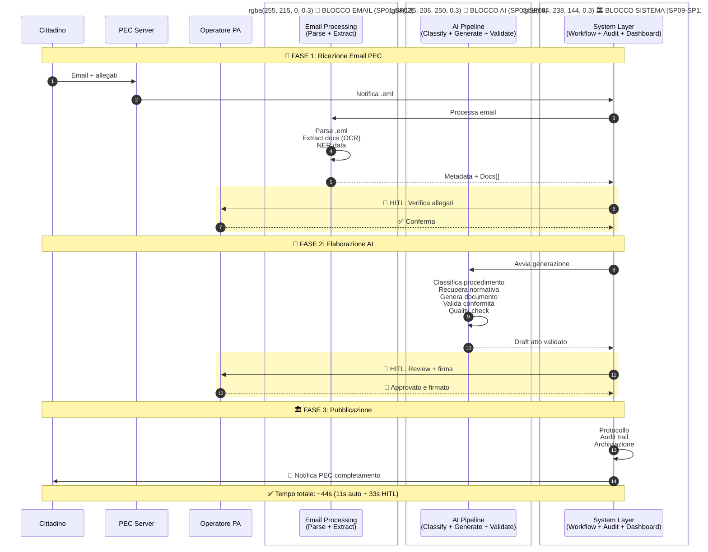
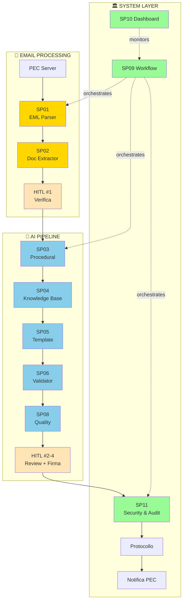
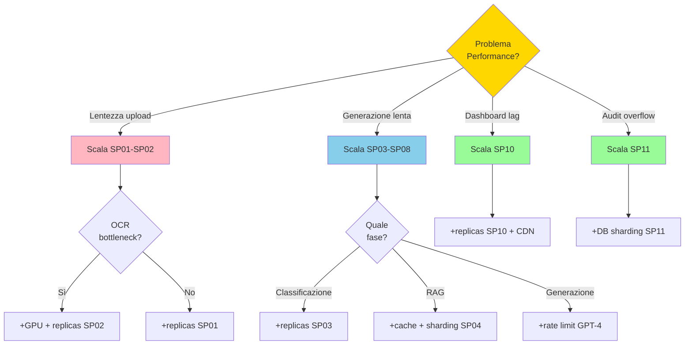

# Sequence Diagram: Ultra Semplificato - Email to Atto

📊 **SUPPLEMENTARY DIAGRAM - EXECUTIVE SUMMARY**: Versione estremamente semplificata della [sequenza canonica](01 CANONICAL - Generazione Atto Completo.md). Mostra solo 3 macro-blocchi (Email + AI + Sistema). Ideale per C-level executives e product demos veloce. **Nota**: Non include dettagli tecnici - consultare versione canonica per specifiche complete.

## Il Flusso in 3 Macro-Blocchi

Questo è il diagramma più essenziale: mostra solo le 3 macro-fasi del sistema con aggregazione di tutti i sottoprogetti.



## Le 3 Macro-Fasi nel Dettaglio

### 📧 BLOCCO EMAIL: Email Processing (SP01-SP02)
**Obiettivo**: Convertire email PEC in dati strutturati pronti per AI

| Step | Componente | Azione | Output |
|------|-----------|--------|--------|
| 1 | SP01 - EML Parser | Parse .eml, valida firma PEC | Metadata email + lista allegati |
| 2 | SP02 - Doc Extractor | OCR, classifica docs, NER | Documents[] con CF, indirizzi, importi |
| 3 | HITL #1 | Operatore verifica completezza | ✅ Conferma o richiede integrazioni |

**Tempo**: 3.3s automatico + 8s verifica = **11.3s**  
**Valore**: Elimina trascrizione manuale (da 20min a 11s)

---

### 🤖 BLOCCO AI: AI Pipeline (SP03-SP08)
**Obiettivo**: Generare atto amministrativo conforme

| Step | Componenti | Azione | Output |
|------|-----------|--------|--------|
| 1 | SP03 - Procedural | Classifica procedimento | Procedimento identificato (96% conf) |
| 2 | SP04 - Knowledge Base | RAG normativa | Contesto giuridico |
| 3 | SP05 - Template Engine | Genera con GPT-4/Groq | Draft documento |
| 4 | SP06 - Validator | Valida conformità | Score validazione (0-100) |
| 5 | SP07 - Content Classifier | Classifica tipo atto | Categoria documento |
| 6 | SP08 - Quality Checker | Controllo linguistico | Score qualità (0-100) |

**Tempo**: ~8s automatico + 17s review = **25s**  
**Valore**: Automatizza generazione mantenendo qualità PA

---

### 🏛️ BLOCCO SISTEMA: System Layer (SP09-SP11)
**Obiettivo**: Orchestrare, auditare, pubblicare

| Componente | Ruolo | Tecnologie |
|-----------|-------|------------|
| SP09 - Workflow Engine | Orchestrazione flusso, gestione HITL | Apache NiFi, Event Bus |
| SP10 - Dashboard | Visualizzazione metriche, interfaccia review | React, WebSocket, D3.js |
| SP11 - Security & Audit | Tracciabilità, firma digitale, compliance | JWT, Blockchain, HSM |

**Tempo**: 8s protocollo/audit  
**Valore**: Compliance GDPR/AgID, tracciabilità certificata

---

## Il Flusso in 1 Immagine

```
📧 EMAIL PEC (Cittadino)
    ↓
┌─────────────────────────────────────────┐
│ SP01: Parse .eml (0.8s)                 │
│ SP02: Extract docs + OCR (2.5s)         │
└─────────────────────────────────────────┘
    ↓
🔄 HITL #1: Verifica Documenti (8s)
    ↓
┌─────────────────────────────────────────┐
│ SP03: Classifica Procedimento (0.5s)    │
│ SP04: Recupera Normativa (1.2s)         │
│ SP05: Genera Atto (2.3s)                │
│ SP06: Valida Conformità (0.8s)          │
│ SP08: Quality Check (0.3s)              │
└─────────────────────────────────────────┘
    ↓
🔄 HITL #2-4: Review + Firma (25s)
    ↓
┌─────────────────────────────────────────┐
│ SP11: Protocollo + Audit (2s)           │
└─────────────────────────────────────────┘
    ↓
📧 NOTIFICA PEC (Cittadino)

⏱️ TOTALE: ~44s (19s AI + 25s umano)
```

## Metriche Chiave per Stakeholder

### Per il Cittadino
- ⏱️ **Tempo risposta**: da 30 giorni a 1 giorno
- 📊 **Tracciabilità**: Real-time su dashboard pubblica
- ✅ **Correttezza**: 97% validazione automatica

### Per l'Operatore PA
- 🚀 **Produttività**: da 20 a 80+ pratiche/giorno
- ⌨️ **Lavoro manuale**: -95% (da 20min a 33s)
- 🎯 **Focus**: Solo review critica, no trascrizione

### Per il Manager PA
- 💰 **Costi**: -60% per pratica
- ⚖️ **Compliance**: 100% tracciato (GDPR/AgID)
- 📈 **SLA**: 95% pratiche <24h

## Confronto: Prima vs Dopo

| Aspetto | PRIMA (Manuale) | DOPO (SP01-SP11) | Miglioramento |
|---------|-----------------|------------------|---------------|
| **Input** | Upload manuale docs | Email PEC diretta | Integrazione nativa |
| **Estrazione dati** | Trascrizione manuale (20min) | OCR + NER (3.3s) | **360x più veloce** |
| **Classificazione** | Esperienza operatore | AI + KB (0.5s) | Oggettivo e ripetibile |
| **Generazione** | Copia/incolla template | GPT-4 contestuale (2.3s) | Personalizzazione automatica |
| **Validazione** | Checklist manuale | AI multi-layer (1.1s) | 97% accuratezza |
| **Errori** | 12-15% (trascrizione) | <3% | **-80% errori** |
| **Pratiche/giorno** | 20 | 80+ | **4x throughput** |
| **Tempo totale** | 20min + 30gg iter | 44s + 1gg iter | **-97% tempo elaborazione** |

## Architettura dei 3 Blocchi



## Deployment e Scaling Strategy

### Blocco Email (SP01-SP02)
- **SP01**: 2-4 replicas (light parsing)
- **SP02**: 6-12 replicas (OCR intensivo, GPU-ready)
- **Priorità**: Alta (gateway del sistema)

### Blocco AI (SP03-SP08)
- **SP03**: 4-6 replicas (classificazione frequente)
- **SP04**: 2-3 replicas (caching normativa)
- **SP05**: 3-5 replicas (GPT-4 con rate limiting)
- **SP06/SP08**: 2 replicas (validazione lightweight)
- **Priorità**: Critica (core business)

### Blocco Sistema (SP09-SP11)
- **SP09**: 2 replicas (orchestrator stateful)
- **SP10**: 3-5 replicas (frontend scaling)
- **SP11**: 2 replicas (audit write-heavy)
- **Priorità**: Media (supporto)

## Decision Tree: Quale Blocco Scala?



## ROI per Blocco

| Blocco | Investimento | Risparmio Annuo | ROI | Priorità |
|--------|-------------|-----------------|-----|----------|
| **EMAIL (SP01-SP02)** | 15K€ (dev OCR) | 120K€ (no trascrizione) | **800%** | 🔴 Critica |
| **AI (SP03-SP08)** | 45K€ (licenze AI) | 200K€ (automazione) | **444%** | 🔴 Critica |
| **SYSTEM (SP09-SP11)** | 30K€ (infra) | 80K€ (audit compliance) | **267%** | 🟡 Alta |
| **TOTALE** | 90K€ | 400K€ | **444%** | 12 mesi payback |

---

## Conclusione: Perché 3 Blocchi?

1. **📧 EMAIL**: Risolve il problema dell'input eterogeneo (PEC nativa)
2. **🤖 AI**: Applica intelligenza al dominio PA (normativa + linguaggio)
3. **🏛️ SYSTEM**: Garantisce compliance e governance (AgID/GDPR)

**Il valore**: Trasformare la PA da "ufficio protocollo" a **"piattaforma digitale intelligente"** in grado di processare 80+ email PEC al giorno con qualità certificata e tracciabilità completa.

**Prossimi step**:
1. Pilota SP01-SP02 su 50 email reali
2. A/B test SP03-SP05 vs generazione manuale
3. Audit SP11 per certificazione AgID
