# Human in the Loop (HITL) - Architettura e Funzionalità

## Concetto Generale

Il sistema implementa un approccio **Human in the Loop** che permette all'utente di:
- **Confermare** le scelte proposte dall'AI
- **Modificare** i risultati generati
- **Rifiutare** e richiedere rigenerazione
- **Tracciare** tutte le modifiche applicate

## Punti di Intervento Umano


## Dettaglio Punti HITL

### HITL #1: Conferma Procedimento (dopo SP03)

**Cosa viene presentato all'utente:**
- Tipo di procedimento identificato
- Confidence score
- Normativa di riferimento rilevata
- Procedimenti simili storici

**Azioni disponibili:**
- ✅ **Conferma**: Procedi con il procedimento identificato (sempre richiesta conferma umana)
- ✏️ **Modifica**: Cambia tipo procedimento o aggiungi note
- 🔄 **Rifiuta**: Richiedi nuova classificazione con feedback

**Nota importante**: Non esiste auto-conferma automatica. Ogni decisione richiede sempre intervento umano esplicito.

**Tracciamento:**
```json
{
  "hitl_point": "PROCEDURAL_CLASSIFICATION",
  "timestamp": "2025-10-14T10:30:00Z",
  "ai_suggestion": {
    "procedure_type": "AUTORIZZAZIONE_SCARICO",
    "confidence": 0.96,
    "normativa": ["D.Lgs 152/2006", "Regolamento Comunale 12/2020"]
  },
  "user_action": "MODIFIED",
  "user_changes": {
    "procedure_type": "AUTORIZZAZIONE_SCARICO_TEMPORANEA",
    "notes": "Richiesta per cantiere temporaneo, durata 6 mesi"
  },
  "user_id": "mario.rossi@comune.it",
  "modification_reason": "Specificazione temporaneità intervento"
}
```

---

### HITL #2: Conferma Classificazione Documento (dopo SP04)

**Cosa viene presentato all'utente:**
- Tipo documento identificato
- Categoria amministrativa
- Template consigliato
- Struttura documento prevista

**Azioni disponibili:**
- ✅ **Conferma**: Usa la classificazione suggerita (sempre richiesta conferma umana)
- ✏️ **Modifica**: Cambia tipo documento o template
- 🔄 **Rifiuta**: Richiedi nuova classificazione

**Nota importante**: Non esiste auto-conferma automatica. Ogni decisione richiede sempre intervento umano esplicito.

**Tracciamento:**
```json
{
  "hitl_point": "DOCUMENT_CLASSIFICATION",
  "timestamp": "2025-10-14T10:32:00Z",
  "ai_suggestion": {
    "document_type": "DETERMINAZIONE_DIRIGENZIALE",
    "template_id": "TPL-DET-001",
    "confidence": 0.94
  },
  "user_action": "CONFIRMED",
  "user_id": "mario.rossi@comune.it"
}
```

---

### HITL #3: Review Draft Documento (dopo SP01)

**Cosa viene presentato all'utente:**
- Documento generato completo
- Evidenziazione parti generate dall'AI
- Suggerimenti alternativi per ogni sezione
- Statistiche: completezza, coerenza, compliance

**Azioni disponibili:**
- ✅ **Approva**: Procedi con il draft generato (sempre richiesta approvazione umana)
- ✏️ **Modifica**: Editor inline con track changes
- 🔄 **Rigenera**: Richiedi nuova generazione con feedback
- 📝 **Modifica Sezione**: Modifica solo parti specifiche

**Nota importante**: Non esiste auto-approvazione automatica. Ogni draft richiede sempre review umana esplicita.

**Tracciamento:**
```json
{
  "hitl_point": "DRAFT_REVIEW",
  "timestamp": "2025-10-14T10:35:00Z",
  "ai_generated": {
    "sections": 12,
    "total_words": 1234,
    "version": "1.0-AI"
  },
  "user_action": "MODIFIED",
  "user_changes": {
    "sections_modified": [
      {
        "section_id": "premesse",
        "original": "Visto il D.Lgs 152/2006...",
        "modified": "Vista la normativa vigente in materia ambientale, con particolare riferimento al D.Lgs 152/2006...",
        "reason": "Aggiunto contesto normativo più ampio"
      },
      {
        "section_id": "motivazione",
        "original": "L'istanza risulta completa...",
        "modified": "L'istanza, presentata in data 01/09/2025, risulta completa e corredata di tutta la documentazione necessaria...",
        "reason": "Aggiunto riferimento temporale e dettaglio documentazione"
      }
    ],
    "total_modifications": 2,
    "modification_percentage": 16.67
  },
  "user_id": "mario.rossi@comune.it",
  "version": "1.1-HUMAN"
}
```

---

### HITL #4: Approvazione Finale (dopo SP05)

**Cosa viene presentato all'utente:**
- Documento finale con tutte le modifiche
- Report di validazione completo
- Quality score finale
- Checklist compliance normativa
- Diff rispetto alla versione AI originale

**Azioni disponibili:**
- ✅ **Approva per Pubblicazione**: Documento pronto (sempre richiesta approvazione umana finale)
- ✏️ **Ultime Modifiche**: Modifiche finali prima della firma
- 🔄 **Rifiuta**: Torna alla generazione
- 📊 **Richiedi Analisi Aggiuntiva**: Validazioni extra

**Nota importante**: Non esiste auto-approvazione automatica. L'approvazione finale richiede sempre decisione umana esplicita con responsabilità legale.

**Tracciamento:**
```json
{
  "hitl_point": "FINAL_APPROVAL",
  "timestamp": "2025-10-14T10:40:00Z",
  "document_state": {
    "version": "1.3-FINAL",
    "quality_score": 0.98,
    "validation_passed": true,
    "compliance_check": "PASSED",
    "total_ai_content": 85.5,
    "total_human_modifications": 14.5
  },
  "user_action": "APPROVED",
  "approval_notes": "Documento conforme, pronto per firma e protocollo",
  "user_id": "mario.rossi@comune.it",
  "timestamp_approval": "2025-10-14T10:41:00Z"
}
```

---

## Database Schema per Tracciamento HITL

### Tabella: `hitl_interactions`

```sql
CREATE TABLE hitl_interactions (
    id SERIAL PRIMARY KEY,
    workflow_id VARCHAR(50) NOT NULL,
    hitl_point VARCHAR(50) NOT NULL,  -- PROCEDURAL_CLASSIFICATION, DOCUMENT_CLASSIFICATION, DRAFT_REVIEW, FINAL_APPROVAL
    timestamp TIMESTAMPTZ NOT NULL DEFAULT NOW(),

    -- AI Suggestion
    ai_suggestion JSONB NOT NULL,
    ai_confidence DECIMAL(5,4),

    -- User Action
    user_action VARCHAR(20) NOT NULL,  -- CONFIRMED, MODIFIED, REJECTED
    user_id VARCHAR(100) NOT NULL,
    user_changes JSONB,
    modification_reason TEXT,

    -- Metadata
    time_to_decision INTERVAL,  -- Quanto tempo l'utente ha impiegato
    session_id VARCHAR(100),
    ip_address INET,
    user_agent TEXT,

    -- Versioning
    document_version_before VARCHAR(20),
    document_version_after VARCHAR(20),

    -- Audit
    created_at TIMESTAMPTZ NOT NULL DEFAULT NOW(),

    FOREIGN KEY (workflow_id) REFERENCES workflows(workflow_id)
);

CREATE INDEX idx_hitl_workflow ON hitl_interactions(workflow_id);
CREATE INDEX idx_hitl_point ON hitl_interactions(hitl_point);
CREATE INDEX idx_hitl_user ON hitl_interactions(user_id);
CREATE INDEX idx_hitl_timestamp ON hitl_interactions(timestamp);
```

### Tabella: `document_versions`

```sql
CREATE TABLE document_versions (
    id SERIAL PRIMARY KEY,
    workflow_id VARCHAR(50) NOT NULL,
    version VARCHAR(20) NOT NULL,  -- 1.0-AI, 1.1-HUMAN, 1.2-HUMAN, etc.
    content TEXT NOT NULL,
    content_hash VARCHAR(64) NOT NULL,  -- SHA256 hash

    -- Diff tracking
    diff_from_previous JSONB,  -- JSON diff
    changes_summary TEXT,

    -- Metadata
    created_by VARCHAR(100) NOT NULL,  -- AI or user_id
    created_at TIMESTAMPTZ NOT NULL DEFAULT NOW(),
    is_ai_generated BOOLEAN NOT NULL,
    hitl_interaction_id INTEGER REFERENCES hitl_interactions(id),

    -- Statistics
    word_count INTEGER,
    section_count INTEGER,
    ai_content_percentage DECIMAL(5,2),
    human_content_percentage DECIMAL(5,2),

    FOREIGN KEY (workflow_id) REFERENCES workflows(workflow_id),
    UNIQUE(workflow_id, version)
);

CREATE INDEX idx_versions_workflow ON document_versions(workflow_id);
CREATE INDEX idx_versions_timestamp ON document_versions(created_at);
```

---

## API Endpoints per HITL

### 1. Get HITL Checkpoint Data
```http
GET /api/v1/workflows/{workflow_id}/hitl/{checkpoint}
```

**Response:**
```json
{
  "workflow_id": "WF-12345",
  "checkpoint": "DRAFT_REVIEW",
  "ai_suggestion": {
    "document": "..",
    "sections": [],
    "confidence": 0.96
  },
  "alternatives": [],
  "context": {},
  "deadline": "2025-10-14T12:00:00Z"
}
```

### 2. Submit HITL Decision
```http
POST /api/v1/workflows/{workflow_id}/hitl/{checkpoint}/decision
```

**Request:**
```json
{
  "action": "MODIFIED",
  "changes": {},
  "reason": "Aggiornamento normativa",
  "continue_workflow": true
}
```

### 3. Get Modification History
```http
GET /api/v1/workflows/{workflow_id}/modifications
```

**Response:**
```json
{
  "workflow_id": "WF-12345",
  "total_modifications": 3,
  "modifications": [
    {
      "hitl_point": "DRAFT_REVIEW",
      "user": "mario.rossi@comune.it",
      "timestamp": "2025-10-14T10:35:00Z",
      "changes": {}
    }
  ]
}
```

### 4. Get Document Version History
```http
GET /api/v1/workflows/{workflow_id}/versions
```

**Response:**
```json
{
  "workflow_id": "WF-12345",
  "current_version": "1.3-FINAL",
  "versions": [
    {
      "version": "1.0-AI",
      "created_at": "2025-10-14T10:34:00Z",
      "created_by": "AI",
      "ai_content": 100
    },
    {
      "version": "1.1-HUMAN",
      "created_at": "2025-10-14T10:36:00Z",
      "created_by": "mario.rossi@comune.it",
      "ai_content": 85.5,
      "human_content": 14.5,
      "diff": {}
    }
  ]
}
```

---

## Dashboard HITL

### Metriche da Visualizzare

1. **Acceptance Rate per Checkpoint**
   - % di conferme vs modifiche vs rifiuti per ogni HITL point

2. **Tempo Medio di Decisione**
   - Quanto tempo impiegano gli utenti a ciascun checkpoint

3. **Pattern di Modifica**
   - Quali sezioni vengono modificate più frequentemente
   - Tipi di modifiche più comuni

4. **AI Confidence vs User Action**
   - Correlazione tra confidence score AI e azione utente

5. **User Expertise Analysis**
   - Quali utenti modificano più spesso
   - Learning curve dell'AI basato su modifiche utente

### Visualizzazione Real-time

```mermaid
graph LR
    A[Workflow WF-12345] --> B{HITL #3<br/>DRAFT_REVIEW}
    B --> C[⏳ Waiting User Decision]
    C --> D[Timer: 5m 23s]

    style B fill:#ffeb3b
    style C fill:#ff9800
    style D fill:#f44336,color:#fff
```



---

## Configurazione HITL

### File: `hitl-config.yaml`

```yaml
hitl:
  enabled: true

  checkpoints:
    procedural_classification:
      enabled: true
      required: true  # Obbligatorio
      timeout: 300  # 5 minuti
      auto_confirm_threshold: 0.98  # Auto-conferma se confidence > 98%

    document_classification:
      enabled: true
      required: true
      timeout: 180  # 3 minuti
      auto_confirm_threshold: 0.95

    draft_review:
      enabled: true
      required: true
      timeout: 1800  # 30 minuti
      auto_confirm_threshold: null  # Mai auto-conferma

    final_approval:
      enabled: true
      required: true
      timeout: null  # Nessun timeout
      auto_confirm_threshold: null

  notifications:
    email: true
    slack: true
    in_app: true

  tracking:
    store_full_diff: true
    calculate_statistics: true
    enable_analytics: true

  permissions:
    who_can_approve:
      - role: "dirigente"
      - role: "funzionario_senior"
    who_can_modify:
      - role: "dirigente"
      - role: "funzionario_senior"
      - role: "funzionario"
    who_can_view:
      - role: "*"  # Tutti possono visualizzare
```

---

## Benefici del Sistema HITL

1. ✅ **Controllo Umano**: L'operatore mantiene sempre il controllo finale
2. 📊 **Apprendimento Continuo**: L'AI migliora basandosi sulle correzioni umane
3. 🔍 **Trasparenza**: Tracciamento completo di tutte le decisioni
4. ⚖️ **Compliance**: Garantisce conformità normativa e legale
5. 🎯 **Qualità**: Combina efficienza AI con esperienza umana
6. 📈 **Metriche**: KPI chiari su performance AI e interventi umani
7. 🔒 **Audit**: Trail completo per verifiche e controlli

---

## Prossimi Passi

1. Implementazione UI per ogni checkpoint HITL
2. Sistema di notifiche real-time
3. Dashboard analytics per HITL
4. Machine Learning per ridurre interventi umani nel tempo
5. A/B testing su diverse configurazioni HITL
