# SP09 - Workflow Engine

## Panoramica

**SP09 - Workflow Engine** è il motore di orchestrazione centrale del sistema di generazione atti. Implementato su Apache NiFi, coordina il flusso di dati attraverso tutti i sottocomponenti (SP01-SP08, SP10-SP11), gestisce transazioni, implementa retry logic, monitora SLA, e può eseguire branching condizionale basato su esiti di step precedenti. Supporta workflow parallelizzati e long-running processes.

## Use Cases

### Workflow Normale: Istanza Completa e Valida
**Scenario**: Istanza ricevuta con documentazione completa, procedimento identificabile, nessun errore.
**Flusso**:
1. SP09 riceve trigger da SP01 (email validata)
2. Crea work item WF-2024-001234
3. Chiama SP02 (doc extraction) - attesa output
4. Chiama SP03 (procedural classifier) - confidence > 80%
5. Chiama SP05 (template generation) - genera documento
6. Chiama SP06 (validator) - passate tutte le validazioni
7. Chiama SP08 (quality checker) - score qualità > 85%
8. Chiama SP11 (security & audit) - firma digitale applicata
9. Registra outcome in dashboard SP10
10. Salva documento finale in MinIO
11. Notifica operatore: "Documento finalizzato, pronto per protocollazione"
12. Workflow completato (stato: SUCCESS)

**Outcome**: Documento pronto, SLA rispettato, audit trail completo

### Workflow con Richiesta Integrazione Documentale
**Scenario**: Istanza iniziale incompleta, manca un allegato obbligatorio, workflow sospeso.
**Flusso**:
1. SP09 riceve email da SP01
2. SP02 rileva documentazione incompleta
3. SP09 entra in stato PENDING_INTEGRATION
4. Invia notifica utente richiedente
5. Attende max 30 giorni per ricevimento integrazione
6. Se integrazione arriva: SP09 riprende workflow da SP02
7. Se timeout 30gg: SP09 marca istanza come ABANDONED

**Outcome**: Workflow non bloccato, iterazione con cittadino

## Diagrammi Architetturali

### Flowchart — Orchestrazione Workflow Completo

```mermaid
flowchart TD
    A["👤 Utente Submit<br/>Form + Allegati"] --> B["🔐 API Gateway<br/>Autenticazione + Autorizzazione"]
    B --> C["✅ Security Check<br/>JWT Token Validation"]
    C --> D["📝 Workflow Creation<br/>WF-XXXXX initialized"]
    D --> E["📤 Upload Allegati<br/>a MinIO Storage"]
    E --> F["🏷️ SP07: Classificazione<br/>Document Type + Category"]
    F --> G["📚 SP04: Knowledge Base<br/>Recupero Normativa"]
    G --> H["📋 SP05: Template Generation<br/>Draft Documento"]
    H --> I["✔️ SP06: Validazione<br/>Semantic + Structural Check"]
    I --> J{Errori Critici?}
    J -->|Sì| K["❌ Workflow Interrompe<br/>Notifica Operatore"]
    J -->|No| L["🔤 SP08: Quality Check<br/>Grammar + Readability"]
    L --> M{Qualità OK?}
    M -->|No| N["↩️ SP05: Refinement<br/>LLM Improvement"]
    N --> L
    M -->|Sì| O["🔒 SP11: Security & Audit<br/>Integrity Check + Logging"]
    O --> P["✍️ Firma Digitale<br/>Digital Signature"]
    P --> Q["📤 Sistema Protocollo<br/>Protocol Registration"]
    Q --> R["📊 SP10: Dashboard Update<br/>Workflow Completed"]
    R --> S["💾 Save Final v2.0<br/>to Storage"]
    S --> T["✔️ Workflow Finito"]
    K --> U["🔄 Loop Correzione<br/>back to Validazione"]
    U --> I
```



## Orchestrazione Workflow End-to-End

Questo diagramma mostra il ruolo centrale del **Workflow Engine (SP09)** nell'orchestrazione di tutti i sottoprogetti.

```mermaid
sequenceDiagram
    autonumber
    participant U as Utente (Operatore)
    participant UI as Web UI
    participant GW as API Gateway
    participant WF as Apache NiFi Workflow Engine
    participant CLS as SP07 Classifier
    participant KB as SP04 Knowledge Base
    participant TPL as SP05 Template Engine
    participant VAL as SP06 Validator
    participant QC as SP08 Quality Checker
    participant SEC as SP11 Security & Audit
    participant DASH as SP10 Dashboard
    participant NIFI_PROV as NiFi Provenance (Data Lineage)
    participant PROT as Sistema Protocollo
    participant FIRMA as Firma Digitale
    participant DB as PostgreSQL
    participant STORAGE as MinIO Storage

    Note over U,STORAGE: Fase 1: Inizializzazione
    U->>UI: Compila form richiesta
    UI->>GW: POST /api/v1/workflows/documents
    GW->>SEC: Autentica e autorizza
    SEC-->>GW: JWT validated
    GW->>WF: Inizia workflow (WF-12345)
    WF->>DB: Crea record workflow
    WF->>NIFI_PROV: Log provenance: workflow.started
    WF->>STORAGE: Upload allegati

    Note over U,STORAGE: Fase 2: Classificazione
    WF->>CLS: Classifica documento
    CLS-->>WF: Tipo + categoria
    WF->>NIFI_PROV: Log provenance: document.classified
    WF->>DB: Update: CLASSIFIED
    WF->>DASH: Update dashboard

    Note over U,STORAGE: Fase 3: Knowledge Base
    WF->>KB: Recupera contesto normativo
    KB-->>WF: Normativa + precedenti
    WF->>DB: Update: context_retrieved

    Note over U,STORAGE: Fase 4: Generazione
    WF->>TPL: Genera documento
    TPL-->>WF: Draft generato
    WF->>NIFI_PROV: Log provenance: document.generated
    WF->>DB: Update: DRAFT_GENERATED
    WF->>STORAGE: Save draft v0.1
    WF->>DASH: Update dashboard

    Note over U,STORAGE: Fase 5: Validazione
    WF->>VAL: Valida documento
    VAL-->>WF: Risultati validazione
    alt Errori critici
        WF->>UI: Notifica errori
        UI-->>U: Mostra errori
        U->>UI: Corregge
        UI->>WF: Retry
    end
    WF->>NIFI_PROV: Log provenance: document.validated
    WF->>DB: Update: VALIDATED
    WF->>STORAGE: Save v0.2
    WF->>DASH: Update dashboard

    Note over U,STORAGE: Fase 6: Quality Check
    WF->>QC: Controlla qualità
    QC-->>WF: Quality report
    alt Qualità insufficiente
        WF->>TPL: Refine documento
        TPL-->>WF: Documento raffinato
        WF->>QC: Ricontrolla
    end
    WF->>NIFI_PROV: Log provenance: quality.checked
    WF->>DB: Update: QUALITY_APPROVED
    WF->>STORAGE: Save v1.0
    WF->>DASH: Update dashboard

    Note over U,STORAGE: Fase 7: Review Umana
    WF->>UI: Invia per review
    UI-->>U: Visualizza documento
    DASH->>U: Mostra dashboard decisioni AI
    U->>UI: Approva
    UI->>GW: POST /approve
    GW->>WF: Procedi pubblicazione
    WF->>DB: Update: APPROVED

    Note over U,STORAGE: Fase 8: Integrazione Legacy
    WF->>PROT: Protocolla documento
    PROT-->>WF: Numero protocollo
    WF->>FIRMA: Firma digitale
    FIRMA-->>WF: Documento firmato
    WF->>STORAGE: Save signed document
    WF->>DB: Update: PUBLISHED

    Note over U,STORAGE: Fase 9: Audit e Notifiche
    WF->>SEC: Audit log completo
    SEC->>DB: Store audit trail
    WF->>NIFI_PROV: Log provenance: workflow.completed
    WF->>UI: Notifica completamento
    UI-->>U: ✅ Pubblicato
    WF->>DASH: Final update

    Note over U,STORAGE: Fase 10: Analytics
    NIFI_PROV->>DB: Aggiorna analytics con provenance
    NIFI_PROV->>DASH: Send analytics events from provenance

    rect rgb(200, 255, 200)
        Note over U,STORAGE: WORKFLOW COMPLETATO<br/>Tempo: ~25 secondi<br/>Status: PUBLISHED
    end
```


## 🏛️ Conformità Normativa - SP09

### 1. Quadro Normativo di Riferimento

**Framework applicabili a SP09 (Motore Workflow)**:
- **CAD** (Codice Amministrazione Digitale): Art. 1, 13, 21-22, 62
- **GDPR** (Regolamento 2016/679): Art. 4, 5, 6, 12, 13, 32

**UC di Appartenenza**: UC5

---

### 2. Conformità CAD

**Applicabilità**: OBBLIGATORIO per tutti gli SP - SP09 è parte della trasformazione digitale PA

**Articoli CAD Principali**:
- Art. 1: Principi digitalizzazione
- Art. 13: Fascicolo informatico
- Art. 21-22: Documento informatico e conservazione
- Art. 62: Interoperabilità via API
- Art. 71: Accessibilità

**Responsabile**: CTO + Compliance Team (audit trimestrale)

---

### 3. Conformità GDPR

**Applicabilità**: CRITICA per SP09 - gestisce dati personali

**Elementi chiave**:
- Base legale: Art. 6(1)c (obbligo legale PA)
- Data Protection by Design: Art. 25 GDPR
- Sicurezza: Art. 32 GDPR (encryption, access control, audit logging)
- Retention: Conformità a regolamenti settore (tipicamente 3-10 anni)
- Diritti interessati: Art. 15-22 (accesso, rettifica, cancellazione)

**DPA (Data Protection Impact Assessment)**: Richiesta se high-risk processing

**Responsabile**: DPO (Responsabile della Protezione dei Dati (DPO))

---

### 6. Monitoraggio Conformità

**Schedule di Review**:
- **Trimestrale**: Compliance assessment + security audit
- **Semestrale**: Framework alignment review (CAD/GDPR/eIDAS/AGID)
- **Annuale**: Full compliance audit + risk assessment

**KPI Conformità**:
- Audit trail completeness: 100%
- Incident response time: <24h
- Compliance violations: 0 per quarter
- Certificate expiry (if eIDAS): Alert at 30 days

**Escalation**: Non-conformità → Compliance Manager → CTO → Legal

**Prossima review programmata**: 2026-02-17

---

## Riepilogo Conformità SP09

**Status**: ✅ COMPLIANT

| Framework | Applicabile | Status | Responsabile |
|-----------|-----------|--------|-------------|
| CAD | ✅ Sì | ✅ Compliant | CTO |
| GDPR | ✅ Sì | ✅ Compliant | DPO |
| eIDAS | ❌ No | N/A | - |
| AGID | ❌ No | N/A | - |

**Key Compliance Points**:
1. All CAD articles implemented
2. Data handling compliant with applicable regulations
3. Security controls in place (encryption, access control, audit logging)
4. Regular monitoring and review schedule established
5. Clear responsibility assignments (RACI)

**Prossima Review**: 2026-02-17

---


### Framework Normativi Applicabili

☑ L. 241/1990
☑ CAD
☐ GDPR - Regolamento 2016/679
☐ eIDAS - Regolamento 2014/910
☐ AI Act - Regolamento 2024/1689
☐ D.Lgs 42/2004 - Codice Beni Culturali
☐ D.Lgs 152/2006 - Codice dell'Ambiente
☐ D.Lgs 33/2013 - Decreto Trasparenza

**Per mappatura completa articoli → implementazioni**, vedi [Conformità Normativa Standard Template](../../templates/conformita-normativa-standard.md) e [COMPLIANCE-MATRIX.md](../../COMPLIANCE-MATRIX.md).

### Requisiti Principali Implementati

| Framework | Requisiti Principali | Status | Riferimenti |
|-----------|-------------------|--------|-------------|
| L. 241/1990 | Art. 1, Art. 3, Art. 6, Art. 27 | ✅ Implementato | [Dettagli](../../templates/conformita-normativa-standard.md) |
| CAD | Art. 1, Art. 21, Art. 22, Art. 62 | ✅ Implementato | [Dettagli](../../templates/conformita-normativa-standard.md) |

### Conformità Normativa - Checklist

- [ ] Tutti i framework normativi applicabili identificati
- [ ] Articoli rilevanti mappati alle responsabilità SP
- [ ] GDPR: Data protection by design implementato (se applicabile)
- [ ] eIDAS: Firma digitale supportata (se applicabile)
- [ ] AI Act: Supervisione umana e trasparenza (se applicabile)
- [ ] Tracciabilità audit completa mantenuta
- [ ] Documentation conformità aggiornata

**Nota**: Dettagli di conformità completi nella sezione "## 🏛️ Conformità Normativa - SP09

### 1. Quadro Normativo di Riferimento

**Framework applicabili a SP09 (Motore Workflow)**:
- **CAD** (Codice Amministrazione Digitale): Art. 1, 13, 21-22, 62
- **GDPR** (Regolamento 2016/679): Art. 4, 5, 6, 12, 13, 32

**UC di Appartenenza**: UC5

---

### 2. Conformità CAD

**Applicabilità**: OBBLIGATORIO per tutti gli SP - SP09 è parte della trasformazione digitale PA

**Articoli CAD Principali**:
- Art. 1: Principi digitalizzazione
- Art. 13: Fascicolo informatico
- Art. 21-22: Documento informatico e conservazione
- Art. 62: Interoperabilità via API
- Art. 71: Accessibilità

**Responsabile**: CTO + Compliance Team (audit trimestrale)

---

### 3. Conformità GDPR

**Applicabilità**: CRITICA per SP09 - gestisce dati personali

**Elementi chiave**:
- Base legale: Art. 6(1)c (obbligo legale PA)
- Data Protection by Design: Art. 25 GDPR
- Sicurezza: Art. 32 GDPR (encryption, access control, audit logging)
- Retention: Conformità a regolamenti settore (tipicamente 3-10 anni)
- Diritti interessati: Art. 15-22 (accesso, rettifica, cancellazione)

**DPA (Data Protection Impact Assessment)**: Richiesta se high-risk processing

**Responsabile**: DPO (Responsabile della Protezione dei Dati (DPO))

---

### 6. Monitoraggio Conformità

**Schedule di Review**:
- **Trimestrale**: Compliance assessment + security audit
- **Semestrale**: Framework alignment review (CAD/GDPR/eIDAS/AGID)
- **Annuale**: Full compliance audit + risk assessment

**KPI Conformità**:
- Audit trail completeness: 100%
- Incident response time: <24h
- Compliance violations: 0 per quarter
- Certificate expiry (if eIDAS): Alert at 30 days

**Escalation**: Non-conformità → Compliance Manager → CTO → Legal

**Prossima review programmata**: 2026-02-17

---

## Riepilogo Conformità SP09

**Status**: ✅ COMPLIANT

| Framework | Applicabile | Status | Responsabile |
|-----------|-----------|--------|-------------|
| CAD | ✅ Sì | ✅ Compliant | CTO |
| GDPR | ✅ Sì | ✅ Compliant | DPO |
| eIDAS | ❌ No | N/A | - |
| AGID | ❌ No | N/A | - |

**Key Compliance Points**:
1. All CAD articles implemented
2. Data handling compliant with applicable regulations
3. Security controls in place (encryption, access control, audit logging)
4. Regular monitoring and review schedule established
5. Clear responsibility assignments (RACI)

**Prossima Review**: 2026-02-17

---


---


## Funzionalità Chiave SP09

### Orchestrazione Workflow

#### Stati del Workflow

```mermaid
stateDiagram-v2
    [*] --> INITIATED
    INITIATED --> CLASSIFIED
    CLASSIFIED --> CONTEXT_RETRIEVED
    CONTEXT_RETRIEVED --> DRAFT_GENERATED
    DRAFT_GENERATED --> VALIDATED
    VALIDATED --> QUALITY_APPROVED
    QUALITY_APPROVED --> APPROVED
    APPROVED --> PUBLISHED
    PUBLISHED --> [*]

    VALIDATED --> DRAFT_GENERATED : Errori critici
    QUALITY_APPROVED --> DRAFT_GENERATED : Qualità bassa
    APPROVED --> VALIDATED : Richiesta modifiche
```



| Stato | Descrizione | Timeout |
|-------|-------------|---------|
| INITIATED | Workflow creato, allegati caricati | 5s |
| CLASSIFIED | Documento classificato | 10s |
| CONTEXT_RETRIEVED | Contesto normativo recuperato | 15s |
| DRAFT_GENERATED | Bozza generata | 30s |
| VALIDATED | Documento validato | 40s |
| QUALITY_APPROVED | Qualità verificata | 45s |
| APPROVED | Approvato da operatore | ∞ |
| PUBLISHED | Protocollato e firmato | 60s |

### Retry Logic

```json
{
  "retry_policy": {
    "max_attempts": 3,
    "backoff_strategy": "EXPONENTIAL",
    "base_delay_ms": 1000,
    "max_delay_ms": 10000,
    "retryable_errors": [
      "TIMEOUT",
      "SERVICE_UNAVAILABLE",
      "RATE_LIMIT_EXCEEDED"
    ],
    "non_retryable_errors": [
      "VALIDATION_FAILED",
      "UNAUTHORIZED",
      "BAD_REQUEST"
    ]
  }
}
```

### Circuit Breaker

Protezione da failure a cascata:

```json
{
  "circuit_breaker": {
    "failure_threshold": 5,
    "timeout_seconds": 30,
    "half_open_requests": 3,
    "states": {
      "CLOSED": "Normal operation",
      "OPEN": "Failures exceeded, fallback active",
      "HALF_OPEN": "Testing if service recovered"
    }
  }
}
```

### Compensating Transactions

In caso di rollback:

| Fase Fallita | Compensazione |
|--------------|---------------|
| DRAFT_GENERATED | Elimina draft da storage |
| VALIDATED | Elimina versione validata |
| PUBLISHED | ⚠️ Non reversibile - audit log |

### Event Publishing

Eventi tracciati con NiFi Provenance:

```json
{
  "events": [
    {
      "provenance_type": "CREATE",
      "component": "workflow.started",
      "payload": {"workflow_id": "WF-12345", "timestamp": "..."}
    },
    {
      "provenance_type": "ROUTE",
      "component": "document.classified",
      "payload": {"workflow_id": "WF-12345", "doc_type": "DELIBERA_GIUNTA"}
    },
    {
      "provenance_type": "MODIFY",
      "component": "document.generated",
      "payload": {"workflow_id": "WF-12345", "version": "v0.1"}
    },
    {
      "provenance_type": "ROUTE",
      "component": "document.validated",
      "payload": {"workflow_id": "WF-12345", "status": "WARNING"}
    },
    {
      "provenance_type": "MODIFY",
      "component": "document.quality.checked",
      "payload": {"workflow_id": "WF-12345", "score": 82}
    },
    {
      "provenance_type": "SEND",
      "component": "document.workflow.completed",
      "payload": {"workflow_id": "WF-12345", "protocol": "12345/2025"}
    }
  ]
}
```

### Dashboard Integration

Aggiornamenti real-time inviati a SP10:

```json
{
  "dashboard_updates": [
    {
      "phase": "CLASSIFICATION",
      "data": {
        "status": "CLASSIFIED",
        "doc_type": "DELIBERA_GIUNTA",
        "confidence": 0.94,
        "processing_time_ms": 450
      }
    },
    {
      "phase": "GENERATION",
      "data": {
        "status": "DRAFT_GENERATED",
        "sections": 12,
        "tokens": 1234,
        "ai_model": "gpt-4-turbo"
      }
    },
    {
      "phase": "VALIDATION",
      "data": {
        "status": "VALIDATED",
        "warnings": 1,
        "critical_issues": 0
      }
    }
  ]
}
```

### Performance Metrics

```json
{
  "metrics": {
    "total_duration_seconds": 25,
    "phase_breakdown": {
      "initialization": 1.2,
      "classification": 0.45,
      "knowledge_retrieval": 1.2,
      "generation": 2.3,
      "validation": 0.78,
      "quality_check": 0.32,
      "human_review": 15.0,
      "integration": 3.5
    },
    "sla_compliance": {
      "target_seconds": 30,
      "achieved": true,
      "percentile_95": 28.5
    }
  }
}
```

### Error Handling

```json
{
  "error_scenarios": [
    {
      "scenario": "CLS timeout",
      "action": "Retry 3x → Fallback manual classification"
    },
    {
      "scenario": "KB unavailable",
      "action": "Use cached normativa or skip context"
    },
    {
      "scenario": "TPL API limit",
      "action": "Queue for later processing"
    },
    {
      "scenario": "VAL critical errors",
      "action": "Notify user, pause workflow"
    },
    {
      "scenario": "PROT system down",
      "action": "Mark as pending, retry background job"
    }
  ]
}
```

### Scalability

- **Concurrent workflows**: Max 100
- **Queue capacity**: 1000 pending
- **Worker pool**: 20 concurrent workers
- **Database connections**: Pool 50
- **Rate limiting**: 100 req/min per user

### Tecnologie

- **Orchestration**: Apache NiFi
- **State Machine**: PostgreSQL + FSM library
- **Events**: NiFi Provenance for data lineage
- **Queue**: NiFi FlowFiles
- **Monitoring**: Prometheus + Grafana
- **Tracing**: Jaeger (distributed tracing)
