# Template Struttura SP per UC5

Questo file mostra la **struttura standardizzata** per documentare un Sottoprogetto (SP) all'interno di un Caso d'Uso.

Seguire questo template per tutti gli SP di UC5 e altri UC.

---

## 📋 Struttura File: `01_SPxx - NOME.md`

```
01_SPxx - NOME.md
│
├── 1. Descrizione Sottoprogetto
├── 2. Sequence Diagram (Happy Path)
├── 3. Request Payload
├── 4. Response Payload (Success)
├── 5. Response Payload (Error)
├── 6. Sequence Diagram Alternativi (opzionale)
└── 7. Integrazione nel UC
```

---

## 🔍 Esempio Concreto: UC5-SP02

### Sezione 1: Descrizione Sottoprogetto

```markdown
## SP02 - Document Extractor & Attachment Classifier

### Descrizione
SP02 estrae gli allegati da email e documenti, classifica il tipo di attachement
e prepara i dati per la successiva analisi. Responsabile di:
- Parsing documenti allegati (PDF, DOCX, XLS, TXT)
- Estrazione testo grezzo
- Classificazione preliminare tipo documento
- Metadata extraction (data creazione, autore, versione)

### Microservizi Coinvolti
- **MS01-CLASSIFIER** (classificazione tipo documento)
- **MS02-ANALYZER** (estrazione metadata)
- **MS04-VALIDATOR** (validazione formato)

### Sottoprogetti Correlati
- **Dipende da**: SP01 (email parsing)
- **Alimenta**: SP03 (procedural classification)

### SLA
- **Latency P95**: < 500ms per documento
- **Throughput**: 100 doc/sec
- **Availability**: 99.9%
```

---

### Sezione 2: Sequence Diagram - Happy Path

```markdown
## Sequence Diagram - Estrazione Allegati (Happy Path)

```mermaid
sequenceDiagram
    participant Client as Email<br/>Handler
    participant MS02 as MS02<br/>ANALYZER
    participant MS01 as MS01<br/>CLASSIFIER
    participant MS04 as MS04<br/>VALIDATOR
    participant Cache as Redis<br/>Cache
    participant DB as PostgreSQL<br/>DB

    Client->>MS02: Extract attachments<br/>(email_id, attachments[])

    MS02->>MS02: Parse document<br/>(identify format)

    alt DOCX/PDF/XLS
        MS02->>MS01: Classify document type<br/>(content sample)
        MS01-->>MS02: Type: invoice, confidence: 0.92
    end

    MS02->>MS04: Validate document<br/>(format, size, malware)
    MS04-->>MS02: Valid ✓

    MS02->>DB: Extract & store metadata<br/>(text, author, date, pages)
    DB-->>MS02: Confirmed, doc_id: UUID

    MS02->>Cache: Cache extracted text<br/>(TTL: 24h)

    MS02-->>Client: Response<br/>{status: success, documents: []}

    Note over MS02: Total latency: ~342ms<br/>✓ SLA: < 500ms
```



---

### Sezione 3: Request Payload

```markdown
## Request Payload

### Struttura

```json
{
  "description": "Richiesta estrazione allegati da email",
  "fields": {
    "email_id": {
      "type": "UUID",
      "required": true,
      "description": "ID univoco dell'email"
    },
    "attachments": {
      "type": "array of objects",
      "required": true,
      "description": "Array di allegati da estrarre",
      "items": {
        "filename": {
          "type": "string",
          "description": "Nome file allegato"
        },
        "content": {
          "type": "base64 string",
          "description": "Contenuto binario file"
        },
        "mime_type": {
          "type": "string",
          "enum": ["application/pdf", "application/msword", "text/plain"],
          "description": "MIME type rilevato"
        }
      }
    },
    "priority": {
      "type": "string",
      "enum": ["low", "normal", "high"],
      "required": false,
      "description": "Priorità elaborazione"
    }
  }
}
```

### Validazioni

- **email_id**: deve essere UUID valido (RFC 4122)
- **attachments**: array non vuoto (min 1, max 50 allegati)
- **file size**: max 50MB per file
- **content encoding**: base64 valid
- **mime_type**: solo tipo supportati

### Esempio Request

```json
{
  "email_id": "550e8400-e29b-41d4-a716-446655440000",
  "attachments": [
    {
      "filename": "invoice_2024.pdf",
      "content": "JVBERi0xLjQKJeLjz9MNCjEgMCBvYmo...",
      "mime_type": "application/pdf"
    },
    {
      "filename": "contract_summary.docx",
      "content": "UEsDBBQAAAAIAF7x...",
      "mime_type": "application/vnd.openxmlformats-officedocument.wordprocessingml.document"
    }
  ],
  "priority": "high"
}
```

---

### Sezione 4: Response Success

```markdown
## Response Payload - Success (200 OK)

### Struttura

```json
{
  "description": "Risposta positiva estrazione allegati",
  "fields": {
    "status": {
      "type": "string",
      "enum": ["success", "partial", "processing"],
      "description": "Stato elaborazione"
    },
    "documents": {
      "type": "array of objects",
      "description": "Documenti estratti e processati",
      "items": {
        "document_id": {
          "type": "UUID",
          "description": "ID univoco documento estratto"
        },
        "filename": {
          "type": "string",
          "description": "Nome file originale"
        },
        "document_type": {
          "type": "string",
          "enum": ["invoice", "contract", "report", "letter", "unknown"],
          "description": "Tipo documento classificato"
        },
        "confidence": {
          "type": "float (0-1)",
          "description": "Confidenza classificazione"
        },
        "extracted_text": {
          "type": "string",
          "description": "Testo estratto (max 5000 chars)"
        },
        "metadata": {
          "type": "object",
          "description": "Metadati documento",
          "fields": {
            "pages": "number",
            "author": "string",
            "creation_date": "ISO8601",
            "language": "string (ISO 639-1)"
          }
        },
        "processing_time_ms": {
          "type": "integer",
          "description": "Tempo elaborazione millisecond"
        }
      }
    },
    "failed_documents": {
      "type": "array",
      "description": "Documenti non processati (se status=partial)"
    }
  }
}
```

### Esempio Response Success

```json
{
  "status": "success",
  "documents": [
    {
      "document_id": "f47ac10b-58cc-4372-a567-0e02b2c3d479",
      "filename": "invoice_2024.pdf",
      "document_type": "invoice",
      "confidence": 0.94,
      "extracted_text": "Invoice #INV-2024-001...",
      "metadata": {
        "pages": 2,
        "author": "Accounting Dept",
        "creation_date": "2024-11-15T10:30:00Z",
        "language": "it"
      },
      "processing_time_ms": 234
    },
    {
      "document_id": "a3c1e8b0-9f42-4c78-b123-1f3c5e9d2a14",
      "filename": "contract_summary.docx",
      "document_type": "contract",
      "confidence": 0.88,
      "extracted_text": "CONTRATTO DI SERVIZI...",
      "metadata": {
        "pages": 5,
        "author": "Legal Team",
        "creation_date": "2024-11-10T14:22:00Z",
        "language": "it"
      },
      "processing_time_ms": 342
    }
  ]
}
```

---

### Sezione 5: Response Error

```markdown
## Response Payload - Error (4xx/5xx)

### Validazione Fallita (422)

```json
{
  "error": {
    "code": "VALIDATION_ERROR",
    "message": "Validation failed for request payload",
    "details": [
      {
        "field": "attachments",
        "issue": "Array cannot be empty",
        "suggestion": "Provide at least one attachment"
      },
      {
        "field": "attachments[0].mime_type",
        "issue": "Unsupported MIME type: application/exe",
        "suggestion": "Supported types: PDF, DOCX, XLS, TXT, PPT"
      }
    ]
  }
}
```

### File Corrotto (400)

```json
{
  "error": {
    "code": "CORRUPTED_FILE",
    "message": "File appears to be corrupted or invalid",
    "details": {
      "filename": "invoice_2024.pdf",
      "reason": "PDF header validation failed",
      "action_required": "Re-upload file from source"
    }
  }
}
```

### Timeout (503)

```json
{
  "error": {
    "code": "SERVICE_TIMEOUT",
    "message": "Document extraction timed out (> 30s)",
    "details": {
      "document": "invoice_2024.pdf",
      "expected_retry_time": "2024-11-18T10:35:00Z"
    },
    "retry": {
      "suggested": true,
      "exponential_backoff": "2s, 4s, 8s"
    }
  }
}
```

---

### Sezione 6: Sequence Diagram Alternativi

```markdown
## Alternative Paths

### Cache Hit Optimization


### Error: Malware Detected

```mermaid
sequenceDiagram
    participant Client
    participant MS02
    participant MS04 as MS04<br/>VALIDATOR

    Client->>MS02: Extract attachments

    MS02->>MS02: Parse document

    MS02->>MS04: Validate document<br/>(security scan)
    MS04-->>MS02: ❌ MALWARE DETECTED<br/>Threat: Trojan.Generic

    MS02-->>Client: 400 Bad Request<br/>{error: MALWARE_DETECTED}

    Note over MS02: Security first:<br/>Malicious files rejected immediately
```



### Retry Logic: Transient Failure


---

### Sezione 7: Integrazione nel UC

```markdown
## Integrazione nel UC5 - Produzione Documentale Integrata

### Posizione nel Flusso

```
UC5 Flow:
1. SP01: Email Parsing ✓
   └─ Estrae email e allegati
2. SP02: Document Extractor ← YOU ARE HERE
   └─ Estrae contenuto allegati
3. SP03: Procedural Classifier
   └─ Classifica tipo procedimento
4. SP04: Knowledge Base Lookup
   └─ Enrichisce con dati anagrafici
...
```

### Handoff da SP01

SP01 passa a SP02:
- email_id (UUID)
- attachment array (base64 content)
- mime_type per ogni allegato

### Output per SP03

SP02 produce per SP03:
- document_id
- extracted_text (testo grezzo)
- preliminary_type (da MS01)
- metadata (autore, data, pagine)

### Dipendenze e Vincoli

- SP02 deve completare in < 500ms (SLA)
- Cache hits accelerano SP03
- Malware detection fa fallire intero UC

---

## 📝 Note Implementazione

- Usare connection pooling per DB per scalabilità
- Implementare circuit breaker per MS01/MS04 calls
- Cache TTL: 24h per documenti, 1h per errors
- Logging: tracciare document_id per audit trail

```

---

## ✅ Checklist per Ogni SP

Quando documentate uno SP, verificate:

- [ ] **Sezione 1**: Descrizione completa con MS, dipendenze, SLA
- [ ] **Sezione 2**: Sequence diagram main flow (min happy path)
- [ ] **Sezione 3**: Request payload con validazioni e esempio
- [ ] **Sezione 4**: Response success con campi dettagliati ed esempio
- [ ] **Sezione 5**: Response error (almeno 2-3 scenari)
- [ ] **Sezione 6**: Almeno 1 sequence alternativo (cache/error/retry)
- [ ] **Sezione 7**: Chiarire posizione nel UC e handoff dati

---

## 🎯 Vantaggi di Questa Struttura

✅ **Per Developer**:
- Navigazione lineare e intuitiva
- Esempio payload pronti a copy-paste
- Capire subito dipendenze MS
- Testing facilitato con esempi

✅ **Per Tester**:
- Criteri accettazione chiari
- Scenario di test dalle sequence
- Payload per test automation

✅ **Per Operations**:
- SLA e timing visibili subito
- Sequence diagrammi per troubleshooting
- Dipendenze chiare (error impact)

---

**Versione**: 1.0
**Creata**: 2024-11-18
**Lingua**: Italiano
**Maintainers**: ZenIA Documentation Team
