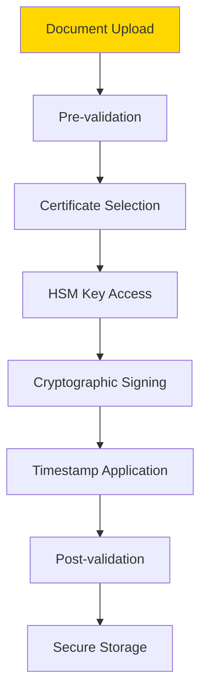
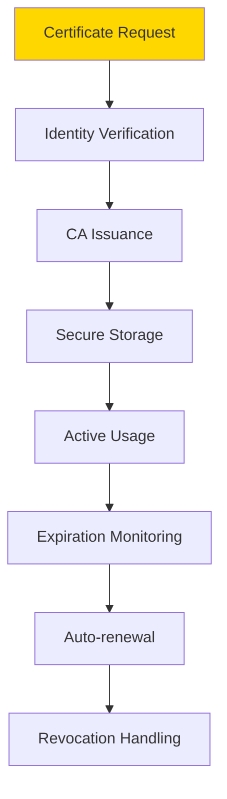
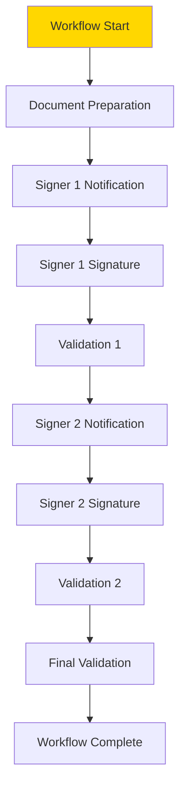
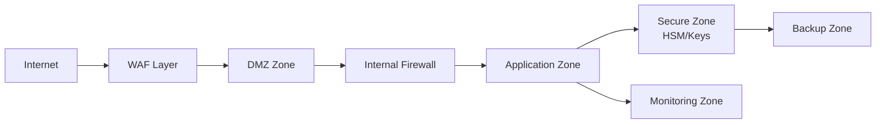

# 00 Architettura UC6 - Firma Digitale Integrata

## Architettura Generale

**UC6 - Firma Digitale Integrata** adotta un'architettura sicura e compliant per la gestione completa del ciclo di vita delle firme digitali, integrandosi con provider esterni e garantendo la validità legale delle operazioni.

```mermaid
graph TB
    subgraph "Client Layer"
        WEB[Web Signature Portal]
        MOBILE[Mobile Signature App]
        API[REST API Integration]
        DESKTOP[Desktop Signature Client]
    end

    subgraph "API Gateway Layer"
        GATEWAY[API Gateway<br/>Kong/Istio]
        AUTH[Auth Service<br/>JWT/OAuth2 + MFA]
        VALIDATE[Signature Validation<br/>Pre-flight]
        RATE[Rate Limiting<br/>Per User/Org]
    end

    subgraph "Microservices Layer"
        SP30[SP30<br/>Digital Signature<br/>Engine]
        SP31[SP31<br/>Certificate<br/>Manager]
        SP32[SP32<br/>Signature<br/>Workflow]
        SP32[SP32<br/>Signature<br/>Validation]

        SP22[SP22<br/>Process Governance]
        SP02[SP02<br/>Document Processor]
        SP07[SP07<br/>Metadata Extractor]
        SP10[SP10<br/>Dashboard Service]
    end

    subgraph "Security Layer"
        HSM[Hardware Security Module<br/>Key Management]
        VAULT[HashiCorp Vault<br/>Secret Management]
        CA[Certificate Authority<br/>Integration]
        TSP[Time Stamp Provider<br/>Legal Timestamping]
    end

    subgraph "Data Layer"
        POSTGRES[(PostgreSQL<br/>Transactional)]
        MONGO[(MongoDB<br/>Signature Metadata)]
        REDIS[(Redis<br/>Session/Cache)]
        ELASTIC[(Elasticsearch<br/>Audit Search)]
        MINIO[(MinIO<br/>Signed Documents)]
    end

    subgraph "External Integrations"
        ARUBA[Aruba Sign<br/>Provider]
        INFOCERT[InfoCert<br/>Provider]
        NAMIRIAL[Namirial<br/>Provider]
        CUSTOM[Custom CA<br/>Integration]
    end

    subgraph "Infrastructure"
        K8S[Kubernetes<br/>Orchestration]
        MONITORING[Prometheus<br/>Monitoring]
        LOGGING[ELK Stack<br/>Logging]
        BACKUP[Automated<br/>Backup]
    end

    WEB --> GATEWAY
    MOBILE --> GATEWAY
    API --> GATEWAY
    DESKTOP --> GATEWAY

    GATEWAY --> AUTH
    AUTH --> SP32$
    AUTH --> SP32$
    AUTH --> SP32
    AUTH --> SP32

    SP32 --> HSM
    SP32 --> CA
    SP32 --> TSP

    SP32 --> POSTGRES
    SP32 --> MONGO
    SP32 --> REDIS
    SP32 --> ELASTIC

    SP32 --> MINIO
    SP32 --> MINIO
    SP32 --> MINIO

    SP32 --> ARUBA
    SP32 --> INFOCERT
    SP32 --> NAMIRIAL
    SP32 --> CUSTOM

    SP32 --> SP22
    SP32 --> SP02
    SP32 --> SP07
    SP32 --> SP10

    K8S --> MONITORING
    MONITORING --> LOGGING
    BACKUP --> MINIO
```



## Componenti Architetturali

### SP32 - Digital Signature Engine
**Responsabilità**: Esecuzione firme digitali e integrazione provider esterni

**Tecnologie**:
- **Crypto Libraries**: OpenSSL, PyCryptodome per operazioni crittografiche
- **HSM Integration**: PKCS#11 per hardware security modules
- **Provider SDKs**: SDK specifici per ciascun provider firma
- **Format Support**: Librerie per PAdES, XAdES, CAdES

**API Endpoints**:
```yaml
POST /api/v1/signatures/sign
  - Input: {
      "document_id": "string",
      "certificate_id": "string",
      "signature_type": "pades|xades|cades",
      "provider": "aruba|infocert"
    }
  - Output: {"signature_id": "string", "status": "completed"}

GET /api/v1/signatures/{id}/status
  - Output: {"status": "pending|completed|failed", "details": {}}
```

### SP32 - Certificate Manager
**Responsabilità**: Gestione completa lifecycle certificati digitali

**Tecnologie**:
- **PKI Libraries**: pyOpenSSL per gestione certificati
- **OCSP/CRL**: Validazione stato certificati online
- **HSM Integration**: Gestione chiavi hardware-secured
- **CA Protocols**: ACME, SCEP per automated certificate management

**API Endpoints**:
```yaml
POST /api/v1/certificates/request
  - Input: {"user_id": "string", "certificate_type": "qualified|advanced"}
  - Output: {"certificate_id": "string", "status": "pending"}

GET /api/v1/certificates/{id}/validate
  - Output: {"valid": true, "chain_valid": true, "revocation_status": "good"}
```

### SP32 - Signature Workflow
**Responsabilità**: Orchestrazione workflow firma multi-firmatari

**Tecnologie**:
- **Workflow Engine**: Custom workflow engine basato su state machines
- **Notification System**: Email/SMS per notifiche firmatari
- **Delegation Logic**: Regole delega firma
- **Escalation Rules**: Gestione scadenze e escalation

**API Endpoints**:
```yaml
POST /api/v1/workflows/signature
  - Input: {
      "document_id": "string",
      "signers": [{"user_id": "string", "order": 1}],
      "deadline": "2024-02-01T00:00:00Z"
    }
  - Output: {"workflow_id": "string", "status": "started"}

POST /api/v1/workflows/{id}/sign
  - Input: {"signer_id": "string", "signature_data": {}}
  - Output: {"status": "completed", "next_signer": "user_456"}
```

### SP32 - Signature Validation
**Responsabilità**: Validazione integrità e legalità firme digitali

**Tecnologie**:
- **Validation Libraries**: DSS Framework per validazione firme
- **Timestamp Validation**: Verifica timestamp legali
- **Blockchain Integration**: Optional per notarization
- **Compliance Engine**: Regole validazione per normative

**API Endpoints**:
```yaml
POST /api/v1/validation/verify
  - Input: {"document_id": "string", "signature_ids": ["sig_1", "sig_2"]}
  - Output: {
      "overall_valid": true,
      "signatures": [
        {"id": "sig_1", "valid": true, "certificate_valid": true}
      ]
    }

GET /api/v1/validation/history/{document_id}
  - Output: {
      "validation_history": [
        {"timestamp": "2024-01-01T10:00:00Z", "result": "valid"}
      ]
    }
```

## Pattern Architetturali

### Secure Signing Pipeline


### Certificate Lifecycle Management


### Multi-signature Workflow


## Sicurezza Architetturale

### Cryptographic Security
- **Key Management**: HSM-backed key storage e operations
- **Algorithm Agility**: Supporto multiple algoritmi crittografici
- **Perfect Forward Secrecy**: Ephemeral keys per sessioni
- **Quantum Resistance**: Preparazione algoritmi post-quantum

### Legal Compliance
- **eIDAS Compliance**: Supporto firme qualificate europee
- **Local Regulations**: Adattamento normative nazionali
- **Timestamp Authority**: Integrazione TSA qualificate
- **Long-term Validation**: Materiale per validazione futura

### Operational Security
- **Zero Trust**: Verifica continua identità e contesto
- **Secure Boot**: Validazione integrità componenti
- **Intrusion Detection**: Monitoraggio anomalie sicurezza
- **Incident Response**: Automated response per security events

## Scalabilità e Performance

### Signature Processing Scale
- **Concurrent Signatures**: 1000+ firme simultanee
- **Document Size**: Supporto documenti fino a 100MB
- **Throughput**: 100 firme/minuto per provider
- **Latency**: <5s per firma semplice, <30s complessa

### Certificate Management Scale
- **Certificate Inventory**: 100k+ certificati gestiti
- **Validation Requests**: 10000 validazioni/minuto
- **CRL Updates**: Real-time certificate status
- **Auto-renewal**: Proactive certificate lifecycle

### Performance Targets
| Componente | Throughput | Latency | Availability |
|------------|------------|---------|--------------|
| SP32 Signature Engine | 1000 sig/min | <30s | 99.9% |
| SP32 Certificate Manager | 10000 val/min | <2s | 99.9% |
| SP32 Signature Workflow | 500 workflows/min | <5s | 99.9% |
| SP32 Signature Validation | 2000 val/min | <10s | 99.9% |

## Deployment Architecture

### High-Security Deployment


### Multi-Provider Integration
- **Provider Abstraction**: Unified API per diversi provider
- **Failover Logic**: Automatic failover tra provider
- **Load Balancing**: Distribuzione load basata su performance
- **Cost Optimization**: Selezione provider basata su costi</content>
<parameter name="filePath">/Users/giangio/Documents/GitHub/Interzen/Interzen.POC/ZenIA/docs/use_cases/UC6 - Firma Digitale Integrata/00 Architettura UC6.md