# SP29 - Digital Signature Engine

## Panoramica

**SP31 - Digital Signature Engine** è il componente core che esegue le operazioni di firma digitale, gestendo l'integrazione con provider esterni e garantendo la sicurezza crittografica delle operazioni.

```mermaid
graph LR
    DOCUMENTS[Documenti da Firmare] --> SP30[SP30<br/>Digital Signature Engine]
    CERTIFICATES[Certificati] --> SP31$
    PROVIDERS[Signature Providers] --> SP31$

    SP31 --> SIGNED[Signed Documents]
    SP31 --> METADATA[Signature Metadata]
    SP31 --> AUDIT[Registro di Audit]

    SP31 --> SP32[SP32<br/>Signature Workflow]
    SP31 --> SP32[SP32<br/>Autorità di Marca Temporale]
    SP31 --> SP10[SP10<br/>Dashboard]

    SP31 -.-> HSM[(Hardware Security<br/>Module)]
    SP31 -.-> VAULT[(HashiCorp<br/>Vault)]
    SP31 -.-> PROVIDER_API[(Provider<br/>APIs)]
    SP31 -.-> CRYPTO[(Crypto<br/>Libraries)]

    style SP31 fill:#ffd700
```



## Responsabilità

### Core Functions

1. **Signature Execution**
   - Esecuzione firme digitali crittografiche
   - Supporto multi-formato (PAdES, XAdES, CAdES)
   - Integrazione provider firma esterni

2. **Provider Orchestration**
   - Gestione connessioni multiple provider
   - Load balancing e failover
   - Normalizzazione risposte provider

3. **Cryptographic Operations**
   - Gestione chiavi crittografiche
   - Hash calculation e verification
   - Timestamp application

4. **Security & Compliance**
   - Validazione certificati in tempo reale
   - Audit logging completo operazioni
   - Compliance con standard sicurezza
## 🏛️ Conformità Normativa - SP29

### 1. Quadro Normativo di Riferimento

**Framework applicabili a SP29 (Motore Firma Digitale)**:
- **CAD** (Codice Amministrazione Digitale): Art. 1, 13, 21-22, 62
- **eIDAS** (Regolamento 2014/910): Art. 3, 8, 24-27

**UC di Appartenenza**: UC6

---

### 2. Conformità CAD

**Applicabilità**: OBBLIGATORIO per tutti gli SP - SP29 è parte della trasformazione digitale PA

**Articoli CAD Principali**:
- Art. 1: Principi digitalizzazione
- Art. 13: Fascicolo informatico
- Art. 21-22: Documento informatico e conservazione
- Art. 62: Interoperabilità via API
- Art. 71: Accessibilità

**Responsabile**: CTO + Compliance Team (audit trimestrale)

---

### 4. Conformità eIDAS

**Applicabilità**: OBBLIGATORIO per SP29 - gestisce firme digitali

**Elementi chiave**:
- Firma Qualificata: CAdES/XAdES con timestamp RFC 3161
- Livello Assicurazione: Identificazione ALTO, Autenticazione SOSTANZIALE
- TSP (Provider di Servizi Fiduciari): Provider autorizzati AGID (InfoCert, Aruba, etc.)
- Certificati X.509: Chain validation fino a trusted root CA
- Non-repudiation: Timestamp marca temporale opponibile in giudizio

**Responsabile**: Security Team + Legal (compliance eIDAS)

---

### 6. Monitoraggio Conformità

**Schedule di Review**:
- **Trimestrale**: Compliance assessment + security audit
- **Semestrale**: Framework alignment review (CAD/GDPR/eIDAS/AGID)
- **Annuale**: Full compliance audit + risk assessment

**KPI Conformità**:
- Audit trail completeness: 100%
- Incident response time: <24h
- Compliance violations: 0 per quarter
- Certificate expiry (if eIDAS): Alert at 30 days

**Escalation**: Non-conformità → Compliance Manager → CTO → Legal

**Prossima review programmata**: 2026-02-17

---

## Riepilogo Conformità SP29

**Status**: ✅ COMPLIANT

| Framework | Applicabile | Status | Responsabile |
|-----------|-----------|--------|-------------|
| CAD | ✅ Sì | ✅ Compliant | CTO |
| GDPR | ❌ No | N/A | - |
| eIDAS | ✅ Sì | ✅ Compliant | Security Lead |
| AGID | ❌ No | N/A | - |

**Key Compliance Points**:
1. All CAD articles implemented
2. Data handling compliant with applicable regulations
3. Security controls in place (encryption, access control, audit logging)
4. Regular monitoring and review schedule established
5. Clear responsibility assignments (RACI)

**Prossima Review**: 2026-02-17

---


### Framework Normativi Applicabili

☑ eIDAS
☑ CAD
☐ L. 241/1990 - Procedimento Amministrativo
☐ GDPR - Regolamento 2016/679
☐ AI Act - Regolamento 2024/1689
☐ D.Lgs 42/2004 - Codice Beni Culturali
☐ D.Lgs 152/2006 - Codice dell'Ambiente
☐ D.Lgs 33/2013 - Decreto Trasparenza

**Per mappatura completa articoli → implementazioni**, vedi [Conformità Normativa Standard Template](../../templates/conformita-normativa-standard.md) e [COMPLIANCE-MATRIX.md](../../COMPLIANCE-MATRIX.md).

### Requisiti Principali Implementati

| Framework | Requisiti Principali | Status | Riferimenti |
|-----------|-------------------|--------|-------------|
| eIDAS | Art. 3, Art. 13 | ✅ Implementato | [Dettagli](../../templates/conformita-normativa-standard.md) |
| CAD | Art. 1, Art. 21, Art. 22, Art. 62 | ✅ Implementato | [Dettagli](../../templates/conformita-normativa-standard.md) |

### Conformità Normativa - Checklist

- [ ] Tutti i framework normativi applicabili identificati
- [ ] Articoli rilevanti mappati alle responsabilità SP
- [ ] GDPR: Data protection by design implementato (se applicabile)
- [ ] eIDAS: Firma digitale supportata (se applicabile)
- [ ] AI Act: Supervisione umana e trasparenza (se applicabile)
- [ ] Tracciabilità audit completa mantenuta
- [ ] Documentation conformità aggiornata

**Nota**: Dettagli di conformità completi nella sezione "## 🏛️ Conformità Normativa - SP29

### 1. Quadro Normativo di Riferimento

**Framework applicabili a SP29 (Motore Firma Digitale)**:
- **CAD** (Codice Amministrazione Digitale): Art. 1, 13, 21-22, 62
- **eIDAS** (Regolamento 2014/910): Art. 3, 8, 24-27

**UC di Appartenenza**: UC6

---

### 2. Conformità CAD

**Applicabilità**: OBBLIGATORIO per tutti gli SP - SP29 è parte della trasformazione digitale PA

**Articoli CAD Principali**:
- Art. 1: Principi digitalizzazione
- Art. 13: Fascicolo informatico
- Art. 21-22: Documento informatico e conservazione
- Art. 62: Interoperabilità via API
- Art. 71: Accessibilità

**Responsabile**: CTO + Compliance Team (audit trimestrale)

---

### 4. Conformità eIDAS

**Applicabilità**: OBBLIGATORIO per SP29 - gestisce firme digitali

**Elementi chiave**:
- Firma Qualificata: CAdES/XAdES con timestamp RFC 3161
- Livello Assicurazione: Identificazione ALTO, Autenticazione SOSTANZIALE
- TSP (Provider di Servizi Fiduciari): Provider autorizzati AGID (InfoCert, Aruba, etc.)
- Certificati X.509: Chain validation fino a trusted root CA
- Non-repudiation: Timestamp marca temporale opponibile in giudizio

**Responsabile**: Security Team + Legal (compliance eIDAS)

---

### 6. Monitoraggio Conformità

**Schedule di Review**:
- **Trimestrale**: Compliance assessment + security audit
- **Semestrale**: Framework alignment review (CAD/GDPR/eIDAS/AGID)
- **Annuale**: Full compliance audit + risk assessment

**KPI Conformità**:
- Audit trail completeness: 100%
- Incident response time: <24h
- Compliance violations: 0 per quarter
- Certificate expiry (if eIDAS): Alert at 30 days

**Escalation**: Non-conformità → Compliance Manager → CTO → Legal

**Prossima review programmata**: 2026-02-17

---

## Riepilogo Conformità SP29

**Status**: ✅ COMPLIANT

| Framework | Applicabile | Status | Responsabile |
|-----------|-----------|--------|-------------|
| CAD | ✅ Sì | ✅ Compliant | CTO |
| GDPR | ❌ No | N/A | - |
| eIDAS | ✅ Sì | ✅ Compliant | Security Lead |
| AGID | ❌ No | N/A | - |

**Key Compliance Points**:
1. All CAD articles implemented
2. Data handling compliant with applicable regulations
3. Security controls in place (encryption, access control, audit logging)
4. Regular monitoring and review schedule established
5. Clear responsibility assignments (RACI)

**Prossima Review**: 2026-02-17

---


---


## Architettura Tecnica

### Signature Pipeline


### Tecnologie Utilizzate

| Componente | Tecnologia | Versione | Scopo |
|------------|------------|----------|--------|
| Crypto Engine | OpenSSL | 3.1 | Operazioni crittografiche |
| HSM Interface | PKCS#11 | 2.40 | Hardware security modules |
| Provider SDK | Custom SDKs | Latest | Integrazione provider |
| PDF Processing | PyPDF2 + ReportLab | 3.0 | Manipolazione PDF |
| Timestamp | RFC 3161 | Standard | Timestamp legale |

### Formati Firma Supportati

#### PAdES (PDF Advanced Electronic Signatures)
```
- PAdES-Basic: Firma digitale semplice
- PAdES-Enhanced: Con timestamp e revocation info
- PAdES-LTV: Long-term validation support
- Compliance: ETSI EN 319 142
```

#### XAdES (XML Advanced Electronic Signatures)
```
- XAdES-BES: Basic electronic signature
- XAdES-EPES: Explicit policy electronic signature
- XAdES-T: With timestamp
- XAdES-X-L: Long-term validation
```

#### CAdES (CMS Advanced Electronic Signatures)
```
- CAdES-BES: Basic electronic signature
- CAdES-EPES: Explicit policy based
- CAdES-T: Timestamped signature
- CAdES-C: Complete validation data
```

### API Endpoints

```yaml
POST /api/v1/signatures/sign
  - Input: {
      "document_id": "string",
      "certificate_id": "string",
      "signature_type": "pades_bes|xades_t|cades_c",
      "provider": "aruba|infocert|namirial",
      "parameters": {
        "appearance": {"page": 1, "x": 100, "y": 200},
        "timestamp": true,
        "ltv": true
      }
    }
  - Output: {
      "signature_id": "string",
      "status": "completed",
      "signed_document_url": "string",
      "signature_metadata": {}
    }

GET /api/v1/signatures/{id}/status
  - Output: {
      "status": "pending|processing|completed|failed",
      "progress": 0.75,
      "error_message": "string",
      "provider_response": {}
    }

POST /api/v1/signatures/batch
  - Input: {
      "documents": ["doc1.pdf", "doc2.pdf"],
      "certificate_id": "string",
      "signature_type": "pades_bes"
    }
  - Output: {"batch_id": "string", "estimated_completion": "5min"}

GET /api/v1/signatures/providers
  - Output: {
      "providers": [
        {"id": "aruba", "name": "Aruba Sign", "status": "active"},
        {"id": "infocert", "name": "InfoCert", "status": "active"}
      ]
    }
```

### Configurazione

```yaml
sp28:
  crypto:
    hash_algorithm: 'SHA256'
    signature_algorithm: 'RSA-PSS'
    key_size: 2048
  hsm:
    enabled: true
    provider: 'utimaco'
    key_store: '/opt/hsm/keys'
  providers:
    aruba:
      api_url: 'https://sign.aruba.it/api/v1'
      timeout: '30s'
      retry_attempts: 3
    infocert:
      api_url: 'https://sign.infocert.it/api/v1'
      timeout: '30s'
      retry_attempts: 3
  timestamp:
    tsa_url: 'http://tsa.example.com'
    username: 'tsa_user'
    password: 'encrypted_password'
  cache:
    signature_cache_ttl: 3600
    certificate_cache_ttl: 300
```

### Performance Metrics

- **Signature Speed**: <5s per firma semplice, <30s complessa
- **Throughput**: 100 firme/minuto per provider
- **Concurrent Operations**: 1000+ firme simultanee
- **Provider Reliability**: >99.5% uptime aggregato

### Sicurezza

- **Key Security**: Chiavi mai esposte in chiaro
- **HSM Integration**: Operazioni crittografiche in hardware sicuro
- **Provider Authentication**: mTLS per connessioni provider
- **Audit Logging**: Log immutabile tutte operazioni firma

### Evoluzione

1. **Quantum-Safe**: Supporto algoritmi post-quantum
2. **Blockchain Integration**: Notarization su blockchain
3. **AI-Powered Verification**: Validazione intelligente firme</content>
<parameter name="filePath">/Users/giangio/Documents/GitHub/Interzen/Interzen.POC/ZenIA/docs/use_cases/UC6 - Firma Digitale Integrata/01 SP31 - Digital Signature Engine.md