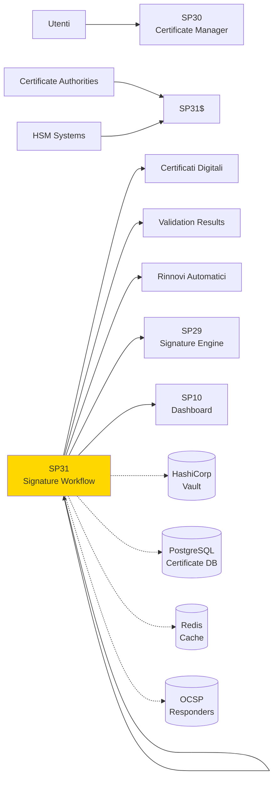
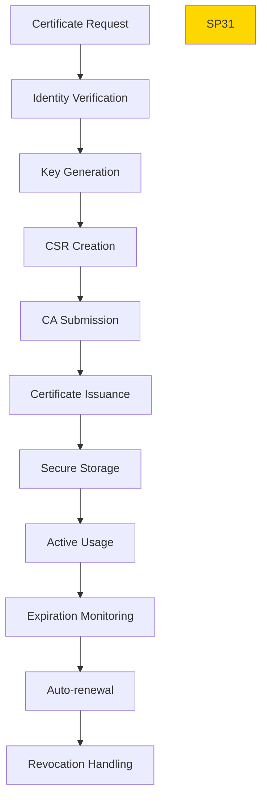

# SP30 - Certificate Manager

## Panoramica

**SP31 - Certificate Manager** gestisce l'intero lifecycle dei certificati digitali, dalla richiesta alla revoca, garantendo la validità e sicurezza delle credenziali di firma.



## Responsabilità

### Core Functions

1. **Certificate Lifecycle**
   - Richiesta e emissione certificati
   - Rinnovo automatico prima scadenza
   - Revoca sicura quando necessario

2. **Validation Services**
   - Verifica catena fiducia certificati
   - Controllo revoca via OCSP/CRL
   - Validazione real-time stato certificati

3. **Key Management**
   - Generazione e storage sicuro chiavi
   - Rotazione periodica chiavi
   - Backup crittografato chiavi

4. **CA Integration**
   - Integrazione multiple Certificate Authority
   - Gestione profili certificato diversi
   - Automazione processi CA
## 🏛️ Conformità Normativa

### Framework Normativi Applicabili

☑ eIDAS
☑ CAD
☐ L. 241/1990 - Procedimento Amministrativo
☐ GDPR - Regolamento 2016/679
☐ AI Act - Regolamento 2024/1689
☐ D.Lgs 42/2004 - Codice Beni Culturali
☐ D.Lgs 152/2006 - Codice dell'Ambiente
☐ D.Lgs 33/2013 - Decreto Trasparenza

**Per mappatura completa articoli → implementazioni**, vedi [Conformità Normativa Standard Template](../../templates/conformita-normativa-standard.md) e [COMPLIANCE-MATRIX.md](../../COMPLIANCE-MATRIX.md).

### Requisiti Principali Implementati

| Framework | Requisiti Principali | Status | Riferimenti |
|-----------|-------------------|--------|-------------|
| eIDAS | Art. 3, Art. 13 | ✅ Implementato | [Dettagli](../../templates/conformita-normativa-standard.md) |
| CAD | Art. 1, Art. 21, Art. 22, Art. 62 | ✅ Implementato | [Dettagli](../../templates/conformita-normativa-standard.md) |

### Conformità Normativa - Checklist

- [ ] Tutti i framework normativi applicabili identificati
- [ ] Articoli rilevanti mappati alle responsabilità SP
- [ ] GDPR: Data protection by design implementato (se applicabile)
- [ ] eIDAS: Firma digitale supportata (se applicabile)
- [ ] AI Act: Supervisione umana e trasparenza (se applicabile)
- [ ] Tracciabilità audit completa mantenuta
- [ ] Documentation conformità aggiornata

**Nota**: Dettagli di conformità completi nella sezione "## 🏛️ Conformità Normativa" del template standard.

---


## Architettura Tecnica

### Certificate Lifecycle



### Tecnologie Utilizzate

| Componente | Tecnologia | Versione | Scopo |
|------------|------------|----------|--------|
| PKI Library | pyOpenSSL | 23.2 | Gestione certificati |
| HSM Interface | PKCS#11 | 2.40 | Hardware security modules |
| Key Vault | HashiCorp Vault | 1.13 | Secure key storage |
| OCSP Client | ocsp | 1.0 | Certificate validation |
| ACME Client | acme | 2.6 | Automated certificates |

### Tipi Certificato Supportati

#### Qualified Certificates (eIDAS)
```
- QCP: Qualified Certificate for electronic signatures
- QCP-web: Qualified Certificate for website authentication
- Validity: 1-3 years based on regulation
- Requirements: Face-to-face identity verification
```

#### Advanced Certificates
```
- AATL: Advanced electronic signature with timestamp
- AATL+LT: With long-term validation
- Validity: 1-2 years
- Requirements: Remote identity verification
```

### API Endpoints

```yaml
POST /api/v1/certificates/request
  - Input: {
      "user_id": "string",
      "certificate_type": "qualified|advanced",
      "key_type": "rsa_2048|ecdsa_p256",
      "validity_years": 2,
      "ca_provider": "aruba|infocert|custom",
      "profile": "signature|authentication"
    }
  - Output: {
      "certificate_id": "string",
      "status": "pending",
      "estimated_completion": "24h",
      "request_id": "string"
    }

GET /api/v1/certificates/{id}
  - Output: {
      "certificate_id": "string",
      "status": "active|expired|revoked",
      "subject": "CN=John Doe,O=Company",
      "issuer": "CN=CA Name",
      "valid_from": "2024-01-01",
      "valid_to": "2026-01-01",
      "serial_number": "1234567890"
    }

POST /api/v1/certificates/{id}/renew
  - Input: {"validity_years": 2}
  - Output: {"renewal_id": "string", "status": "processing"}

POST /api/v1/certificates/{id}/revoke
  - Input: {"reason": "key_compromise|superseded"}
  - Output: {"revocation_id": "string", "status": "completed"}

GET /api/v1/certificates/validate
  - Query: ?certificate_pem=<pem_data>&checks=chain,revocation,expiration
  - Output: {
      "valid": true,
      "checks": {
        "chain": {"valid": true, "trusted_ca": true},
        "revocation": {"status": "good", "checked_at": "2024-01-15T10:00:00Z"},
        "expiration": {"valid": true, "days_remaining": 365}
      }
    }
```

### Configurazione

```yaml
sp29:
  hsm:
    enabled: true
    provider: 'utimaco'
    key_store_path: '/opt/hsm/certificates'
  vault:
    url: 'https://vault.example.com'
    mount_path: 'certificates'
    token_renewal: '24h'
  ca_providers:
    aruba:
      api_url: 'https://ca.aruba.it/api/v1'
      supported_types: ['qualified', 'advanced']
    custom:
      api_url: 'https://ca.company.com/api/v1'
      client_cert: '/certs/client.pem'
  validation:
    ocsp_timeout: '10s'
    crl_cache_ttl: 3600
    max_chain_depth: 10
  monitoring:
    expiration_alert_days: [30, 7, 1]
    renewal_lead_time: '30d'
```

### Performance Metrics

- **Certificate Issuance**: <24h per certificato qualificato
- **Validation Speed**: <2s per validazione completa
- **Concurrent Requests**: 1000+ richieste simultanee
- **Uptime CA Integration**: >99.9%

### Sicurezza

- **Key Protection**: Chiavi mai esposte, solo in HSM
- **Certificate Pinning**: Validazione catena fiducia rigorosa
- **Revocation Monitoring**: Alert immediati per certificati revocati
- **Audit Trail**: Log completo tutte operazioni certificato

### Evoluzione

1. **Quantum-Resistant Keys**: Supporto algoritmi post-quantum
2. **Decentralized Identity**: Integrazione DID e verifiable credentials
3. **AI-Based Validation**: Machine learning per detection fraud</content>
<parameter name="filePath">/Users/giangio/Documents/GitHub/Interzen/Interzen.POC/ZenIA/docs/use_cases/UC6 - Firma Digitale Integrata/01 SP31 - Certificate Manager.md