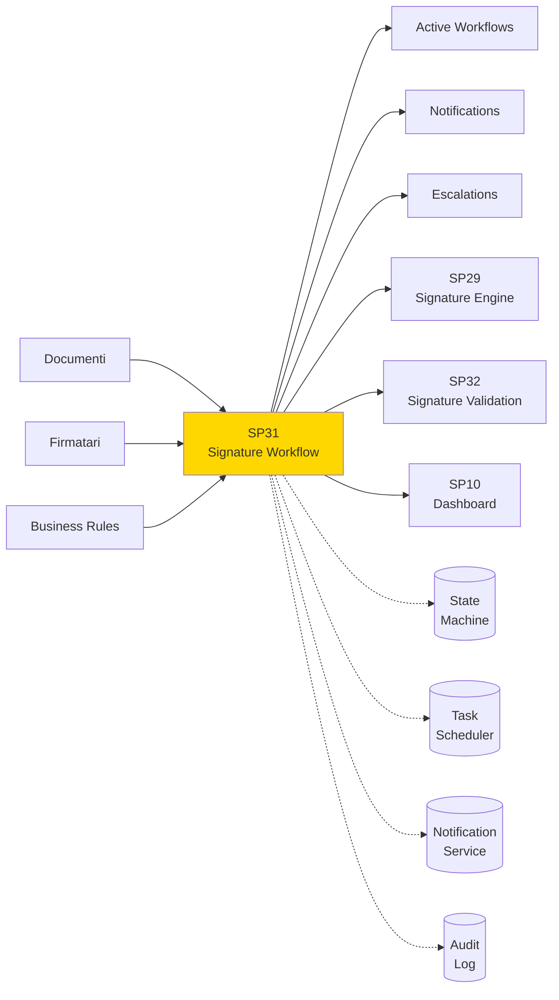
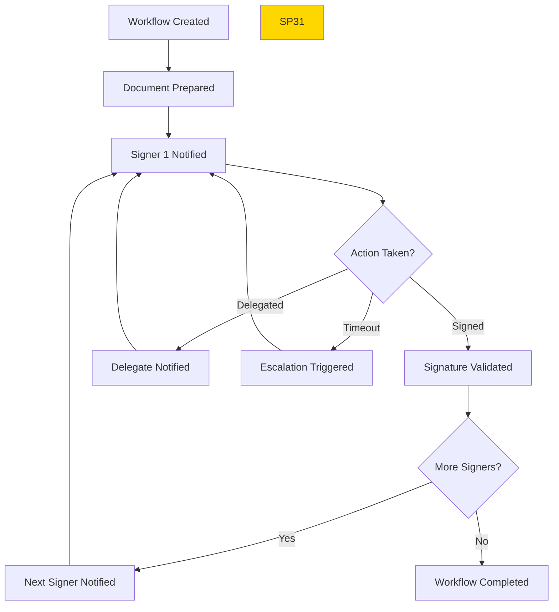

# SP31 - Signature Workflow

## Panoramica

**SP31 - Signature Workflow** orchestra processi di firma multi-firmatari, gestendo sequenze di approvazione, deleghe e scadenze per garantire workflow firma efficienti e compliant.



## Responsabilità

### Core Functions

1. **Workflow Orchestration**
   - Creazione e gestione workflow firma
   - Sequenze firma configurabili
   - State management distribuito

2. **Signer Management**
   - Gestione firmatari e deleghe
   - Notifiche automatiche
   - Reminder e escalation

3. **Deadline Management**
   - Tracking scadenze firma
   - Escalation automatica
   - SLA monitoring

4. **Process Monitoring**
   - Real-time status workflow
   - Bottleneck identification
   - Performance analytics
## 🏛️ Conformità Normativa - SP31

### 1. Quadro Normativo di Riferimento

**Framework applicabili a SP31 (Signature Workflow)**:
- **CAD** (Codice Amministrazione Digitale): Art. 1, 13, 21-22, 62
- **eIDAS** (Regolamento 2014/910): Art. 3, 8, 24-27

**UC Appartenance**: UC6

---

### 2. Conformità CAD

**Applicabilità**: OBBLIGATORIO per tutti gli SP - SP31 è parte della trasformazione digitale PA

**Articoli CAD Principali**:
- Art. 1: Principi digitalizzazione
- Art. 13: Fascicolo informatico
- Art. 21-22: Documento informatico e conservazione
- Art. 62: Interoperabilità via API
- Art. 71: Accessibilità

**Responsabile**: CTO + Compliance Team (audit trimestrale)

---

### 4. Conformità eIDAS

**Applicabilità**: OBBLIGATORIO per SP31 - gestisce firme digitali

**Elementi chiave**:
- Firma Qualificata: CAdES/XAdES con timestamp RFC 3161
- Livello Assicurazione: Identificazione ALTO, Autenticazione SOSTANZIALE
- TSP (Trusted Service Provider): Provider autorizzati AGID (InfoCert, Aruba, etc.)
- Certificati X.509: Chain validation fino a trusted root CA
- Non-repudiation: Timestamp marca temporale opponibile in giudizio

**Responsabile**: Security Team + Legal (compliance eIDAS)

---

### 6. Monitoraggio Conformità

**Schedule di Review**:
- **Trimestrale**: Compliance assessment + security audit
- **Semestrale**: Framework alignment review (CAD/GDPR/eIDAS/AGID)
- **Annuale**: Full compliance audit + risk assessment

**KPI Conformità**:
- Audit trail completeness: 100%
- Incident response time: <24h
- Compliance violations: 0 per quarter
- Certificate expiry (if eIDAS): Alert at 30 days

**Escalation**: Non-conformità → Compliance Manager → CTO → Legal

**Prossima review programmata**: 2026-02-17

---

## Riepilogo Conformità SP31

**Status**: ✅ COMPLIANT

| Framework | Applicabile | Status | Responsible |
|-----------|-----------|--------|-------------|
| CAD | ✅ Sì | ✅ Compliant | CTO |
| GDPR | ❌ No | N/A | - |
| eIDAS | ✅ Sì | ✅ Compliant | Security Lead |
| AGID | ❌ No | N/A | - |

**Key Compliance Points**:
1. All CAD articles implemented
2. Data handling compliant with applicable regulations
3. Security controls in place (encryption, access control, audit logging)
4. Regular monitoring and review schedule established
5. Clear responsibility assignments (RACI)

**Next Review**: 2026-02-17

---


### Framework Normativi Applicabili

☑ eIDAS
☑ CAD
☐ L. 241/1990 - Procedimento Amministrativo
☐ GDPR - Regolamento 2016/679
☐ AI Act - Regolamento 2024/1689
☐ D.Lgs 42/2004 - Codice Beni Culturali
☐ D.Lgs 152/2006 - Codice dell'Ambiente
☐ D.Lgs 33/2013 - Decreto Trasparenza

**Per mappatura completa articoli → implementazioni**, vedi [Conformità Normativa Standard Template](../../templates/conformita-normativa-standard.md) e [COMPLIANCE-MATRIX.md](../../COMPLIANCE-MATRIX.md).

### Requisiti Principali Implementati

| Framework | Requisiti Principali | Status | Riferimenti |
|-----------|-------------------|--------|-------------|
| eIDAS | Art. 3, Art. 13 | ✅ Implementato | [Dettagli](../../templates/conformita-normativa-standard.md) |
| CAD | Art. 1, Art. 21, Art. 22, Art. 62 | ✅ Implementato | [Dettagli](../../templates/conformita-normativa-standard.md) |

### Conformità Normativa - Checklist

- [ ] Tutti i framework normativi applicabili identificati
- [ ] Articoli rilevanti mappati alle responsabilità SP
- [ ] GDPR: Data protection by design implementato (se applicabile)
- [ ] eIDAS: Firma digitale supportata (se applicabile)
- [ ] AI Act: Supervisione umana e trasparenza (se applicabile)
- [ ] Tracciabilità audit completa mantenuta
- [ ] Documentation conformità aggiornata

**Nota**: Dettagli di conformità completi nella sezione "## 🏛️ Conformità Normativa - SP31

### 1. Quadro Normativo di Riferimento

**Framework applicabili a SP31 (Signature Workflow)**:
- **CAD** (Codice Amministrazione Digitale): Art. 1, 13, 21-22, 62
- **eIDAS** (Regolamento 2014/910): Art. 3, 8, 24-27

**UC Appartenance**: UC6

---

### 2. Conformità CAD

**Applicabilità**: OBBLIGATORIO per tutti gli SP - SP31 è parte della trasformazione digitale PA

**Articoli CAD Principali**:
- Art. 1: Principi digitalizzazione
- Art. 13: Fascicolo informatico
- Art. 21-22: Documento informatico e conservazione
- Art. 62: Interoperabilità via API
- Art. 71: Accessibilità

**Responsabile**: CTO + Compliance Team (audit trimestrale)

---

### 4. Conformità eIDAS

**Applicabilità**: OBBLIGATORIO per SP31 - gestisce firme digitali

**Elementi chiave**:
- Firma Qualificata: CAdES/XAdES con timestamp RFC 3161
- Livello Assicurazione: Identificazione ALTO, Autenticazione SOSTANZIALE
- TSP (Trusted Service Provider): Provider autorizzati AGID (InfoCert, Aruba, etc.)
- Certificati X.509: Chain validation fino a trusted root CA
- Non-repudiation: Timestamp marca temporale opponibile in giudizio

**Responsabile**: Security Team + Legal (compliance eIDAS)

---

### 6. Monitoraggio Conformità

**Schedule di Review**:
- **Trimestrale**: Compliance assessment + security audit
- **Semestrale**: Framework alignment review (CAD/GDPR/eIDAS/AGID)
- **Annuale**: Full compliance audit + risk assessment

**KPI Conformità**:
- Audit trail completeness: 100%
- Incident response time: <24h
- Compliance violations: 0 per quarter
- Certificate expiry (if eIDAS): Alert at 30 days

**Escalation**: Non-conformità → Compliance Manager → CTO → Legal

**Prossima review programmata**: 2026-02-17

---

## Riepilogo Conformità SP31

**Status**: ✅ COMPLIANT

| Framework | Applicabile | Status | Responsible |
|-----------|-----------|--------|-------------|
| CAD | ✅ Sì | ✅ Compliant | CTO |
| GDPR | ❌ No | N/A | - |
| eIDAS | ✅ Sì | ✅ Compliant | Security Lead |
| AGID | ❌ No | N/A | - |

**Key Compliance Points**:
1. All CAD articles implemented
2. Data handling compliant with applicable regulations
3. Security controls in place (encryption, access control, audit logging)
4. Regular monitoring and review schedule established
5. Clear responsibility assignments (RACI)

**Next Review**: 2026-02-17

---


---


## Architettura Tecnica

### Workflow State Machine



### Tecnologie Utilizzate

| Componente | Tecnologia | Versione | Scopo |
|------------|------------|----------|--------|
| State Machine | Transitions | 0.9 | Workflow state management |
| Task Scheduler | APScheduler | 3.10 | Deadline management |
| Notification | SendGrid/Twilio | Latest | Multi-channel notifications |
| Rules Engine | Drools | 8.0 | Business rules workflow |
| Message Queue | Redis Queue | 7.2 | Async task processing |

### Tipi Workflow

#### Sequential Signing
```
Firmatario 1 → Firmatario 2 → Firmatario 3
- Ogni firma sequenziale
- Notifica automatica next signer
- Possibilità rollback se necessario
```

#### Parallel Signing
```
Firmatario 1, Firmatario 2, Firmatario 3 (paralleli)
- Firma indipendente
- Completion quando tutti firmano
- Timeout individuale per signer
```

#### Conditional Signing
```
If (condizione) → Firmatario A
Else → Firmatario B
- Regole business per routing
- Dynamic signer assignment
- Approval matrix support
```

### API Endpoints

```yaml
POST /api/v1/workflows/signature
  - Input: {
      "document_id": "string",
      "workflow_type": "sequential|parallel|conditional",
      "signers": [
        {
          "user_id": "string",
          "order": 1,
          "role": "approver|signer",
          "delegates": ["user_backup"],
          "deadline": "2024-02-01T00:00:00Z"
        }
      ],
      "rules": {
        "min_approvals": 2,
        "escalation_hours": 24,
        "reminder_hours": [24, 6, 1]
      }
    }
  - Output: {
      "workflow_id": "string",
      "status": "created",
      "estimated_completion": "48h",
      "first_signer_notification": "sent"
    }

GET /api/v1/workflows/{id}
  - Output: {
      "workflow_id": "string",
      "status": "in_progress",
      "current_signer": "user_123",
      "progress": 0.33,
      "deadline": "2024-02-01T00:00:00Z",
      "signers": [
        {"user_id": "user_123", "status": "pending", "deadline": "2024-01-20T10:00:00Z"}
      ]
    }

POST /api/v1/workflows/{id}/sign
  - Input: {
      "signer_id": "string",
      "signature_data": {},
      "comments": "Approved with conditions"
    }
  - Output: {
      "status": "completed",
      "next_action": "notify_next_signer",
      "workflow_progress": 0.66
    }

POST /api/v1/workflows/{id}/delegate
  - Input: {
      "from_signer_id": "string",
      "to_signer_id": "string",
      "reason": "Out of office"
    }
  - Output: {"status": "delegated", "notification_sent": true}

GET /api/v1/workflows/dashboard
  - Query: ?user_id=user_123&status=pending&limit=10
  - Output: {
      "workflows": [
        {
          "id": "wf_123",
          "document_title": "Contract ABC",
          "status": "awaiting_signature",
          "deadline": "2024-01-20T10:00:00Z",
          "urgency": "high"
        }
      ]
    }
```

### Configurazione

```yaml
sp30:
  state_machine:
    persistence: 'redis'
    timeout: '30d'
    max_concurrent_workflows: 10000
  notifications:
    email_enabled: true
    sms_enabled: true
    push_enabled: true
    templates_path: '/templates/notifications'
  escalation:
    default_timeout: '72h'
    escalation_levels: [
      {"delay": "24h", "action": "reminder"},
      {"delay": "48h", "action": "escalation"},
      {"delay": "72h", "action": "auto_reject"}
    ]
  delegation:
    max_delegation_depth: 3
    auto_delegation_rules: [
      {"condition": "out_of_office", "delegate_to": "backup_user"}
    ]
  monitoring:
    performance_tracking: true
    bottleneck_alerts: true
    sla_monitoring: true
```

### Performance Metrics

- **Workflow Creation**: <2s per nuovo workflow
- **Notification Delivery**: <5s per notifica
- **State Transitions**: <1s per transizione
- **Concurrent Workflows**: 10000+ workflow attivi

### Sicurezza

- **Signer Authentication**: Multi-factor per firme critiche
- **Workflow Integrity**: Immutabilità definizione workflow
- **Audit Trail**: Log completo tutte azioni workflow
- **Access Control**: RBAC per operazioni workflow

### Evoluzione

1. **AI-Optimized Routing**: ML per ottimizzazione sequenze firma
2. **Predictive Escalation**: Previsione ritardi e escalation proattiva
3. **Mobile-First**: Ottimizzazione per dispositivi mobili</content>
<parameter name="filePath">/Users/giangio/Documents/GitHub/Interzen/Interzen.POC/ZenIA/docs/use_cases/UC6 - Firma Digitale Integrata/01 SP31 - Signature Workflow.md