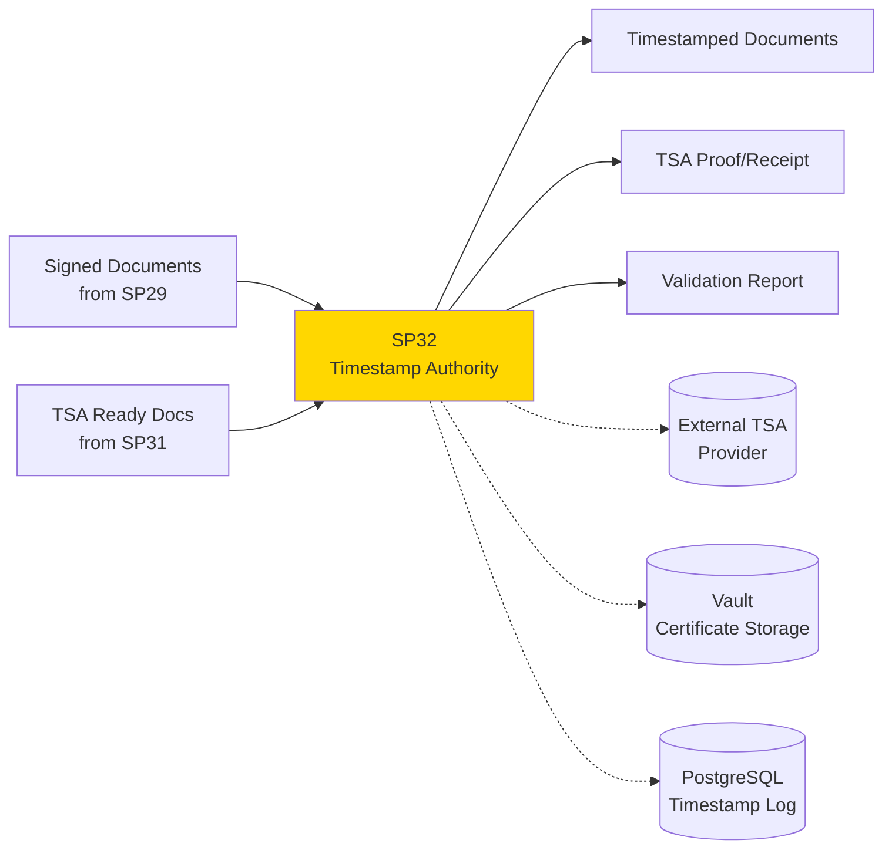
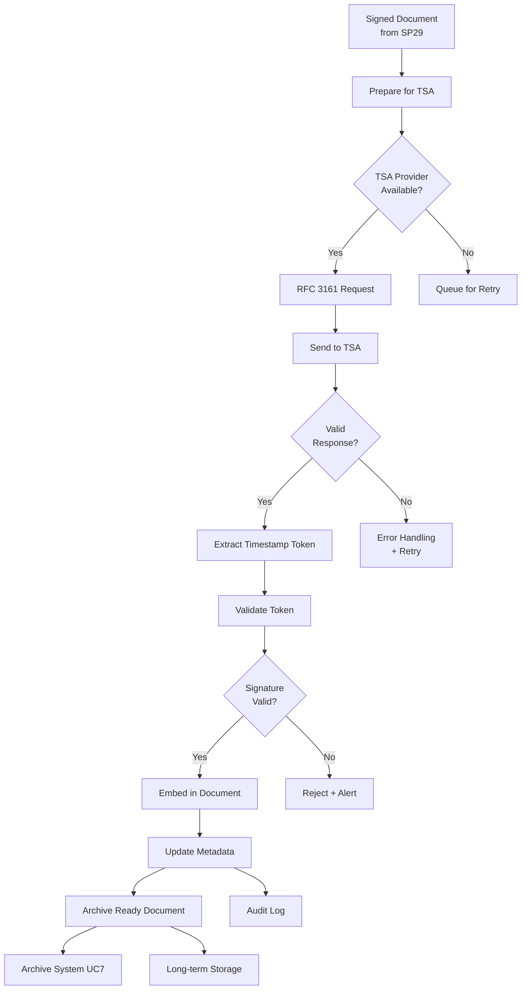

# SP32 - Timestamp Authority & Temporal Marking

## 1. Informazioni Generali

| Proprietà | Valore |
|---|---|
| **Numero SP** | SP32 |
| **Nome** | Timestamp Authority & Temporal Marking Manager |
| **Caso d'Uso** | UC6 - Firma Digitale Integrata |
| **Categoria** | Core Security |
| **MS Primario** | **MS13** Generic Security Engine |
| **MS Supporto** | **MS04** Generic Validator Engine, **MS14** Generic Audit Engine |
| **Status** | In Design |

## 2. Panoramica

**Scopo**: Applicare marcature temporali legalmente valide alle firme digitali, garantendo non-ripudio temporale e conformità alle normative sulla conservazione digitale.



**Business Value**:
- **Legal Validity**: Marcatura temporale obbligatoria per conformità CAD/eIDAS
- **Non-Repudiation**: Prove legale del timestamp della firma
- **Audit Trail**: Tracciabilità completa per conservazione digitale
- **Compliance**: Soddisfa requisiti AgID per conservazione documenti

## 3. Responsabilità Principali

1. **Timestamp Generation**
   - Richieste a Time Stamp Authority (TSA) esterni
   - Generazione proof-of-time legalmente valide
   - Supporto format RFC 3161 (standard IETF)
   - Validazione risposte TSA

2. **Certificate Management**
   - Gestione certificati TSA
   - Chain-of-trust validation
   - Revocation checking (CRL/OCSP)
   - Certificate pinning per security

3. **Temporal Proof Attachment**
   - Incorporamento timestamp nei documenti
   - Supporto XAdES-T (ETSI standard)
   - Metadata tracking del timestamp
   - Long-term validation (XAdES-XL format)

4. **Audit & Compliance**
   - Logging completo operazioni TSA
   - Tracciamento richieste/risposte
   - Compliance reporting (CAD, AgID)
   - Non-repudiation evidence

## 4. Input/Output

### Input
| Nome | Tipo | Fonte | Formato | Note |
|---|---|---|---|---|
| **Signed Documents** | Digital documents | SP31 Digital Signature Engine | PDF + XML metadata | Ready per timestamping |
| **Signature Metadata** | Document metadata | SP31 | JSON | Contains signature details |
| **TSA Configuration** | Configuration | MS15 Config | YAML | TSA provider endpoints |
| **Certificate Data** | X.509 certificates | MS13 Security | PEM/DER | TSA certificates |
| **Validation Rules** | Business rules | Compliance | JSON | Timestamp validation rules |

### Output
| Nome | Tipo | Destinazione | Formato | Note |
|---|---|---|---|---|
| **Timestamped Document** | Signed PDF/XML | Archive, SP32 Auditor | PDF-A + XAdES-T | With embedded timestamp |
| **TSA Proof** | RFC 3161 Response | Audit Trail, Archive | DER/Base64 | Legally valid timestamp proof |
| **Timestamp Metadata** | Metadata | PostgreSQL Log | JSON | Timestamp details + validation |
| **Compliance Report** | Report | Dashboard, Compliance | JSON/PDF | Timestamp validity confirmation |
| **Validation Receipt** | Receipt | User, Workflow | JSON | Proof of timestamping |

## 5. Dipendenze

### Upstream (Cosa richiede)
```
SP31 (Digital Signature Engine) → SP32
  Data: Signed documents, signature metadata
  Timing: Real-time (after signature)
  SLA: Timestamp < 30 sec from signature

SP31 (Signature Workflow) → SP32
  Data: Workflow completion signals, document list
  Timing: Event-driven (on workflow completion)
  SLA: Batching available
```

### Downstream (Cosa fornisce)
```
SP32 → Archive System (UC7)
  Data: Documents ready for long-term preservation (with embedded timestamp)
  Timing: Async batch
  SLA: Within 24h of timestamping

SP32 → Compliance/Audit Dashboard
  Data: Timestamp validation reports, audit trail, non-repudiation proofs
  Timing: Real-time + Daily reports + on-demand
  SLA: Reports within 1h

SP32 → External Systems
  Data: Timestamped documents, TSA proofs (RFC 3161 format)
  Timing: Real-time
  SLA: Available immediately after timestamping
```

## 6. Architettura Tecnica

### Componenti Core
```
SP32 Timestamp Authority Manager
├── TSA Client Layer
│   ├── RFC 3161 Protocol Handler
│   ├── Provider Adapter (multi-provider support)
│   ├── Request Composer
│   └── Response Validator
├── Certificate Management
│   ├── Certificate Chain Validator
│   ├── CRL/OCSP Checker
│   ├── Certificate Pinning
│   └── Trust Store Manager
├── Document Processing
│   ├── Format Converter (PDF → XAdES)
│   ├── Timestamp Embedder
│   ├── Long-term Validation Preparer
│   └── Archive-ready Generator
├── Validation Engine
│   ├── Timestamp Validator
│   ├── Clock Accuracy Checker
│   ├── Chain-of-trust Verifier
│   └── Compliance Checker (CAD/eIDAS/AgID)
└── Output Layer
    ├── Document Publisher
    ├── Audit Logger
    ├── Compliance Reporter
    └── API Endpoint
```

### Data Flow Diagram


### Storage Layer
- **PostgreSQL**: Timestamp logs, validation results, certificate chain
- **Redis**: Cache per certificati TSA, session state
- **MinIO**: Documents timestamped (backup copy)
- **HashiCorp Vault**: TSA credentials, API keys

## 7. Implementazione Tecnica

### Stack Tecnologico
| Componente | Tecnologia | Versione | Note |
|---|---|---|---|
| Language | Python | 3.11 | Core implementation |
| TSA Protocol | RFC 3161 PyDER | Latest | Timestamp token handling |
| PDF Signing | PyPDF4 + iText | Latest | PDF manipulation |
| XML Signing | lxml-xmlsec | Latest | XAdES-T signature |
| Cryptography | cryptography.io | 41.x | Crypto primitives |
| HTTP Client | httpx | 0.25+ | TSA provider communication |
| API | FastAPI | 0.104+ | REST endpoints |
| Database | PostgreSQL | 15+ | Audit logging |
| Certificates | pyOpenSSL | 23.x | X.509 handling |
| Validation | pyasn1 | 0.4+ | ASN.1 parsing |

### API Endpoints

**POST /api/v1/timestamp/sign**
```http
{
  "document_id": "doc_123",
  "signed_content": "base64_encoded_pdf",
  "signature_format": "PAdES",  # or XAdES, CAdES
  "tsa_provider": "aruba",  # or infocert, namirial, custom
  "priority": "normal"  # or urgent
}

Response:
{
  "status": "success",
  "timestamp_token": "base64_tst_token",
  "timestamp_datetime": "2025-11-24T15:30:45.123Z",
  "tsa_serial": "12345",
  "document_with_timestamp": "base64_pdf_with_ts",
  "proof_receipt": "https://..."
}
```

**POST /api/v1/timestamp/validate**
```http
{
  "document_id": "doc_123",
  "timestamp_token": "base64_tst_token",
  "include_cert_chain": true
}

Response:
{
  "valid": true,
  "timestamp": "2025-11-24T15:30:45.123Z",
  "tsa_serialNumber": "12345",
  "tsa_accuracy": "milliseconds",
  "certificate_chain_valid": true,
  "compliance": {
    "cad": "compliant",
    "eidas": "compliant",
    "agid": "compliant"
  }
}
```

**GET /api/v1/timestamp/status/{document_id}**
```http
Response:
{
  "document_id": "doc_123",
  "timestamp_status": "timestamped",
  "timestamp_datetime": "2025-11-24T15:30:45.123Z",
  "validation_status": "valid",
  "archive_ready": true,
  "last_validation": "2025-11-24T16:00:00Z"
}
```

### Database Schema
```sql
-- Timestamp logs
CREATE TABLE timestamp_operations (
  id SERIAL PRIMARY KEY,
  document_id VARCHAR(255),
  timestamp_token BYTEA,
  timestamp_datetime TIMESTAMPTZ,
  tsa_provider VARCHAR(50),  -- aruba, infocert, namirial, custom
  tsa_serial_number VARCHAR(255),
  accuracy VARCHAR(50),  -- seconds, milliseconds, microseconds
  validation_status VARCHAR(20),  -- valid, invalid, expired, revoked
  compliance_status JSONB,  -- {cad: ok, eidas: ok, agid: ok}
  certificate_chain JSONB,
  audit_trail JSONB,
  created_at TIMESTAMPTZ DEFAULT NOW(),
  updated_at TIMESTAMPTZ,
  INDEX idx_document_timestamp (document_id, created_at DESC),
  INDEX idx_validation_status (validation_status)
);

-- Certificate chain cache
CREATE TABLE tsa_certificates (
  id SERIAL PRIMARY KEY,
  tsa_provider VARCHAR(50),
  certificate_subject VARCHAR(255),
  certificate_issuer VARCHAR(255),
  certificate_pem TEXT,
  valid_from TIMESTAMPTZ,
  valid_until TIMESTAMPTZ,
  fingerprint SHA256,
  pinned BOOLEAN DEFAULT FALSE,
  created_at TIMESTAMPTZ DEFAULT NOW(),
  UNIQUE(certificate_subject, certificate_issuer)
);

-- Timestamp batch operations
CREATE TABLE timestamp_batches (
  id SERIAL PRIMARY KEY,
  batch_id UUID,
  document_count INT,
  status VARCHAR(20),  -- pending, processing, completed, failed
  tsa_provider VARCHAR(50),
  submitted_at TIMESTAMPTZ,
  completed_at TIMESTAMPTZ,
  metadata JSONB,
  INDEX idx_batch_status (status, submitted_at DESC)
);
```

### Configuration
```yaml
sp31:
  tsa_providers:
    aruba:
      endpoint: "https://tsa.arubapec.it"
      username: ${TSA_ARUBA_USER}
      password: ${TSA_ARUBA_PASS}
      certificate: /etc/certs/aruba-ca.pem
      timeout_ms: 10000
      retry_count: 3
    infocert:
      endpoint: "https://tsa.infocert.it"
      certificate: /etc/certs/infocert-ca.pem
      timeout_ms: 10000
    namirial:
      endpoint: "https://tsa.namirial.com"
      certificate: /etc/certs/namirial-ca.pem
      timeout_ms: 10000
    custom:
      endpoint: ${CUSTOM_TSA_ENDPOINT}
      certificate: /etc/certs/custom-ca.pem
      timeout_ms: 10000

  default_provider: "aruba"  # fallback to others on failure

  signature_formats:
    supported: ["PAdES", "XAdES-T", "XAdES-XL", "CAdES"]
    default: "PAdES"

  validation:
    check_certificate_chain: true
    check_revocation: true  # CRL/OCSP
    check_clock_accuracy: true
    acceptable_time_diff_ms: 5000

  compliance:
    cad: true
    eidas: true
    agid: true

  caching:
    certificate_ttl_hours: 24
    validation_result_ttl_hours: 1

  batch_processing:
    enabled: true
    max_batch_size: 100
    batch_timeout_seconds: 300
```

## 8. Performance & Scalability

### Target KPIs
| Metrica | Target | Note |
|---|---|---|
| **Timestamping Latency** | < 5 sec | Per document |
| **Batch Latency** | < 30 sec | Per 100 documents |
| **TSA Availability** | 99.9% | Multi-provider fallback |
| **Validation Speed** | < 500ms | Per document |
| **Throughput** | 1000 docs/min | With multiple providers |

### Scaling Strategy
- **Horizontal**: Multiple SP32 instances for load balancing
- **Provider Redundancy**: Fallback to secondary TSA if primary fails
- **Batch Processing**: Group requests for efficiency
- **Caching**: Redis for certificate chains and recent validations

## 9. Security & Compliance

### Data Protection
- **In Transit**: TLS 1.3 to TSA providers
- **At Rest**: Encrypted PostgreSQL for timestamp logs
- **Credentials**: HashiCorp Vault for TSA credentials
- **Audit**: Complete audit trail of all operations

### Regulatory Compliance
- **eIDAS (EU)**: RFC 3161 compliant timestamps
- **CAD (Italy)**: Conformity to Digital Administration Code
- **AgID**: Compliance with Italian Guidelines on Digital Preservation
- **GDPR**: Data retention policies, right-to-delete

### Certificate Management
- **Chain Validation**: Full X.509 chain verification
- **Revocation Checking**: CRL/OCSP support
- **Certificate Pinning**: Optional pinning for enhanced security
- **Expiration Monitoring**: Alerts before expiration

## 10. Monitoring & Alerting

### Prometheus Metrics
```
sp31_timestamp_latency_seconds{provider}
sp31_batch_size{provider}
sp31_tsa_requests_total{provider, status}
sp31_validation_results{status}
sp31_certificate_chain_valid
sp31_provider_availability{provider}
```

### Alerts
- TSA provider unavailable → Failover + page on-call
- Validation failure > 5% → Investigate quality
- Certificate expiring < 30 days → Renew
- Timestamp latency > 10s → Check TSA load

## 11. Testing Strategy

### Unit Tests
- RFC 3161 token parsing
- Certificate chain validation
- Format conversion functions
- Configuration validation
- Coverage: > 85%

### Integration Tests
- TSA provider connectivity
- End-to-end timestamping
- Batch processing
- Validation workflows
- Multi-provider failover

### E2E Tests
- Complete signature → timestamp workflow
- Long-term preservation format validation
- Compliance checks (CAD, eIDAS, AgID)
- Performance under load

## 12. Operational Runbook

### Startup Checklist
- [ ] TSA provider connectivity
- [ ] Certificate store loaded
- [ ] Database connectivity
- [ ] Vault access working
- [ ] API health check passing

### Common Issues
| Problema | Sintomo | Soluzione |
|---|---|---|
| TSA Unavailable | Timeout errors | Failover to secondary provider |
| Certificate Expired | Validation failures | Renew certificate from provider |
| Clock Skew | Invalid timestamps | Sync system clock with NTP |
| High Latency | p99 > 10s | Check TSA load, use batch mode |

### Incident Response
- TSA provider down > 5min → page on-call
- Validation failures > 10% → manual review
- Certificate issues → escalate to security team

## 13. Roadmap & Evoluzione

### v1.0 (Current)
- Multi-provider support (Aruba, InfoCert, Namirial)
- RFC 3161 compliance
- Basic validation

### v1.1 (Q1 2026)
- Long-term validation (XAdES-XL) support
- Batch processing optimization
- Enhanced compliance reporting

### v2.0 (Q2 2026)
- Blockchain-based timestamping option
- Real-time validation updates
- Decentralized trust model

## 14. Documentazione Correlata

- [SP-MS-MAPPING-MASTER.md](../../SP-MS-MAPPING-MASTER.md) - Full mapping
- [UC6 - Firma Digitale](../../use_cases/riepilogo_casi_uso.md) - Parent use case
- [SP31 - Digital Signature Engine](./01 SP31 - Digital Signature Engine.md) - Upstream
- [SP31 - Signature Workflow](./01 SP31 - Signature Workflow.md) - Upstream
- [SP32 - Post-Signature Auditor](./01 SP32 - Post-Signature Auditor.md) - Downstream (when created)
- [MS13 - Generic Security Engine](../../microservices/MS13-Generic-Security-Engine.md) - Primary MS
- [MS04 - Generic Validator Engine](../../microservices/MS04-Generic-Validator-Engine.md) - Support MS
- [MS14 - Generic Audit Engine](../../microservices/MS14-Generic-Audit-Engine.md) - Support MS

