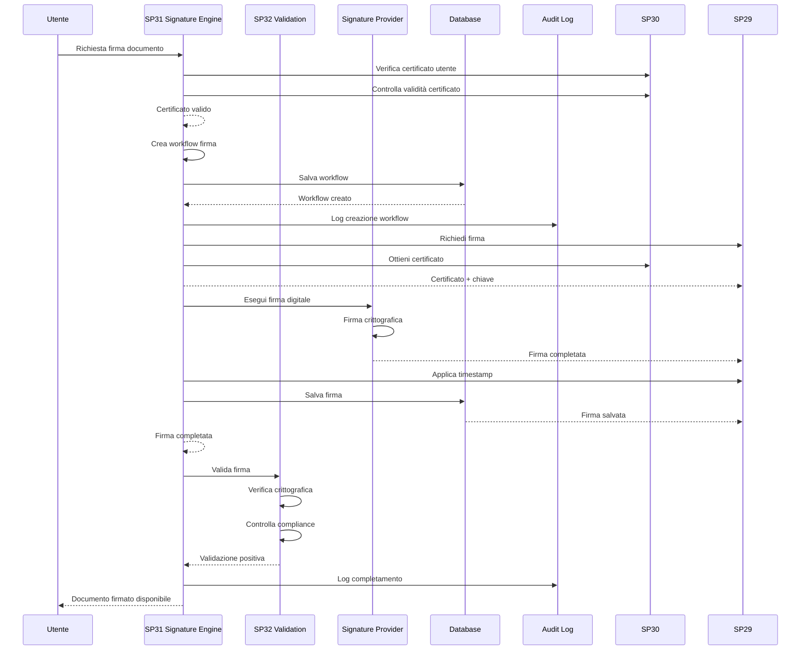
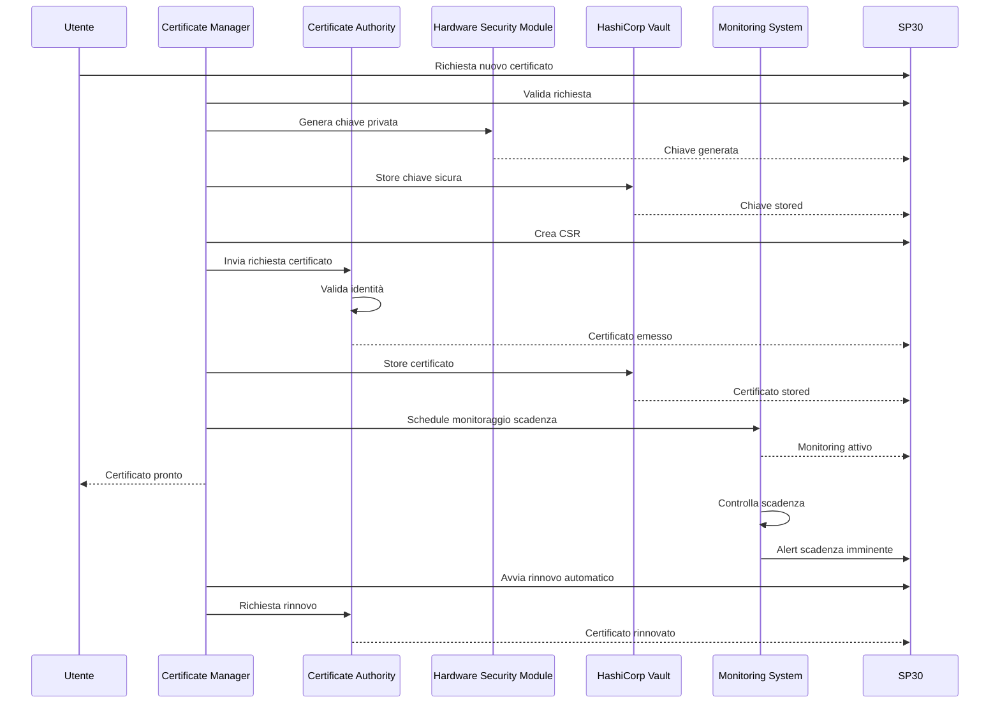
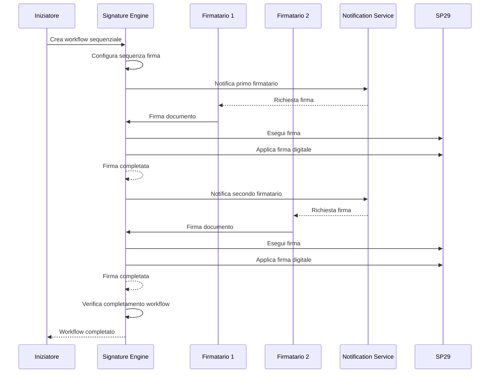
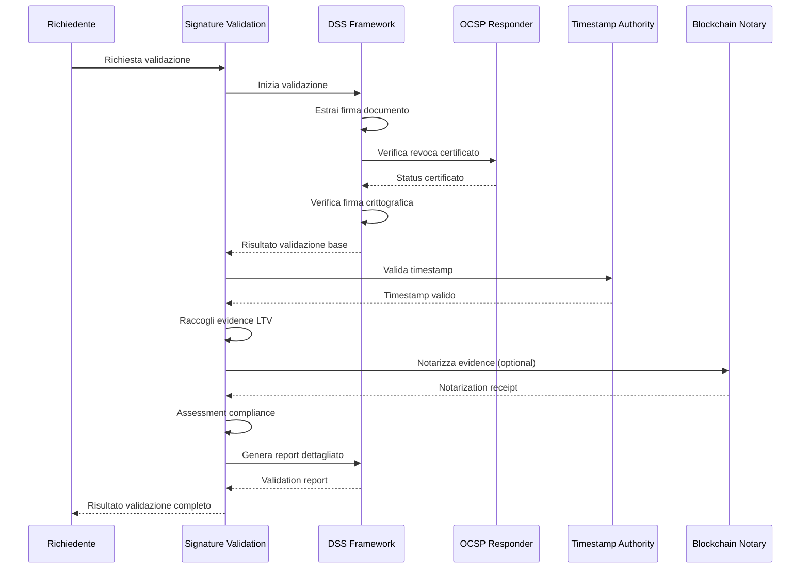
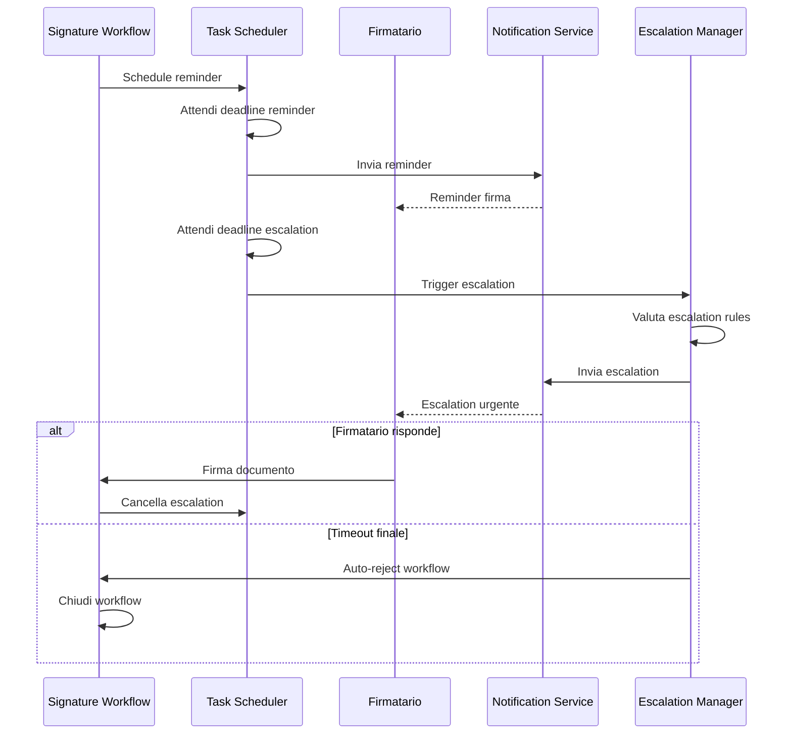

# Sequence Diagrams - UC6 Firma Digitale Integrata

## Diagramma Completo del Processo Firma



## Diagramma di Gestione Certificati



## Diagramma di Workflow Firma Multi-Firmatari



## Diagramma di Validazione Firma



## Diagramma di Escalation e Reminder



## Diagramma Ultra-Semplificato

```mermaid
sequenceDiagram
    participant User as Utente
    participant System as Sistema Firma

    User->>System: Carica documento
    System->>System: Verifica certificato
    System-->>User: Certificato OK

    User->>System: Avvia firma
    System->>System: Firma digitale
    System-->>User: Documento firmato

    User->>System: Valida firma
    System->>System: Verifica integrità
    System-->>User: Firma valida
```</content>
<parameter name="filePath">/Users/giangio/Documents/GitHub/Interzen/Interzen.POC/ZenIA/docs/use_cases/UC6 - Firma Digitale Integrata/01 Sequence diagrams.md