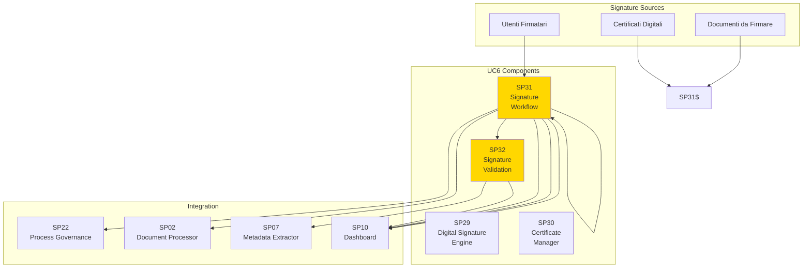
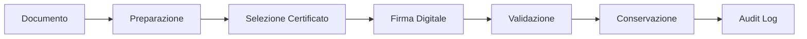
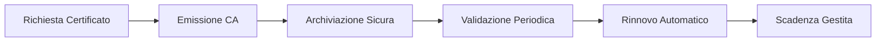

# Guida UC6 - Firma Digitale Integrata

## Panoramica

**UC6 - Firma Digitale Integrata** implementa un sistema completo di firma digitale avanzata che gestisce l'intero ciclo di vita delle firme elettroniche, dalla creazione alla validazione e conservazione a lungo termine.

## Obiettivi

### Business Objectives

1. **Firma Digitale Avanzata**
   - Supporto firme elettroniche qualificate
   - Firma multipla e controfirma
   - Integrazione con provider esterni

2. **Gestione Certificati**
   - Lifecycle management certificati
   - Validazione catena fiducia
   - Integrazione CA esterne

3. **Workflow Firma**
   - Orchestrazione processi firma
   - Gestione approvazioni sequenziali
   - Tracking stato firme

4. **Validazione e Conservazione**
   - Verifica integrità firme
   - Conservazione digitale a norma
   - Audit trail completo

## Caratteristiche Principali

### Firma Digitale Avanzata
- **Firme Qualificate**: Supporto eIDAS e normative locali
- **Firma Multipla**: Controfirma e firma congiunta
- **Formati Avanzati**: PAdES, XAdES, CAdES
- **Integrazione Provider**: Aruba, InfoCert, Namirial

### Gestione Certificati Intelligente
- **Auto-Rinnovo**: Gestione automatica scadenza certificati
- **Validazione Real-time**: Verifica stato certificati online
- **Multi-CA**: Supporto certificati da diverse CA
- **Secure Storage**: Archiviazione sicura chiavi private

### Workflow Firma Sofisticati
- **Approvazioni Sequenziali**: Catena firme ordinate
- **Deleghe**: Firma per conto di altri
- **Scadenze**: Reminder e escalation automatici
- **Rollback**: Annullamento firme in cascata

### Validazione e Audit
- **Verifica Integrità**: Controllo non-manomissione documenti
- **Timestamp**: Marca temporale legale
- **Audit Trail**: Log completo operazioni firma
- **Report Compliance**: Certificazioni validità firme

## Architettura di Integrazione

### Signature Flow

### Certificate Management

## Benefici Attesi

### Sicurezza e Compliance
- **Integrità Documenti**: Garanzia non-manomissione
- **Autenticità**: Verifica identità firmatari
- **Legal Validity**: Validità legale firme
- **Audit Compliance**: Tracciabilità completa

### Efficienza Operativa
- **Processi Accelerati**: Firma digitale vs cartacea
- **Riduzione Costi**: Eliminazione carta e spedizioni
- **Workflow Automatici**: Orchestrazione processi firma
- **Remote Working**: Firma da qualsiasi luogo

### User Experience
- **Interfacce Intuitive**: Firma semplice e guidata
- **Mobile Support**: Firma da dispositivi mobili
- **Bulk Operations**: Firma massiva documenti
- **Status Tracking**: Monitoraggio real-time processi

## KPI di Successo

| KPI | Target | Misurazione |
|-----|--------|-------------|
| Signature Speed | <30s | Tempo medio firma documento |
| Certificate Validity | >99.5% | Percentuale certificati validi |
| Process Completion | >95% | Workflow firma completati |
| Legal Compliance | 100% | Validità legale firme |

## Roadmap Implementazione

### Fase 1: Foundation (Mesi 1-3)
- Setup infrastruttura firma digitale
- Integrazione provider firma principali
- Gestione certificati base

### Fase 2: Core Features (Mesi 4-6)
- Workflow firma avanzati
- Validazione e audit
- Dashboard monitoraggio

### Fase 3: Advanced Features (Mesi 7-9)
- Firma qualificata eIDAS
- Conservazione digitale
- Analytics avanzati

### Fase 4: Enterprise Scale (Mesi 10-12)
- Integrazione multi-provider
- Scalabilità enterprise
- Advanced security features</content>
<parameter name="filePath">/Users/giangio/Documents/GitHub/Interzen/Interzen.POC/ZenIA/docs/use_cases/UC6 - Firma Digitale Integrata/Guida_UC6_Firma_Digitale.md