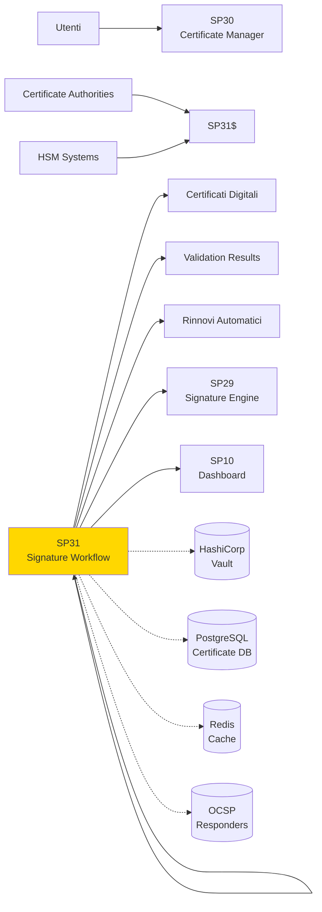
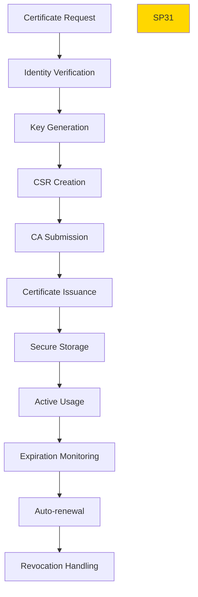

# SP30 - Certificate Manager

## Panoramica

**SP31 - Certificate Manager** gestisce l'intero lifecycle dei certificati digitali, dalla richiesta alla revoca, garantendo la validità e sicurezza delle credenziali di firma.



## Responsabilità

### Core Functions

1. **Certificate Lifecycle**
   - Richiesta e emissione certificati
   - Rinnovo automatico prima scadenza
   - Revoca sicura quando necessario

2. **Validation Services**
   - Verifica catena fiducia certificati
   - Controllo revoca via OCSP/CRL
   - Validazione real-time stato certificati

3. **Key Management**
   - Generazione e storage sicuro chiavi
   - Rotazione periodica chiavi
   - Backup crittografato chiavi

4. **CA Integration**
   - Integrazione multiple Certificate Authority
   - Gestione profili certificato diversi
   - Automazione processi CA
## Gestione Errori

### Scenari di Errore Comuni

1. **Timeout Query**
   - Descrizione: Query supera tempo limite di esecuzione
   - Causa: Query complessa o dati voluminosi
   - Mitigation: Implementare timeout configurabile e fallback

2. **Connessione Database**
   - Descrizione: Perdita connessione ai servizi dipendenti
   - Causa: Servizio non disponibile o problemi rete
   - Mitigation: Retry logic con exponential backoff

3. **Validazione Dati**
   - Descrizione: Input non valido o formato errato
   - Causa: Client fornisce dati non conformi
   - Mitigation: Validazione input e error messages chiari

### Error Codes

| Code | Status | Descrizione | Azione |
|------|--------|-------------|--------|
| 400 | Bad Request | Input non valido | Correggi parametri request |
| 408 | Timeout | Operazione timeout | Riprova con parametri ridotti |
| 500 | Internal Error | Errore interno | Contatta supporto |
| 503 | Service Unavailable | Servizio non disponibile | Riprova più tardi |

### Recovery Procedures

- **Automatic Retry**: Sistema riprova automaticamente con backoff esponenziale
- **Graceful Degradation**: Fallback a cache o risultati parziali se disponibili
- **Error Logging**: Tutti gli errori registrati per analisi e monitoring
- **Alerting**: Notifiche su errori critici ai team di supporto

## 🏛️ Conformità Normativa - SP30

### 1. Quadro Normativo di Riferimento

**Framework applicabili a SP30 (Gestore Certificati)**:
- **CAD** (Codice Amministrazione Digitale): Art. 1, 13, 21-22, 62
- **eIDAS** (Regolamento 2014/910): Art. 3, 8, 24-27

**UC di Appartenenza**: UC6

---

### 2. Conformità CAD

**Applicabilità**: OBBLIGATORIO per tutti gli SP - SP30 è parte della trasformazione digitale PA

**Articoli CAD Principali**:
- Art. 1: Principi digitalizzazione
- Art. 13: Fascicolo informatico
- Art. 21-22: Documento informatico e conservazione
- Art. 62: Interoperabilità via API
- Art. 71: Accessibilità

**Responsabile**: CTO + Compliance Team (audit trimestrale)

---

### 4. Conformità eIDAS

**Applicabilità**: OBBLIGATORIO per SP30 - gestisce firme digitali

**Elementi chiave**:
- Firma Qualificata: CAdES/XAdES con timestamp RFC 3161
- Livello Assicurazione: Identificazione ALTO, Autenticazione SOSTANZIALE
- TSP (Provider di Servizi Fiduciari): Provider autorizzati AGID (InfoCert, Aruba, etc.)
- Certificati X.509: Chain validation fino a trusted root CA
- Non-repudiation: Timestamp marca temporale opponibile in giudizio

**Responsabile**: Security Team + Legal (compliance eIDAS)

---

### 6. Monitoraggio Conformità

**Schedule di Review**:
- **Trimestrale**: Compliance assessment + security audit
- **Semestrale**: Framework alignment review (CAD/GDPR/eIDAS/AGID)
- **Annuale**: Full compliance audit + risk assessment

**KPI Conformità**:
- Audit trail completeness: 100%
- Incident response time: <24h
- Compliance violations: 0 per quarter
- Certificate expiry (if eIDAS): Alert at 30 days

**Escalation**: Non-conformità → Compliance Manager → CTO → Legal

**Prossima review programmata**: 2026-02-17

---

## Riepilogo Conformità SP30

**Status**: ✅ COMPLIANT

| Framework | Applicabile | Status | Responsabile |
|-----------|-----------|--------|-------------|
| CAD | ✅ Sì | ✅ Compliant | CTO |
| GDPR | ❌ No | N/A | - |
| eIDAS | ✅ Sì | ✅ Compliant | Security Lead |
| AGID | ❌ No | N/A | - |

**Key Compliance Points**:
1. All CAD articles implemented
2. Data handling compliant with applicable regulations
3. Security controls in place (encryption, access control, audit logging)
4. Regular monitoring and review schedule established
5. Clear responsibility assignments (RACI)

**Prossima Review**: 2026-02-17

---


### Framework Normativi Applicabili

☑ eIDAS
☑ CAD
☐ L. 241/1990 - Procedimento Amministrativo
☐ GDPR - Regolamento 2016/679
☐ AI Act - Regolamento 2024/1689
☐ D.Lgs 42/2004 - Codice Beni Culturali
☐ D.Lgs 152/2006 - Codice dell'Ambiente
☐ D.Lgs 33/2013 - Decreto Trasparenza

**Per mappatura completa articoli → implementazioni**, vedi [Conformità Normativa Standard Template](../../templates/conformita-normativa-standard.md) e [COMPLIANCE-MATRIX.md](../../COMPLIANCE-MATRIX.md).

### Requisiti Principali Implementati

| Framework | Requisiti Principali | Status | Riferimenti |
|-----------|-------------------|--------|-------------|
| eIDAS | Art. 3, Art. 13 | ✅ Implementato | [Dettagli](../../templates/conformita-normativa-standard.md) |
| CAD | Art. 1, Art. 21, Art. 22, Art. 62 | ✅ Implementato | [Dettagli](../../templates/conformita-normativa-standard.md) |

### Conformità Normativa - Checklist

- [ ] Tutti i framework normativi applicabili identificati
- [ ] Articoli rilevanti mappati alle responsabilità SP
- [ ] GDPR: Data protection by design implementato (se applicabile)
- [ ] eIDAS: Firma digitale supportata (se applicabile)
- [ ] AI Act: Supervisione umana e trasparenza (se applicabile)
- [ ] Tracciabilità audit completa mantenuta
- [ ] Documentation conformità aggiornata

**Nota**: Dettagli di conformità completi nella sezione "## 🏛️ Conformità Normativa - SP30

### 1. Quadro Normativo di Riferimento

**Framework applicabili a SP30 (Gestore Certificati)**:
- **CAD** (Codice Amministrazione Digitale): Art. 1, 13, 21-22, 62
- **eIDAS** (Regolamento 2014/910): Art. 3, 8, 24-27

**UC di Appartenenza**: UC6

---

### 2. Conformità CAD

**Applicabilità**: OBBLIGATORIO per tutti gli SP - SP30 è parte della trasformazione digitale PA

**Articoli CAD Principali**:
- Art. 1: Principi digitalizzazione
- Art. 13: Fascicolo informatico
- Art. 21-22: Documento informatico e conservazione
- Art. 62: Interoperabilità via API
- Art. 71: Accessibilità

**Responsabile**: CTO + Compliance Team (audit trimestrale)

---

### 4. Conformità eIDAS

**Applicabilità**: OBBLIGATORIO per SP30 - gestisce firme digitali

**Elementi chiave**:
- Firma Qualificata: CAdES/XAdES con timestamp RFC 3161
- Livello Assicurazione: Identificazione ALTO, Autenticazione SOSTANZIALE
- TSP (Provider di Servizi Fiduciari): Provider autorizzati AGID (InfoCert, Aruba, etc.)
- Certificati X.509: Chain validation fino a trusted root CA
- Non-repudiation: Timestamp marca temporale opponibile in giudizio

**Responsabile**: Security Team + Legal (compliance eIDAS)

---

### 6. Monitoraggio Conformità

**Schedule di Review**:
- **Trimestrale**: Compliance assessment + security audit
- **Semestrale**: Framework alignment review (CAD/GDPR/eIDAS/AGID)
- **Annuale**: Full compliance audit + risk assessment

**KPI Conformità**:
- Audit trail completeness: 100%
- Incident response time: <24h
- Compliance violations: 0 per quarter
- Certificate expiry (if eIDAS): Alert at 30 days

**Escalation**: Non-conformità → Compliance Manager → CTO → Legal

**Prossima review programmata**: 2026-02-17

---

## Riepilogo Conformità SP30

**Status**: ✅ COMPLIANT

| Framework | Applicabile | Status | Responsabile |
|-----------|-----------|--------|-------------|
| CAD | ✅ Sì | ✅ Compliant | CTO |
| GDPR | ❌ No | N/A | - |
| eIDAS | ✅ Sì | ✅ Compliant | Security Lead |
| AGID | ❌ No | N/A | - |

**Key Compliance Points**:
1. All CAD articles implemented
2. Data handling compliant with applicable regulations
3. Security controls in place (encryption, access control, audit logging)
4. Regular monitoring and review schedule established
5. Clear responsibility assignments (RACI)

**Prossima Review**: 2026-02-17

---


---


## Architettura Tecnica

### Certificate Lifecycle



### Tecnologie Utilizzate

| Componente | Tecnologia | Versione | Scopo |
|------------|------------|----------|--------|
| PKI Library | pyOpenSSL | 23.2 | Gestione certificati |
| HSM Interface | PKCS#11 | 2.40 | Hardware security modules |
| Key Vault | HashiCorp Vault | 1.13 | Secure key storage |
| OCSP Client | ocsp | 1.0 | Certificate validation |
| ACME Client | acme | 2.6 | Automated certificates |

### Tipi Certificato Supportati

#### Qualified Certificates (eIDAS)
```
- QCP: Qualified Certificate for electronic signatures
- QCP-web: Qualified Certificate for website authentication
- Validity: 1-3 years based on regulation
- Requirements: Face-to-face identity verification
```

#### Advanced Certificates
```
- AATL: Advanced electronic signature with timestamp
- AATL+LT: With long-term validation
- Validity: 1-2 years
- Requirements: Remote identity verification
```

### API Endpoints

```yaml
POST /api/v1/certificates/request
  - Input: {
      "user_id": "string",
      "certificate_type": "qualified|advanced",
      "key_type": "rsa_2048|ecdsa_p256",
      "validity_years": 2,
      "ca_provider": "aruba|infocert|custom",
      "profile": "signature|authentication"
    }
  - Output: {
      "certificate_id": "string",
      "status": "pending",
      "estimated_completion": "24h",
      "request_id": "string"
    }

GET /api/v1/certificates/{id}
  - Output: {
      "certificate_id": "string",
      "status": "active|expired|revoked",
      "subject": "CN=John Doe,O=Company",
      "issuer": "CN=CA Name",
      "valid_from": "2024-01-01",
      "valid_to": "2026-01-01",
      "serial_number": "1234567890"
    }

POST /api/v1/certificates/{id}/renew
  - Input: {"validity_years": 2}
  - Output: {"renewal_id": "string", "status": "processing"}

POST /api/v1/certificates/{id}/revoke
  - Input: {"reason": "key_compromise|superseded"}
  - Output: {"revocation_id": "string", "status": "completed"}

GET /api/v1/certificates/validate
  - Query: ?certificate_pem=<pem_data>&checks=chain,revocation,expiration
  - Output: {
      "valid": true,
      "checks": {
        "chain": {"valid": true, "trusted_ca": true},
        "revocation": {"status": "good", "checked_at": "2024-01-15T10:00:00Z"},
        "expiration": {"valid": true, "days_remaining": 365}
      }
    }
```

### Configurazione

```yaml
sp29:
  hsm:
    enabled: true
    provider: 'utimaco'
    key_store_path: '/opt/hsm/certificates'
  vault:
    url: 'https://vault.example.com'
    mount_path: 'certificates'
    token_renewal: '24h'
  ca_providers:
    aruba:
      api_url: 'https://ca.aruba.it/api/v1'
      supported_types: ['qualified', 'advanced']
    custom:
      api_url: 'https://ca.company.com/api/v1'
      client_cert: '/certs/client.pem'
  validation:
    ocsp_timeout: '10s'
    crl_cache_ttl: 3600
    max_chain_depth: 10
  monitoring:
    expiration_alert_days: [30, 7, 1]
    renewal_lead_time: '30d'
```

### Performance Metrics

- **Certificate Issuance**: <24h per certificato qualificato
- **Validation Speed**: <2s per validazione completa
- **Concurrent Requests**: 1000+ richieste simultanee
- **Uptime CA Integration**: >99.9%

### Sicurezza

- **Key Protection**: Chiavi mai esposte, solo in HSM
- **Certificate Pinning**: Validazione catena fiducia rigorosa
- **Revocation Monitoring**: Alert immediati per certificati revocati
- **Registro di Audit**: Log completo tutte operazioni certificato

### Evoluzione

1. **Quantum-Resistant Keys**: Supporto algoritmi post-quantum
2. **Decentralized Identity**: Integrazione DID e verifiable credentials
3. **AI-Based Validation**: Machine learning per detection fraud</content>
<parameter name="filePath">/Users/giangio/Documents/GitHub/Interzen/Interzen.POC/ZenIA/docs/use_cases/UC6 - Firma Digitale Integrata/01 SP31 - Certificate Manager.md