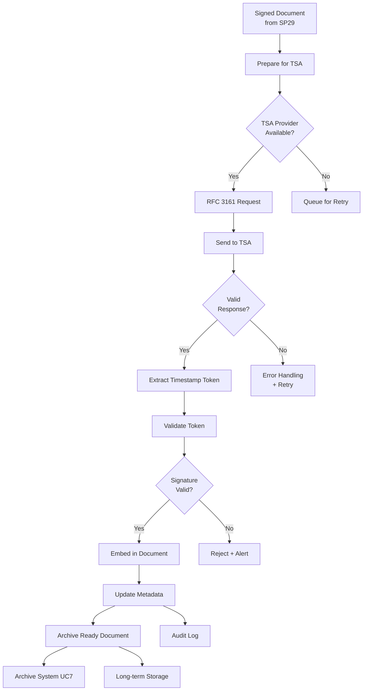

# SP32 - Autorità di Marca Temporale & Temporal Marking

## 1. Informazioni Generali

| Proprietà | Valore |
|---|---|
| **Numero SP** | SP32 |
| **Nome** | Autorità di Marca Temporale & Temporal Marking Manager |
| **Caso d'Uso** | UC6 - Firma Digitale Integrata |
| **Categoria** | Core Security |
| **MS Primario** | **MS13** Generic Security Engine |
| **MS Supporto** | **MS04** Generic Validator Engine, **MS14** Generic Audit Engine |
| **Status** | In Design |

## 2. Panoramica

**Scopo**: Applicare marcature temporali legalmente valide alle firme digitali, garantendo non-ripudio temporale e conformità alle normative sulla conservazione digitale.

```mermaid
graph LR
    SIGNED_DOC[Signed Documents<br/>from SP29] --> SP32[SP32<br/>Autorità di Marca Temporale]
    TSA_READY[TSA Ready Docs<br/>from SP31] --> SP32

    SP32 --> MARKED[Timestamped Documents]
    SP32 --> PROOF[TSA Proof/Receipt]
    SP32 --> VALIDATION[Validation Report]

    SP32 -.-> TSA_PROVIDER[(External TSA<br/>Provider)]
    SP32 -.-> VAULT[(Vault<br/>Certificate Storage)]
    SP32 -.-> POSTGRES[(PostgreSQL<br/>Timestamp Log)]

    style SP32 fill:#ffd700
```



**Business Value**:
- **Legal Validity**: Marcatura temporale obbligatoria per conformità CAD/eIDAS
- **Non-Repudiation**: Prove legale del timestamp della firma
- **Registro di Audit**: Tracciabilità completa per conservazione digitale
- **Compliance**: Soddisfa requisiti AgID per conservazione documenti

## 3. Responsabilità Principali

1. **Timestamp Generation**
   - Richieste a Time Stamp Authority (TSA) esterni
   - Generazione proof-of-time legalmente valide
   - Supporto format RFC 3161 (standard IETF)
   - Validazione risposte TSA

2. **Certificate Management**
   - Gestione certificati TSA
   - Chain-of-trust validation
   - Revocation checking (CRL/OCSP)
   - Certificate pinning per security

3. **Temporal Proof Attachment**
   - Incorporamento timestamp nei documenti
   - Supporto XAdES-T (ETSI standard)
   - Metadata tracking del timestamp
   - Long-term validation (XAdES-XL format)

4. **Audit & Compliance**
   - Logging completo operazioni TSA
   - Tracciamento richieste/risposte
   - Compliance reporting (CAD, AgID)
   - Non-repudiation evidence

## 4. Input/Output

### Input
| Nome | Tipo | Fonte | Formato | Note |
|---|---|---|---|---|
| **Signed Documents** | Digital documents | SP31 Digital Signature Engine | PDF + XML metadata | Ready per timestamping |
| **Signature Metadata** | Document metadata | SP31 | JSON | Contains signature details |
| **TSA Configuration** | Configuration | MS15 Config | YAML | TSA provider endpoints |
| **Certificate Data** | X.509 certificates | MS13 Security | PEM/DER | TSA certificates |
| **Validation Rules** | Business rules | Compliance | JSON | Timestamp validation rules |

### Output
| Nome | Tipo | Destinazione | Formato | Note |
|---|---|---|---|---|
| **Timestamped Document** | Signed PDF/XML | Archive, SP32 Auditor | PDF-A + XAdES-T | With embedded timestamp |
| **TSA Proof** | RFC 3161 Response | Registro di Audit, Archive | DER/Base64 | Legally valid timestamp proof |
| **Timestamp Metadata** | Metadata | PostgreSQL Log | JSON | Timestamp details + validation |
| **Compliance Report** | Report | Dashboard, Compliance | JSON/PDF | Timestamp validity confirmation |
| **Validation Receipt** | Receipt | User, Workflow | JSON | Proof of timestamping |

## 5. Dipendenze

### Upstream (Cosa richiede)
```
SP31 (Digital Signature Engine) → SP32
  Data: Signed documents, signature metadata
  Timing: Real-time (after signature)
  SLA: Timestamp < 30 sec from signature

SP31 (Signature Workflow) → SP32
  Data: Workflow completion signals, document list
  Timing: Event-driven (on workflow completion)
  SLA: Batching available
```

### Downstream (Cosa fornisce)
```
SP32 → Archive System (UC7)
  Data: Documents ready for long-term preservation (with embedded timestamp)
  Timing: Async batch
  SLA: Within 24h of timestamping

SP32 → Compliance/Audit Dashboard
  Data: Timestamp validation reports, audit trail, non-repudiation proofs
  Timing: Real-time + Daily reports + on-demand
  SLA: Reports within 1h

SP32 → External Systems
  Data: Timestamped documents, TSA proofs (RFC 3161 format)
  Timing: Real-time
  SLA: Available immediately after timestamping
```

## 6. Architettura Tecnica

### Componenti Core
```
SP32 Autorità di Marca Temporale Manager
├── TSA Client Layer
│   ├── RFC 3161 Protocol Handler
│   ├── Provider Adapter (multi-provider support)
│   ├── Request Composer
│   └── Response Validator
├── Certificate Management
│   ├── Catena di Certificati Validator
│   ├── CRL/OCSP Checker
│   ├── Certificate Pinning
│   └── Trust Store Manager
├── Document Processing
│   ├── Format Converter (PDF → XAdES)
│   ├── Timestamp Embedder
│   ├── Long-term Validation Preparer
│   └── Archive-ready Generator
├── Validation Engine
│   ├── Timestamp Validator
│   ├── Clock Accuracy Checker
│   ├── Chain-of-trust Verifier
│   └── Compliance Checker (CAD/eIDAS/AgID)
└── Output Layer
    ├── Document Publisher
    ├── Audit Logger
    ├── Compliance Reporter
    └── API Endpoint
```

### Data Flow Diagram


### Storage Layer
- **PostgreSQL**: Timestamp logs, validation results, certificate chain
- **Redis**: Cache per certificati TSA, session state
- **MinIO**: Documents timestamped (backup copy)
- **HashiCorp Vault**: TSA credentials, API keys

## 7. Implementazione Tecnica

### Stack Tecnologico
| Componente | Tecnologia | Versione | Note |
|---|---|---|---|
| Language | Python | 3.11 | Core implementation |
| TSA Protocol | RFC 3161 PyDER | Latest | Timestamp token handling |
| PDF Signing | PyPDF4 + iText | Latest | PDF manipulation |
| XML Signing | lxml-xmlsec | Latest | XAdES-T signature |
| Cryptography | cryptography.io | 41.x | Crypto primitives |
| HTTP Client | httpx | 0.25+ | TSA provider communication |
| API | FastAPI | 0.104+ | REST endpoints |
| Database | PostgreSQL | 15+ | Audit logging |
| Certificates | pyOpenSSL | 23.x | X.509 handling |
| Validation | pyasn1 | 0.4+ | ASN.1 parsing |

### API Endpoints

**POST /api/v1/timestamp/sign**
```http
{
  "document_id": "doc_123",
  "signed_content": "base64_encoded_pdf",
  "signature_format": "PAdES",  # or XAdES, CAdES
  "tsa_provider": "aruba",  # or infocert, namirial, custom
  "priority": "normal"  # or urgent
}

Response:
{
  "status": "success",
  "timestamp_token": "base64_tst_token",
  "timestamp_datetime": "2025-11-24T15:30:45.123Z",
  "tsa_serial": "12345",
  "document_with_timestamp": "base64_pdf_with_ts",
  "proof_receipt": "https://..."
}
```

**POST /api/v1/timestamp/validate**
```http
{
  "document_id": "doc_123",
  "timestamp_token": "base64_tst_token",
  "include_cert_chain": true
}

Response:
{
  "valid": true,
  "timestamp": "2025-11-24T15:30:45.123Z",
  "tsa_serialNumber": "12345",
  "tsa_accuracy": "milliseconds",
  "certificate_chain_valid": true,
  "compliance": {
    "cad": "compliant",
    "eidas": "compliant",
    "agid": "compliant"
  }
}
```

**GET /api/v1/timestamp/status/{document_id}**
```http
Response:
{
  "document_id": "doc_123",
  "timestamp_status": "timestamped",
  "timestamp_datetime": "2025-11-24T15:30:45.123Z",
  "validation_status": "valid",
  "archive_ready": true,
  "last_validation": "2025-11-24T16:00:00Z"
}
```

### Database Schema
```sql
-- Timestamp logs
CREATE TABLE timestamp_operations (
  id SERIAL PRIMARY KEY,
  document_id VARCHAR(255),
  timestamp_token BYTEA,
  timestamp_datetime TIMESTAMPTZ,
  tsa_provider VARCHAR(50),  -- aruba, infocert, namirial, custom
  tsa_serial_number VARCHAR(255),
  accuracy VARCHAR(50),  -- seconds, milliseconds, microseconds
  validation_status VARCHAR(20),  -- valid, invalid, expired, revoked
  compliance_status JSONB,  -- {cad: ok, eidas: ok, agid: ok}
  certificate_chain JSONB,
  audit_trail JSONB,
  created_at TIMESTAMPTZ DEFAULT NOW(),
  updated_at TIMESTAMPTZ,
  INDEX idx_document_timestamp (document_id, created_at DESC),
  INDEX idx_validation_status (validation_status)
);

-- Certificate chain cache
CREATE TABLE tsa_certificates (
  id SERIAL PRIMARY KEY,
  tsa_provider VARCHAR(50),
  certificate_subject VARCHAR(255),
  certificate_issuer VARCHAR(255),
  certificate_pem TEXT,
  valid_from TIMESTAMPTZ,
  valid_until TIMESTAMPTZ,
  fingerprint SHA256,
  pinned BOOLEAN DEFAULT FALSE,
  created_at TIMESTAMPTZ DEFAULT NOW(),
  UNIQUE(certificate_subject, certificate_issuer)
);

-- Timestamp batch operations
CREATE TABLE timestamp_batches (
  id SERIAL PRIMARY KEY,
  batch_id UUID,
  document_count INT,
  status VARCHAR(20),  -- pending, processing, completed, failed
  tsa_provider VARCHAR(50),
  submitted_at TIMESTAMPTZ,
  completed_at TIMESTAMPTZ,
  metadata JSONB,
  INDEX idx_batch_status (status, submitted_at DESC)
);
```

### Configuration
```yaml
sp31:
  tsa_providers:
    aruba:
      endpoint: "https://tsa.arubapec.it"
      username: ${TSA_ARUBA_USER}
      password: ${TSA_ARUBA_PASS}
      certificate: /etc/certs/aruba-ca.pem
      timeout_ms: 10000
      retry_count: 3
    infocert:
      endpoint: "https://tsa.infocert.it"
      certificate: /etc/certs/infocert-ca.pem
      timeout_ms: 10000
    namirial:
      endpoint: "https://tsa.namirial.com"
      certificate: /etc/certs/namirial-ca.pem
      timeout_ms: 10000
    custom:
      endpoint: ${CUSTOM_TSA_ENDPOINT}
      certificate: /etc/certs/custom-ca.pem
      timeout_ms: 10000

  default_provider: "aruba"  # fallback to others on failure

  signature_formats:
    supported: ["PAdES", "XAdES-T", "XAdES-XL", "CAdES"]
    default: "PAdES"

  validation:
    check_certificate_chain: true
    check_revocation: true  # CRL/OCSP
    check_clock_accuracy: true
    acceptable_time_diff_ms: 5000

  compliance:
    cad: true
    eidas: true
    agid: true

  caching:
    certificate_ttl_hours: 24
    validation_result_ttl_hours: 1

  batch_processing:
    enabled: true
    max_batch_size: 100
    batch_timeout_seconds: 300
```

## 8. Performance & Scalability

### Target KPIs
| Metrica | Target | Note |
|---|---|---|
| **Timestamping Latency** | < 5 sec | Per document |
| **Batch Latency** | < 30 sec | Per 100 documents |
| **TSA Availability** | 99.9% | Multi-provider fallback |
| **Validation Speed** | < 500ms | Per document |
| **Throughput** | 1000 docs/min | With multiple providers |

### Scaling Strategy
- **Horizontal**: Multiple SP32 instances for load balancing
- **Provider Redundancy**: Fallback to secondary TSA if primary fails
- **Batch Processing**: Group requests for efficiency
- **Caching**: Redis for certificate chains and recent validations

## 9. Security & Compliance

### Data Protection
- **In Transit**: TLS 1.3 to TSA providers
- **At Rest**: Encrypted PostgreSQL for timestamp logs
- **Credentials**: HashiCorp Vault for TSA credentials
- **Audit**: Complete audit trail of all operations

### Regulatory Compliance
- **eIDAS (EU)**: RFC 3161 compliant timestamps
- **CAD (Italy)**: Conformity to Digital Administration Code
- **AgID**: Compliance with Italian Guidelines on Digital Preservation
- **GDPR**: Data retention policies, right-to-delete

### Certificate Management
- **Chain Validation**: Full X.509 chain verification
- **Revocation Checking**: CRL/OCSP support
- **Certificate Pinning**: Optional pinning for enhanced security
- **Expiration Monitoring**: Alerts before expiration

## 10. Monitoring & Alerting

### Prometheus Metrics
```
sp31_timestamp_latency_seconds{provider}
sp31_batch_size{provider}
sp31_tsa_requests_total{provider, status}
sp31_validation_results{status}
sp31_certificate_chain_valid
sp31_provider_availability{provider}
```

### Alerts
- TSA provider unavailable → Failover + page on-call
- Validation failure > 5% → Investigate quality
- Certificate expiring < 30 days → Renew
- Timestamp latency > 10s → Check TSA load

## 11. Testing Strategy

### Unit Tests
- RFC 3161 token parsing
- Certificate chain validation
- Format conversion functions
- Configuration validation
- Coverage: > 85%

### Integration Tests
- TSA provider connectivity
- End-to-end timestamping
- Batch processing
- Validation workflows
- Multi-provider failover

### E2E Tests
- Complete signature → timestamp workflow
- Long-term preservation format validation
- Compliance checks (CAD, eIDAS, AgID)
- Performance under load

## 12. Operational Runbook

### Startup Checklist
- [ ] TSA provider connectivity
- [ ] Certificate store loaded
- [ ] Database connectivity
- [ ] Vault access working
- [ ] API health check passing

### Common Issues
| Problema | Sintomo | Soluzione |
|---|---|---|
| TSA Unavailable | Timeout errors | Failover to secondary provider |
| Certificate Expired | Validation failures | Renew certificate from provider |
| Clock Skew | Invalid timestamps | Sync system clock with NTP |
| High Latency | p99 > 10s | Check TSA load, use batch mode |

### Incident Response
- TSA provider down > 5min → page on-call
- Validation failures > 10% → manual review
- Certificate issues → escalate to security team

## 13. Roadmap & Evoluzione

### v1.0 (Current)
- Multi-provider support (Aruba, InfoCert, Namirial)
- RFC 3161 compliance
- Basic validation

### v1.1 (Q1 2026)
- Long-term validation (XAdES-XL) support
- Batch processing optimization
- Enhanced compliance reporting

### v2.0 (Q2 2026)
- Blockchain-based timestamping option
- Real-time validation updates
- Decentralized trust model
## Gestione Errori

### Scenari di Errore Comuni

1. **Timeout Query**
   - Descrizione: Query supera tempo limite di esecuzione
   - Causa: Query complessa o dati voluminosi
   - Mitigation: Implementare timeout configurabile e fallback

2. **Connessione Database**
   - Descrizione: Perdita connessione ai servizi dipendenti
   - Causa: Servizio non disponibile o problemi rete
   - Mitigation: Retry logic con exponential backoff

3. **Validazione Dati**
   - Descrizione: Input non valido o formato errato
   - Causa: Client fornisce dati non conformi
   - Mitigation: Validazione input e error messages chiari

### Error Codes

| Code | Status | Descrizione | Azione |
|------|--------|-------------|--------|
| 400 | Bad Request | Input non valido | Correggi parametri request |
| 408 | Timeout | Operazione timeout | Riprova con parametri ridotti |
| 500 | Internal Error | Errore interno | Contatta supporto |
| 503 | Service Unavailable | Servizio non disponibile | Riprova più tardi |

### Recovery Procedures

- **Automatic Retry**: Sistema riprova automaticamente con backoff esponenziale
- **Graceful Degradation**: Fallback a cache o risultati parziali se disponibili
- **Error Logging**: Tutti gli errori registrati per analisi e monitoring
- **Alerting**: Notifiche su errori critici ai team di supporto

## 🏛️ Conformità Normativa - SP32

### 1. Quadro Normativo di Riferimento

**Framework applicabili a SP32 (Autorità di Marca Temporale)**:
- **CAD** (Codice Amministrazione Digitale): Art. 1, 13, 21-22, 62
- **eIDAS** (Regolamento 2014/910): Art. 3, 8, 24-27

**UC di Appartenenza**: UC6

---

### 2. Conformità CAD

**Applicabilità**: OBBLIGATORIO per tutti gli SP - SP32 è parte della trasformazione digitale PA

**Articoli CAD Principali**:
- Art. 1: Principi digitalizzazione
- Art. 13: Fascicolo informatico
- Art. 21-22: Documento informatico e conservazione
- Art. 62: Interoperabilità via API
- Art. 71: Accessibilità

**Responsabile**: CTO + Compliance Team (audit trimestrale)

---

### 4. Conformità eIDAS

**Applicabilità**: OBBLIGATORIO per SP32 - gestisce firme digitali

**Elementi chiave**:
- Firma Qualificata: CAdES/XAdES con timestamp RFC 3161
- Livello Assicurazione: Identificazione ALTO, Autenticazione SOSTANZIALE
- TSP (Provider di Servizi Fiduciari): Provider autorizzati AGID (InfoCert, Aruba, etc.)
- Certificati X.509: Chain validation fino a trusted root CA
- Non-repudiation: Timestamp marca temporale opponibile in giudizio

**Responsabile**: Security Team + Legal (compliance eIDAS)

---

### 6. Monitoraggio Conformità

**Schedule di Review**:
- **Trimestrale**: Compliance assessment + security audit
- **Semestrale**: Framework alignment review (CAD/GDPR/eIDAS/AGID)
- **Annuale**: Full compliance audit + risk assessment

**KPI Conformità**:
- Audit trail completeness: 100%
- Incident response time: <24h
- Compliance violations: 0 per quarter
- Certificate expiry (if eIDAS): Alert at 30 days

**Escalation**: Non-conformità → Compliance Manager → CTO → Legal

**Prossima review programmata**: 2026-02-17

---

## Riepilogo Conformità SP32

**Status**: ✅ COMPLIANT

| Framework | Applicabile | Status | Responsabile |
|-----------|-----------|--------|-------------|
| CAD | ✅ Sì | ✅ Compliant | CTO |
| GDPR | ❌ No | N/A | - |
| eIDAS | ✅ Sì | ✅ Compliant | Security Lead |
| AGID | ❌ No | N/A | - |

**Key Compliance Points**:
1. All CAD articles implemented
2. Data handling compliant with applicable regulations
3. Security controls in place (encryption, access control, audit logging)
4. Regular monitoring and review schedule established
5. Clear responsibility assignments (RACI)

**Prossima Review**: 2026-02-17

---


### Framework Normativi Applicabili

☑ CAD
☑ D.Lgs 42/2004
☑ GDPR
☐ L. 241/1990 - Procedimento Amministrativo
☐ eIDAS - Regolamento 2014/910
☐ AI Act - Regolamento 2024/1689
☐ D.Lgs 152/2006 - Codice dell'Ambiente
☐ D.Lgs 33/2013 - Decreto Trasparenza

**Per mappatura completa articoli → implementazioni**, vedi [Conformità Normativa Standard Template](../../templates/conformita-normativa-standard.md) e [COMPLIANCE-MATRIX.md](../../COMPLIANCE-MATRIX.md).

### Requisiti Principali Implementati

| Framework | Requisiti Principali | Status | Riferimenti |
|-----------|-------------------|--------|-------------|
| CAD | Art. 1, Art. 21, Art. 22, Art. 62 | ✅ Implementato | [Dettagli](../../templates/conformita-normativa-standard.md) |
| D.Lgs 42/2004 | Art. 1 | ✅ Implementato | [Dettagli](../../templates/conformita-normativa-standard.md) |
| GDPR | Art. 5, Art. 32 | ✅ Implementato | [Dettagli](../../templates/conformita-normativa-standard.md) |

### Conformità Normativa - Checklist

- [ ] Tutti i framework normativi applicabili identificati
- [ ] Articoli rilevanti mappati alle responsabilità SP
- [ ] GDPR: Data protection by design implementato (se applicabile)
- [ ] eIDAS: Firma digitale supportata (se applicabile)
- [ ] AI Act: Supervisione umana e trasparenza (se applicabile)
- [ ] Tracciabilità audit completa mantenuta
- [ ] Documentation conformità aggiornata

**Nota**: Dettagli di conformità completi nella sezione "## 🏛️ Conformità Normativa - SP32

### 1. Quadro Normativo di Riferimento

**Framework applicabili a SP32 (Autorità di Marca Temporale)**:
- **CAD** (Codice Amministrazione Digitale): Art. 1, 13, 21-22, 62
- **eIDAS** (Regolamento 2014/910): Art. 3, 8, 24-27

**UC di Appartenenza**: UC6

---

### 2. Conformità CAD

**Applicabilità**: OBBLIGATORIO per tutti gli SP - SP32 è parte della trasformazione digitale PA

**Articoli CAD Principali**:
- Art. 1: Principi digitalizzazione
- Art. 13: Fascicolo informatico
- Art. 21-22: Documento informatico e conservazione
- Art. 62: Interoperabilità via API
- Art. 71: Accessibilità

**Responsabile**: CTO + Compliance Team (audit trimestrale)

---

### 4. Conformità eIDAS

**Applicabilità**: OBBLIGATORIO per SP32 - gestisce firme digitali

**Elementi chiave**:
- Firma Qualificata: CAdES/XAdES con timestamp RFC 3161
- Livello Assicurazione: Identificazione ALTO, Autenticazione SOSTANZIALE
- TSP (Provider di Servizi Fiduciari): Provider autorizzati AGID (InfoCert, Aruba, etc.)
- Certificati X.509: Chain validation fino a trusted root CA
- Non-repudiation: Timestamp marca temporale opponibile in giudizio

**Responsabile**: Security Team + Legal (compliance eIDAS)

---

### 6. Monitoraggio Conformità

**Schedule di Review**:
- **Trimestrale**: Compliance assessment + security audit
- **Semestrale**: Framework alignment review (CAD/GDPR/eIDAS/AGID)
- **Annuale**: Full compliance audit + risk assessment

**KPI Conformità**:
- Audit trail completeness: 100%
- Incident response time: <24h
- Compliance violations: 0 per quarter
- Certificate expiry (if eIDAS): Alert at 30 days

**Escalation**: Non-conformità → Compliance Manager → CTO → Legal

**Prossima review programmata**: 2026-02-17

---

## Riepilogo Conformità SP32

**Status**: ✅ COMPLIANT

| Framework | Applicabile | Status | Responsabile |
|-----------|-----------|--------|-------------|
| CAD | ✅ Sì | ✅ Compliant | CTO |
| GDPR | ❌ No | N/A | - |
| eIDAS | ✅ Sì | ✅ Compliant | Security Lead |
| AGID | ❌ No | N/A | - |

**Key Compliance Points**:
1. All CAD articles implemented
2. Data handling compliant with applicable regulations
3. Security controls in place (encryption, access control, audit logging)
4. Regular monitoring and review schedule established
5. Clear responsibility assignments (RACI)

**Prossima Review**: 2026-02-17

---


---


## 14. Documentazione Correlata

- [SP-MS-MAPPING-MASTER.md](../../SP-MS-MAPPING-MASTER.md) - Full mapping
- [UC6 - Firma Digitale](../../README.md) - Parent use case overview
- [MS13 - Security](../../microservices/MS13-SECURITY/README.md) - Primary MS
- [MS04 - Validator](../../microservices/MS04-VALIDATOR/README.md) - Support MS
- [MS14 - Audit](../../microservices/MS14-AUDIT/README.md) - Support MS

