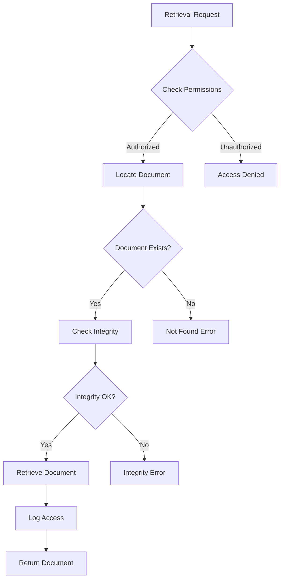

# SP33 - Archive Manager

## Descrizione Componente

Il **SP33 Archive Manager** è il componente core del sistema di gestione archivio, responsabile della gestione completa del ciclo di vita documentale. Implementa le policy di retention, classificazione automatica e orchestrazione dei workflow di archiviazione secondo gli standard OAIS e le normative CAD.

## Responsabilità

- **Gestione Ciclo Vita**: Implementazione policy retention e lifecycle management
- **Classificazione Automatica**: Determinazione tier di storage basato su metadata
- **Orchestrazione Workflow**: Coordinamento processi archiviazione e retrieval
- **Access Control**: Gestione autorizzazioni e audit trail
- **Integration Gateway**: Interfaccia con altri UC per ingestion documenti

## Architettura Interna

```
┌─────────────────────────────────────────────────────────────┐
│                    API GATEWAY LAYER                        │
│  ┌─────────────────────────────────────────────────────────┐ │
│  │  REST API              GraphQL API          WebSocket   │ │
│  │  ┌─────────────────┐    ┌────────────────┐   ┌─────────┐ │ │
│  │  │  - CRUD Ops     │    │  - Complex Q  │   │  - RT    │ │
│  │  │  - File Upload  │    │  - Analytics  │   │  - Notif │ │
│  │  │  - Batch Import │    │  - Federation │   │  - Status│ │
│  │  └─────────────────┘    └────────────────┘   └─────────┘ │ │
└─────────────────────────────────────────────────────────────┘
│                    BUSINESS LOGIC LAYER                     │
│  ┌─────────────────────────────────────────────────────────┐ │
│  │  Lifecycle Manager     Classification Engine   Access   │ │
│  │  ┌─────────────────┐    ┌────────────────┐   ┌─────────┐ │ │
│  │  │  - Retention    │    │  - AI Class   │   │  - RBAC  │ │
│  │  │  - Migration    │    │  - Metadata   │   │  - Audit │ │
│  │  │  - Disposal     │    │  - Policy     │   │  - JWT   │ │
│  │  └─────────────────┘    └────────────────┘   └─────────┘ │ │
└─────────────────────────────────────────────────────────────┘
│                    DATA ACCESS LAYER                        │
│  ┌─────────────────────────────────────────────────────────┐ │
│  │  PostgreSQL             Redis Cache          MinIO      │ │
│  │  ┌─────────────────┐    ┌────────────────┐   ┌─────────┐ │ │
│  │  │  - Metadata     │    │  - Sessions    │   │  - Docs │ │
│  │  │  - Policies     │    │  - ACL         │   │  - Index │ │
│  │  │  - Audit        │    │  - Locks       │   │  - Vers  │ │
│  │  └─────────────────┘    └────────────────┘   └─────────┘ │ │
└─────────────────────────────────────────────────────────────┘
```

## API Endpoints

### Document Management
```http
POST   /api/v1/documents/archive
GET    /api/v1/documents/{id}
PUT    /api/v1/documents/{id}/metadata
DELETE /api/v1/documents/{id}
GET    /api/v1/documents/search
```

### Lifecycle Management
```http
POST   /api/v1/lifecycle/policies
GET    /api/v1/lifecycle/policies/{id}
PUT    /api/v1/lifecycle/policies/{id}
POST   /api/v1/lifecycle/migrate
POST   /api/v1/lifecycle/dispose
```

### Access Control
```http
POST   /api/v1/acl/grant
POST   /api/v1/acl/revoke
GET    /api/v1/acl/{resource}/permissions
GET    /api/v1/audit/events
```

## Modelli Dati

### Document Entity

Il modello Document rappresenta l'entità principale per la gestione dei documenti nell'archivio:

**Struttura Base**:
- Identificatore univoco del documento con UUID
- Metadata descrittivi (titolo, autore, data creazione)
- Informazioni di classificazione e categorizzazione
- Riferimenti ai file fisici e versioni
- Timestamp di creazione e modifica

**Metadata Enrichment**:
- Estrazione automatica di metadati tecnici (formato, dimensione, checksum)
- Classificazione basata su contenuto e contesto
- Tag semantici per ricerca avanzata
- Relazioni con altri documenti e processi

**Versioning Support**:
- Gestione versioni multiple dello stesso documento
- Tracking delle modifiche e differenze
- Rollback capabilities per recovery
- Audit trail completo delle versioni

### Retention Policy

Le policy di retention definiscono le regole per la conservazione e disposal dei documenti:

**Policy Definition**:
- Regole temporali per retention minima e massima
- Criteri di classificazione per categorie documentali
- Condizioni speciali per documenti sensibili
- Trigger automatici per review periodica

**Lifecycle Management**:
- Transizioni automatiche tra stati di conservazione
- Migrazione tra tier di storage basata su età
- Disposal sicuro con certificazione di cancellazione
- Audit trail completo per compliance

## Workflow Engine

### Archive Workflow

Il workflow di archiviazione gestisce l'intero processo di ingestion e storage dei documenti:

**Document Ingestion**:
- Validazione iniziale del documento ricevuto
- Estrazione e arricchimento dei metadati
- Classificazione automatica basata su regole e AI
- Determinazione del tier di storage appropriato

**Storage Processing**:
- Generazione di hash per integrità
- Archiviazione fisica del documento
- Aggiornamento degli indici di ricerca
- Applicazione delle policy di retention

**Audit & Notification**:
- Logging completo di tutte le operazioni
- Notifiche agli stakeholder interessati
- Aggiornamenti dello stato del documento
- Preparazione per retrieval futuro

### Retrieval Workflow

Il workflow di retrieval gestisce l'accesso e la consegna dei documenti archiviati:

**Access Request**:
- Validazione delle autorizzazioni di accesso
- Verifica delle policy di retention
- Controllo di integrità del documento
- Logging della richiesta per audit

**Document Delivery**:
- Recupero dal tier di storage appropriato
- Conversione formato se necessario
- Applicazione di watermark o protezioni
- Tracciamento dell'accesso per compliance

**Post-Retrieval Processing**:
- Aggiornamento delle statistiche di utilizzo
- Verifica di eventuali obblighi di notifica
- Preparazione per archiviazione futura se modificato
- Cleanup delle risorse temporanee


## Algoritmi di Classificazione

### Rule-Based Classification

### AI-Powered Classification

## Sicurezza

### Authentication & Authorization
- **JWT Tokens**: Per autenticazione stateless
- **RBAC**: Role-based access control
- **ABAC**: Attribute-based permissions
- **Audit Trail**: Logging completo di tutti gli accessi

### Data Protection
- **Encryption**: AES-256 at rest
- **Hashing**: SHA-256 per integrità
- **Digital Signatures**: Per documenti critici
- **Secure Deletion**: Multi-pass wiping

## Performance & Scalabilità

### Caching Strategy
- **Metadata Cache**: Redis per metadata frequenti
- **ACL Cache**: In-memory per permissions
- **Search Cache**: Elasticsearch per risultati query

### Database Optimization
- **Partitioning**: Per data ranges
- **Indexing**: Composite indexes per query patterns
- **Connection Pooling**: PgBouncer per PostgreSQL

### Async Processing
- **Queue System**: Redis Queue per operazioni pesanti
- **Background Jobs**: Celery per workflow complessi
- **Event Streaming**: Kafka per notifiche cross-component

## Monitoraggio

### Metrics

### Health Checks
- **Database Connectivity**: PostgreSQL ping
- **Storage Accessibility**: MinIO health check
- **Queue Health**: Redis connectivity
- **Dependency Status**: SP34, SP35, SP36 health

## Configurazione

### Environment Variables
```bash
# Database
DB_HOST=postgres-archive
DB_PORT=5432
DB_NAME=archive_db

# Storage
MINIO_ENDPOINT=minio:9000
MINIO_ACCESS_KEY=archive_key
MINIO_SECRET_KEY=archive_secret

# Security
JWT_SECRET_KEY=your-secret-key
HSM_MODULE_PATH=/usr/lib/hsm

# Performance
MAX_WORKERS=10
CACHE_TTL=3600
```

### Policy Configuration
```yaml
retention_policies:
  - name: "Administrative Documents"
    retention: "10 years"
    disposal: "secure_delete"
    triggers:
      - type: "date_expires"
      - type: "manual_review"

  - name: "Legal Documents"
    retention: "permanent"
    disposal: "none"
    triggers:
      - type: "never"
```

## Testing

### Unit Tests

### Integration Tests
- **End-to-End Archive**: Document upload → storage → retrieval
- **Lifecycle Management**: Policy application → migration → disposal
- **Multi-Component**: Integration con SP34, SP35, SP36

### Performance Tests
- **Load Testing**: 1000 concurrent archives
- **Stress Testing**: Peak load scenarios
- **Volume Testing**: Large document sets

## Deployment

### Docker Configuration
```dockerfile
FROM python:3.11-slim

WORKDIR /app
COPY requirements.txt .
RUN pip install -r requirements.txt

COPY . .
EXPOSE 8000

CMD ["uvicorn", "main:app", "--host", "0.0.0.0", "--port", "8000"]
```

### Kubernetes Manifest
```yaml
apiVersion: apps/v1
kind: Deployment
metadata:
  name: archive-manager
spec:
  replicas: 3
  selector:
    matchLabels:
      app: archive-manager
  template:
    metadata:
      labels:
        app: archive-manager
    spec:
      containers:
      - name: archive-manager
        image: archive-manager:latest
        ports:
        - containerPort: 8000
        envFrom:
        - configMapRef:
            name: archive-config
        - secretRef:
            name: archive-secrets
        resources:
          requests:
            memory: "512Mi"
            cpu: "500m"
          limits:
            memory: "2Gi"
            cpu: "2000m"
```

## Disaster Recovery

### Backup Strategy
- **Database**: Daily PostgreSQL dumps
- **Documents**: Cross-region MinIO replication
- **Configuration**: GitOps with ArgoCD

### Recovery Procedures
1. **Database Restore**: Point-in-time recovery
2. **Document Restore**: MinIO replication failover
3. **Application Restart**: Rolling deployment
4. **Integrity Verification**: Full hash validation

## Roadmap

### Version 1.0 (Current)
- Basic archive/retrieval
- Rule-based classification
- PostgreSQL storage

### Version 2.0 (Next)
- AI classification
- Advanced retention policies
- Multi-region replication

### Version 3.0 (Future)
- Blockchain integrity
- Quantum-safe signatures
- Predictive lifecycle management</content>
<parameter name="filePath">/Users/giangio/Documents/GitHub/Interzen/Interzen.POC/ZenIA/docs/use_cases/UC7 - Sistema di Gestione Archivio e Conservazione/01 SP33 - Archive Manager.md