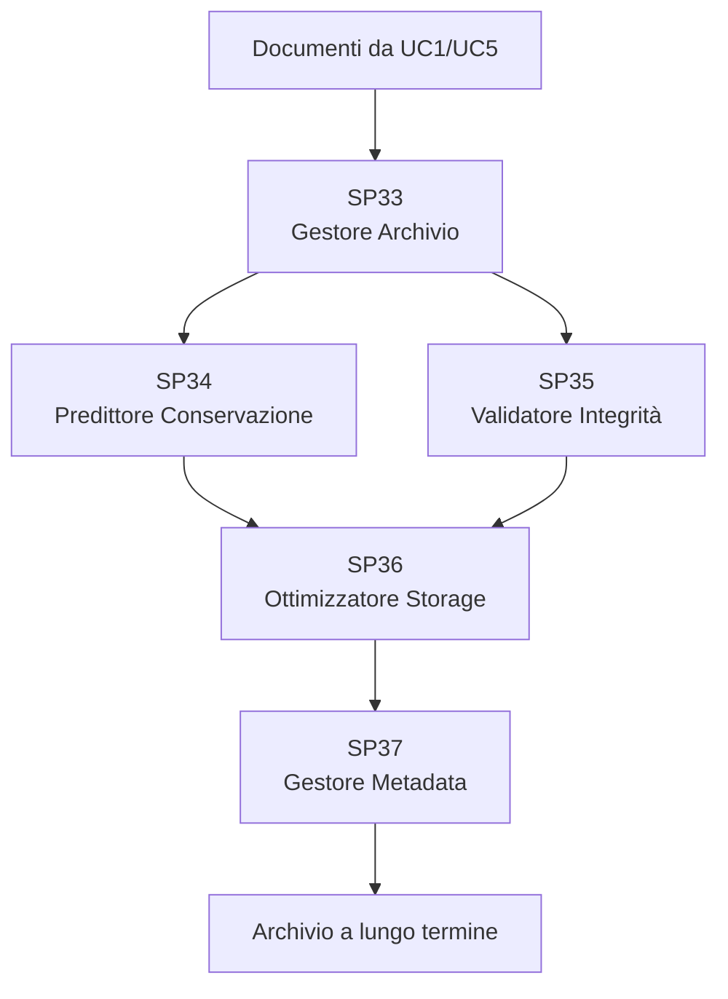

# Matrice Dipendenze - UC7 Conservazione Digitale

## Overview Dipendenze

## Matrice Dipendenze

| SP | Dipendenze In | Dipendenze Out | Dati | Criticità |
|---|---|---|---|---|
| **SP33 Gestore** | Documenti | SP34, SP35, SP36 | Metadata archivio | ALTA |
| **SP34 Predittore** | SP33 | SP36 | Predizioni di rischio | MEDIA |
| **SP35 Validatore** | SP33 | SP36 | Risultati validazione | ALTA |
| **SP36 Storage** | SP34, SP35 | SP37 | Documenti archiviati | CRITICA |
| **SP37 Metadata** | SP36 | Archivio | Record metadata | ALTA |

## Flusso Dati Principale

Documento (UC1/UC5) → SP33 (Gestore) → SP34 (Predizione) & SP35 (Validazione) → SP36 (Storage) → SP37 (Metadata) → Archivio

## Dipendenze Critiche

1. SP33 → SP34/SP35 → SP36: Classificazione e validazione devono completarsi prima dello storage
2. SP36: Punto unico di storage (mitigato da replicazione)
3. SP37: Il tagging dei metadata è richiesto per la conservazione a lungo termine

## Mitigazioni

- SP36: Replicazione 3-way, geo-distribuita
- SP34: Cache delle classificazioni (TTL 24h)
- SP36: Validazione in tempo reale richiesta
- SP35: Predizioni asincrone accettabili

## Tecnologie

| SP | Linguaggio | Framework | Storage |
|---|---|---|---|
| SP33 | Python | FastAPI | PostgreSQL |
| SP34 | Python | Scikit-learn | TimescaleDB |
| SP35 | Python | FastAPI | PostgreSQL |
| SP36 | Python | FastAPI | MinIO + S3 |
| SP37 | Python | FastAPI + Elasticsearch | PostgreSQL + Elasticsearch |

## KPIs

- **SP33**: Accuratezza gestore > 95%, Latency < 2s
- **SP34**: Accuratezza predizione > 90%, Elaborazione batch
- **SP35**: Latency validazione < 2s, Tasso errori < 0.1%
- **SP36**: Recupero archivio < 30s, Disponibilità 99.99%
- **SP37**: Latency indicizzazione metadata < 5s, Ricerca < 500ms

## Ordine Implementazione

1. SP33 (Gestore - base)
2. SP35 (Validatore - controlli di validazione)
3. SP36 (Storage Manager - storage archivio)
4. SP37 (Gestore Metadata - indicizzazione/ricerca)
5. SP34 (Predittore - miglioramento, asincrono)

