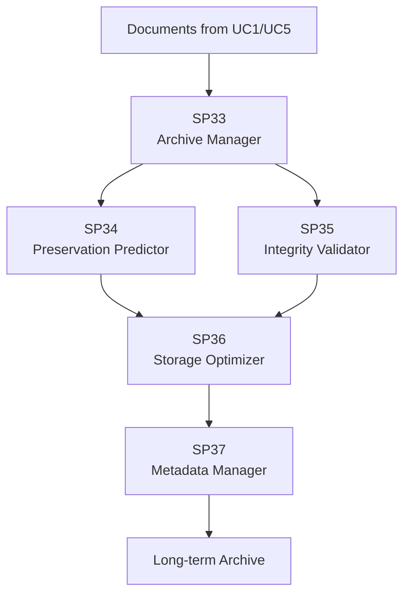

# Matrice Dipendenze - UC7 Conservazione Digitale

## Overview Dipendenze

## Matrice Dipendenze

| SP | Dipendenze In | Dipendenze Out | Dati | Criticità |
|---|---|---|---|---|
| **SP33 Manager** | Documents | SP34, SP35, SP36 | Archive metadata | ALTA |
| **SP34 Predictor** | SP33 | SP36 | Risk predictions | MEDIA |
| **SP35 Validator** | SP33 | SP36 | Validation results | ALTA |
| **SP36 Storage** | SP34, SP35 | SP37 | Stored documents | CRITICA |
| **SP37 Metadata** | SP36 | Archive | Metadata records | ALTA |

## Flusso Dati Principale

Document (UC1/UC5) → SP33 (Manager) → SP34 (Predict) & SP35 (Validate) → SP36 (Storage) → SP37 (Metadata) → Archive

## Dipendenze Critiche

1. SP33 → SP34/SP35 → SP36: Classification and validation must complete before storage
2. SP36: Single point of storage (mitigated by replication)
3. SP37: Metadata tagging required for long-term preservation

## Mitigazioni

- SP36: 3-way replication, geo-distributed
- SP34: Cache classifications (TTL 24h)
- SP36: Real-time validation required
- SP35: Async predictions acceptable

## Tecnologie

| SP | Language | Framework | Storage |
|---|---|---|---|
| SP33 | Python | FastAPI | PostgreSQL |
| SP34 | Python | Scikit-learn | TimescaleDB |
| SP35 | Python | FastAPI | PostgreSQL |
| SP36 | Python | FastAPI | MinIO + S3 |
| SP37 | Python | FastAPI + Elasticsearch | PostgreSQL + Elasticsearch |

## KPIs

- **SP33**: Manager accuracy > 95%, Latency < 2s
- **SP34**: Prediction accuracy > 90%, Batch processing
- **SP35**: Validation latency < 2s, Error rate < 0.1%
- **SP36**: Archive retrieval < 30s, Availability 99.99%
- **SP37**: Metadata indexing latency < 5s, Search < 500ms

## Ordine Implementazione

1. SP33 (Manager - base)
2. SP35 (Validator - validation checks)
3. SP36 (Storage Manager - archive storage)
4. SP37 (Metadata Manager - indexing/search)
5. SP34 (Predictor - enhancement, async)

