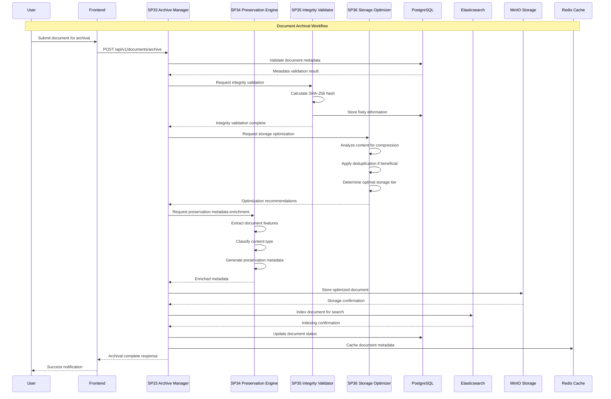
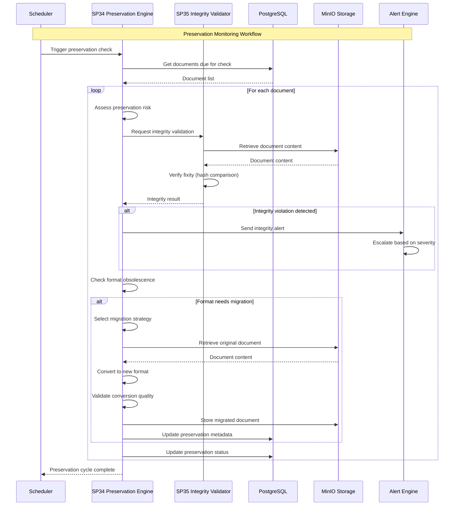
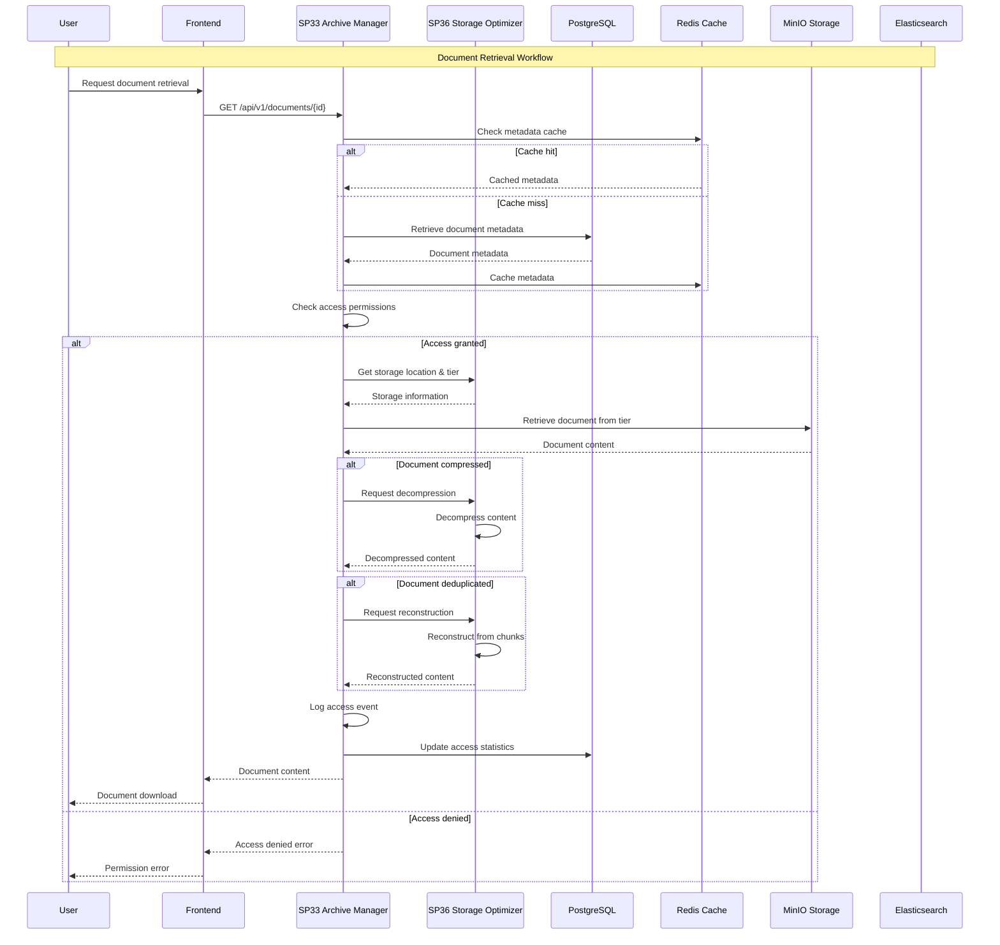
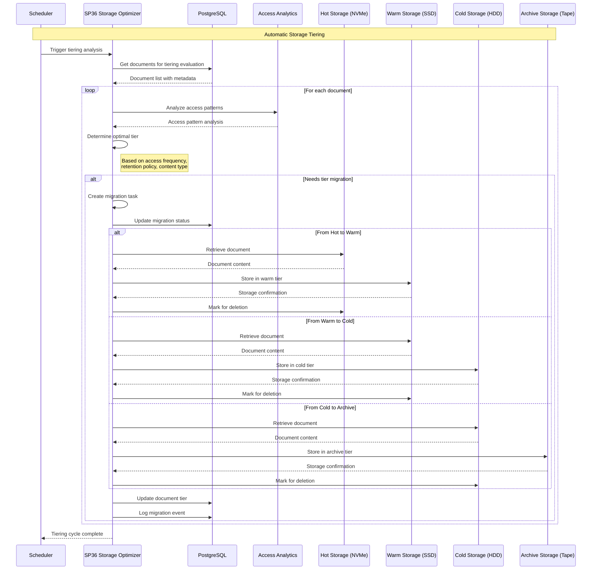
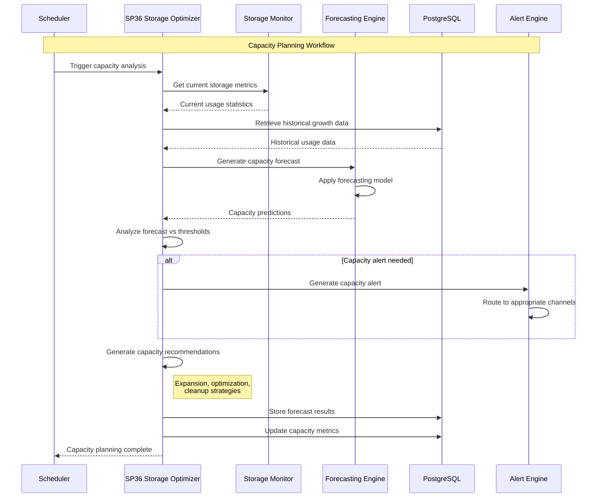
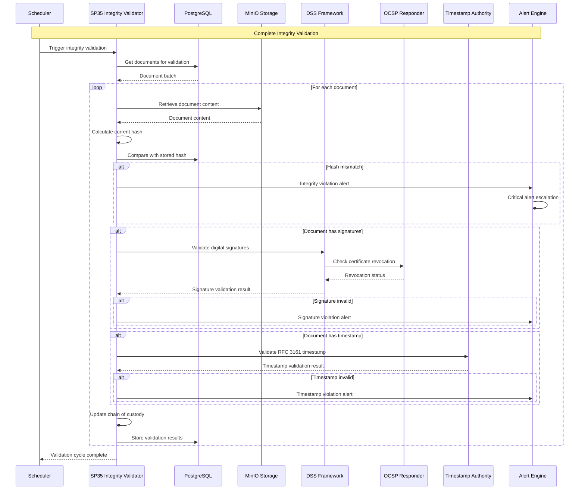
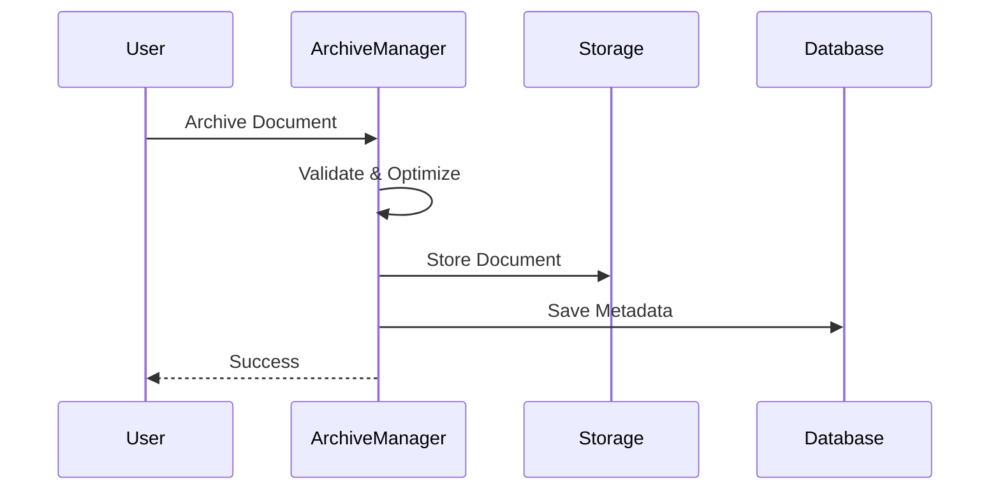
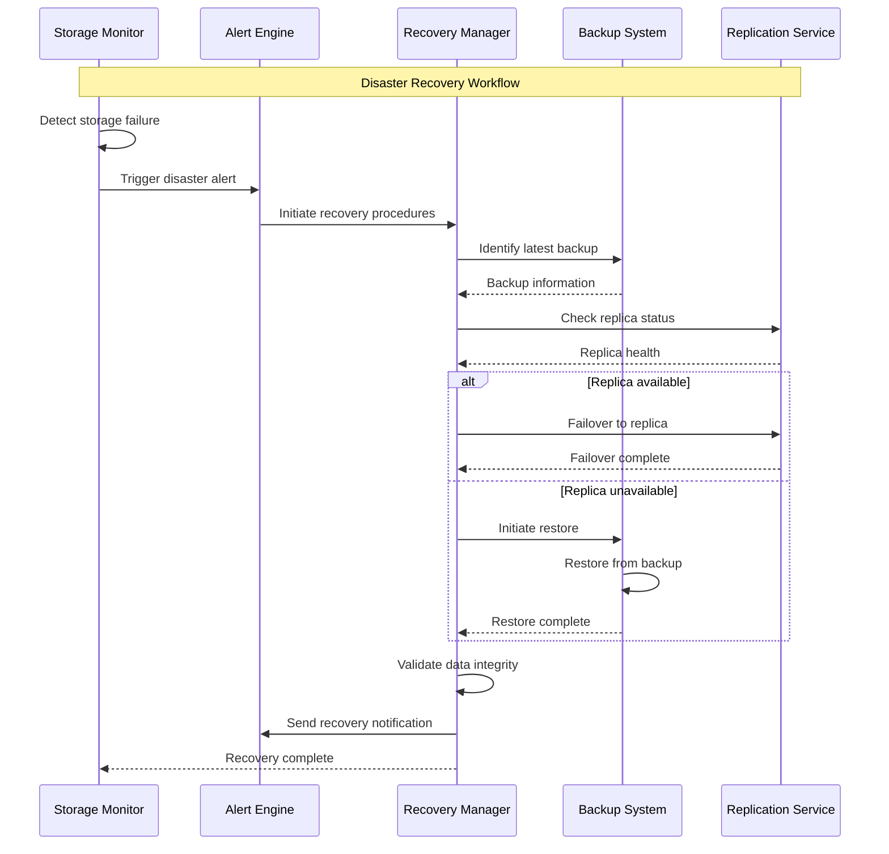
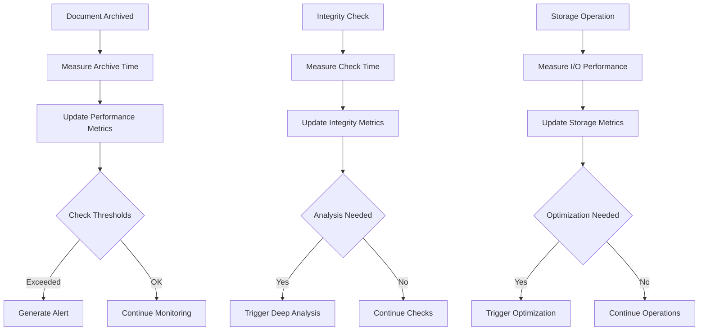

# 01 Sequence diagrams - UC7 Sistema di Gestione Archivio e Conservazione

## Diagramma Completo Workflow Archiviazione



## Diagramma Preservation Monitoring



## Diagramma Retrieval Ottimizzato



## Diagramma Storage Tiering Automatico



## Diagramma Capacity Planning



## Diagramma Integrity Validation Completo



## Diagramma Ultra-Semplificato Archiviazione



## Workflow di Emergenza e Recovery



## Metriche e Monitoraggio

### Performance Metrics Flow


### Alert Escalation Flow
```mermaid
graph TD
    A[Alert Detected] --> B{Determine Severity}
    B -->|Critical| C[Immediate Escalation]
    B -->|High| D[Management Alert]
    B -->|Medium| E[Team Notification]
    B -->|Low| F[Log Only]

    C --> G[Pager Alert]
    D --> H[Email + Slack]
    E --> I[Slack Notification]
    F --> J[Central Logging]

    G --> K[Incident Response]
    H --> L[Review Meeting]
    I --> M[Daily Report]
    J --> N[Weekly Review]
```</content>
<parameter name="filePath">/Users/giangio/Documents/GitHub/Interzen/Interzen.POC/ZenIA/docs/use_cases/UC7 - Sistema di Gestione Archivio e Conservazione/01 Sequence diagrams.md
