# 01 Sequence diagrams

## Diagramma di Sequenza 1: Raccolta e Normalizzazione Eventi Sicurezza


## Diagramma di Sequenza 2: Elaborazione e Correlazione Eventi

```mermaid
sequenceDiagram
    participant Consumer as Kafka Consumer
    participant Processor as SP39 SIEM Processor
    participant Filter as Initial Filter
    participant Correlator as Correlation Engine
    participant AnomalyDetector as Anomaly Detector
    participant ThreatDetector as Threat Detector
    participant AlertEngine as Alert Engine
    participant IncidentMgr as Incident Manager
    participant Storage as SP40 SIEM Storage

    Consumer->>Processor: Poll eventi da Kafka
    activate Processor

    loop Per ogni evento
        Processor->>Filter: Applica filtri iniziali
        activate Filter
        Filter-->>Processor: Event filtered/approved
        deactivate Filter

        Processor->>Correlator: Correlazione evento
        activate Correlator
        Correlator->>Correlator: Cerca correlazioni temporali
        Correlator->>Correlator: Cerca correlazioni attributi
        Correlator->>Correlator: Cerca correlazioni comportamentali
        Correlator-->>Processor: Evento correlato
        deactivate Correlator

        Processor->>AnomalyDetector: Rilevamento anomalie
        activate AnomalyDetector
        AnomalyDetector->>AnomalyDetector: Analisi statistica
        AnomalyDetector->>AnomalyDetector: Analisi comportamentale
        AnomalyDetector->>AnomalyDetector: Analisi ML
        AnomalyDetector-->>Processor: Score anomalia
        deactivate AnomalyDetector

        Processor->>ThreatDetector: Rilevamento minacce
        activate ThreatDetector
        ThreatDetector->>ThreatDetector: Match IOC
        ThreatDetector->>ThreatDetector: Match YARA rules
        ThreatDetector->>ThreatDetector: Analisi comportamentale
        ThreatDetector-->>Processor: Match minacce
        deactivate ThreatDetector

        Processor->>AlertEngine: Genera alert
        activate AlertEngine
        AlertEngine->>AlertEngine: Calcola severità
        AlertEngine->>AlertEngine: Verifica soppressioni
        AlertEngine->>AlertEngine: Invia notifiche
        AlertEngine-->>Processor: Alert generati
        deactivate AlertEngine

        Processor->>IncidentMgr: Gestisci incidenti
        activate IncidentMgr
        IncidentMgr->>IncidentMgr: Cerca incidenti correlati
        IncidentMgr->>IncidentMgr: Crea/aggiorna incidente
        IncidentMgr->>IncidentMgr: Avvia workflow
        IncidentMgr-->>Processor: Incidenti gestiti
        deactivate IncidentMgr

        Processor->>Storage: Archivia evento elaborato
        activate Storage
        Storage-->>Processor: Conferma archiviazione
        deactivate Storage
    end

    Processor->>Consumer: Commit offset
    deactivate Processor
```



## Diagramma di Sequenza 3: Archiviazione Multi-Tier


## Diagramma di Sequenza 4: Analytics e Reporting Real-Time


## Diagramma di Sequenza 5: Threat Hunting e Investigation


## Diagramma di Sequenza 6: Compliance Monitoring e Reporting

```mermaid
sequenceDiagram
    participant Scheduler as Report Scheduler
    participant Reporting as SP41 Reporting Engine
    participant DataSource as Analytics Data Source
    participant Calculator as Compliance Calculator
    participant Template as Report Template
    participant PDF as PDF Generator
    participant Distributor as Report Distributor
    participant Recipient as Compliance Officer
    participant Auditor as External Auditor

    Scheduler->>Reporting: Trigger report generation
    activate Scheduler
    note over Scheduler: Scheduled (monthly/quarterly)

    Reporting->>DataSource: Raccogli dati compliance
    activate Reporting
    DataSource-->>Reporting: Compliance data
    deactivate DataSource

    Reporting->>Calculator: Calcola compliance score
    activate Calculator
    Calculator->>Calculator: Analyze controls
    Calculator->>Calculator: Check violations
    Calculator->>Calculator: Calculate metrics
    Calculator-->>Reporting: Compliance score
    deactivate Calculator

    Reporting->>Template: Render report template
    activate Template
    Template->>Template: Populate data
    Template->>Template: Format content
    Template-->>Reporting: HTML report
    deactivate Template

    Reporting->>PDF: Convert to PDF
    activate PDF
    PDF-->>Reporting: PDF report
    deactivate PDF

    Reporting->>Distributor: Distribuisci report
    activate Distributor
    Distributor->>Recipient: Invia email interno
    Distributor->>Auditor: Invia email esterno
    Distributor-->>Reporting: Delivery confirmation
    deactivate Distributor

    deactivate Reporting
    deactivate Scheduler

    Recipient->>Recipient: Review report
    Auditor->>Auditor: Review for audit
```

## Diagramma di Sequenza 7: Predictive Analytics e Risk Assessment


## Diagramma di Sequenza 8: Incident Response Automation

```mermaid
sequenceDiagram
    participant Alert as Alert Engine
    participant SOAR as SOAR Platform
    participant Incident as Incident Manager
    participant Workflow as Workflow Engine
    participant Enricher as Incident Enricher
    participant Responder as Automated Responder
    participant Analyst as Security Analyst
    participant Assets as Asset Management
    participant Network as Network Controls

    Alert->>SOAR: Nuovo alert critico
    activate Alert

    SOAR->>Incident: Crea incidente
    activate SOAR
    Incident-->>SOAR: Incident ID
    deactivate Incident

    SOAR->>Workflow: Avvia workflow response
    activate Workflow
    Workflow->>Enricher: Arricchisci incidente
    activate Enricher
    Enricher->>Assets: Lookup asset info
    Assets-->>Enricher: Asset details
    Enricher->>Enricher: Gather context
    Enricher-->>Workflow: Enriched incident
    deactivate Enricher

    Workflow->>Responder: Esegui automated response
    activate Responder

    alt Tipo minaccia: Malware
        Responder->>Network: Isolate host
        Network-->>Responder: Isolation confirmed
        Responder->>Responder: Quarantine files
    else Tipo minaccia: Brute force
        Responder->>Network: Block source IP
        Network-->>Responder: Block confirmed
        Responder->>Responder: Reset passwords
    end

    Responder-->>Workflow: Response completed
    deactivate Responder

    Workflow->>Analyst: Assegna investigation
    activate Analyst
    Analyst->>Workflow: Investigation in progress
    Analyst->>SOAR: Richiedi additional actions
    SOAR->>Responder: Execute manual actions
    Responder-->>SOAR: Actions completed
    Analyst->>Workflow: Investigation completed
    deactivate Analyst

    Workflow->>Workflow: Update incident status
    Workflow-->>SOAR: Workflow completed
    deactivate Workflow

    deactivate SOAR
    deactivate Alert
```

## Legenda Sequenze

### Attori Principali
- **Agent**: Agenti di raccolta log (Wazuh, Filebeat)
- **Collector**: SP38 SIEM Collector
- **Processor**: SP39 SIEM Processor
- **Storage**: SP40 SIEM Storage
- **Analytics**: SP41 SIEM Analytics & Reporting
- **SOAR**: Security Orchestration, Automation & Response
- **Analyst**: Analista sicurezza

### Flussi Dati
- **Event Flow**: Flusso eventi da raccolta ad archiviazione
- **Processing Flow**: Elaborazione e analisi eventi
- **Storage Flow**: Lifecycle dati multi-tier
- **Analytics Flow**: Generazione insight e report
- **Response Flow**: Risposta automatica e manuale

### Pattern Architetturali
- **Streaming**: Elaborazione real-time con Kafka/Flink
- **Batch**: Elaborazione batch con Spark
- **Multi-tier**: Archiviazione gerarchica hot/warm/cold
- **Event-driven**: Architettura basata su eventi
- **Microservices**: Componenti loosely coupled</content>
<parameter name="filePath">/Users/giangio/Documents/GitHub/Interzen/Interzen.POC/ZenIA/docs/use_cases/UC8 - Integrazione con SIEM (Sicurezza Informatica)/01 Sequence diagrams.md