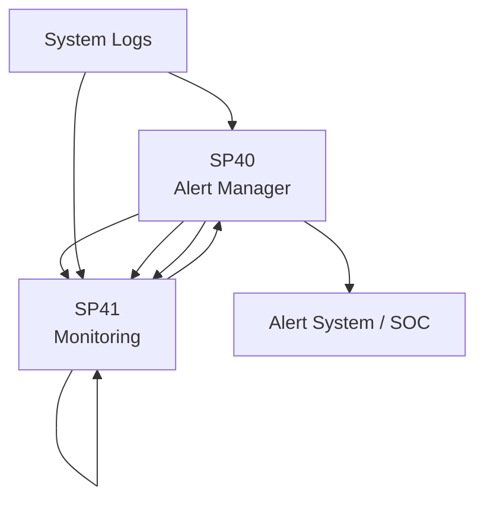

# Matrice Dipendenze - UC8 Integrazione SIEM

## Overview

## Dipendenze

| SP | In | Out | Criticità |
|---|---|---|---|
| **SP40 Anomaly Detector** | System logs | SP41, SP41 | CRITICA |
| **SP41 Incident Predictor** | SP40 | SP40, SP41 | ALTA |
| **SP40 Alert Manager** | SP41 | Alert system | CRITICA |
| **SP41 Monitoring** | SP40, SP41, SP40 | Dashboards | MEDIA |

## Flusso Principale

System Logs → SP40 (Detect anomalies) → SP41 (Predict incidents) → SP40 (Alert) → SOC

## Criticità

1. SP40: Anomaly detection is base layer (HARD dependency for all)
2. SP40: Alert generation required for SOC notification
3. SP41: Monitoring helps track all detections

## Mitigazioni

- SP40: Multi-model ensemble for accuracy
- SP40: Alert queue for retry
- SP41: Real-time dashboards for visibility

## KPIs

- **SP40**: Anomaly detection latency < 5s, False positive rate < 5%
- **SP41**: Incident prediction accuracy > 85%, Latency < 10s
- **SP40**: Alert delivery SLA < 30s, Escalation < 5min
- **SP41**: Dashboard refresh < 10s, Availability 99.9%

## Implementazione

1. SP40 (Anomaly detection)
2. SP41 (Monitoring)
3. SP41 (Prediction)
4. SP40 (Alerting)

