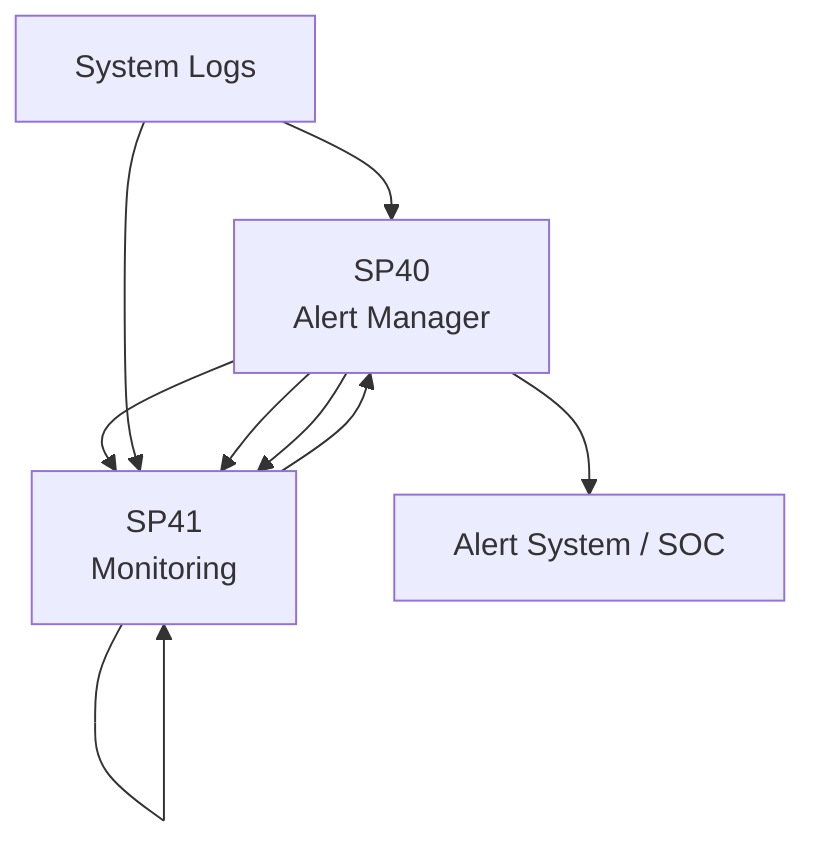
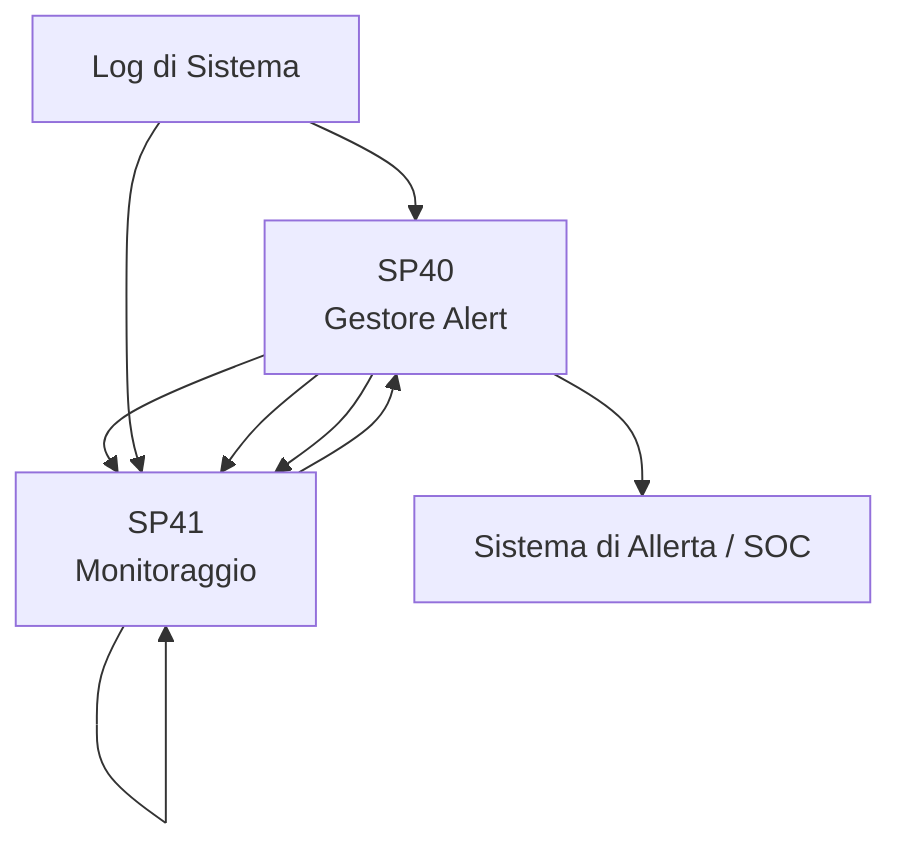

# Matrice Dipendenze - UC8 Integrazione SIEM

## Overview



## Dipendenze

| SP | In | Out | Criticità |
|---|---|---|---|
| **SP40 Anomaly Detector** | System logs | SP41, SP41 | CRITICA |
| **SP41 Incident Predictor** | SP40 | SP40, SP41 | ALTA |
| **SP40 Alert Manager** | SP41 | Alert system | CRITICA |
| **SP41 Monitoring** | SP40, SP41, SP40 | Dashboards | MEDIA |

```markdown
# Matrice Dipendenze - UC8 Integrazione SIEM

## Panoramica



## Dipendenze

| SP | In | Out | Criticità |
|---|---|---|---|
| **SP40 Rilevatore di Anomalie** | Log di sistema | SP41 | CRITICA |
| **SP41 Predittore di Incidenti** | SP40 | SP40, SP41 | ALTA |
| **SP40 Gestore Alert** | SP41 | Sistema di Allerta | CRITICA |
| **SP41 Monitoraggio** | SP40, SP41 | Dashboard | MEDIA |

## Flusso Principale

Log di Sistema → SP40 (Rileva anomalie) → SP41 (Predice incidenti) → SP40 (Genera alert) → SOC

## Criticità

1. SP40: Il rilevatore di anomalie è il livello base (dipendenza HARD per tutti)
2. SP40: La generazione di alert è necessaria per le notifiche SOC
3. SP41: Il monitoraggio aiuta a tracciare tutte le rilevazioni

## Mitigazioni

- SP40: Ensemble multi-modello per maggiore accuratezza
- SP40: Coda di alert per retry
- SP41: Dashboard in tempo reale per visibilità

## KPI

- **SP40**: Latency rilevazione anomalie < 5s, tasso falsi positivi < 5%
- **SP41**: Accuratezza predizione incidenti > 85%, Latency < 10s
- **SP40**: SLA consegna alert < 30s, Escalation < 5min
- **SP41**: Refresh dashboard < 10s, Disponibilità 99.9%

## Implementazione

1. SP40 (Rilevazione anomalie)
2. SP41 (Monitoraggio)
3. SP41 (Predizione)
4. SP40 (Alerting)

