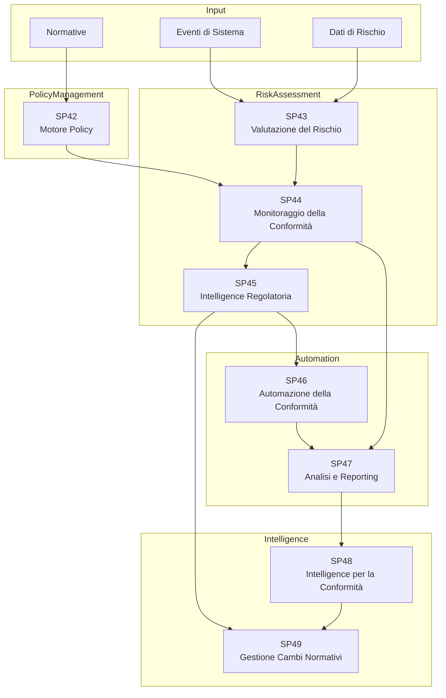

# Matrice Dipendenze - UC9 Compliance e Gestione del Rischio

## Panoramica

## Dipendenze

| SP | In | Out | Criticità |
|---|---|---|---|
| **SP42 Motore Policy** | Normative | SP44 | CRITICA |
| **SP43 Valutazione del Rischio** | Eventi, Dati di Rischio | SP44 | CRITICA |
| **SP44 Monitoraggio della Conformità** | SP42, SP43 | SP45, SP47 | CRITICA |
| **SP45 Intelligence Regolatoria** | SP44 | SP46, SP49 | ALTA |
| **SP46 Automazione della Conformità** | SP45 | SP47 | ALTA |
| **SP47 Analisi e Reporting** | SP44, SP46 | SP48 | ALTA |
| **SP48 Intelligence per la Conformità** | SP47 | SP49 | MEDIA |
| **SP49 Gestione Cambi Normativi** | SP45, SP48 | Esterna | MEDIA |

## Flusso Principale

Normative → SP42 (Definisce le policy) → SP43 (Valuta i rischi) → SP44 (Monitora la conformità) → SP47 (Analisi) → SP48 (Intelligence) → SP49 (Gestione cambiamenti)

## Criticità

1. SP42: Il motore policy è fondamentale (qui sono definite tutte le regole di conformità)
2. SP43: La valutazione del rischio guida le priorità del monitoraggio della conformità
3. SP44: Il monitoraggio della conformità è il centro di controllo (valida le operazioni)
4. SP48: La piattaforma di intelligence individua pattern e minacce
5. SP49: La gestione dei cambiamenti normativi garantisce conformità proattiva

## Mitigazioni

- SP42: Controllo versione e audit su tutte le modifiche alle policy
- SP43: Scoring del rischio continuo con modelli ML
- SP44: Monitoraggio della conformità in tempo reale con alerting
- SP47: Analisi delle serie storiche per rilevare pattern
- SP48: Modelli predittivi per la rilevazione precoce delle minacce
- SP49: Alimentazione automatica di intelligence normativa

## KPI

- **SP42**: Copertura Motore Policy 100%, Latency aggiornamenti < 1h
- **SP43**: Latency valutazione rischio < 5m, Accuratezza modello > 90%
- **SP44**: Latency controllo conformità < 2s, Tasso falsi positivi < 2%
- **SP45**: Copertura intelligence normativa 100%, Latency aggiornamenti < 24h
- **SP46**: Tasso esecuzione automazioni > 95%, SLA compliance > 98%
- **SP47**: Refresh analisi < 1h, Completezza dati > 99%
- **SP48**: Accuratezza intelligence > 90%, Tasso rilevazione minacce > 95%
- **SP49**: Efficacia gestione cambiamenti > 90%, Conformità normativa 100%

## Implementazione

1. SP42 (Motore Policy - policy fondamentali)
2. SP43 (Valutazione del Rischio - scoring di base)
3. SP44 (Monitoraggio della Conformità - regole core di monitoraggio)
4. SP47 (Analisi e Reporting - analisi storica)
5. SP46 (Automazione della Conformità - risposte automatizzate)
6. SP48 (Intelligence per la Conformità - rilevazione avanzata di pattern)
7. SP45 (Intelligence Regolatoria - feed di intelligence esterni)
8. SP49 (Gestione Cambi Normativi - adattamento proattivo)

