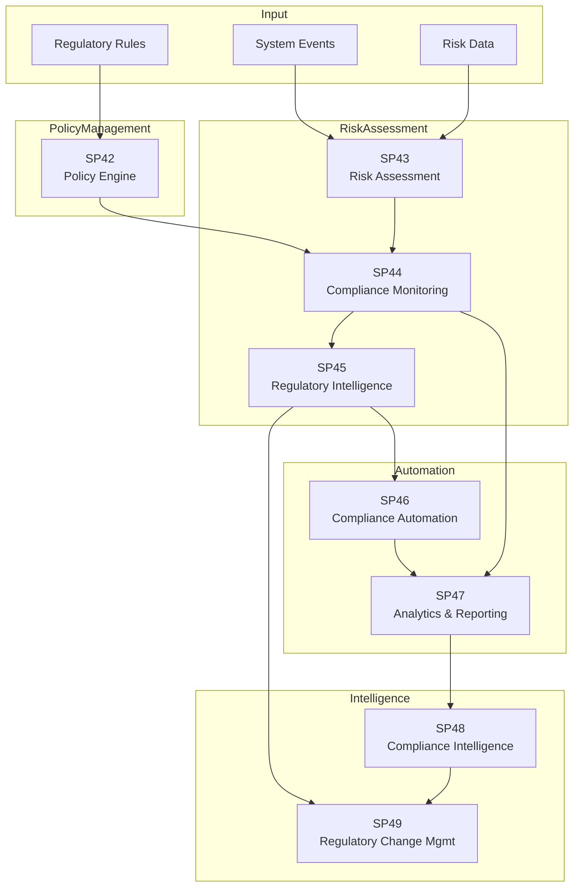

# Matrice Dipendenze - UC9 Compliance & Risk Management

## Overview

## Dipendenze

| SP | In | Out | Criticità |
|---|---|---|---|
| **SP42 Policy Engine** | Regulations | SP44 | CRITICA |
| **SP43 Risk Assessment** | Events, Risk Data | SP44 | CRITICA |
| **SP44 Compliance Monitoring** | SP42, SP43 | SP45, SP47 | CRITICA |
| **SP45 Regulatory Intelligence** | SP44 | SP46, SP49 | ALTA |
| **SP46 Compliance Automation** | SP45 | SP47 | ALTA |
| **SP47 Analytics & Reporting** | SP44, SP46 | SP48 | ALTA |
| **SP48 Compliance Intelligence** | SP47 | SP49 | MEDIA |
| **SP49 Regulatory Change Mgmt** | SP45, SP48 | External | MEDIA |

## Flusso Principale

Regulations → SP42 (Define policies) → SP43 (Assess risks) → SP44 (Monitor compliance) → SP47 (Analytics) → SP48 (Intelligence) → SP49 (Change management)

## Criticità

1. SP42: Policy Engine is foundational (all compliance rules defined here)
2. SP43: Risk Assessment drives compliance monitoring priorities
3. SP44: Compliance Monitoring is the control center (validates all operations)
4. SP48: Intelligence Platform detects patterns and threats
5. SP49: Regulatory Change Management ensures proactive compliance

## Mitigazioni

- SP42: Version control & audit all policy changes
- SP43: Continuous risk scoring with ML models
- SP44: Real-time compliance monitoring with alerting
- SP47: Historical trend analysis for pattern detection
- SP48: Predictive models for early threat detection
- SP49: Automated regulatory intelligence feeds

## KPIs

- **SP42**: Policy Engine coverage 100%, Update latency < 1h
- **SP43**: Risk assessment latency < 5m, Model accuracy > 90%
- **SP44**: Compliance check latency < 2s, False positive rate < 2%
- **SP45**: Regulatory intelligence coverage 100%, Update latency < 24h
- **SP46**: Automation execution rate > 95%, SLA compliance > 98%
- **SP47**: Analytics refresh < 1h, Data completeness > 99%
- **SP48**: Intelligence accuracy > 90%, Threat detection rate > 95%
- **SP49**: Change management effectiveness > 90%, Regulatory compliance 100%

## Implementazione

1. SP42 (Policy Engine - foundational policies)
2. SP43 (Risk Assessment - baseline risk scoring)
3. SP44 (Compliance Monitoring - core monitoring rules)
4. SP47 (Analytics & Reporting - historical analysis)
5. SP46 (Compliance Automation - automated responses)
6. SP48 (Compliance Intelligence - advanced pattern detection)
7. SP45 (Regulatory Intelligence - external intelligence feeds)
8. SP49 (Regulatory Change Management - proactive adaptation)

