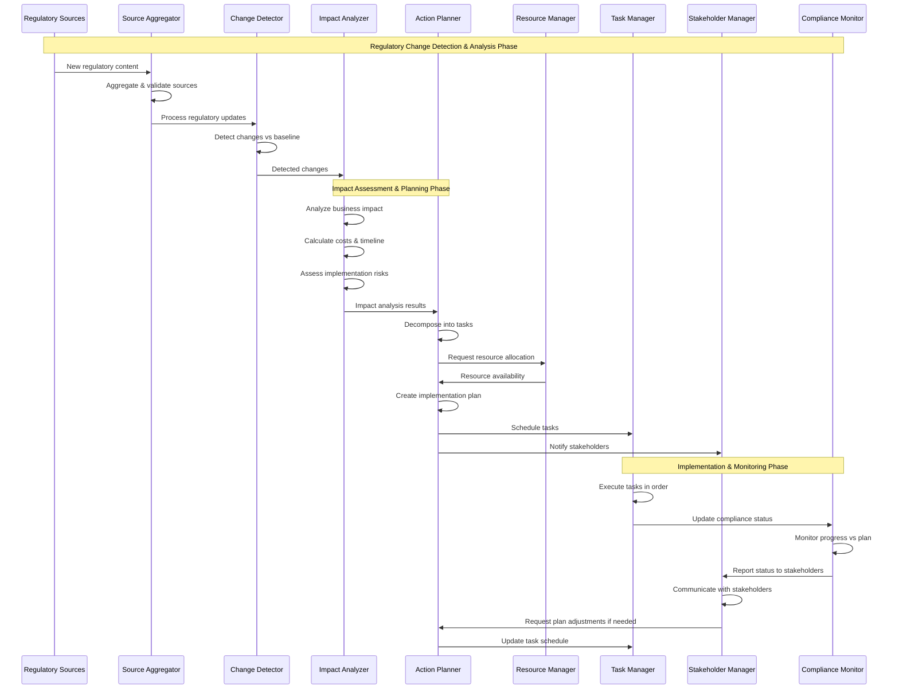
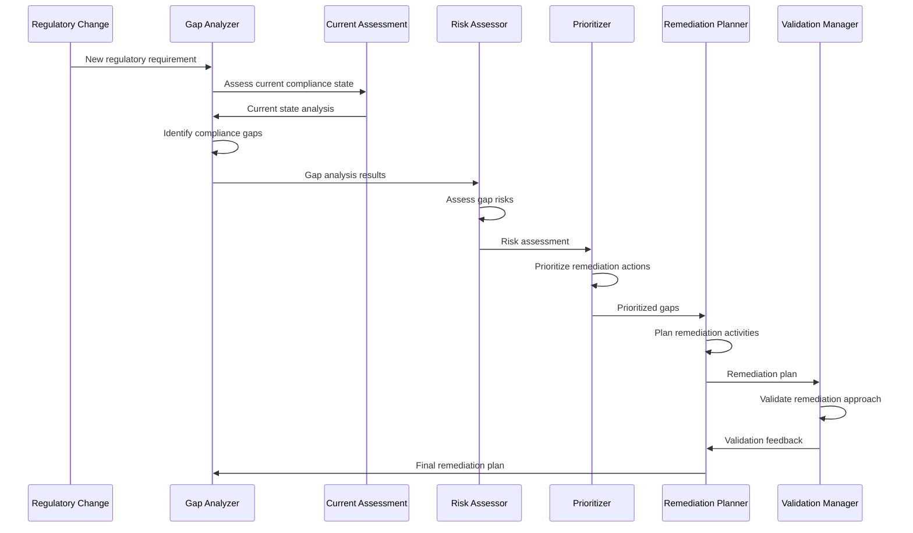
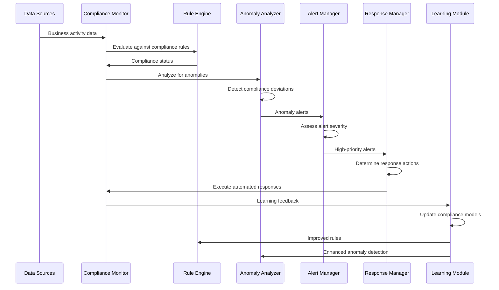
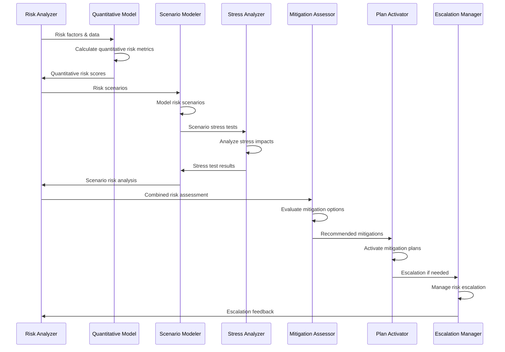
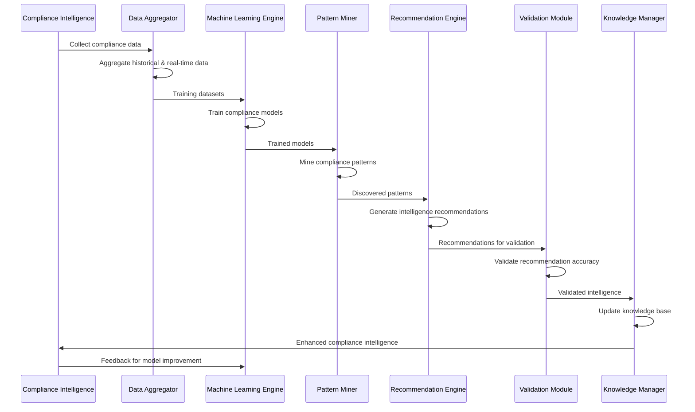
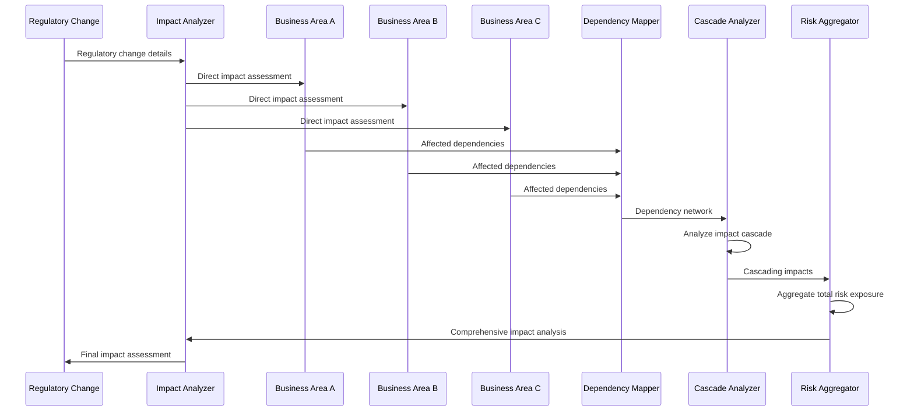
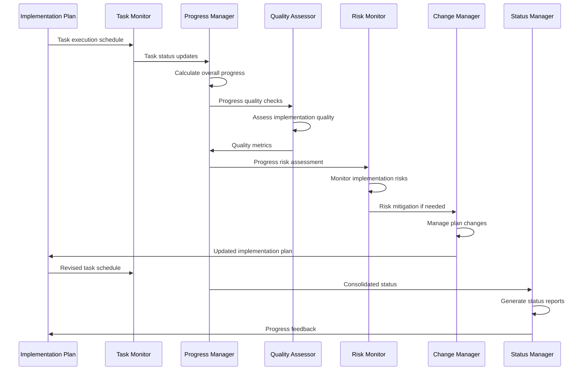
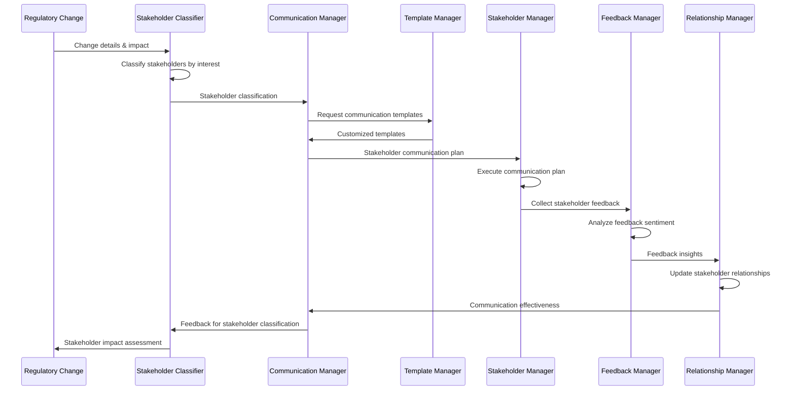

# 01 Sequence diagrams

## Regulatory Change Management Process Flow



## Compliance Gap Analysis Flow



## Automated Compliance Monitoring Flow



## Risk Assessment & Mitigation Flow



## Compliance Intelligence Learning Cycle



## Regulatory Change Impact Propagation



## Implementation Progress Tracking



## Stakeholder Communication Flow



## Audit Trail & Compliance Reporting

```mermaid
sequenceDiagram
    participant AT as Audit Trail
    participant CR as Compliance Reporter
    participant DR as Data Retriever
    participant VA as Validation Agent
    participant FM as Format Manager
    participant DM as Distribution Manager
    participant AM as Archive Manager

    AT->>CR: Compliance events & activities
    CR->>DR: Request compliance data
    DR->>DR: Retrieve relevant data
    DR->>VA: Data for validation

    VA->>VA: Validate data accuracy
    VA->>CR: Validated compliance data
    CR->>CR: Generate compliance reports

    CR->>FM: Request report formatting
    FM->>FM: Format reports per requirements
    FM->>DM: Formatted reports

    DM->>DM: Distribute to stakeholders
    DM->>AM: Archive reports
    AM->>AM: Store in compliance archive

    AM->>AT: Archive confirmation
    AT->>CR: Audit trail update
```</content>
<parameter name="filePath">/Users/giangio/Documents/GitHub/Interzen/Interzen.POC/ZenIA/docs/use_cases/UC9 - Compliance & Risk Management/01 Sequence diagrams.md