# SP42 - Policy Engine

## Diagrammi Architetturali

### Flowchart — Pipeline Authoring e Enforcement Politiche

```mermaid
flowchart TD
    A["👤 Policy Authoring<br/>Visual GUI/Wizard"] --> B["📋 Policy Definition<br/>Drag & Drop / Template"]
    B --> C["✔️ Validation Layer<br/>Syntax + Logic Checks"]
    C --> D{Policy Valid?}
    D -->|No| E["❌ Validation Error<br/>Feedback to Author"]
    E --> A
    D -->|Yes| F["📦 Policy Packaging<br/>Version + Metadata"]
    F --> G["🔐 Deployment<br/>Zero-Downtime Release"]
    G --> H["🚀 Policy Active<br/>in Runtime"]
    H --> I["📊 Drools Rule Engine<br/>Forward/Backward Chaining"]
    I --> J["🔍 Pattern Matching<br/>Condition Evaluation"]
    J --> K["⚙️ Action Execution<br/>Policy Enforcement"]
    K --> L["📋 Rule Repository<br/>Git-based Version Control"]
    L --> M["💾 Audit Logging<br/>Complete Traceability"]
    M --> N["📈 Monitoring & Compliance<br/>Policy Adherence Metrics"]
    N --> O["🔄 Feedback Loop<br/>Policy Optimization"]
    O --> P["✔️ Fine"]
```



### Sequence Diagram — Flusso Policy Enforcement


### State Diagram — Ciclo Vita Policy


## Descrizione Componente

Il **SP42 Policy Engine** è il motore centrale per la gestione, enforcement e monitoraggio delle policy normative nell'ecosistema aziendale. Implementa un framework completo per l'authoring, deployment e enforcement di policy complesse, garantendo la conformità automatica ai requisiti regolamentari.

## Responsabilità

- **Policy Authoring**: Creazione e gestione policy attraverso interfaccia user-friendly
- **Rule Engine**: Esecuzione regole business complesse per policy enforcement
- **Policy Deployment**: Distribuzione sicura e versionata delle policy
- **Compliance Monitoring**: Monitoraggio continuo dell'adherence alle policy
- **Registro di Audit**: Tracciabilità completa di tutte le operazioni policy

## Architettura Interna

```
┌─────────────────────────────────────────────────────────────┐
│                    POLICY AUTHORING LAYER                   │
│  ┌─────────────────────────────────────────────────────────┐ │
│  │  GUI Authoring       Template Library     Validation     │ │
│  │  ┌─────────────────┐    ┌────────────────┐   ┌─────────┐ │ │
│  │  │  - Drag & Drop  │    │  - Industry    │   │  - Syntax │ │
│  │  │  - Visual Rules │    │  - Custom      │   │  - Logic  │ │
│  │  │  - Wizards      │    │  - Compliance  │   │  - Conflict│ │
│  │  └─────────────────┘    └────────────────┘   └─────────┘ │ │
└─────────────────────────────────────────────────────────────┘
│                    RULE ENGINE LAYER                        │
│  ┌─────────────────────────────────────────────────────────┐ │
│  │  Drools Engine       Decision Tables     Rule Repository │ │
│  │  ┌─────────────────┐    ┌────────────────┐   ┌─────────┐ │ │
│  │  │  - Forward Chain│    │  - Excel Import│   │  - Git    │ │
│  │  │  - Backward Chain│    │  - CSV Import │   │  - Version │ │
│  │  │  - Rete Algorithm│    │  - Validation │   │  - History │ │
│  │  └─────────────────┘    └────────────────┘   └─────────┘ │ │
└─────────────────────────────────────────────────────────────┘
│                    DEPLOYMENT LAYER                         │
│  ┌─────────────────────────────────────────────────────────┐ │
│  │  Policy Distribution  Version Control     Rollback       │ │
│  │  ┌─────────────────┐    ┌────────────────┐   ┌─────────┐ │ │
│  │  │  - Zero-downtime│    │  - Git-based   │   │  - Auto   │ │
│  │  │  - Incremental  │    │  - Approval WF │   │  - Manual │ │
│  │  │  - Validation   │    │  - Registro di Audit │   │  - Safe   │ │
│  │  └─────────────────┘    └────────────────┘   └─────────┘ │ │
└─────────────────────────────────────────────────────────────┘
```

## Policy Authoring System

### Visual Policy Builder

Il builder visuale permette la creazione di policy attraverso interfaccia drag-and-drop:

**GUI Authoring Tools**:
- Interfaccia drag-and-drop per costruzione regole
- Visual workflow designer per policy complesse
- Wizards guidati per policy standard
- Preview capabilities per validation

**Rule Composition**:
- Composizione visuale di condizioni e azioni
- Template-based creation per accelerare authoring
- Validation real-time per syntax e logic errors
- Collaboration features per team authoring

### Template Library Management

La gestione della libreria template fornisce componenti riutilizzabili per policy:

**Industry Templates**:
- Template predefiniti per settori specifici
- Compliance framework templates (GDPR, SOX, HIPAA)
- Custom template creation per policy aziendali
- Template versioning per evoluzione requirements

**Template Customization**:
- Parameterization per adattamento a contesti specifici
- Inheritance per estendere template esistenti
- Validation rules per template compliance
- Usage analytics per template effectiveness

## Rule Engine Core

### Drools Integration

L'integrazione Drools fornisce un potente motore di regole per policy enforcement:

**Forward Chaining**:
- Data-driven rule execution per inferenza automatica
- Pattern matching per identificare condizioni
- Agenda management per rule prioritization
- Conflict resolution per rule ordering

**Backward Chaining**:
- Goal-driven execution per prove verification
- Recursive rule evaluation per complex logic
- Explanation facilities per rule reasoning
- Performance optimization per large rule sets

### Decision Tables Management

Le decision tables semplificano la gestione di regole complesse attraverso tabelle:

**Excel/CSV Import**:
- Import da spreadsheet per business user authoring
- Validation automatica per format consistency
- Conflict detection per rule overlaps
- Version control per table evolution

**Table Processing**:
- Runtime compilation per performance
- Hot deployment per rule updates
- Testing framework per table validation
- Analytics per rule effectiveness

## Policy Deployment System

### Version Control Integration

L'integrazione con version control garantisce deployment sicuro e tracciabile:

**Git-based Versioning**:
- Repository strutturato per policy organization
- Branching strategy per development lifecycle
- Merge conflict resolution per collaborative authoring
- Audit trail per change tracking

**Approval Workflows**:
- Multi-level approval per policy deployment
- Role-based access control per authoring permissions
- Change review process per quality assurance
- Automated testing per deployment validation

## Compliance Monitoring

### Policy Enforcement Tracking

Il tracking dell'enforcement garantisce monitoraggio continuo della compliance:

**Execution Monitoring**:
- Real-time tracking di policy evaluation
- Performance metrics per rule execution
- Error logging per enforcement failures
- Alert generation per policy violations

**Compliance Analytics**:
- Adherence reporting per policy effectiveness
- Trend analysis per compliance evolution
- Gap identification per improvement areas
- Predictive analytics per risk assessment

## Testing e Validation

### Policy Testing Framework

Il framework di testing garantisce qualità e affidabilità delle policy:

**Unit Testing**:
- Test case generation per rule validation
- Mock data creation per isolated testing
- Performance testing per scalability validation
- Regression testing per change impact assessment

**Integration Testing**:
- End-to-end testing per policy workflows
- Cross-system validation per interoperability
- Load testing per high-volume scenarios
- Security testing per policy enforcement

## Performance Optimization

### Policy Caching

Il caching delle policy ottimizza performance per high-throughput scenarios:

**Rule Caching**:
- Compiled rule caching per reduced latency
- Result caching per repeated evaluations
- Distributed caching per scalability
- Cache invalidation per policy updates

**Optimization Strategies**:
- Rule indexing per fast retrieval
- Parallel execution per complex evaluations
- Memory optimization per large rule sets
- Monitoring per cache effectiveness
## 🏛️ Conformità Normativa - SP42

### 1. Quadro Normativo di Riferimento

**Framework applicabili a SP42 (Motore Politiche)**:
- **CAD** (Codice Amministrazione Digitale): Art. 1, 13, 21-22, 62
- **GDPR** (Regolamento 2016/679): Art. 4, 5, 6, 12, 13, 32

**UC di Appartenenza**: UC9

---

### 2. Conformità CAD

**Applicabilità**: OBBLIGATORIO per tutti gli SP - SP42 è parte della trasformazione digitale PA

**Articoli CAD Principali**:
- Art. 1: Principi digitalizzazione
- Art. 13: Fascicolo informatico
- Art. 21-22: Documento informatico e conservazione
- Art. 62: Interoperabilità via API
- Art. 71: Accessibilità

**Responsabile**: CTO + Compliance Team (audit trimestrale)

---

### 3. Conformità GDPR

**Applicabilità**: CRITICA per SP42 - gestisce dati personali

**Elementi chiave**:
- Base legale: Art. 6(1)c (obbligo legale PA)
- Data Protection by Design: Art. 25 GDPR
- Sicurezza: Art. 32 GDPR (encryption, access control, audit logging)
- Retention: Conformità a regolamenti settore (tipicamente 3-10 anni)
- Diritti interessati: Art. 15-22 (accesso, rettifica, cancellazione)

**DPA (Data Protection Impact Assessment)**: Richiesta se high-risk processing

**Responsabile**: DPO (Responsabile della Protezione dei Dati (DPO))

---

### 6. Monitoraggio Conformità

**Schedule di Review**:
- **Trimestrale**: Compliance assessment + security audit
- **Semestrale**: Framework alignment review (CAD/GDPR/eIDAS/AGID)
- **Annuale**: Full compliance audit + risk assessment

**KPI Conformità**:
- Audit trail completeness: 100%
- Incident response time: <24h
- Compliance violations: 0 per quarter
- Certificate expiry (if eIDAS): Alert at 30 days

**Escalation**: Non-conformità → Compliance Manager → CTO → Legal

**Prossima review programmata**: 2026-02-17

---

## Riepilogo Conformità SP42

**Status**: ✅ COMPLIANT

| Framework | Applicabile | Status | Responsabile |
|-----------|-----------|--------|-------------|
| CAD | ✅ Sì | ✅ Compliant | CTO |
| GDPR | ✅ Sì | ✅ Compliant | DPO |
| eIDAS | ❌ No | N/A | - |
| AGID | ❌ No | N/A | - |

**Key Compliance Points**:
1. All CAD articles implemented
2. Data handling compliant with applicable regulations
3. Security controls in place (encryption, access control, audit logging)
4. Regular monitoring and review schedule established
5. Clear responsibility assignments (RACI)

**Prossima Review**: 2026-02-17

---


### Framework Normativi Applicabili

☑ CAD
☑ GDPR
☐ L. 241/1990 - Procedimento Amministrativo
☐ eIDAS - Regolamento 2014/910
☐ AI Act - Regolamento 2024/1689
☐ D.Lgs 42/2004 - Codice Beni Culturali
☐ D.Lgs 152/2006 - Codice dell'Ambiente
☐ D.Lgs 33/2013 - Decreto Trasparenza

**Per mappatura completa articoli → implementazioni**, vedi [Conformità Normativa Standard Template](../../templates/conformita-normativa-standard.md) e [COMPLIANCE-MATRIX.md](../../COMPLIANCE-MATRIX.md).

### Requisiti Principali Implementati

| Framework | Requisiti Principali | Status | Riferimenti |
|-----------|-------------------|--------|-------------|
| CAD | Art. 1, Art. 21, Art. 22, Art. 62 | ✅ Implementato | [Dettagli](../../templates/conformita-normativa-standard.md) |
| GDPR | Art. 5, Art. 32 | ✅ Implementato | [Dettagli](../../templates/conformita-normativa-standard.md) |

### Conformità Normativa - Checklist

- [ ] Tutti i framework normativi applicabili identificati
- [ ] Articoli rilevanti mappati alle responsabilità SP
- [ ] GDPR: Data protection by design implementato (se applicabile)
- [ ] eIDAS: Firma digitale supportata (se applicabile)
- [ ] AI Act: Supervisione umana e trasparenza (se applicabile)
- [ ] Tracciabilità audit completa mantenuta
- [ ] Documentation conformità aggiornata

**Nota**: Dettagli di conformità completi nella sezione "## 🏛️ Conformità Normativa - SP42

### 1. Quadro Normativo di Riferimento

**Framework applicabili a SP42 (Motore Politiche)**:
- **CAD** (Codice Amministrazione Digitale): Art. 1, 13, 21-22, 62
- **GDPR** (Regolamento 2016/679): Art. 4, 5, 6, 12, 13, 32

**UC di Appartenenza**: UC9

---

### 2. Conformità CAD

**Applicabilità**: OBBLIGATORIO per tutti gli SP - SP42 è parte della trasformazione digitale PA

**Articoli CAD Principali**:
- Art. 1: Principi digitalizzazione
- Art. 13: Fascicolo informatico
- Art. 21-22: Documento informatico e conservazione
- Art. 62: Interoperabilità via API
- Art. 71: Accessibilità

**Responsabile**: CTO + Compliance Team (audit trimestrale)

---

### 3. Conformità GDPR

**Applicabilità**: CRITICA per SP42 - gestisce dati personali

**Elementi chiave**:
- Base legale: Art. 6(1)c (obbligo legale PA)
- Data Protection by Design: Art. 25 GDPR
- Sicurezza: Art. 32 GDPR (encryption, access control, audit logging)
- Retention: Conformità a regolamenti settore (tipicamente 3-10 anni)
- Diritti interessati: Art. 15-22 (accesso, rettifica, cancellazione)

**DPA (Data Protection Impact Assessment)**: Richiesta se high-risk processing

**Responsabile**: DPO (Responsabile della Protezione dei Dati (DPO))

---

### 6. Monitoraggio Conformità

**Schedule di Review**:
- **Trimestrale**: Compliance assessment + security audit
- **Semestrale**: Framework alignment review (CAD/GDPR/eIDAS/AGID)
- **Annuale**: Full compliance audit + risk assessment

**KPI Conformità**:
- Audit trail completeness: 100%
- Incident response time: <24h
- Compliance violations: 0 per quarter
- Certificate expiry (if eIDAS): Alert at 30 days

**Escalation**: Non-conformità → Compliance Manager → CTO → Legal

**Prossima review programmata**: 2026-02-17

---

## Riepilogo Conformità SP42

**Status**: ✅ COMPLIANT

| Framework | Applicabile | Status | Responsabile |
|-----------|-----------|--------|-------------|
| CAD | ✅ Sì | ✅ Compliant | CTO |
| GDPR | ✅ Sì | ✅ Compliant | DPO |
| eIDAS | ❌ No | N/A | - |
| AGID | ❌ No | N/A | - |

**Key Compliance Points**:
1. All CAD articles implemented
2. Data handling compliant with applicable regulations
3. Security controls in place (encryption, access control, audit logging)
4. Regular monitoring and review schedule established
5. Clear responsibility assignments (RACI)

**Prossima Review**: 2026-02-17

---


---


## Roadmap

### Version 1.0 (Current)
- Basic policy authoring e rule engine
- Drools integration
- Policy deployment e versioning
- Compliance monitoring foundation

### Version 2.0 (Next)
- Advanced visual authoring
- AI-assisted policy creation
- Real-time policy updates
- Enhanced compliance analytics

### Version 3.0 (Future)
- Natural language policy authoring
- Predictive policy optimization
- Autonomous policy adaptation
- Cross-system policy orchestration</content>
<parameter name="filePath">/Users/giangio/Documents/GitHub/Interzen/Interzen.POC/ZenIA/docs/use_cases/UC9 - Compliance & Risk Management/01 SP42 - Policy Engine.md