# POC Generatore Determine Amministrative

## 🎯 Obiettivo del Progetto

Questo POC implementa un sistema intelligente per la generazione automatica di determine amministrative utilizzando:

- **Ollama + llama3.2:1b** per l'elaborazione AI
- **Model Context Protocol (MCP)** per l'architettura modulare
- **Streamlit** per l'interfaccia utente
- **Python** come linguaggio di sviluppo

## 📁 Struttura del Progetto

```
src/
├── core/                    # Moduli core dell'applicazione
│   ├── models.py           # Modelli Pydantic
│   ├── config.py           # Configurazione
│   └── document_processor.py # Processamento documenti
├── mcp_server/             # Server MCP con tools AI
│   └── server.py           # Implementazione server
├── mcp_client/             # Client MCP
│   └── client.py           # Client e servizi di generazione
├── frontend/               # Interfaccia Streamlit
│   ├── app.py              # Applicazione principale
│   └── start_app.py        # Script di avvio
├── templates/              # Template per determine
│   └── templates.py        # Template predefiniti
├── uploads/                # Directory per file caricati
├── outputs/                # Directory per output generati
├── requirements.txt        # Dipendenze Python
├── .env.example           # Configurazione esempio
└── run_poc.py             # Script principale di avvio
```

## 🚀 Installazione e Avvio

### 1. Prerequisiti

**Ollama con llama3.2:1b**
```bash
# Installazione Ollama (se non già installato)
# Per Windows: scaricare da https://ollama.ai

# Avviare Ollama
ollama serve

# Installare il modello llama3.2:1b
# Test rapido Ollama
ollama pull llama3.2:1b
```

**Python 3.8+**
```bash
# Verificare versione Python
python --version
```

### 2. Setup del Progetto

```bash
# Navigare nella directory del progetto
cd ZenIA/src

# Installare le dipendenze
pip install -r requirements.txt

# Copiare e configurare le variabili d'ambiente
copy .env.example .env
# Modificare .env se necessario
```

### 3. Avvio Rapido

```bash
# Avvio completo con controlli automatici
python run_poc.py

# Oppure avvio diretto Streamlit
streamlit run frontend/app.py --server.port 8501
```

### 4. Verifica Installazione

L'applicazione sarà disponibile su: **http://localhost:8501**

## 🔧 Configurazione

### File .env

```ini
# Configurazione Ollama
OLLAMA_BASE_URL=http://localhost:11434
OLLAMA_MODEL=llama3.2:1b

# Configurazione MCP Server
MCP_SERVER_HOST=localhost
MCP_SERVER_PORT=3001

# Configurazione API
API_HOST=0.0.0.0
API_PORT=8000

# Streamlit
STREAMLIT_PORT=8501

# Limiti
MAX_FILE_SIZE_MB=50
MAX_PROCESSING_TIME_SECONDS=300
```

### Personalizzazione Template

I template per le determine sono configurabili in `templates/templates.py`:

```python
TEMPLATE_STANDARD = {
    "id": "standard",
    "nome": "Template Standard Determina", 
    "struttura": {
        "premesse_template": "...",
        "motivazione_template": "...",
        "dispositivo_template": "..."
    }
}
```

## 🎮 Utilizzo dell'Applicazione

### 1. Caricamento Documenti
- Caricare i PDF/TXT del fascicolo procedimentale
- Il sistema estrae automaticamente il contenuto testuale
- Classificazione automatica del tipo di documento

### 2. Configurazione Fascicolo
- Inserire dati del richiedente
- Specificare tipo di procedimento
- Aggiungere note aggiuntive

### 3. Generazione Determina
- Cliccare "Genera Determina"
- Il sistema elabora il fascicolo usando i tools MCP:
  - **fascicolo-analyzer**: Analizza contenuti e estrae informazioni
  - **legal-framework-validator**: Valida conformità normativa
  - **content-generator**: Genera contenuto per sezioni
  - **document-composer**: Compone documento finale
  - **compliance-checker**: Verifica qualità e conformità

### 4. Risultati
- **Determina**: Visualizzazione del documento generato
- **Validazione**: Report controlli qualità
- **Metadati**: Informazioni su generazione
- **Download**: Esportazione in JSON/TXT

## 🛠️ Architettura Tecnica

### Componenti Principali

1. **MCP Server** (`mcp_server/server.py`)
   - Implementa i 5 tools definiti nelle specifiche
   - Comunica con Ollama per generazione AI
   - Fornisce interfaccia standardizzata MCP

2. **MCP Client** (`mcp_client/client.py`)
   - Connessione al server MCP
   - Orchestrazione del workflow di generazione
   - Gestione errori e retry

3. **Frontend Streamlit** (`frontend/app.py`)
   - Interfaccia utente intuitiva
   - Upload e processamento file
   - Visualizzazione risultati

4. **Document Processor** (`core/document_processor.py`)
   - Estrazione testo da PDF/TXT
   - Classificazione automatica documenti
   - Analisi contenuto

### Workflow di Generazione
Mappatura dei procedimenti dell'Ente -> Elenco di tutti i procedimenti gestiti dall'Ente

Premesse per le Knoledge Base
Abbiamo individuato 3 livelli di KB
1) **KB1** Livello normativo per singolo procedimento amministrativo -> contiene tutte le disposizioni normative per singolo procedimento amministrativo
2) **KB2** Livello storico provvedimenti dell'Ente -> contiene tutti i provvedimenti dei procedimenti amministrativi dell'Ente generati nel passato e viene incrementata con i nuovi provvedimenti; sarà utilizzata per generare suggerimenti dalla AI all'utente
3) **KB3** Livello iniziativa di riferimento -> contiene tutte le informazioni dei documenti presenti all'interno della richiesta per generare i riferimenti che saranno utilizzati nel provvedimento

Fasi del procedimento amministrativo
1) Fase Iniziativa - ricezione documento -> classificazione documento -> attribuzione procedimento
2) Fase Istruttoria - recupero documenti richiesti per legge -> verifica formale delle tipologie documenti caricati -> validazione sostanziale del contenuto dei documenti
3) Fase Decisoria - estrazione dei contenuti validati -> produzione provvedimento
4) Fase Integrativa - pubblicazione provvedimento

```mermaid
graph TD
    %% Ingresso
    A[Upload PDF/TXT] --> B[Estrazione Testo]
    B --> FA[fascicolo-analyzer: estrazione & classificazione]
    B --> DC_docclass[document-classifier: attribuzione procedimento]

    %% Knowledge Base livelli
    subgraph KB_side [Knowledge Bases]
      KB1["KB Level 1 - Normativa (per procedimento)"]
      KB2["KB Level 2 - Storico provvedimenti ente"]
      KB3["KB Level 3 - Iniziativa / Documenti di richiesta"]
    end

    %% Fase Iniziativa
    subgraph "Fase Iniziativa"
      FA
      DC_docclass
      I_INDEX[kb-initiativa-indexer: indicizzazione iniziativa]
    end

    KB3 --> I_INDEX
    FA --> I_INDEX
    DC_docclass --> I_INDEX

    %% Fase Istruttoria
    subgraph "Fase Istruttoria"
      RETR[document-retriever: recupero da KB1/KB2]
      FORM_VALID[formal-validator: verifica formale]
      SUBS_VALID[substantive-validator: verifica sostanziale]
      EVID[evidence-extractor: estrazione e metadata]
    end

    I_INDEX --> RETR
    KB1 --> RETR
    KB2 --> RETR
    RETR --> FORM_VALID
    RETR --> SUBS_VALID
    RETR --> EVID

    %% Fase Decisoria
    subgraph "Fase Decisoria"
      LF[legal-framework-validator: verifica normativa e riferimenti]
      CG[content-generator: bozze per premesse/motivazione/dispositivo]
      DECIDE[decision-reasoner: argomentazione decisione]
      COMP_DOC[document-composer: assemblaggio template]
    end

    KB1 --> LF
    KB2 --> CG
    EVID --> CG
    FORM_VALID --> LF
    SUBS_VALID --> LF
    LF --> CG
    CG --> DECIDE
    DECIDE --> COMP_DOC

    %% Fase Integrativa
    subgraph "Fase Integrativa"
      COMPLI[compliance-checker: controlli qualità e conformità]
      PUB[publishing-publisher: pubblicazione / output]
      ARCH[metadata-archiver: archiviazione metadati]
      KB_UPD[kb-updater: aggiorna KB Level 2 con nuovo provv.]
    end

    COMP_DOC --> COMPLI
    COMPLI --> PUB
    PUB --> ARCH
    PUB --> KB_UPD
    KB_UPD --> KB2

    %% Output
    PUB --> OUT[Output JSON / Download / Pubblicazione]

    %% collegamenti finali
    COMP_DOC --> OUT
```



## 🔬 Tools MCP Implementati

### Tools ristrutturati per fase (breve sintesi)

Fase Iniziativa
- fascicolo-analyzer
  - Input: file/fascicolo grezzo
  - Output: testo estratto, principali entità (richiedente, date, oggetto)
- document-classifier
  - Input: testo estratto
  - Output: tipo documento, probabilità categoria
- kb-initiativa-indexer
  - Input: dati iniziativa, estratti metadati
  - Output: indicizzazione nella KB livello 3

Fase Istruttoria
- document-retriever
  - Input: tipo procedimento, query
  - Output: documenti normativi (KB1), provvedimenti simili (KB2)
- formal-validator
  - Input: documenti caricati
  - Output: checklist formale (mancanze)
- substantive-validator
  - Input: contenuto documento
  - Output: valutazione sostanziale (coerenza)
- evidence-extractor
  - Input: fascicolo, allegati
  - Output: entità probatorie e metadati

Fase Decisoria
- legal-framework-validator
  - Input: tipo procedimento, riferimenti normative
  - Output: esito conformità normativa, riferimenti rilevanti
- content-generator
  - Input: sezione richiesta, contesto, KB2 (storico)
  - Output: bozze per premesse/motivazione/dispositivo
- decision-reasoner
  - Input: bozze, validazioni, evidenze
  - Output: argomentazione decisionale strutturata
- document-composer
  - Input: sezioni approvate, template
  - Output: determina assemblata (testo/JSON)

Fase Integrativa
- compliance-checker
  - Input: determina finale
  - Output: report conformità e suggerimenti
- publishing-publisher
  - Input: determina, metadati
  - Output: pubblicazione / esportazioni (JSON/TXT/PDF)
- metadata-archiver
  - Input: metadati generazione
  - Output: record archivio per audit
- kb-updater
  - Input: determina generata
  - Output: aggiornamento KB Level 2 (storico provvedimenti)

Note: i tre livelli di KB (normativa, storico, iniziativa) sono collegati ai tool che li consumano o aggiornano (vedi diagramma).

## 📊 Output JSON Strutturato

```json
{
  "determina_id": "det_fasc_20250911_143052",
  "status": "generated",
  "content": {
    "premesse": "IL DIRIGENTE\n\nPREMESSO CHE...",
    "motivazione": "CONSIDERATO CHE...",
    "dispositivo": "DETERMINA\n\ndi autorizzare...",
    "allegati": ["Istanza di parte", "Documento identità"],
    "riferimenti_normativi": ["L. 241/1990", "D.P.R. 380/2001"]
  },
  "validation_results": [
    {
      "section": "struttura",
      "severity": "info", 
      "passed": true,
      "suggestion": "Documento ben strutturato"
    }
  ],
  "metadata": {
    "generated_at": "2025-09-11T14:30:52",
    "ai_model": "llama3.2:1b",
    "processing_time_seconds": 45.2,
    "tokens_used": 3847
  }
}
```

## 🧪 Testing e Debug

### Test Manuali
```bash
# Test connessione Ollama
curl http://localhost:11434/api/tags

# Test singolo tool MCP
python -c "
import asyncio
from mcp_client.client import create_mcp_client
async def test():
    client = await create_mcp_client('mcp_server/server.py')
    result = await client.invoke_tool('fascicolo-analyzer', {
        'fascicolo_content': 'Test content',
        'document_types': ['istanza']
    })
    print(result)
asyncio.run(test())
"
```

## 📘 Notebook di riferimento: sequenza operativa

Per facilitare la comprensione e il trasferimento degli step del POC è stato aggiunto un notebook esplicativo:

- `poc_sequence_notebook.ipynb` — contiene una mappa operativa, spiegazioni per ogni fase e celle eseguibili (mock e snippet) per esplorare il flusso senza avviare tutti i componenti esterni.

Come aprirlo localmente:

```powershell
# Posizionarsi nella cartella src
cd ZenIA/src
# Aprire con Jupyter Lab / Notebook
jupyter lab poc_sequence_notebook.ipynb
# oppure
jupyter notebook poc_sequence_notebook.ipynb
```

### Logs
- **Console**: Output real-time nell'interfaccia
- **File**: `app.log` nella directory di lavoro
- **Livello**: Configurabile via `LOG_LEVEL` in .env

## 🚨 Risoluzione Problemi

### Errore "Ollama non connesso"
```bash
# Verificare che Ollama sia in esecuzione
ollama list
# Se non risponde, riavviare
ollama serve
```

### Errore "Modello non trovato"
```bash
# Installare il modello
ollama pull llama3.2:1b
# Verificare installazione
ollama list
```

### Errore import MCP
```bash
# Reinstallare dipendenze MCP
pip install --upgrade mcp
```

### Problemi performance
- Ridurre dimensione file PDF (< 10MB)
- Verificare risorse sistema (RAM > 4GB)
- Provare modello più piccolo se disponibile

## 🔮 Sviluppi Futuri

### Fase 1 - Miglioramenti Core
- [ ] Caching intelligente delle analisi
- [ ] Supporto formati aggiuntivi (DOCX, RTF)
- [ ] Ottimizzazione prompts AI
- [ ] Validazione input più robusta

### Fase 2 - Features Avanzate  
- [ ] Template personalizzabili via UI
- [ ] Sistema di feedback per miglioramento AI
- [ ] API REST per integrazione esterna
- [ ] Dashboard analytics e metriche

### Fase 3 - Produzione
- [ ] Deployment containerizzato
- [ ] Autenticazione e autorizzazione
- [ ] Audit trail completo
- [ ] Scalabilità orizzontale

## 📞 Supporto

Per problemi o domande:

1. **Verificare** i prerequisiti (Ollama, Python, dipendenze)
2. **Consultare** i logs in `app.log`
3. **Testare** la connessione Ollama separatamente
4. **Provare** con documenti più semplici per debug

## 📄 Licenza

Questo POC è sviluppato per scopi dimostrativi nell'ambito del progetto ZenShare.
